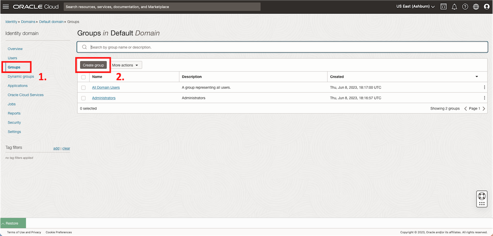
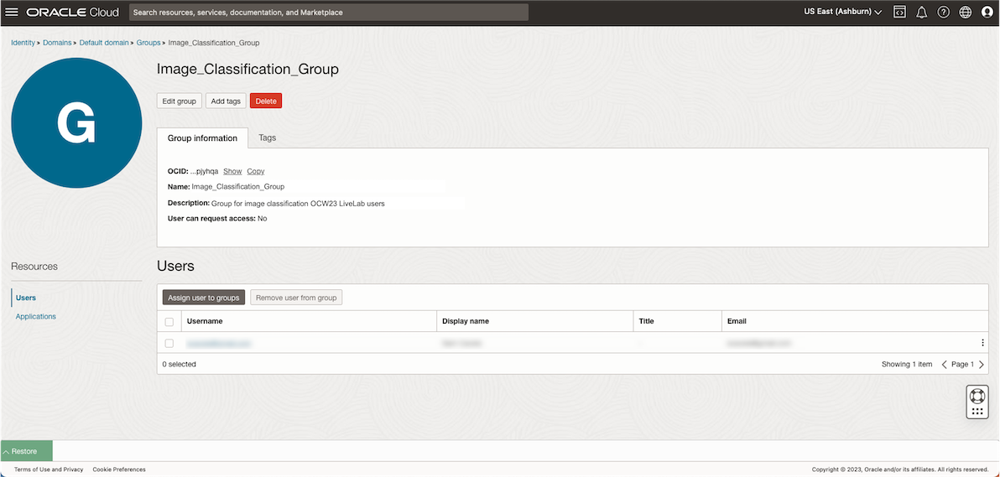
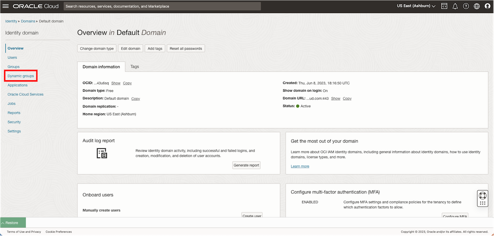
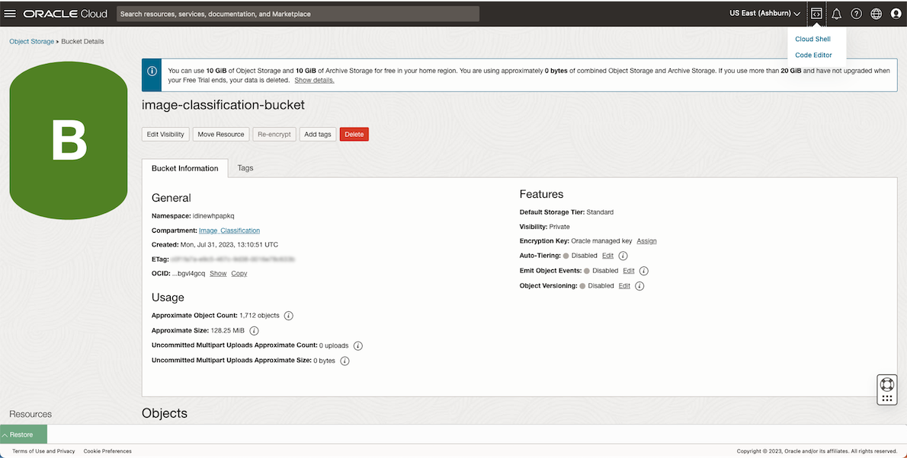
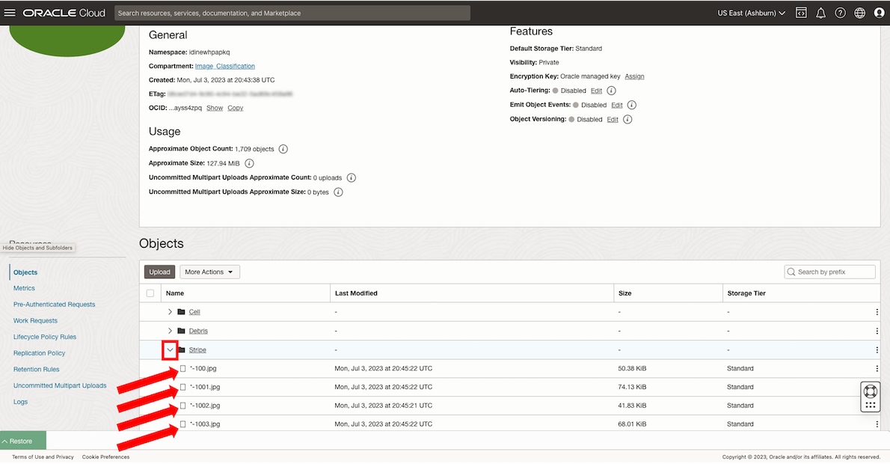
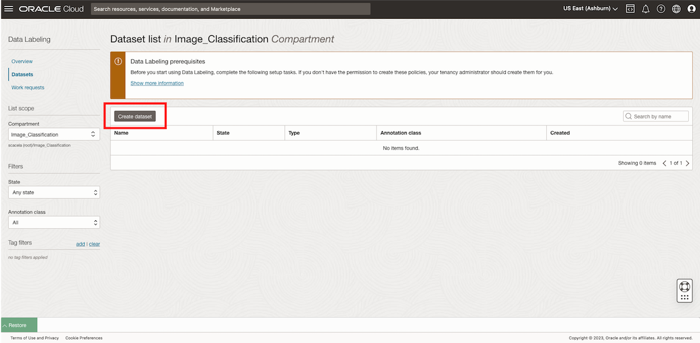
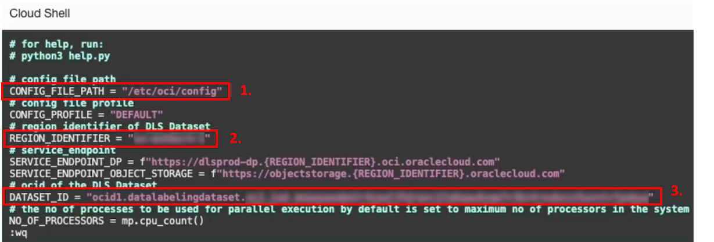
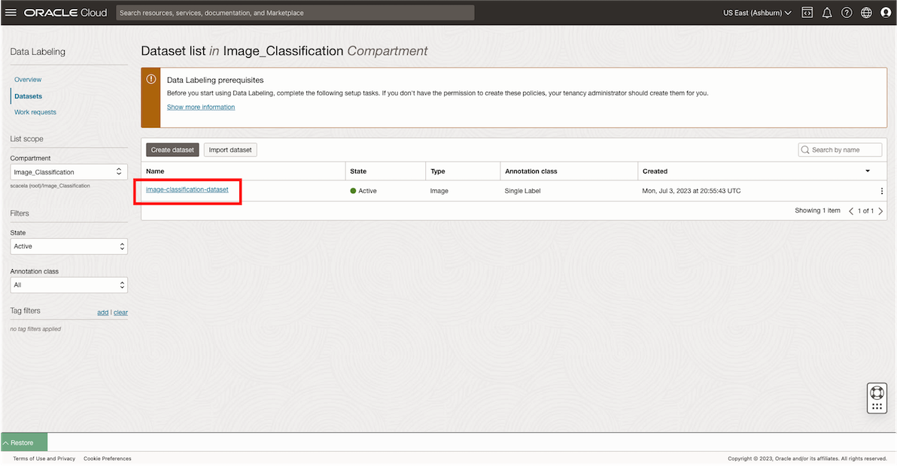
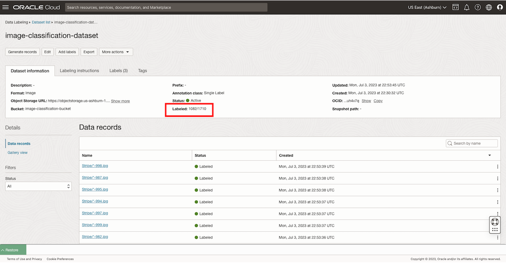
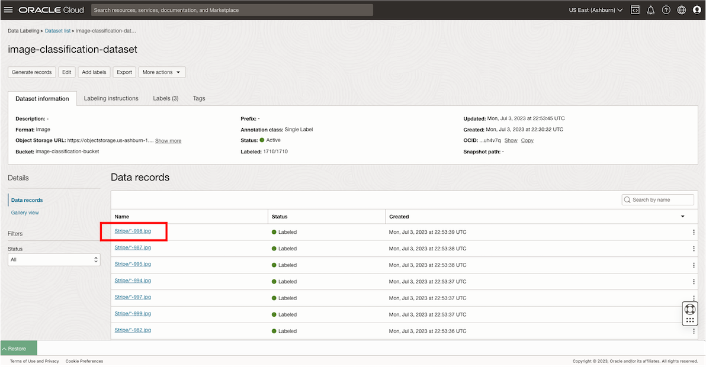

# Bulk-upload and bulk-label your data
**Estimated Time**: *35 minutes*

## Introduction

[Lab 1](videohub:1_5dimsltq)

In this Lab, you will be provided a dataset consisting of *1710* images. The images have been pre-sorted by medical professionals into folders named *Cell*, *Debris*, and *Stripe*. While images in the *Cell* folder depict intact and viable cellular structures, the *Debris* and *Stripe* folders contain images of two types of non-cell structures. The folders contain the same number of images.


You will load this dataset into Object Storage, and prepare the data for model training by labeling each image. But don't worry - you won't have to label each image individually! This Lab provides a helper script as a short cut to help you efficiently label every image based on the way the images are pre-sorted.

After your data has been labeled, you will be able to move on with training your custom AI Vision model in style.

The Tasks in this Lab are summarized as follows:

* **Task 1**: *\[10m\]* Create Identity and Access Management (IAM) Compartment, Dynamic Group, and Policy to enable necessary permissions for this Workshop
* **Task 2**: *\[2m\]* Create an Object Storage Bucket for training data
* **Task 3**: *\[5m\]* Download the training data using Cloud Shell, and bulk-upload the biomedical training data to your Object Storage Bucket
* **Task 4**: *\[3m\]* Create a Dataset in OCI Data Labeling, which imports the image data from your Object Storage Bucket as records
* **Task 5**: *\[15m\]* Leverage a helper script to bulk-label the records in your OCI Data Labeling Dataset

### Objectives

In this Lab, you will:

* Learn how to navigate in the OCI web console and be able to demo key Data Labeling features
* Learn how to leverage a helper script to bulk-label a dataset of biomedical images, i.e. efficiently label a large volume of images

### Prerequisites

* An Oracle Free Tier, or Paid Cloud Account
* One of the following:
    * You are either a tenancy administrator
    * A tenancy administrator will set up Identity and Access Management (IAM) configuration as described in *Lab 1, Task 1*. Then, you may proceed beginning with *Lab 1, Task 2*.
* Accessibility to your tenancy's [home region](https://docs.oracle.com/en-us/iaas/Content/Identity/Tasks/managingregions.htm)
* Sufficient resource availability within your home region for: 1 Compartment, 1 Group, 1 Dynamic Group, 1 Policy, 1 Object Storage Bucket, 1 Data Labeling Dataset, 1710 Data Labeling Dataset records
* *Not required, though beneficial*: Familiarity with a command-line interface (CLI) text editor (e.g. vi, nano, emacs)
* *Not required, though beneficial*: Familiarity with [OCI-CLI](https://docs.oracle.com/en-us/iaas/Content/API/Concepts/cliconcepts.htm)
* *Not required, though beneficial*: Familiarity with Python

## **Task 1**: Identity and Access Management (IAM) setup
*\[10 minutes\]*

Before you start using OCI Data Labeling, you or your tenancy administrator should set up the following Identity and Access Management (IAM) configuration:

1. Create a new compartment where you will provision the resources used for this lab.

  a. From the OCI Services menu, click **Identity & Security** > **Compartments**

  

  b. Click **Create Compartment**.

  

  c. **Name**: Provide a name for your Compartment, e.g. *Image\_Classification*

  d. **Description**: Provide a description for your Compartment, e.g. *Compartment for image classification OCW23 Workshop*

  e. **Parent Compartment**: Select the root-level compartment, which has the same name as your tenancy.

  f. Click **Create Compartment**.

  

2. Find the compartment's Oracle Cloud Identifier (OCID), as shown in the below image. Then, copy and paste this value into a new line on a digital notepad app. You will retrieve this value when building your IAM Policy statements.

  

3. Create a Group and add users to it.

  a. From the OCI Services menu, click **Identity & Security** > **Domains**

  

  b. Select the root compartment from the dropdown menu on the left-hand side of the screen, and select the **Default** domain.

  

  c. Click **Groups** on the left-hand side of the page. Then, click **Create group**.

  

  d. **Name**: Provide a name for your Group, e.g. *Image\_Classification\_Group*

  e. **Description**: Provide a description for your Group, e.g. *Group for image classification OCW23 Workshop users*

  f. **Users**: Select the name of the user who will proceed with the lab tasks after the Policy Setup.

  

  

4.  In this step, you will create a Dynamic Group. The Dynamic Group will serve as a reference to a collection of resources that is determined by the matching rule logic associated with the Dynamic Group. You will write a matching rule that will match all Data Labeling Datasets in your new compartment.

  a. Click **Default domain** on the upper-left of the screen.

  

  b. Click **Dynamic groups**.

  

  c. Click **Create dynamic group**.

  

  d. **Name**: Provide a name for your Dynamic Group, e.g. *Image\_Classification\_Dynamic_Group*

  e. **Description**: Provide a description for your Dynamic Group, e.g. *Dynamic Group for image classification OCW23 Workshop resources*

  f. **Matching rules**: Paste the following matching rule into the text field. Replace the placeholder value **&ltcompartment OCID&gt** with your own compartment OCID from your notepad. Be sure to preserve the quotation marks from the template.
      
      ```
      <copy>ALL {datalabelingdataset.compartment.id='<compartment OCID>'}</copy>
      ```
  g. Click **Create**.

  

5. In this step, you will create a Policy. The Policy will contain a series of statements. Each statement will allow a Group (and associated users) or Dynamic Group (and associated resources that are matched by the matching rule) to access specified resources to specified degrees of privilege.

  a. From the OCI Services menu, click **Identity & Security** > **Policies**.

  

  b. Select the root compartment from the dropdown menu on the left-hand side of the screen.

  c. Click **Create Policy**.

  d. **Name**: Provide a name for your Policy, e.g. *Image\_Classification\_Policy*

  e. **Description**: Provide a description for your Policy, e.g. *Policy for image classification OCW23 Workshop*

  f. **Compartment**: Ensure that the policy is scoped at the root-level compartment. Click the toggle switch labeled **Show manual editor** to enable entry of free-form text into a text field. You will use this text field to build your Policy logic.

  g. Toggle the **Show manual editor** switch. Then, copy and paste the following statements into the Policy Builder editor. Replace the placeholder value **&ltcompartment OCID&gt** with your own compartment OCID from your notepad.
      
      ```
      <copy>Allow dynamic-group Image_Classification_Dynamic_Group to read buckets in compartment id <compartment OCID>
      Allow dynamic-group Image_Classification_Dynamic_Group to read objects in compartment id <compartment OCID>
      Allow dynamic-group Image_Classification_Dynamic_Group to manage objects in compartment id <compartment OCID> where any {request.permission='OBJECT_CREATE'}
      Allow group Image_Classification_Group to manage object-family in compartment id <compartment OCID>
      Allow group Image_Classification_Group to read objectstorage-namespaces in compartment id <compartment OCID>
      Allow group Image_Classification_Group to manage data-labeling-family in compartment id <compartment OCID>
      Allow group Image_Classification_Group to use cloud-shell in tenancy
      Allow group Image_Classification_Group to manage ai-service-vision-family in compartment id <compartment OCID></copy>
      ```
    h. Click **Create**.

    

## **Task 2**: Create an Object Storage Bucket
*\[2 minutes\]*

1. From the OCI services menu, click: **Storage** > **Buckets**

  

2. Select your new compartment using the dropdown menu under **List Scope**.

3. Click **Create Bucket** and enter details for your Bucket:

  

  a. **Bucket Name**: Enter a name for your Bucket that you can recognize, e.g. *image-classification-bucket*.

    > **Note**: If you choose a different name, copy and paste this value into a new line on your digital notepad app for later use in this Lab.

  b. Click **Create**.

  c. Navigate to the detailed view of your Bucket by clicking on the hyperlinked listing named after your Bucket, and see the details associated with your Bucket.

  

  

  

## **Task 3**: Bulk-upload the biomedical training data into Object Storage
*\[5 minutes\]*

1. Open Cloud Shell by clicking the **&lt&gt** icon at the top-left of the webpage. Then, click **Cloud Shell**.

  

2. You may dismiss the tutorial by entering *N*, or enter *Y* if you wish to follow the tutorial. Note your ability to minimize, maximize, and restore the Cloud Shell window as is convenient for intermittent interaction with the OCI Console UI.

3. Run the following command on your Cloud Shell command line interface (CLI) to download the image files necessary this lab, which is the training data that will be used to train the computer vision machine learning model:
    
    ```
    <copy>wget https://objectstorage.us-ashburn-1.oraclecloud.com/p/R2GriGitNq-0NmTYGez0fop69aXx4SniJhyOjYpKXQyvQtaRtWU3yPgB8DaUzjey/n/orasenatdpltintegration03/b/all-images-live-lab-ocw23/o/Biomedical_Image_Classification_Training_Data.zip</copy>
    ```
4. Run the following command to unzip the download, extracting the enclosed folder containing the image files:
    
    ```
    <copy>unzip Biomedical_Image_Classification_Training_Data.zip</copy>
    ```
5. Execute the following command to bulk-upload the training image files to your bucket. Note that if you named your Bucket with a different name than *image-classification-bucket*, then retrieve this name from your digital notepadd app and replace *image-classification-bucket* in your command before you run it.
    
    ```
    <copy>oci os object bulk-upload --bucket-name image-classification-bucket --src-dir ~/Biomedical_Image_Classification_Training_Data --content-type 'image/jpeg'</copy>
    ```

  

6. Once the bulk-uploading process has completed, refresh the bucket page as indicated in the below screenshot.

  

7. Confirm that your training images have been uploaded to your Object Storage bucket within their respective folders: *Cell*, *Debris*, and *Stripe*.

  

## **Task 4**: Create a Data Labeling Dataset
*\[3 minutes\]*

1. From the OCI services menu, click: **Analytics & AI** > **Data Labeling**

  

2. Click on **Datasets**.

3. Select your new compartment using the dropdown menu under **List Scope**.

4. Create your Data Labeling Dataset by clicking **Create dataset**.

  

  a. **Name**: Enter a name for your Data Labeling Dataset, e.g. *image-classification-dataset*

  b. **Dataset format**: *Images*

  c. **Annotation Class**: *Single Label*

  d. Click **Next**.

  

  e. Retrieve files from Object Storage by choosing **Select from Object Storage**.

  f. **Compartment**: Select the name of compartment where your Object Storage bucket exists.

  g. **Bucket**: Select your Bucket by name.

  

  h. **Add Labels**: You will enter all possible labels into this field. In our case, our labels will be as shown below. Be sure that the *first letter* of each label is *uppercase*, and the *remaining letters* are *lowercase*. Take care to leave no space characters in the label names.
    
    * *Cell*
    * *Debris*
    * *Stripe*

  i. Click **Next**.

  

  j. Review the information and deploy your Data Labeling Dataset by clicking **Create**.

  

5. Find the Dataset OCID as shown in the screenshot. Then, copy and paste this value into a new line on your digital notepad app. You will retrieve this value in the next Task when configuring the bulk-labeling tool.

  

6. While your images are importing from your Object Storage Bucket as records, you may move onto the next Task. Note that this process will take about *10 minutes*. Once the records have been fully imported, the page will appear similar to the below screenshot, and the **Status** of the Dataset will show as *Active*. Move onto the next Task while your images are importing.


## **Task 5**: Bulk-label the Data Labeling Dataset records
*\[15 minutes\]*

1. On Cloud Shell, run the following command to download the bulk-labeling script to the home directory on your Cloud Shell machine.
    
    ```
    <copy>cd; git clone https://github.com/oracle-samples/oci-data-science-ai-samples.git</copy>
    ```
2. Run the following command to change your directory to the folder where the configuration files and main executable script are located.
    
    ```
    <copy>cd oci-data-science-ai-samples/data_labeling_examples/bulk_labeling_python</copy>
    ```
3. Run the following command to obtain the identifier of your tenancy's home region. Copy and paste the returned value into a new line on your digital notepad app.
    
    ```
    <copy>echo $OCI_REGION</copy>
    ```
4. In this step, you will open the file named **config.py** from the bulk-labeling tool contents with a CLI-based text editor of your preference (e.g. vi, nano, emacs), and then edit the variables as indicated below. Be sure to replace the **&ltplaceholder values&gt** with your own values from your digital notepad app. Preserve the quotation marks as shown in the template. Instructions on how to make these edits using vi are provided, and are recommended for users who are unfamiliar with CLI-based text editors.

    ```
    <copy>CONFIG_FILE_PATH = "/etc/oci/config"
    REGION_IDENTIFIER = "<Region identifier from your notepad app>"
    DATASET_ID = "<OCID of your Data Labeling Dataset from your notepad app>"</copy>
    ```

    

  a. Open **config.py** by running the following command:

    ```
    <copy>vi config.py</copy>
    ```

  b. Use the **arrow keys** to navigate your cursor to the end of the value to the right of: *CONFIG\_FILE\_PATH =*
  
  c. Enter *insert* mode by typing **i**.
  
  d. Delete the value within the quotation marks using the **delete** button.
  
  e. Enter the value to be assigned to *CONFIG\_FILE\_PATH* for this Lab, which is: *"/etc/oci/config"*. Be sure to include the quotation marks where indicated.
  
  f. Press **ESC** to escape *insert* mode.
  
  g. Repeat steps **b.** through **e.**, for the remaining variables (*REGION\_IDENTIFIER* and *DATASET\_ID*) and their respective values, as indicated above.
  
  h. Save your edits and exit the vi editor by typing **:wq** (*write* followed by *quit*), then pressing **Enter**.

5. In a fashion similar to that of the previous step, in this step you will open the file named **classification\_config.py** from the bulk-labeling tool contents, and then edit the variables as indicated below.

    ```
    <copy>LABELING_ALGORITHM = "FIRST_REGEX_MATCH"
    LABELS = ["Cell", "Debris", "Stripe"]</copy>
    ```

    

  a. Open **classification\_config.py** by running the following command:

    ```
    <copy>vi classification_config.py</copy>
    ```

  b. Use the **arrow keys** to navigate your cursor to the end of the value to the right of: *LABELING\_ALGORITHM =*
  
  c. Enter *insert* mode by typing **i**.
  
  d. Delete the value within the quotation marks using the **delete** button.
  
  e. Enter the value to be assigned to *LABELING\_ALGORITHM* for this Lab, which is: *\["FIRST\_REGEX\_MATCH"\]*. Be sure to include the quotation marks where indicated.
  
  f. Press **ESC** to escape *insert* mode.
  
  g. Repeat steps **b.** through **e.**, for the *LABELS* variable and its respective value: *\["Cell", "Debris", "Stripe"\]*
  
  h. Save your edits and exit the vi editor by typing **:wq**, then pressing **Enter**.

6. Install pandas for your user on Cloud Shell, which is a prerequisite for running the bulk-labeling script:
    ```
    <copy>pip install --user pandas</copy>
    ```
7. Run the script once the images have been imported:

  a. Check whether your page appears similar to the below screenshot, with the **Status** of your Data Labeling Dataset showing as *Active*, and the value next to **Labeled**, appearing as *0/1710*, indicating that while *1710* images have been imported as records, none (*0*) of them have been labeled. You can track progress by clicking **Dataset list** and then clicking your Dataset listing to return to this page. Once you have confirmed that your page appears similar, move onto **b.**

    > **Note**: Until the **Status** of your Data Labeling Dataset shows as *Active*, you may use the buttons on the web console as shown in the below screenshots to check on the progress of the importing of records from Object Storage. For this lab, we recommend this method of checking progress rather than by refreshing the browser tab. Refreshing the browser tab will force a reconnect to your Cloud Shell session. If you refresh the browser tab, then before proceeding with subsequent steps, you will need to run *cd oci-data-science-ai-samples/data_labeling_examples/bulk_labeling_python* on Cloud Shell to change your directory to the directory containing the bulk-labeling script.

  

  

  

  b. Run the following command on Cloud Shell to bulk-label the records in your Data Labeling dataset. This process is expected to complete after about **5 minutes**.
    
    ```
    <copy>python bulk_labeling_script.py</copy>
    ```
8. If you notice that the bulk-labeling process halts or fails out, as shown in the below screenshot, simply run *python bulk\_labeling\_script.py* again on Cloud Shell to resume the bulk-labeling process.

  

9. Use the buttons on the web console as shown in the below screenshots to check on the progress of the the bulk-labeling. For this lab, we recommend this method of checking progress rather than by refreshing the browser tab. Refreshing the browser tab will force a reconnect to your Cloud Shell session, and halt the bulk-labeling process. If you refresh the browser tab, then before proceeding with subsequent steps, you will need to run *python bulk\_labeling\_script.py* on Cloud Shell to resume the bulk-labeling process.

  

  

10. Notice that the number of labeled records will increase on the dataset page similarly to as shown in the below screenshot. In the example shown in the below screenshot, *1082* of the *1710* records have so far been labeled.

  

11. After the bulk-labeling process has completed, a report detailing the duration of the labeling process will print to the screen, and the dataset page will reflect that *1710/1710* records have been labeled.

  

12. Verify that your images have been labeled as intended by clicking into one of the records, and checking that the label is as you would expect it. In the example shown in the below screenshots, we can see that this record was sourced from the *Stripe* folder, based on the image name, *Stripe/\*-998.jpg*, and was labeled correspondingly as part of the bulk-labeling process.

  

  

## Conclusions

**Congratulations on completing Lab 1!**

In this Lab, you have:

* Set up IAM resources for image classification
* Created an Object Storage Bucket for training data
* Bulk-uploaded image data to your Object Storage Bucket
* Created a Dataset in OCI Data Labeling, which imported the images from your Object Storage Bucket as records
* Bulk-labeled the records in your OCI Data Labeling Dataset

Now that you have loaded and labeled your dataset, you are ready to [proceed to Lab 2](#next) to train your own cell classifier with your labeled image data.

## Acknowledgements

* **Authors**
    * Samuel Cacela - Senior Cloud Engineer
    * Gabrielle Prichard - Product Manager, Analytics Platform
    * David Chen - Master Principal Cloud Architect
    * Dr. Xin-hua Hu - Professor, Dept. of Physics at East Carolina University

* **Last Updated By/Date**
    * Samuel Cacela - Senior Cloud Engineer, August 2023
