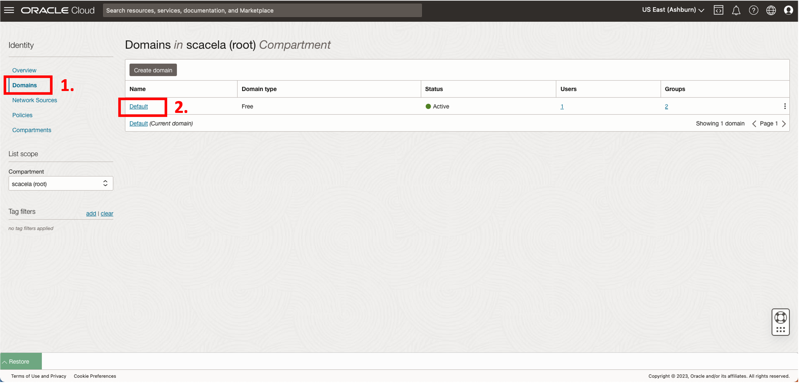
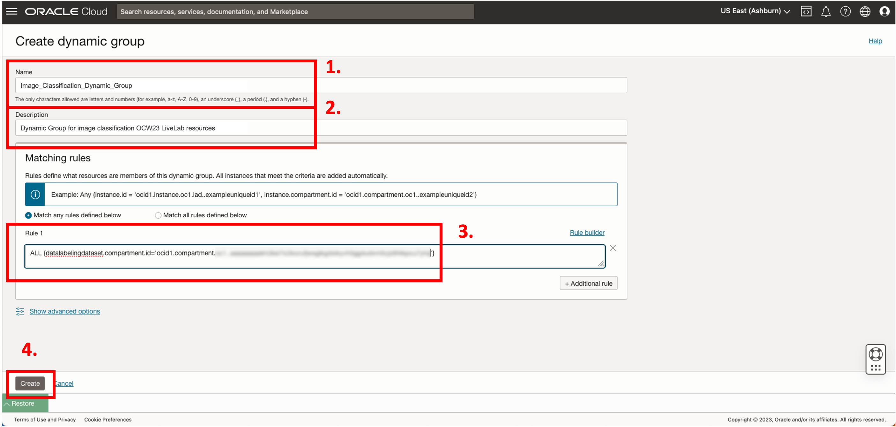
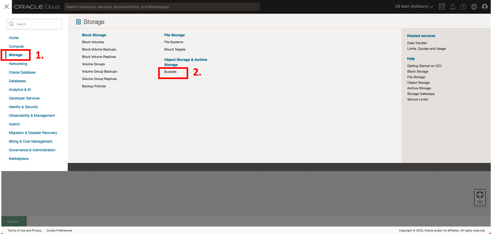
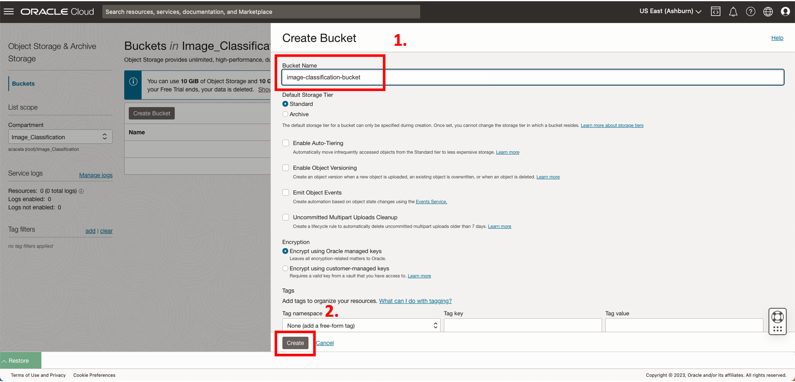
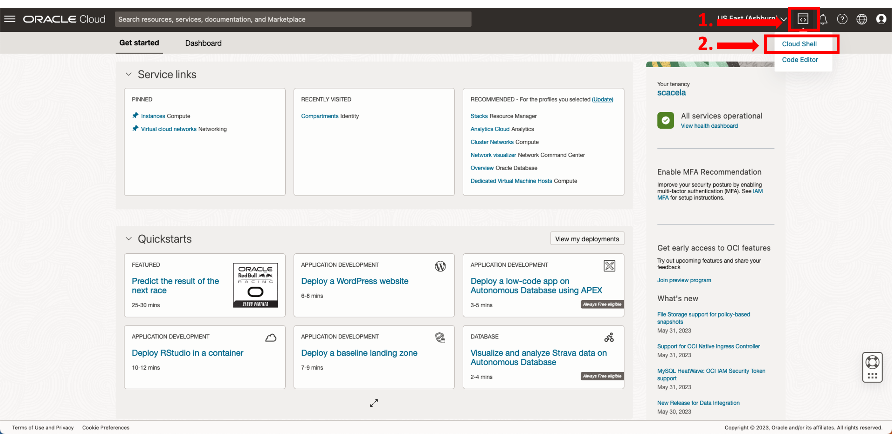
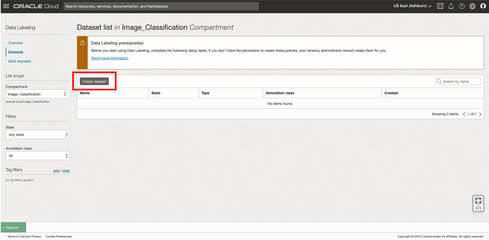
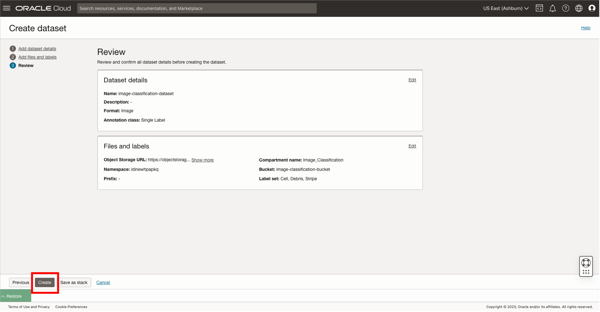

# Use DLS to bulk label a dataset

## Introduction
In this lab, we will provide a .zip file containing biomedical images separated into 3 subfolders based on how each image has been medically classified.

Participants will download a .zip file, bulk-upload the images to object storage, and create a labeled dataset using the Data Labeling service and a bulk-labeling script.

You will use the labeled dataset you create in this lab to custom-train a Vision model in [Lab 2](../custom-model/custom-model.md).

*Estimated Time*: 45-60 minutes

### Objectives

In this lab, you will:

* **Policy Setup**: Create Identity and Access Management (IAM) Compartment, Policy, Group, and Dynamic Group to enable necessary permissions for this LiveLab.
* **Task 1**: Create an Object Storage Bucket.
* **Task 2**: Download biomedical training data using Cloud Shell, and bulk-upload the biomedical training data to the Object Storage bucket.
* **Task 3**: Create a Data Labeling dataset, which imports the training images from Object Storage as records.
* **Task 4**: Bulk-label the images that were loaded into Object Storage using a provided script that takes a labeling scheme as input. In this lab, the labeling scheme will be based on the names of the folders containing the training images (e.g. images in the *Cell* folder will be labeled with *Cell*, and so on)

### Prerequisites

* An Oracle Free Tier, or Paid Cloud Account
* User is either a tenancy administrator, or has access to a tenancy administrator for the **Policy Setup** step.
    * Note: If you are not a tenancy administrator, begin with **Task 1** after the tenancy administrator has assigned permissions in **Policy Setup**.
* Lab steps assume usage of home region.
* Familiarity with a command-line interface (CLI) text editor is recommended, e.g. vi, nano, emacs
* Some familiarity with OCI-CLI is desirable, but not required
* Some familiarity with Python is desirable, but not required

## **Policy Setup**
*\[10-15 minutes\]*

Before you start using OCI Data Labeling, you or your tenancy administrator should set up the following policies by following below steps:

1. Create a new compartment where you will provision the resources used for this lab.

  a. From the OCI Services menu, click **Compartments** under **Identity & Security**.
  

  

  b. Click **Create Compartment**.

  c. Provide a name for your Policy, e.g. **Image_Classification**

  d. Provide a description, e.g. **Compartment for image classification OCW23 LiveLab**

  e. Select the root-level compartment, which has the same name as your tenancy.

  f. Click **Create Compartment**.
  

2. Find the compartment's Oracle Cloud Identifier (OCID), as shown in the below image. Then, copy and paste this value into a new line on a digital notepad app. You will retrieve this value when building your IAM Policy statements.


3. Create a Group and add users to it.

  a. From the OCI Services menu, click **Domains** under **Identity & Security**.
  

  b. Select the root compartment from the dropdown menu on the left-hand side of the screen, and select the **Default** domain.
  
  

  c. Click **Create Group**.
  

  d. Provide a name for your Group, e.g. **Image_Classification_Group**

  e. Provide a description for your Group, e.g. *Group for image classification OCW23 LiveLab users*
  

  f. Click **Add User to Group**, and select the name of the user who will proceed with the lab tasks after the Policy Setup.
  
  

<!-- todo: replace images for dynamic group step so that they have boxes drawn around dynamic group resource names on the console UI -->
4.  Create a Dynamic Group. The Dynamic Group will serve as a reference to a collection of resources that is determined by the matching rule logic associated with the Dynamic Group. You will write a matching rule that will match all Data Labeling datasets in your new compartment.

  a. From the OCI Services menu, click **Domains** under **Identity & Security**.
  

  b. Select the root compartment using the dropdown menu under **List Scope**, and select the **Default** domain.
  

  c. Click **Dynamic Groups**.
  

  d. Click **Create Dynamic Group**.
  <!-- todo: Need picture -->

  e. Provide a name for your Dynamic Group, e.g. **Image_Classification_Dynamic_Group**
  <!-- todo: Need picture -->

  <!-- todo: In image, replace users with resources -->
  f. Provide a description for your Dynamic Group, e.g. *Dynamic Group for image classification OCW23 LiveLab resources*

  g. Paste the following matching rule into the text field. Replace the placeholder value **\<compartment OCID\>** with your own compartment OCID from your notepad. Be sure to preserve the quotation marks from the template.

    ```
    <copy>ALL {datalabelingdataset.compartment.id='<compartment OCID>'}</copy>
    ```
  

  h. Click **Create**.

5. Create a Policy. The Policy will contain a series of statements. Each statement will allow a Group (and associated users) or Dynamic Group (and associated resources that are matched by the matching rule) to access specified resources to specified degrees of privilege.

  a. From the OCI Services menu, click 'Policies' under 'Identity & Security'
  

  b. Select the root compartment using the dropdown menu under **List Scope**, and select 'Policies'.
  

  c. Click **Create Policy**.
  <!-- todo: Need picture -->

  d. Provide a name for your Policy, e.g. **Data_Labeling_Policy**

  e. Provide a description, e.g. *Policy for image classification OCW23 LiveLab*

  f. Click the toggle switch labeled **Show manual editor** to enable entry of free-form text into a text field. You will use this text field to build your Policy logic.

  g. Copy and paste the following statements into the Policy Builder editor. Replace the placeholder value **\<compartment OCID\>** with your own compartment OCID from your notepad.

    ```
    <copy>Allow dynamic-group DataLabeling_DynamicGroup to read buckets in compartment id <compartment OCID>
    Allow dynamic-group DataLabeling_DynamicGroup to read objects in compartment id <compartment OCID>
    Allow dynamic-group DataLabeling_DynamicGroup to manage objects in compartment id <compartment OCID> where any {request.permission='OBJECT_CREATE'}
    Allow group ImageClassification_Group to manage object-family in compartment id <compartment OCID>
    Allow group ImageClassification_Group to read objectstorage-namespaces in compartment id <compartment OCID>
    Allow group ImageClassification_Group to manage data-labeling-family in compartment id <compartment OCID>
    Allow group ImageClassification_Group to use cloud-shell in tenancy
    Allow group ImageClassification_Group to manage ai-service-vision-family in compartment id <compartment OCID></copy>
    ```
  

  h. Click **Create**.

## **Task 1:** Create an Object Storage Bucket
*\[5 minutes\]*

1. From the OCI services menu, click **Buckets** under **Object Storage & Archive Storage**.
  

2. Select your new compartment using the dropdown menu under **List Scope**.
  

3. Click **Create Bucket** and enter details for your Bucket.

  a. **Bucket Name**: Enter a name for your Bucket that you can recognize, e.g. *image-classification-demo*. Make a note of this name for later use in this lab.

  b. **Default Storage Tier**: *Standard*

  c. **Encryption**: *Encrypt using Oracle managed keys*
  

  d. Click **Create**
  


## **Task 2:** Load the Biomedical Training Data into Object Storage
*\[5 minutes\]*

1. Open Cloud Shell


2. Feel free to dismiss the tutorial by entering *N*. Alternatively, you may enter *Y*.

3. Run the following command on your Cloud Shell command line interface to download the files needed throughout this lab:
```
<copy>wget https://objectstorage.us-ashburn-1.oraclecloud.com/p/R2GriGitNq-0NmTYGez0fop69aXx4SniJhyOjYpKXQyvQtaRtWU3yPgB8DaUzjey/n/orasenatdpltintegration03/b/all-images-live-lab-ocw23/o/Biomedical_Image_Classification_Training_Data.zip</copy>
```
4. Run the following command to unzip the download:
```
<copy>unzip Biomedical_Image_Classification_Training_Data.zip</copy>
```

5. Execute the following command to set an environment variable for the name of your bucket. Replace the placeholder value **\<Bucket Name\>** with the name of your own bucket.
```
<copy>export DL_Bucket_Name=<Bucket Name></copy>
```

6. Execute the following command to set an environment variable for the directory that contains your training image files.
```
<copy>export DL_Training_Data_Path=~/Biomedical_Image_Classification_Training_Data</copy>
```

7. Execute the following command to bulk-upload the training image files to your bucket.
```
<copy>oci os object bulk-upload --bucket-name "${DL_Bucket_Name}" --src-dir "${DL_Training_Data_Path}" --content-type 'image/jpeg'</copy>
```

<!--  -->
8. Minimize the Cloud Shell window, and confirm that the images have been uploaded to Object Storage within their respective folders.


## **Task 3:** Create a Data Labeling Dataset
*\[5-10 minutes\]*

1. From the OCI services menu, click **Data Labeling** under **Analytics & AI**.


2. Click on **Datasets**.


3. Select your new compartment using the dropdown menu under **List Scope**.

4. Create your dataset by clicking **Create dataset**.

  a. **Name**: Enter a name for your Data Labeling dataset, e.g. *image-classification-demo*

  b. **Dataset format**: *Images*

  c. **Annotation Class**: *Single Label*

  

  d. Click **Next**.
  <!--  -->

  e. Retrieve files from Object Storage by choosing **Select from Object Storage**.

  f. **Compartment**: Select the name of compartment where your Object Storage bucket exists.
  <!--  -->

  g. **Bucket**: Select your Bucket by name.
  <!--  -->
  

  h. **Add Labels**: You will enter all possible labels into this field. In our case, our labels will be as shown below. Note to use capitalized first letters followed by lowercase letters, and take care to leave no space characters in the label names.
    * Cell
    * Debris
    * Stripe
  

  i. Click **Next**.
  <!--  -->

  j. Review the information and deploy your Data Labeling dataset by clicking **Create**.
  

5. Find the Dataset OCID as shown in the screenshot. Then, copy and paste this value into a new line on your digital notepad app. You will retrieve this value in the next Task when configuring the bulk-labeling tool.
  

## **Task 4:** Populate Your DLS Dataset With the Data From Your Object Storage Bucket
*\[20-30 minutes\]*

1. Click into your new Data Labeling dataset. When all of the data has been imported into your dataset from your Object Storage Bucket, it will be time to perform the bulk-labeling operation on your data.

2. Run the following command to download the bulk-labeling script to the home directory on your Cloud Shell machine.
```
<copy>cd; git clone https://github.com/oracle-samples/oci-data-science-ai-samples.git</copy>
```
3. Run the following command to change your directory to the folder where the configuration files and main executable script are located.
```
<copy>cd oci-data-science-ai-samples/data_labeling_examples/bulk_labeling_python</copy>
```
<!--  -->

3. Run the following command to obtain the identifier of your tenancy's home region. Copy and paste the returned value into a new line on your digital notepad app.
```
<copy>echo $OCI_REGION</copy>
```
4. Open the file named **config.py** from the bulk-labeling tool contents with a command-line interface text editor of your preference (e.g. vi, nano, emacs) e.g. with vi using the command *vi config.py*, and then edit the variables as indicated below. Be sure to replace the **\<placeholder values\>** with your own values. Preserve the quotation marks in the template.
  ```
  <copy>CONFIG_FILE_PATH = "/etc/oci/config"</copy>
  <copy>REGION_IDENTIFIER = "<Region identifier from your notepad app>"</copy>
  <copy>DATASET_ID = "<OCID of your Data Labeling dataset from your notepad app>"</copy>
  ```
5. Open the file named **classification\_config.py** from the bulk-labeling tool contents, e.g. with the command *vi classification\_config.py*, and then edit the variables as indicated below.
```
<copy>LABELS = ["Cell", "Debris", "Stripe"]</copy>
<copy>LABELING_ALGORITHM = "FIRST_REGEX_MATCH"</copy>
```

6. Install pandas for your user on Cloud Shell, which is a prerequisite for running the bulk-labeling script:
```
<copy>pip install --user pandas</copy>
```
7. Run the following command to bulk-label the records in your Data Labeling dataset. This process is expected to complete after about 17 minutes.

**Note**: If you wish to check on the progress of the labeling from the web console, use the buttons on the web console UI to periodically return to the Data Labeling dataset page shown in the below screenshot, rather than refreshing the page. Refreshing the browser will halt the bulk-labeling process. If you refresh the browser, you will need to run the following command again to resume the bulk-labeling process.
```
<copy>python bulk_labeling_script.py</copy>
```

The unlabeled records would appear similar to those in this image:


After the bulk-labeling process has completed, a report detailing the duration of the labeling process will print to the screen, as similarly shown in this image.


8. Verify that your images have been labeled by navigating to the dataset created earlier and selecting one of the images.


Congratulations on completing this lab!

You have successfully achieved the following:

* Created Identity and Access Management (IAM) Compartment, Policy, Group, and Dynamic Group to enable necessary permissions for this LiveLab.
* Created an Object Storage Bucket.
* Downloaded biomedical training data using Cloud Shell, and bulk-upload the biomedical training data to the Object Storage bucket.
* Created a Data Labeling dataset, which imports the training images from Object Storage as records.
* Bulk-labeled the images that were loaded into Object Storage using a provided script that takes a labeling scheme as input. In this lab, the labeling scheme will be based on the names of the folders containing the training images (e.g. images in the *Cell* folder will be labeled with *Cell*, and so on)

[You may now **proceed to the next lab**](#next).

## Acknowledgements

* **Authors**
    * Samuel Cacela - Senior Cloud Engineer
    * Gabrielle Prichard - Product Manager, Analytics Platform
    * Xin-hua Hu - Professor, Dept. of Physics at East Carolina University
    * David Chen - Master Principal Cloud Architect

* **Last Updated By/Date**
    * Samuel Cacela - Senior Cloud Engineer, June 2023
