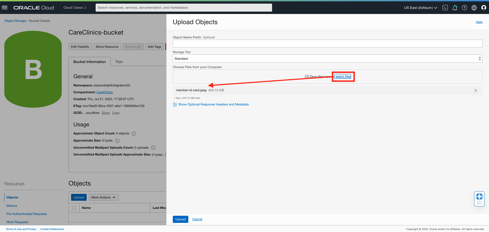
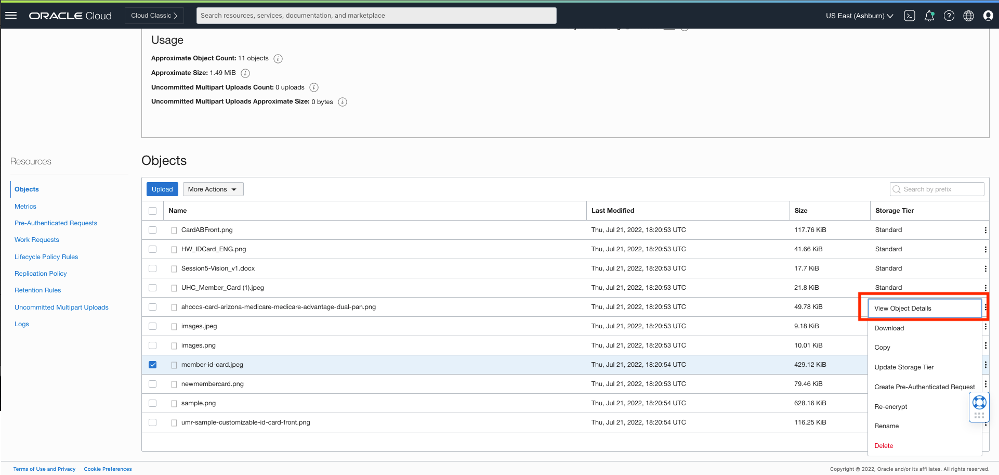
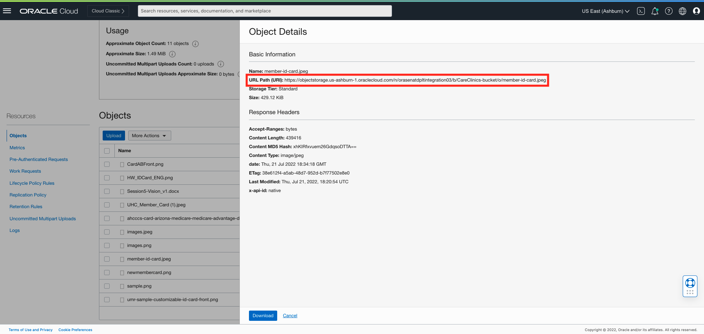
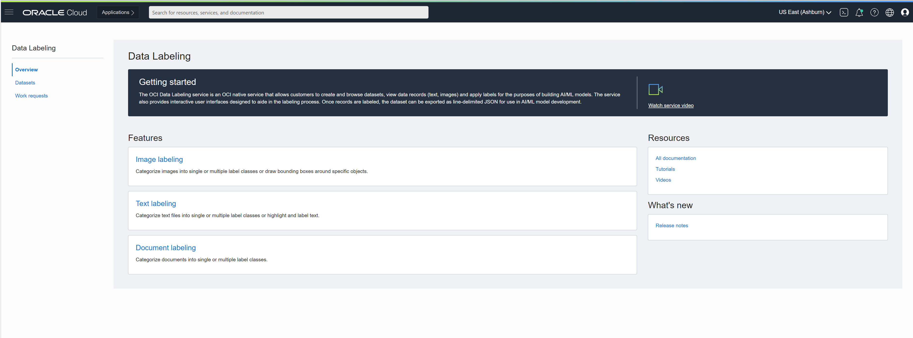

# Oracle Vision Service - Pre-Built models

## Introduction 

Oracle Cloud Infrastructure Vision is an AI service for performing deep-learning-based image analysis at scale, that is accessible using the OCI Console, REST APIs, SDKs and CLI. Vision service features are thematically split between Document AI for document-centric images and Image Analysis for object and scene-based images. 

With pre-built models available out of the box, developers can easily build image recognition and text recognition into their applications without machine learning (ML) expertise.  For industry -specific use cases, developers can automatically train custom vision models using their own data. 

In this session, we will walk through the OCI console to familiarize ourselves with the Vision service. We’ll discuss the data requirements and formats, and show you how to upload to Oracle Object storage for later to train our models. 


***Estimated Time***: 2 hours

### Objectives

In this lab, you will:
- Understand the data requirements and data formats for analyzing images using OCI Vision

- Upload data into OCI (Oracle Cloud Infrastructure) Object Storage

- Get familiar with the OCI console and be able to demo key OCI Vision features  


### Pre-requisites 

-	A free tier or paid tenancy in OCI (Oracle Cloud Infrastructure)
-	Familiarity with OCI Object Storage is desirable, but not required


## Policy Setup

Before you start using OCI Vision, your tenancy administrator should set up the following policies by following below steps:

1. Navigate to Policies

    Log into OCI Cloud Console. Using the Burger Menu on the top left corner, navigate to Identity & Security and click it, and then select Policies item under Identity.


    


2. Create Policy

   Click Create Policy 

   

3. Create a new policy with the following statements:

   If you want to allow all the users in your tenancy to use vision service, create a new policy with the below statement:     

    ```
    <copy>
    allow any-user to use ai-service-vision-family in tenancy
    </copy>
    ```

    

    If you want to limit access to a user group, create a new policy with the below statement:

    ```
    <copy>
    allow group <group-name> to use ai-service-vision-family in tenancy
    </copy>
    ```

    


## Task 1: Understand the data requirements for OCI AI Vision service

The vision service works with multiple formats of image data in order to detect objects, assign labels to images, extract text, and more. The service accepts data through Object Storage and locally stored images (if using via OCI console).

The service offers sync and async APIs to analyze images, with data requirements for each detailed below:

| API | Description | Supported Input Format |
| -------- |:-------:| -----:|
| sync API (analyzeImage, analyzeDocument) | Analyzes individual images |<p>* JPG, PNG, (PDF and Tiff for analyzeDocument) <br>*Up to 8 MB<br> *Single image input<br></p>|
| async API/jobs/startImageAnalysisjob/jobs/start | Analyze multiple images or multi-page PDFs | <p>* JPG, PNG (PDF and Tiff for analyzeDocument)<br>* Up to 2000 images input<br> * Supports multi-page PDF<br></p>| 


## Task 2: Upload Data to Object Storage 

1. Create an Object Storage Bucket (This step is optional in case the bucket is already created)

a. First, From the OCI Services menu, click Object Storage.


b. Then, Select Compartment from the left dropdown menu. Choose the compartment matching your name or company name.


c. Next click Create Bucket


d. Next, fill out the dialog box:

* Bucket Name: Provide a name
* Storage Tier: STANDARD

e. Then click Create


2. Upload image files into Storage Bucket

a. Switch to OCI Window and click the Bucket Name.
b. Bucket detail window should be visible. Click Upload


c. Click on Upload and then browse to file which you desire to upload.



More details on Object storage can be found on this page. [Object Storage Upload Page](https://oracle-livelabs.github.io/oci-core/object-storage/workshops/freetier/index.html?lab=object-storage) to see how to upload.

## Task 3: Demo Vision Service using the OCI Console

1. Navigate to the Vision Page of OCI Console


2. Use Document AI features

a. On the Vision page, select “Document AI” on the left navigation menu and provide a document or image from OCI object storage. You can also upload from local storage. In order to upload image from Object Storage Bucket, you will need image's URL Path.


b. Image URL path can be found in the Object Storage Bucket where your image resides. Navigate to the bucket to locate object details that has the image URL path, as shown below. 





c.  This invokes analyzeDocument API after the image is provided. Raw text extracted by our pre-trained multi-tenant model is displayed on the right.


| Feature | Description | Details on Console |
| -------- |:-------:| -----:|
| OCR (Optical Character Recognition) |Locates and digitizes text information from images |Text will appear under the "raw text" header of the results pane of the console [Reference](images/raw-text.png)|
| Document Image Classification |Classifies documents into different types based on their visual appearance, high-level features, and extracted keywords |Classification along with confidence score appears directly under "Results" pane [Reference](images/results.png)|
|Language Classification|Classifies the language of document based on visual features |Classification along with confidence score appears under document classification in Results pane [Reference](images/results.png)|
|Table extraction|Extracts content in tabular format, maintaining row/column relationships of cells| Toggle to the Table tab to get table information |
|Searchable PDF output|Embeds a transparent layer on top of document image in PDF format to make it searchable by keywords|You need to test on a PDF document to use this feature. When you've selected a PDF, the searchable PDF button will be clickable. Clicking on it will download an OCR PDF to your computer. [Reference](images/pdf.png)|


3. Use Image Analysis Features

a. On the Vision page, select “Image Classification” or "Object Detection" on the left navigation menu and provide an image from local storage or OCI object storage. This invokes analyzeImage API after the image is provided.


b. Features you can test out:

| Feature | Description | Details on Console |
| -------- |:-------:| -----:|
| Image classification | Categorizes object(s) within an image | Select "Image Classification." Labels and confidence scores will appear under the Results pane. [Reference](images/img-detection.png)|
| Object detection | Locates and identifies objects within an image | Select "Object Detection." Objects, confidence score, and highlighted bounding box will all appear under the Results pane. Clicking on one of the labels on the results pane will also highlight where on the image that object was detected.|

With this information, you can now succesfully leverage OCI Vision service through the OCI console.

Next, we will show you how to create a Custom Vision model through the console. 

In the following steps, we will show you how to create a vision project, select your training data, and train a custom model.


## Task 4: Create a Project

A Project is a way to organize multiple models in the same workspace. It is the first step to start.

1. Log into OCI Cloud Console. Using the Burger Menu on the top left corner, navigate to Analytics and AI menu and click it, and then select Vision Service item under AI services. Clicking the Vision Service Option will navigate one to the Vision Service Console. Once here, select Projects under "Custom Models" header on the left hand side of the console.


2. The Create Project button navigates User to a form where they can specify the compartment in which to create a Vision Project. The project we create here is named "CareClinicsDemo".


3. Once the details are entered click the Create Button. If the project is successfully created it will show up in projects pane.


## Task 5: Select Model Type

1. Click on the project that you just created. Next, we will go ahead and create a model. 

2. You will need to select Create Model within your project. 


3. AI Vision Service supports training of an on-demand custom model for Object Detection, Image Classification, and Document Image Classification features. You can select one of these three options in the drop down.

 


## Task 6: Select Training Data 

 1. To train a custom model, you will need training data. There are two main options depending on if you already have an annotated dataset, or only have raw (unlabeled) images.

 


2. Create a New dataset: If you do not have any annotated images (you only have raw images you'd like to train your model on), select "Create a New Dataset".


This will drive you to OCI Data Labeling service, where you can easily add labels or draw bounding boxes over your image content. To learn more about how to annotate images using OCI Data Labeling service, you can review documentation here [Adding and Editing Labels](https://docs.oracle.com/en-us/iaas/data-labeling/data-labeling/using/labels.htm).



Choose existing dataset: If you have an existing annotated dataset, you can select it by clicking "Choose Existing Dataset." If you've previously annotated images using OCI Data Labeling service, select that button and select the dataset file of your choice. If you have annotated your images using some 3rd party tool, you can upload that dataset file to object storage and select via the "object storage" button.


## Task 7: Train your Custom Model

1. In the "train model" step, you will name your model, add a description of it, and optionally, specify a training duration.


## Task 8: Review and Submit

In the "review" step, you can verify that all of your information is correct and go back if you want to make adjustments (on training time, for example). When you want to start training, click "submit" and this will kick of the process. You can then check on the status of your model in the project where you created it.


Congratulations on completing this lab!

