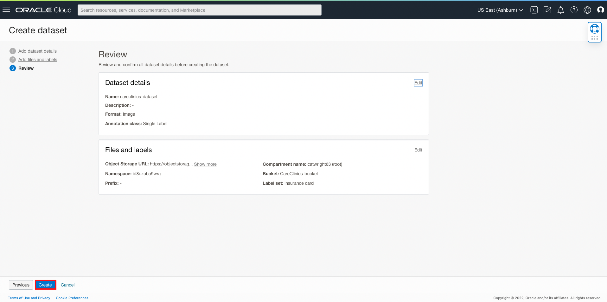
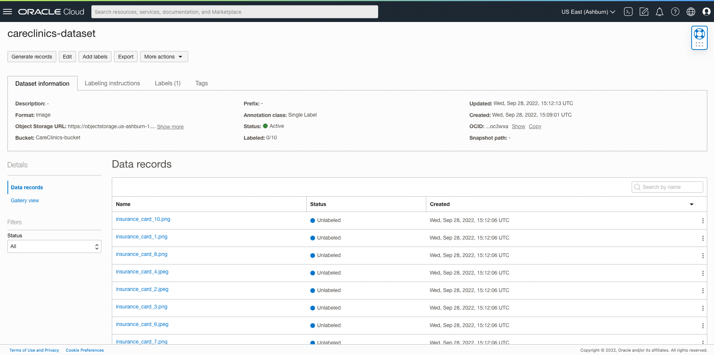
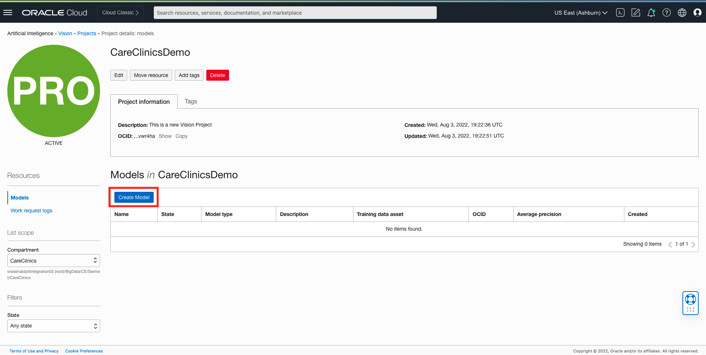
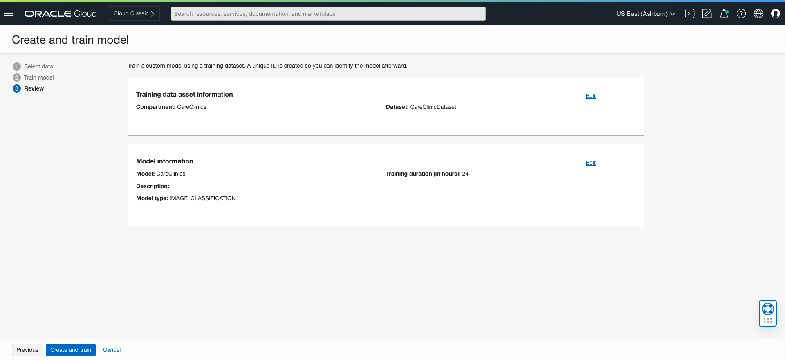

# Leverage Deep Learning Based Image Analysis at Scale

## Introduction 

Oracle Cloud Infrastructure Vision is an AI service for performing deep-learning-based image analysis at scale, that is accessible using the OCI Console, REST APIs, SDKs and CLI. Vision service features are thematically split between Document AI for document-centric images and Image Analysis for object and scene-based images. 

With pre-built models available out of the box, developers can easily build image recognition and text recognition into their applications without machine learning (ML) expertise.  For industry -specific use cases, developers can automatically train custom vision models using their own data. 

In this session, we will walk through the OCI console to familiarize ourselves with the Vision service. We’ll discuss the data requirements and formats, and show you how to upload to Oracle Object storage for later to train our models. 


***Estimated Time***: 2 hours

### Objectives

In this lab, you will:
- Understand the data requirements and data formats for analyzing images using OCI Vision

- Upload data into OCI (Oracle Cloud Infrastructure) Object Storage

- Get familiar with the OCI console and be able to demo key OCI Vision features  


### Pre-requisites 

-	A free tier or paid tenancy in OCI (Oracle Cloud Infrastructure)
-	Familiarity with OCI Object Storage is desirable, but not required


## Policy Setup

Before you start using OCI Vision, your tenancy administrator should set up the following policies by following below steps:

1. Navigate to Policies

    Log into OCI Cloud Console. Using the Burger Menu on the top left corner, navigate to Identity & Security and click it, and then select Policies item under Identity.


    


2. Click Create Policy 

   

3. Create a new policy with the following statements:

   If you want to allow all the users in your tenancy to use vision service, create a new policy with the below statement:     

    ```
    <copy>
    allow any-user to use ai-service-vision-family in tenancy
    </copy>
    ```

    

    If you want to limit access to a user group, create a new policy with the below statement:

    ```
    <copy>
    allow group <group-name> to use ai-service-vision-family in tenancy
    </copy>
    ```

    


## Task 1: Understand the data requirements for OCI AI Vision service

The purpose of **Task 1** is to understand what file types you can use to leverage the Vision service. The vision service works with multiple formats of image data in order to detect objects, assign labels to images, extract text, and more. The service accepts data through Object Storage and locally stored images (if using via OCI console).

The service offers sync and async APIs to analyze images, with data requirements for each detailed below:

| API | Description | Supported Input Format |
| -------- |:-------:| -----:|
| sync API (analyzeImage, analyzeDocument) | Analyzes individual images |<p>* JPG, PNG, (PDF and Tiff for analyzeDocument) <br>*Up to 8 MB<br> *Single image input<br></p>|
| async API/jobs/startImageAnalysisjob/jobs/start | Analyze multiple images or multi-page PDFs | <p>* JPG, PNG (PDF and Tiff for analyzeDocument)<br>* Up to 2000 images input<br> * Supports multi-page PDF<br></p>| 


## Task 2: Upload Data to Object Storage 

1. Create an Object Storage Bucket

a. First, From the OCI Services menu, click 'Object Storage'.


b. Then, Select Compartment from the left dropdown menu. Choose the compartment matching your name or company name. If you are the **only** user of the tenancy, you can use the Root compartment for purposes of this lab.


c. Next click 'Create Bucket'


d. Next, fill out the dialog box:

* Bucket Name: Provide a name
* Storage Tier: STANDARD

e. Then click 'Create'


2. Click this [link] (https://objectstorage.us-ashburn-1.oraclecloud.com/p/dFREAN2I7xPSaGTaLUt6bqRLjxk6ErJZ5pIt3mjbAmKcHJIl7cY3oyzMl5er23Iv/n/orasenatdpltintegration03/b/CareClinics-bucket/o/Vision%20Photos.zip) to download sample images that will be used during this lab. Please download and then unzip the folder "Vision Photos" from your local drive.


3. Upload image files into Storage Bucket

a. Switch to OCI Window and click the Bucket Name.

b. Bucket detail window should be visible. Click Upload.


c. Click on Upload and then browse to the Vision Photos you downloaded previously. There are 10 insurance card photos in total.


More details on Object storage can be found on this page. [Object Storage Upload Page](https://oracle-livelabs.github.io/oci-core/object-storage/workshops/freetier/index.html?lab=object-storage) to see how to upload.

d. Image URL path can be found in the Object Storage Bucket where your image resides. Next to each object, click the three dots and click 'View Object Details' button.


e. Copy the URL Path (URL) of each object into a separate notepad text file so you can easily access these links later in the lab.


## Task 3: Demo Vision Service using the OCI Console

| Feature | Description | Details on Console |
| -------- |:-------:| -----:|
| OCR (Optical Character Recognition) |Locates and digitizes text information from images |Text will appear under the "raw text" header of the results pane of the console [Reference](images/raw-text.png)|
| Document Image Classification |Classifies documents into different types based on their visual appearance, high-level features, and extracted keywords |Classification along with confidence score appears directly under "Results" pane [Reference](images/results.png)|
|Language Classification|Classifies the language of document based on visual features |Classification along with confidence score appears under document classification in Results pane [Reference](images/results.png)|
|Table extraction|Extracts content in tabular format, maintaining row/column relationships of cells| Toggle to the Table tab to get table information |
|Searchable PDF output|Embeds a transparent layer on top of document image in PDF format to make it searchable by keywords|You need to test on a PDF document to use this feature. When you've selected a PDF, the searchable PDF button will be clickable. Clicking on it will download an OCR PDF to your computer. [Reference](images/pdf.png)|

1. Navigate to the Vision Page of OCI Console


2. Use Document AI features

a. On the Vision page, select “Document AI” on the left navigation menu and provide a document or image from OCI object storage. You can also upload from local storage. In order to upload image from Object Storage Bucket, you will need image's URL Path. Refer back to the URL Path links that you copy and pasted into your notepad from Task 2. You will now paste these into the 'Enter Image URL' field and click 'Upload'.


b. This invokes analyzeDocument API after the image is provided. Raw text extracted by our pre-trained multi-tenant model is displayed on the right.


3. Features you can test out:

| Feature | Description | Details on Console |
| -------- |:-------:| -----:|
| Image classification | Categorizes object(s) within an image | Select "Image Classification." Labels and confidence scores will appear under the Results pane. [Reference](images/img-detection.png)|
| Object detection | Locates and identifies objects within an image | Select "Object Detection." Objects, confidence score, and highlighted bounding box will all appear under the Results pane. Clicking on one of the labels on the results pane will also highlight where on the image that object was detected.|

4. Use Object detection feature

a. On the Vision page, select "Object detection" on the left navigation menu and provide an image from local storage or OCI object storage. This invokes analyzeImage API after the image is provided.


With this information, you can now successfully leverage OCI Vision service through the OCI console.

Next, we will show you how to create a Custom Vision model through the console. 

In the following steps, we will show you how to create a vision project, select your training data, and train a custom model.

## Task 4: Create a Data Labeling Service Dataset

During Task 4, we will be creating a dataset that will have labels associated with the ten insurance card images we have uploaded and analyzed thus far. The dataset will be used later in the lab when we create a Vision model in **Task 7**.

1.	From the OCI services menu, click ‘Analytics & AI’, navigate to 'Data Labeling' under 'Machine Learning’ section.


2.	Click on 'Datasets.'


3.	If you are **not** using the Root compartment, set your Compartment to the same Compartment where you created your Bucket using the drop down under List Scope.

4.	Create your dataset by clicking 'Create dataset.'


a. Name: enter a name for your DLS Dataset that you can recognize, e.g. careclinics-dataset

b. Dataset format: Images

c. Annotation Class: Multiple Label


d. Click 'Next'

e. Retrieve files from Object Storage by choosing 'Select from Object Storage'

f. Choose the name of compartment where your Bucket exists

g. Choose your Bucket by name


h. Add Labels: enter all possible labels that you will want to use to label any of your data, pressing enter between each label. In our case, our labels will be: ‘insurance card’ and ‘health insurance card’.

i. Click ‘Next’


j. Review the information and deploy your Dataset by clicking 'Create'



5. From the CareClinicsDataset page, add labels to each data record i.e. insurance card.



a. Click the three dot icon on each data record

b. Choose 'label'


c. Check both label boxes 'insurance card' and 'health insurance card'

d.	Click ‘Save & next’ when finished and repeat this process for all images


e.	The dataset is complete when all images have a Status of ‘Labeled’ with a green dot.


## Task 5: Create a Project

A Project is a way to organize multiple models in the same workspace. It is the first step to start.

1. Log into OCI Cloud Console. Using the Burger Menu on the top left corner, navigate to Analytics and AI menu and click it, and then select Vision Service item under AI services. Clicking the Vision Service Option will navigate one to the Vision Service Console. Once here, select Projects under "Custom Models" header on the left hand side of the console.


2. The Create Project button navigates User to a form where they can specify the compartment in which to create a Vision Project. The project we create here is named "CareClinicsDemo".


3. Once the details are entered click the Create Button. If the project is successfully created it will show up in projects pane.


## Task 6: Select Model Type

1. Drill into the project that you just created. Next, we will create a model. 

2. You will need to select 'Create Model' within your project. 



3. AI Vision Service supports training of an on-demand custom model for Object Detection, Image Classification, and Document Image Classification features. We will select **image classification** out of the three options in the drop down.
 


## Task 7: Select Training Data 

 1. To train a custom model, you will need training data. There are two main options depending on if you already have an annotated dataset, or only have raw (unlabeled) images.

 


2. Choose Existing Dataset

In **Task 4**, we created a dataset that will now be leveraged in the training model. 

Choose existing dataset: If you have an existing annotated dataset, you can select it by clicking "Choose Existing Dataset." If you've previously annotated images using OCI Data Labeling service, select that button and select the dataset file of your choice. If you have annotated your images using some 3rd party tool, you can upload that dataset file to object storage and select via the "object storage" button.


If you would like to learn more about Adding and Editing labels in the future, you can find more information by reviewing documentation here [Adding and Editing Labels](https://docs.oracle.com/en-us/iaas/data-labeling/data-labeling/using/labels.htm).

## Task 8: Train your Custom Model and Submit

1. In the "train model" step, you will name your model, add a description of it, and optionally, specify a training duration.


In the "review" step, you can verify that all of your information is correct and go back if you want to make adjustments (on training time, for example). When you want to start training, click "submit" and this will kick of the process. You can then check on the status of your model in the project where you created it.



## Task 9: Test the model on new images

1. Navigate to the Project Details page and click on the model just created.


2. Click the [link](https://objectstorage.us-ashburn-1.oraclecloud.com/p/HTMmO7ndSl_UUwuJu2dKfWu4l5DsaYjZRqutq90atlQQIq6gtPRue5xWeGMYDGtb/n/orasenatdpltintegration03/b/CareClinics-bucket/o/test-images.zip) to download sample test images to your local machine. 

3. Upload one image from the test dataset on your local machine to test the newly created model.

a. Select 'Local file' under 'Image source'

b. Select 'select one…' in the 'Upload image' section. Navigate to the folder containing the test images on your local machine and select an image to upload.


c. Examine confidence measurements under the 'Results' pane. You can see our Vision model correctly predicted this image as an insurance card. You can test out with other images as well. 


Congratulations on completing this lab!