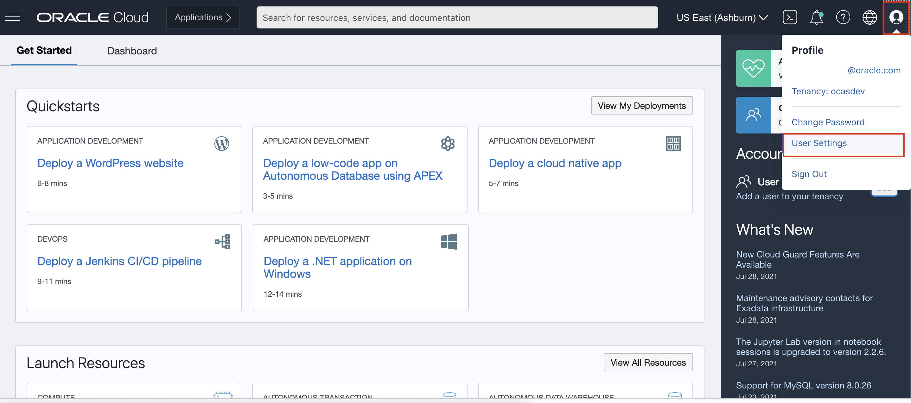
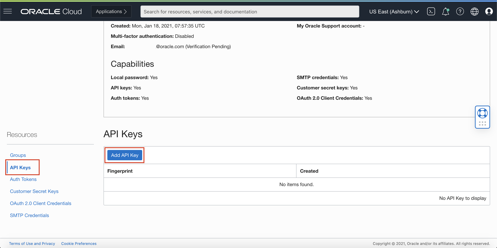
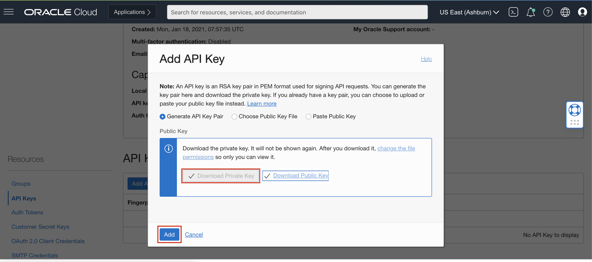
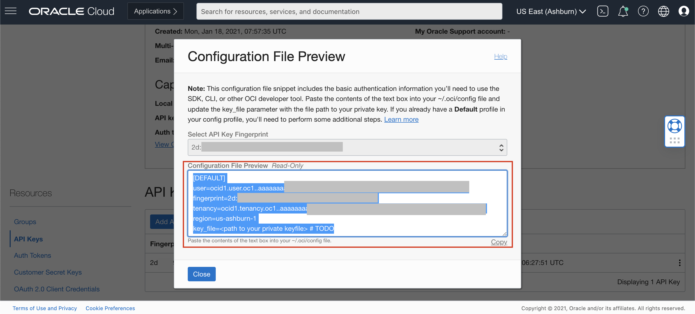
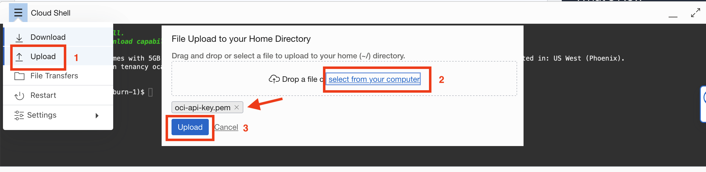

#  (Advanced Session) Access Anomaly Detection Service with OCI CLI

## Introduction

Our anomaly detection services also support to use CLI (Command Line Interface) tool `oci` or REST API calls to perform model and data operations.

In this lab session, we will show how to use OCI CLI tools to call our services. You can setup the configuration, execute those commands/codes, to see the results.

*Estimated Time*: 45 minutes

### Objectives

* Learn how to use OCI CLI to communicate with our anomaly detection service endpoints, by using Oracle Cloud Shell.

### Prerequisites

* Familiar with Oracle Cloud Shell. Refer [docs here](https://docs.oracle.com/en-us/iaas/Content/API/Concepts/cloudshellintro.htm)
* You have permission to use cloud shell; ask tenancy administrator to add policy if not.
* Familiar with local editing IDEs, such as VS Code or Sublime, etc
* Familiar with Linux editing tools, such as vi, or nano

## Task 1: Setup API Signing Key

We need to generate proper authentication configuration (API Signing Key pair) in order to use OCI CLI to communicate properly to the services on your behalf.

### 1. Open User Settings
Open the Profile menu (User menu icon) on the top right corner and click User Settings.


### 2. Open API Key
Navigate to API Key and then Click Add API Key.


### 3. Generate API Key
In the dialog, select Generate API Key Pair. Click Download Private Key and save the key to your local computer, and we will upload it later to the Cloud Shell.

**You can rename this `pem` file as `oci-api-key.pem` .**

Then click the Add button.


### 4. Generate Config File
After click the Add button, a configuration file window pop up.
Copy the values shown on the console, and save in your local computer, again later it will be used in the Cloud Shell.



The configuration content will be like the following:
```
<copy>[DEFAULT]
user=ocid1.user.oc1..aaaaaaa....
fingerprint=11:11:11:....
tenancy=ocid1.tenancy.oc1..aaaaaaaa....
region=us-ashburn-1
key_file=<path to your private keyfile> # TODO</copy>
```

To know more about API key and config file, please visit [Generating API KEY](https://docs.oracle.com/en-us/iaas/Content/API/Concepts/apisigningkey.htm) and [SDK and CLI Configuration File](https://docs.oracle.com/en-us/iaas/Content/API/Concepts/sdkconfig.htm#SDK_and_CLI_Configuration_File)

## Task 2: Activate Cloud Shell with Configuration

### 1. Get permission to Use Cloud shell

If you do not have permission to use cloud shell, ask your tenancy administrators to add the following policy:
```
<copy>allow any-user to use cloud-shell in tenancy</copy>
```
For details, you can refer to the [Cloud Shell Doc](https://docs.oracle.com/en-us/iaas/Content/API/Concepts/cloudshellintro.htm) .

### 2. Navigate to Cloud Shell

Log into OCI Cloud Console. Navigate to Cloud Shell Icon on the top right and click it.


It may take up to 30 seconds for the Cloud Shell to be ready, like the following screenshot.


### 3. Set up API Key and Configuration File

On the Cloud Shell, type the following command to create `.oci` folder and Enter:
```
<copy>mkdir .oci</copy>
```

Now, upload the `oci-api-key.pem` file you generated and downloaded earlier to the Cloud Shell host.


Once it is uploaded, it may landed in the home folder, you can move it to the `.oci` folder with the following command and change it permission to be accessible by owner ONLY:
```
<copy>mv oci-api-key.pem .oci/ ;
chmod 600 .oci/oci-api-key.pem </copy>
```

Next, let setup the configuration file using `nano` tool, paste the content copied from earlier step, and only update the last TODO line.
```
<copy>nano .oci/config </copy>
```
Now paste the configuration content, and update the last line as:
```
key_file=~/.oci/oci-api-key.pem
```
Then save the file (CTRL+X), and update the file permission to be accessible by owner only:
```
chmod 600 .oci/config </copy>
```

The final structure of `.oci` folder will be like this:


## Task 3: Execute OCI Anomaly Detection Commands

### 1. Try the main anomaly-detection command
```
<copy>oci anomaly-detection -h</copy>
```

### 2. Create a new Anomaly Detection project
This command requires the compartment-id, which can be found on the [compartment page](https://cloud.oracle.com/identity/compartments?region=us-ashburn-1).
```
<copy>oci anomaly-detection project create --compartment-id ocid1.tenancy.oc1..aaaaaaaa.... --display-name "OCI CLI test" --description "test description"</copy>
```
In the output, record the id value, which will be use for next step.

### 3. Create a Data Asset with Object Storage

To create data asset, first you need to find some object information by visiting the [Bucket service](https://cloud.oracle.com/object-storage/buckets?region=us-ashburn-1).
* bucketname
* namespace
* object name

For example, you can use the existing bucket in the tenancy with bucket name `anomaly-detection-bucket`, namespace `abcdefg`, and object name `demo-training-data.csv`.

Now use `nano` to create a file named `create_asset.json`, with the following content:
```
<copy>{
    "dataSourceType" : "ORACLE_OBJECT_STORAGE",
    "bucketName" : "anomaly-detection-bucket",
    "namespace" : "abcdefg",
    "objectName" : "demo-training-data.csv"
}</copy>
```
Next, let run the following command to create the asset, need to replace the <PROJECT-ID> with the real id in previous step:
```
<copy>oci anomaly-detection data-asset create --compartment-id ocid1.tenancy.oc1..aaaaaa..... --project-id <PROJECT-ID> --display-name "oci-cli-data-asset" --data-source-details file://create_asset.json</copy>
```
Again, in the output, record the id value, which is the data asset value.

### 4. Create and Train a Model

To create the model, we need to know the compartment id, project id, and data asset id.

First, let use `nano` to create a file named `create_model.json` to configure some information with the following content.
Again update the DATA-ASSET-ID with id collected above:
```
<copy>{
  "dataAssetIds": [
    "string",
    "string"
  ],
  "targetFap": 0.01,
  "trainingFraction": 0.7,
  "windowSize": 1,
  "algorithmHint": "MULTIVARIATE_MSET",
}</copy>
```
Now run the following command with the previous project id:
```
<copy>oci anomaly-detection model create --compartment-id ocid1.tenancy.oc1..aaaaaaa.... --project-id <PROJECT-ID> --display-name "oci-cli-model"  --model-training-details file://create_model.json</copy>
```

Now, in the output, record the id value, which is the model id.

### 5. Sync Detect Anomaly with the Model

You can use the following command example to make detection with the model built earlier.
```
<copy>oci anomaly-detection model detect-anomalies-inline --model-id <MODEL-ID> --sensitivity 0.5 --data file://data.json --signal-names file://signal_names.json </copy>
```

The content of signal_names.json can be like the following:
```
[
    "temperature_1",
    "temperature_2",
    "temperature_3",
    "temperature_4",
    "temperature_5",
    "pressure_1",
    "pressure_2",
    "pressure_3",
    "pressure_4",
    "pressure_5",
    "pressure_6"
]
```
The content of data.json can be like the following:
```
[
    {
        "timestamp": "2020-07-13T20:44:46Z",
        "values": [ 1, 0.4713, 1, 0.5479, 1.291, 0.8059, 1.393, 0.0293, 0.1541, 0.2611, 0.4098]
    },
    {
        "timestamp": "2020-07-13T20:45:46Z",
        "values": [ 2, 0.4713, 1, 0.5479, 1.291, 0.8059, 1.393, 0.0293, 0.1541, 0.2611, 0.4098]
    }
]
```

### 6. Async Detect Anomaly Job

Anomaly Detection supports Async Detection jobs and the command below can be used to perform async detection

```
oci anomaly-detection detect-anomaly-job create --compartment-id ocid1.tenancy.oc1..aaaaaaaa.... --input-details file://path/to/input.json --model-id <MODEL-ID>  --output-details  file://path/to/output.json --sensitivity 0.5
```

The content of input.json should have the below format
```
{
        "inputType": "INLINE",
        "data": [
            {
                "timestamp": "2020-07-13T20:44:46Z",
                "values": [
                    1,
                    0.8885,
                    0.6459,
                    -0.0016,
                    -0.9061,
                    0.1349,
                    -0.4967,
                    0.4335,
                    0.4813,
                    -1.0798,
                    0.2734
                ]
            },
            {
                "timestamp": "2020-07-13T20:45:46Z",
                "values": [
                    1,
                    0.1756,
                    1,
                    -0.1524,
                    -0.0804,
                    -0.2209,
                    0.4321,
                    -0.6206,
                    0.3386,
                    0.0082,
                    -0.3083
                ]
            }]}
```

The content of output.json should have the below format
```
{
            "outputType": "OBJECT_STORAGE",
            "namespaceName": NAMESPACE,
            "bucketName": BUCKET_NAME,
            "prefix": "liveLabJobOutput"
    }
```

The result of the Async Detection job can be found in the Object storage with the namespace and bucket specified.
The file would have a prefix of liveLabJobOutput.

Congratulations on completing this lab session!

## Acknowledgements

* **Authors**
    * Jason Ding - Principal Data Scientist - Oracle AI Services
    * Haad Khan - Senior Data Scientist - Oracle AI Services
    * Ochuko Adiotomre - Software Engineer - Oracle AI Services
* **Last Updated By/Date**
    * Ochuko Adiotomre - Software Engineer, Feb 2023
