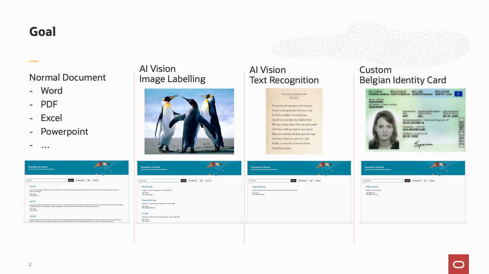

# Introduction

Using low code cloud services in Oracle Cloud Infrastructure (OCI), this workshop will illustrate how to create a system to search the full text of document images using OpenSearch and a familiar search interface created with Visual Builder.

The focus of this workshop is making document images searchable. These document images are typically text documents that have been scanned to .tif or .jpg, or .pdf. However the system you'll build will handle many different document types such as:
- Images with text using AI Document Understanding
- Images without text using AI Vision
- Custom document: Belgian ID card images
- Word, Excel, even recorded speech

The procedures in this workshop are designed for users that have obtained an Oracle Cloud free trial account with active credits. The procedures will also work for other Oracle Cloud accounts but may, in some cases, require minor adaptation.

Total estimated time: 90 minutes

### Architecture

It works like this:
1. A document is uploaded in the Object Storage by the user
1. An event is raised and queued in Streaming (Kafka)
1. The stream is received and processed by Oracle Integration Cloud (OIC)
1. Based on the file type, OIC will send them to one or more AI services to enrich them and provide searchable text
1. The results are uploaded to an OpenSearch index
1. The user queries OpenSearch using a Visual Builder application

The enrichment processing is orchestrated with OIC, a low code integration service that supports many use cases. This picture shows the processing flow.

The file types supported by the OIC project are hard-coded into different routes in the ObjectStorage2OpenSearch integration using the Switch command. Here's how various file types are processed.
- If the name contains ***belgian***, it is processed by OCI Vision, then the extracted text is classified using OCI Language, and then it is indexed into OpenSearch

- If the file has the extension **.png**, **.jpg**, **.jpeg**, or **.gif**, it is processed by OCI Vision, then the extracted text is classified using OCI Language, and then it is indexed into OpenSearch

- If the file has the extension **.json**, this is an output of the asynchronous AI services such as OCI Speech or OCI Document Understanding. The text is classified using Language Service and then it is indexed into OpenSearch.

- If the file has the extension **.mp4**, **.avi**, **.mp3**, **.wav**, or **.m4a**, it is processed by OCI Speech and the json output is processed as described above

- If the file has the extension **.tif** or **.pdf**, it is processed by OCI Document Understanding and the json output is processed as described above

- All other file types are sent to the OCI Function with Tikka parser and extracted text is classified using OCI Language and then indexed into OpenSearch

### Objectives

- Provision the services needed for the system
    - Compartment, Object Storage Bucket, Stream, Event, OpenSearch, OIC, AI services, Visual Builder
- Create an OCI Function to identify the documents
- Integrate the components into a working system
- Create a search user interface
- Process files through the system
- Search for files through the user interface

### Prerequisites
- You need an Oracle Cloud account (i.e. access to an OCI tenancy) to complete this workshop. Participants can take advantage of Oracle's free trial account that comes with free cloud credits that are good for 30 days or until used up. Many Oracle events, such as CloudWorld, offer trial accounts with extra free cloud credits. You should be able to complete this workshop in the allotted time if your free trial cloud account is already created and ready to use. If you previously had a free trial account but the credits have expired, you won't be able to complete the lab. An option in this case is to obtain a new free trial account with fresh credits using a different email address. You can also use an existing paid Oracle Cloud account as long as you have administrator rights that will be needed to provision services.
- You need a computer (laptop or desktop) with web browser, a text editor, and internet access. (Attempting to accomplish this workshop using a tablet or phone might be possible but is not recommended and it hasn't been tested on those types of devices.)

**Please proceed to the [next lab.](#next)**

## Acknowledgements 
- **Author**
    - Marc Gueury
    - Badr Aissaoui
    - Marek Krátký 
- **History** - 27 Mar 2023