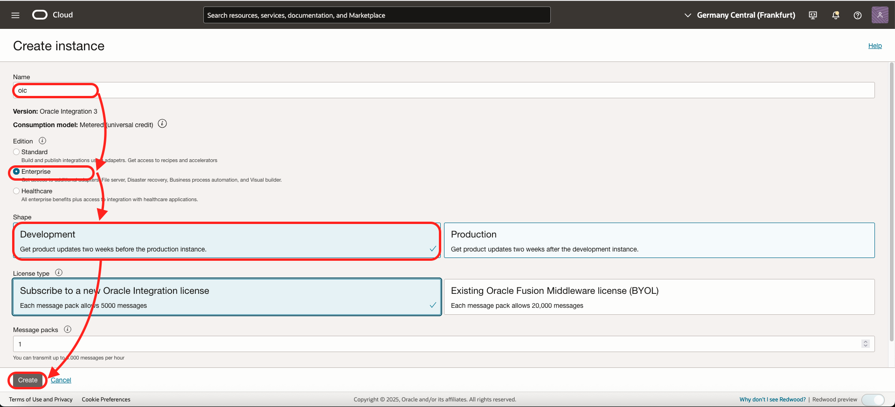

# Install the Components

## Introduction

Estimated time: 60 min

In this section, we will install all the components needed using the OCI Wizards.

### Objectives

- Create all the components.

### Prerequisites

- An OCI Account
- Open a text editor and copy this text. This will be the variables that we will use during the lab.

````
<copy>
List of ##VARIABLES##
---------------------
COMPARTMENT_OCID=(SAMPLE) ocid1.compartment.oc1.amaaaaaaaa
OIC_OCID=(SAMPLE) ocid1.integrationinstance.oc1.aaaaaaaaa
OIC_APPID=(SAMPLE) 123456789012345678AABBCC_APPID
OIC_CLIENT_ID=(SAMPLE) AABBCCDDEEFF1234567890_APPID
OIC_CLIENT_SECRET=(SAMPLE) 123$45678$12234
OIC_SCOPE=(SAMPLE) https://1234567890.integration.us-phoenix-1.ocp.oraclecloud.com:443/ic/api/

Terraform Output
----------------
-- STREAMING CONNECTION --------------------------
STREAM_BOOSTRAPSERVER=(SAMPLE)cell-1.streaming.us-phoenix-1.oci.oraclecloud.com:9092
STREAM_USERNAME=(SAMPLE)tenantname/username/ocid1.streampool.oc1.phx.amaaaaaa3twn4mia5hvcf4m3npe2l76fxfhffbrabcdefgh
AUTH_TOKEN=(SAMPLE)abcdefgh$$123

-- FUNCTION CONNECTION ---------------------------
FUNCTION_ENDPOINT=(SAMPLE)https://abcdefgh.us-phoenix-1.functions.oci.oraclecloud.com/20181201/functions/ocid1.fnfunc.oc1.phx.aaaaaaaacfum7wwrgt34y5pdnjum24kqxr6lkjdgabcdefgh

-- OPENSEARCH CONNECTION --------------------------
OPENSEARCH_API_ENDPOINT=(SAMPLE)https://amaaaaaaabcdefgh.opensearch.us-phoenix-1.oci.oraclecloud.com:9200

-- API GATEWAY CONNECTION ------------------------
APIGW_URL=(SAMPLE)https://abcdefgh.apigateway.us-phoenix-1.oci.customer-oci.com
</copy>
`````

## Task 1: Create a Compartment

The compartment will be used to contains all the components of the lab.

You can
- Use an existing compartment to run the lab. 
- Or create a new one.

1. Go the menu
    - Identity & Security
    - Choose Compartment
    
2. Click ***Create Compartment***
    - Give a name: ***oci-starter***
    - Then again: ***Create Compartment***
    
3. After creating the compartment, copy the OCID in your text editor. ***##COMPARTMENT_OCID##***. We will need it later.
    

## Task 2: Create an Oracle Integration instance

Oracle Integration will allow to glue all of this together.

1. Go the menu
    - Developer Services
    - Application Integration
    
2. Check that you are in the right compartment (*oci-starter* in this case)
3. Click *Create*
    - Name: *oic*
    - Version: *OIC Integration 3*
    - Edition: *Standard*
    - Shape: *Development*
    - Choose the licence type 
    - Click *Create*
        
4. Wait 3 mins that OIC is created and Green. 
5. When it is created, 
    - Click **Service Console**. It will open a new tab that you will use in Task 3.
    - Copy the OCID of the OIC instance in your text editor. ***##OIC_OCID##***. We will need it later.
    - When done, Enable Visual Builder
    

You do not have to wait that Visual Builder is installed before to go to the next step.

## Task 3: Create an Agent Group

To communicate with OpenSearch in the private network, we have to install the OIC agent on the compute.

First, 
1. Go to the OIC console that you opened just above
2. Create the Agent Group
    - On the left menu, choose *Design*
    - Then *Agent* 
    - Click *Create*
    - Name: *OPENSEARCH\_AGENT\_GROUP* 
    - Identifier: *OPENSEARCH\_AGENT\_GROUP*
    - Then *Create*
    

## Task 4: Get the OIC AppID (ClientID)

To enable Resource Principal, we need the OIC APPID.

1. Go the menu
    - Identity & Security 
    - Domains
    
2. Choose *Default (current domain)*
3. On the left, choose *Oracle Cloud Services*
    
4. Scroll down until that you see a name like *oic-xxx-xxxx  - Integration Service*
    - Click on it
5. In the Service details look for *Client ID*
    - Copy the value in your notes *##OIC\_APPID##*. It will be of the something like 668BEAAAA904B7EBBBBBBC5E33943B\_APPID
    

## Task 5: Get the OIC Client ID/Secret

Let's redo nearly the same to get Client ID/Secret for OIC

1. Again, Go the menu
    - Identity & Security 
    - Domains
2. Choose *Default (current domain)*
3. On the left, choose *Oracle Cloud Services*
4. Scroll down until that you see a name like *opensearch\_agent\_group-oic-xxx-xxxx  - Connectivity Agent OAuth Client*
    - Click on it
5. In the Service details look for *Client ID*
    - Copy the value in your notes *##OIC\_CLIENT\_ID##*. It will be of the something like 668BEAAAA904B7EBBBBBBC5E33943B\_APPID
    - Click *Show Secret* Copy the value in your notes *##OIC\_CLIENT\_SECRET##*.
    
6. Scroll further in the page.
    - Copy the scope finishing with /ic/api in your notes *##OIC\_SCOPE##*. It will be of the something like https://12345678.integration.us-phoenix-1.ocp.oraclecloud.com:443/ic/api/
    

## Task 6: Run Terraform to create the other components.

In OCI,
1. Go to OCI homepage
2. Click Code Editor
    - Click Terminal/New Terminal
    - Run the command below in the terminal
    

    ````
    <copy>
    git clone https://github.com/mgueury/oci-searchlab.git
    </copy>
    ````
3. Edit the file oci-searchlab/starter/env.sh
    - Replace the value with your ##OIC\_OCID##, ##OIC_APPID##, ##OIC\_CLIENT\_ID##, ##OIC\_CLIENT\_SECRET##, ##OIC\_SCOPE##
    ````
    <copy>
    export TF_VAR_oic_ocid="##OIC_OCID##"
    export TF_VAR_oic_appid="##OIC_APPID##"
    export TF_VAR_oic_client_id="##OIC_CLIENT_ID##"
    export TF_VAR_oic_client_secret="##OIC_CLIENT_SECRET##"
    export TF_VAR_oic_scope="##OIC_SCOPE##"
    </copy>
    ````
4. Run 2 commands below. It will run Terraform to create the rest of the components.
    ````
    <copy>
    cd oci-searchlab/starter/
    bin/gen_auth_token.sh
    ./build.sh
    </copy>
    ````
5. You can already run the Lab 3, Task 1 and 2. Do not wait that Terraform is finished. 

6. When Terraform will finished, you will settings that you need in later labs. Something like:

    ```
    --------------------------
    OCI SEARCH LAB Environment
    --------------------------

    -- STREAMING CONNECTION --------------------------
    STREAM_BOOSTRAPSERVER=cell-1.streaming.us-phoenix-1.oci.oraclecloud.com:9092
    STREAM_USERNAME=tenantname/username/ocid1.streampool.oc1.phx.amaaaaaa3twn4mia5hvcf4m3npe2l76fxfhffbrabcdefgh
    AUTH_TOKEN=abcdefgh$$123

    -- FUNCTION CONNECTION ---------------------------
    FUNCTION_ENDPOINT=https://abcdefgh.us-phoenix-1.functions.oci.oraclecloud.com/20181201/functions/ocid1.fnfunc.oc1.phx.aaaaaaaacfum7wwrgt34y5pdnjum24kqxr6lkjdgabcdefgh

    -- OPENSEARCH CONNECTION --------------------------
    OPENSEARCH_API_ENDPOINT=https://amaaaaaaabcdefgh.opensearch.us-phoenix-1.oci.oraclecloud.com:9200

    -- API GATEWAY CONNECTION ------------------------
    APIGW_URL=https://abcdefgh.apigateway.us-phoenix-1.oci.customer-oci.com

    Done.
    ```

## Known issues

During the terraform run, there is a error:

```
oci_core_instance.starter_instance: Creating..
- Error: 500-InternalError, Out of host capacity.
  Suggestion: The service for this resource encountered an error. Please contact support for help with service: Core Instance
```

Solution:  edit the file oci-searchlab/starter/src/terraform/variable.tf
Replace:
```
OLD: variable instance_shape { default = "VM.Standard.E4.Flex" }
NEW: variable instance_shape { default = "VM.Standard.E3.Flex" }
```

Then rerun

```
./build.sh
```

## Acknowledgements

- **Author**
    - Marc Gueury
    - Badr Aissaoui
    - Marek Krátký 
- **History** - Creation - 24 May 2023
              - V2 - 28 June 2023