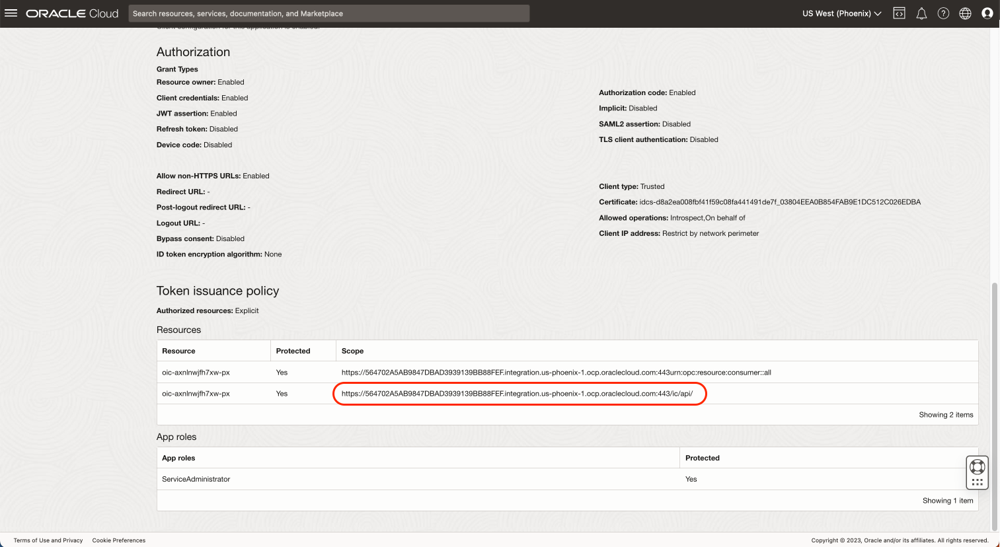

# Install the Components

## Introduction
In this lab, you will install all the components needed for this workshop. Some of these will be provisioned manually and many will be provisioned automatically using a provided Terraform script.

Estimated time: 50 min

### Objectives

- Provision all the cloud components

### Prerequisites

- An OCI Account with sufficient credits where you will perform the lab. (Some of the services used in this lab are not part of the *Always Free* program.)
- Cookies must be enabled in your browser to use the OCI console code editor in this lab
- Choose which web browser to use before you start. There is an option in a later lab to download a github repo to your local computer using the OCI Console Cloud Shell. Some users have experienced a bug attempting to do this with the Firefox Browser Extended Support Release (ESR). The Chrome browser is an alternative in this case.


## Task 1: Prepare to save configuration settings

1. Open a text editor and copy & paste this text into a text file on your local computer. These will be the variables that will be used during the lab.

````
<copy>
List of ##VARIABLES##
---------------------
COMPARTMENT_OCID=(SAMPLE) ocid1.compartment.oc1.amaaaaaaaa
OIC_OCID=(SAMPLE) ocid1.integrationinstance.oc1.aaaaaaaaa
OIC_APPID=(SAMPLE) 123456789012345678AABBCC_APPID
OIC_CLIENT_ID=(SAMPLE) AABBCCDDEEFF1234567890_APPID
OIC_CLIENT_SECRET=(SAMPLE) 123$45678$12234
OIC_SCOPE=(SAMPLE) https://1234567890.integration.us-phoenix-1.ocp.oraclecloud.com:443/ic/api/

Terraform Output
----------------
-- STREAMING CONNECTION --------------------------
STREAM_BOOSTRAPSERVER=(SAMPLE)cell-1.streaming.us-phoenix-1.oci.oraclecloud.com:9092
STREAM_USERNAME=(SAMPLE)tenantname/username/ocid1.streampool.oc1.phx.amaaaaaa3twn4mia5hvcf4m3npe2l76fxfhffbrabcdefgh
AUTH_TOKEN=(SAMPLE)abcdefgh$$123

-- FUNCTION CONNECTION ---------------------------
FUNCTION_ENDPOINT=(SAMPLE)https://abcdefgh.us-phoenix-1.functions.oci.oraclecloud.com/20181201/functions/ocid1.fnfunc.oc1.phx.aaaaaaaacfum7wwrgt34y5pdnjum24kqxr6lkjdgabcdefgh

-- OPENSEARCH CONNECTION --------------------------
OPENSEARCH_API_ENDPOINT=(SAMPLE)https://amaaaaaaabcdefgh.opensearch.us-phoenix-1.oci.oraclecloud.com:9200

-- API GATEWAY CONNECTION ------------------------
APIGW_URL=(SAMPLE)https://abcdefgh.apigateway.us-phoenix-1.oci.customer-oci.com
</copy>
`````

## Task 2: Create a Compartment

The compartment will be used to contain all the components of the lab.

You can
- Use an existing compartment to run the lab 
- Or create a new one (recommended)

1. Login to your OCI account/tenancy
1. Go the 3-bar/hamburger menu of the console and select
    1. Identity & Security
    1. Compartment
    
2. Click ***Create Compartment***
    - Give a name: ***oci-starter***
    - Then again: ***Create Compartment***
    
3. After creating the compartment, copy the OCID to your text file at ***##COMPARTMENT_OCID##***. You will need it later.
    

## Task 3: Create an Oracle Integration instance

Oracle Integration Cloud (OIC) will allow you to glue all of the components together.

1. Go the Cloud console 3-bar/hamburger menu and select the following
    1. Developer Services
    1. Application Integration
    
2. Check that you are in the intended compartment (*oci-starter* in this case)
3. Click *Create* and set the following options
    - Name: *oic*
    - Version: *OIC Integration 3*
    - Edition: *Standard*
    - Shape: *Development*
    - Choose the license type (Use *Subscribe to a new...* unless you already have a license that you can reuse.)
    - Click *Create*
        
4. Wait about 3 mins until OIC is created and Green. 
5. When it is created, click **Service Console**. It will open a new tab that you will use in Task 3.
1. Copy the OCID of the OIC instance and paste it in your text file. ***##OIC_OCID##***. You will need it later.
1. Click **Enable** next to *Visual Builder* to enable it
    

1. Continue to next task. You do not have to wait for Visual Builder to be installed before continuing.

## Task 4: Create an Agent Group

To communicate with OpenSearch in the private network, it is necessary to install the OIC agent on the compute instance.

1. Go to the OIC console that you opened just above
2. Create the Agent Group using the following steps:
    1. On the left menu, choose *Design*
    1. Then *Agent* 
    1. Click *Create*
    1. Name: *OPENSEARCH\_AGENT\_GROUP* 
    1. Identifier: *OPENSEARCH\_AGENT\_GROUP*
    1. Then *Create*
    


## Task 5: Get the OIC AppID (ClientID)

To enable Resource Principal, you need the OIC APPID.

1. Go the console 3-bar/hamburger menu and select
    1. Identity & Security 
    1. Domains
    
2. Choose the *Default (current domain)* domain
3. On the left, choose *Oracle Cloud Services*
    
4. Scroll down until that you see a name like *oic-xxx-xxxx  - Integration Service*, then **click on it**
5. In the Service details, look for *Client ID*
    - Copy the value to your text file at *##OIC\_APPID##*. It will be of the something like 668BEAAAA904B7EBBBBBBC5E33943B\_APPID
    

## Task 6: Get the OIC Client ID/Secret

Perform a similar task to get Client ID/Secret for OIC

1. Again, go the console 3-bar/hamburger menu and select 
    1. *Identity & Security* 
    2. *Domains*
2. Choose the *Default (current domain)* domain
3. On the left, choose *Oracle Cloud Services*
4. Scroll down until that you see a name like *opensearch\_agent\_group-oic-xxx-xxxx  - Connectivity Agent OAuth Client* and **click on it**.
5. In the Service details, look for *Client ID*
    - Copy the value to your text file at *##OIC\_CLIENT\_ID##*. It will be of the something like 668BEAAAA904B7EBBBBBBC5E33943B\_APPID
1. Click *Show Secret* and copy the value to your  text file at *##OIC\_CLIENT\_SECRET##*.
    
6. Scroll further down the page to find *Resources*.
1. Copy the scope in the row that ends with /ic/api and paste it to your text file at *##OIC\_SCOPE##*. It will look something like https://12345678.integration.us-phoenix-1.ocp.oraclecloud.com:443/ic/api/
    

## Task 7: Run a Terraform script to create the other components.

1. Go to the OCI console homepage
2. Click the *Developer Tools* icon in the upper right of the page and select *Code Editor*. Wait for it to load.
1. In the code editor menu, click *Terminal* then *New Terminal*
1. Run the command below in the terminal
    
    ````
    <copy>
    git clone https://github.com/mgueury/oci-searchlab.git
    </copy>
    ````
3. Edit the file *oci-searchlab/starter/env.sh*
1. in env.sh, replace the values **##OIC\_OCID##**, **##OIC_APPID##**, **##OIC\_CLIENT\_ID##**, **##OIC\_CLIENT\_SECRET##**, **##OIC\_SCOPE##** with the corresponding value from your text file.
    ````
    <copy>
    export TF_VAR_oic_ocid="##OIC_OCID##"
    export TF_VAR_oic_appid="##OIC_APPID##"
    export TF_VAR_oic_client_id="##OIC_CLIENT_ID##"
    export TF_VAR_oic_client_secret="##OIC_CLIENT_SECRET##"
    export TF_VAR_oic_scope="##OIC_SCOPE##"
    </copy>
    ````
4. Run each of the three commands below, one at a time. It will run Terraform to create the rest of the components.
    ````
    <copy>
    cd oci-searchlab/starter/
    </copy>
    ````
    ````
    <copy>
    bin/gen_auth_token.sh
    </copy>
    ````
    ````
    <copy>
    ./build.sh
    </copy>
    ````
5. **Proceed to the next Lab while Terraform is running.** 
    ```
    Do not wait for the Terraform script to finish because it takes about 34 minutes and you can complete some steps in the next lab while it's running. However, you will need to come back to this lab when it is done and complete the next step.
    ```

6. When Terraform will finished, you will see settings that you need in the next lab. Save these to your text file. It will look something like:

    ```
    --------------------------
    OCI SEARCH LAB Environment
    --------------------------

    -- STREAMING CONNECTION --------------------------
    STREAM_BOOSTRAPSERVER=cell-1.streaming.us-phoenix-1.oci.oraclecloud.com:9092
    STREAM_USERNAME=tenantname/username/ocid1.streampool.oc1.phx.amaaaaaa3twn4mia5hvcf4m3npe2l76fxfhffbrabcdefgh
    AUTH_TOKEN=abcdefgh$$123

    -- FUNCTION CONNECTION ---------------------------
    FUNCTION_ENDPOINT=https://abcdefgh.us-phoenix-1.functions.oci.oraclecloud.com/20181201/functions/ocid1.fnfunc.oc1.phx.aaaaaaaacfum7wwrgt34y5pdnjum24kqxr6lkjdgabcdefgh

    -- OPENSEARCH CONNECTION --------------------------
    OPENSEARCH_API_ENDPOINT=https://amaaaaaaabcdefgh.opensearch.us-phoenix-1.oci.oraclecloud.com:9200

    -- API GATEWAY CONNECTION ------------------------
    APIGW_URL=https://abcdefgh.apigateway.us-phoenix-1.oci.customer-oci.com

    Done.
    ```

## Known issues

During the terraform run, there might be an error depending on the compute shapes supported byyour tenancy:

```
oci_core_instance.starter_instance: Creating..
- Error: 500-InternalError, Out of host capacity.
  Suggestion: The service for this resource encountered an error. Please contact support for help with service: Core Instance
```

Solution:  edit the file *oci-searchlab/starter/src/terraform/variable.tf* and replace the *instance_shape*
```
OLD: variable instance_shape { default = "VM.Standard.E3.Flex" }
NEW: variable instance_shape { default = "VM.Standard.A1.Flex" }
```

Then rerun the following command in the code editor

```
./build.sh
```

## Continue with the next lab when you have completed the final step of this lab.
[Go to next lab.](#next)


## Acknowledgements

- **Author**
    - Marc Gueury
    - Badr Aissaoui
    - Marek Krátký 
- **History** - Creation - 24 May 2023

