# Integrate to the Components together

## Introduction

Estimated time: 20 min

### Objectives

- Integrate all the components together

### Prerequisites

- It is easier to store the sample files on a laptop. If it is impossible, for ex that you do not have the git command, you can get them from the cloud console. We have downloaded them in the previous lab (Function) in the Cloud Shell. There is an option Download in the Cloud Shell.
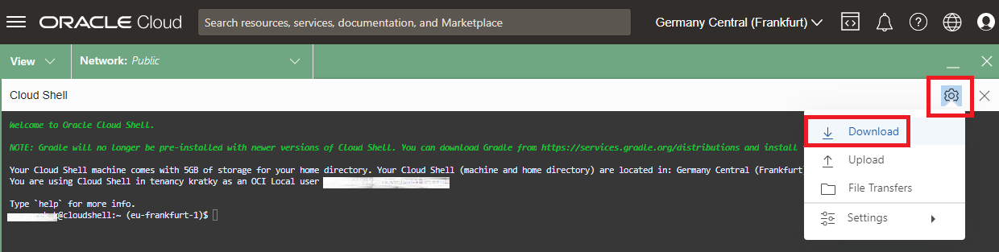

- To download the sample files on your laptop, please run this:

````
<copy>
git clone https://github.com/mgueury/oci-searchlab.git
</copy>
````

The directory contains the Oracle integration Cloud (OIC) package, the Visual Builder (VB) application and samples files to parse.

Alternatively you can download the files form the Cloud Shell:
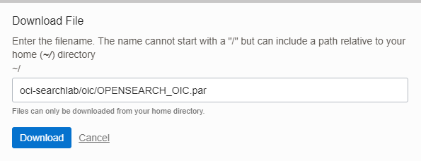

Enter the file name: oci-searchlab/oic/OPENSEARCH_OIC.par and click Download button.


## Task 1: Import the integration

We will upload the integration.
Go to the tab with Integration open
Go to the Oracle Integration home page:
Go the menu
- Developer Services
- Application Integration
- Choose *oic*
- Click *Service Console* to open a new browser tab with OIC 
- On the left menu, choose *Design*
- Then *Package*
- Click *Import*
- Browse: choose *OPENSEARCH_OIC.par*
    - Go to the directory that you downloaded from GITHUB
    - In the directory "oic", you will find *OPENSEARCH_OIC.par*
- Click: *Import and Configure*


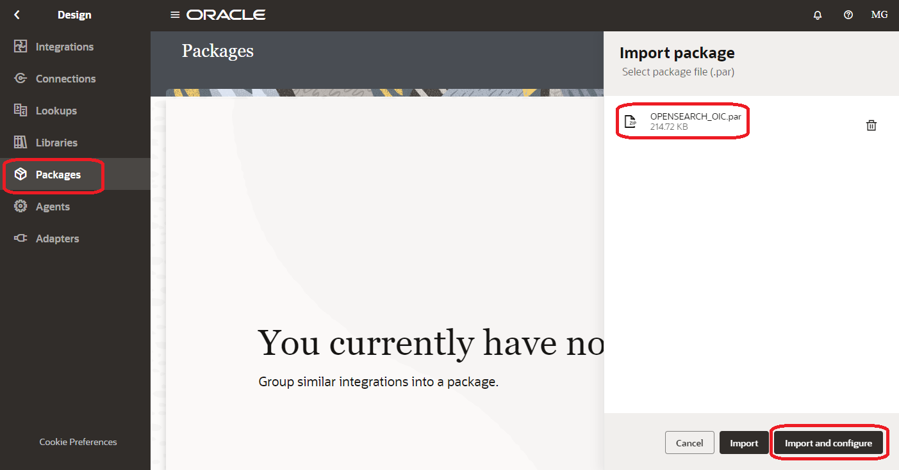

## Task 2: Configure the connections

Lets configure the connections. 
We can start with the public connections first because these don't depend on components provisioning being completed in the previous lab (Terraform script).

Click to edit the connection *RestObjectStorage*

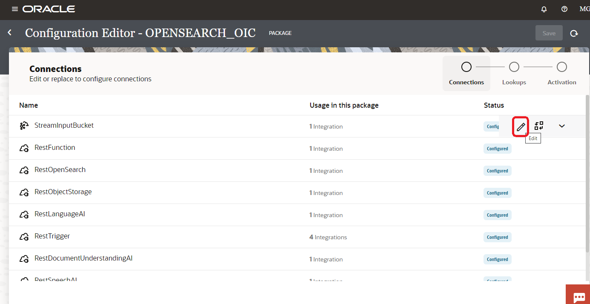

### A. RestObjectStorage

First, we need to get the Object Storage rest API. *##OS\_URL##*

You can find it here [https://docs.oracle.com/en-us/iaas/api/#/en/objectstorage/20160918/](https://docs.oracle.com/en-us/iaas/api/#/en/objectstorage/20160918/)

Fill the Connection details:
Then fill the Connection details:
- Connection Type = *REST API Base URL*
- Connection URL = *##OS\_URL##*
    - ex: https://objectstorage.eu-frankfurt-1.oraclecloud.com
- Security policy = *OCI Service Invocation*
- Access Type = *Public gateway*
- *Save / Test / Save* until 100%

### B. RestLanguageAI

First, we need to get the AI Language rest API. *##AI\_LANG\_URL##*

You can find it here [https://docs.oracle.com/en-us/iaas/api/#/en/language/20221001/](https://docs.oracle.com/en-us/iaas/api/#/en/language/20221001/)

Fill the Connection details:
Then fill the Connection details:
- Connection Type = *REST API Base URL*
- Connection URL = *##AI\_LANG\_URL##*
    - ex: https://language.aiservice.eu-frankfurt-1.oci.oraclecloud.com
- Security policy = *OCI Service Invocation*
- Access Type = *Public gateway*
- *Save / Test / Save* until 100%

### C. Resttrigger

There is no connection details to enter
- *Save / Test / Save* until 100%

### D. RestDocumentUnderstandingAI

First, we need to get the AI Document Understanding rest API. *##AI\_DOC\_URL##*

You can find it here [https://docs.oracle.com/en-us/iaas/api/#/en/document-understanding/20221109/](https://docs.oracle.com/en-us/iaas/api/#/en/document-understanding/20221109/)

Fill the Connection details:
Then fill the Connection details:
- Connection Type = *REST API Base URL*
- Connection URL = *##AI\_LANG\_URL##*
    - ex: https://document.aiservice.eu-frankfurt-1.oci.oraclecloud.com
- Security policy = *OCI Service Invocation*
- Access Type = *Public gateway*
- *Save / Test / Save* until 100%

### E. RestSpeechAI

First, we need to get the AI Speech rest API. *##AI\_SPEECH\_URL##*

You can find it here [https://docs.oracle.com/en-us/iaas/api/#/en/speech/20220101/](https://docs.oracle.com/en-us/iaas/api/#/en/speech/20220101/)

Fill the Connection details:
Then fill the Connection details:
- Connection Type = *REST API Base URL*
- Connection URL = *##AI\_LANG\_URL##*
    - ex: https://speech.aiservice.eu-frankfurt-1.oci.oraclecloud.com
- Security policy = *OCI Service Invocation*
- Access Type = *Public gateway*
- *Save / Test / Save* until 100%

### F. RestVisionAI

First, we need to get the AI Vision rest API. *##AI\_VISION\_URL##*

You can find it here [https://docs.oracle.com/en-us/iaas/api/#/en/vision/20220125/](https://docs.oracle.com/en-us/iaas/api/#/en/vision/20220125/)

Fill the Connection details:
Then fill the Connection details:
- Connection Type = *REST API Base URL*
- Connection URL = *##AI\_VISION\_URL##*
    - ex: https://vision.aiservice.eu-frankfurt-1.oci.oraclecloud.com
- Security policy = *OCI Service Invocation*
- Access Type = *Public gateway*
- *Save / Test / Save* until 100%

Before we can proceed with configuring the remaining three connections we need to wait for the script build.sh (Terraform) from the previous lab (provisioning the components) to finish (approx 30 minutes).

### G. StreamInputBucket
You will need to get values from your environment:
In OCI terminal run: oci-searchlab/starter/src/search_env.sh
In the output of this script look for the following values:
- ##STREAM_BOOSTRAPSERVER##, 
- ##STREAM_USERNAME##, 
- ##AUTH_TOKEN## and 

Download the file *oss_store.jks* from OCI Cloud Shell. 

Enter the file name: oci-searchlab/starter/oss_store.jks and click Download button. 

Click to edit the connection *StreamInputBucket*


Use this info:
  - Bootstrap servers = *##STREAM_BOOSTRAPSERVER##*
  - SASL Username = *##STREAM_USERNAME##*
  - SASL Password = *##AUTH_TOKEN##*
  - Truststore = *oss_store.jks*
  - TrustStore password = *changeit* 
  - Access Type = *Connectivity agent*
  - Selected agent group: *OPENSEARCH\_AGENT\_GROUP*
  - *Save / Test / Save* until 100%

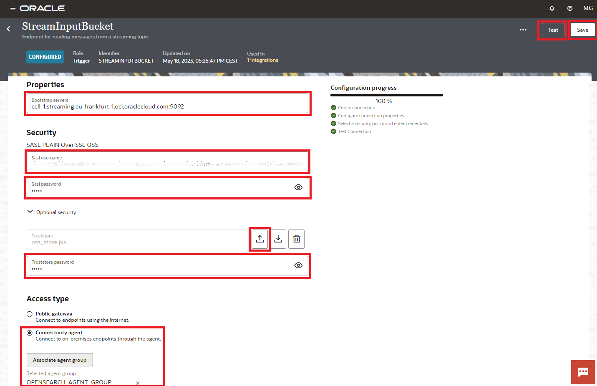

### H. RestFunction

Fill the Connection details:
- Connection Type = *REST API Base URL*
- Connection url = *##FUNCTION_ENDPOINT##* without /action/invoke at the end.
    - ex: https://xxxx.eu-frankfurt-1.functions.oci.oraclecloud.com/20181201/functions/ocid1.fnfunc.oc1.eu-frankfurt-1.aaaaaaabbbbb
- Security policy = *OCI Service Invocation*
- Access Type = *Public gateway*
- *Save / Test / Save* until 100%

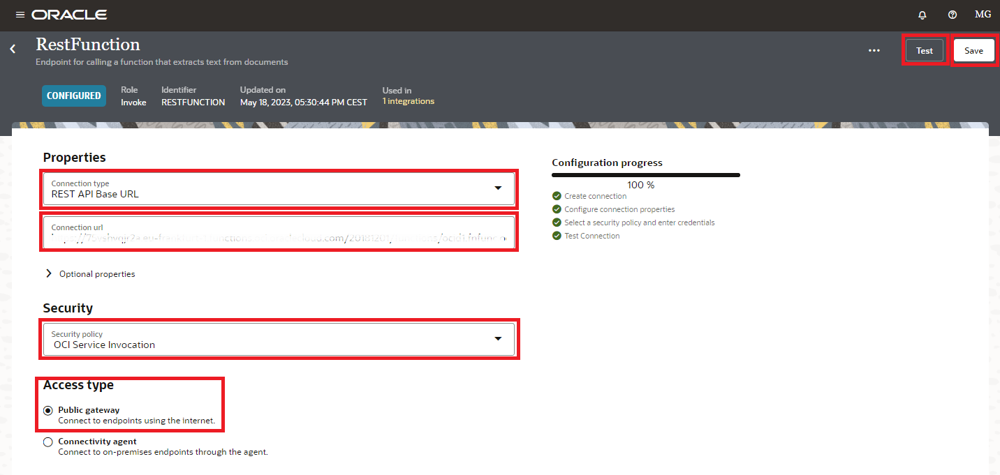

### I. RestOpenSearch

    
Fill the Connection details:
- Connection Type = *REST API Base URL*
- Connection url = *##OPENSEARCH\_API\_ENDPOINT##*
    - ex: https://amamamamalllllaaac5vkwantypqqcs4bqrgqjrkvuxxghsmg7zzzzzxxxxx.opensearch.eu-frankfurt-1.oci.oraclecloud.com:9200
- Security policy: *No Security Policy*
- Access Type = *Connectivity agent*
- Selected agent group: *OPENSEARCH\_AGENT\_GROUP*
- *Save / Test / Save* until 100%

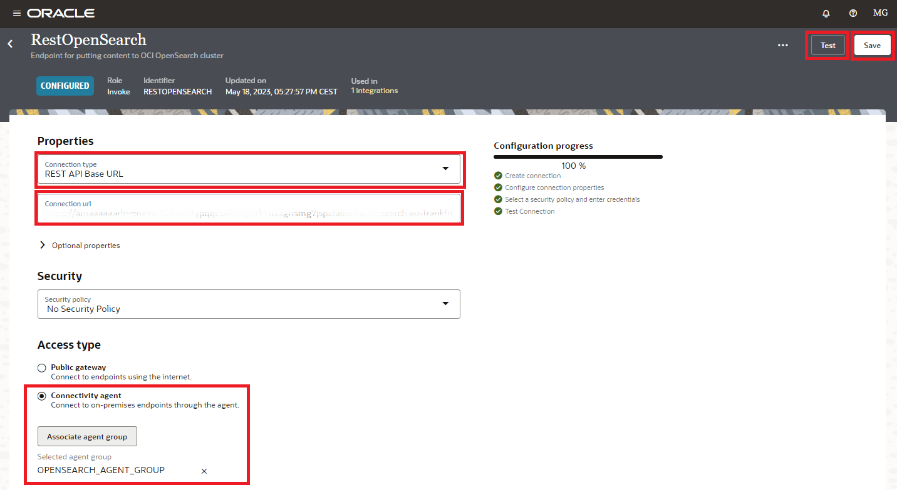

### J. Activate the integration

All connections should be valid. Let's activate the integrations:
Click on Activation 
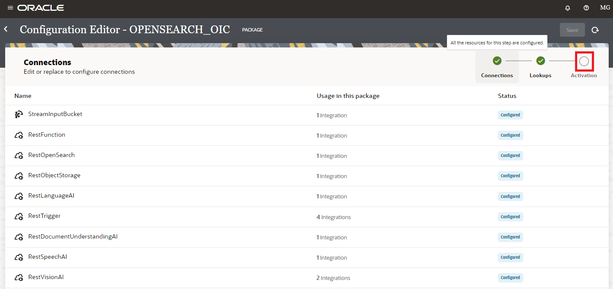

Click on the Activate buttons for each integration and active them. 
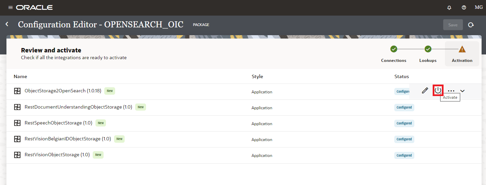
Note: it is recommended to enable Debug level loging for this lab so that we can check the integration payloads. 
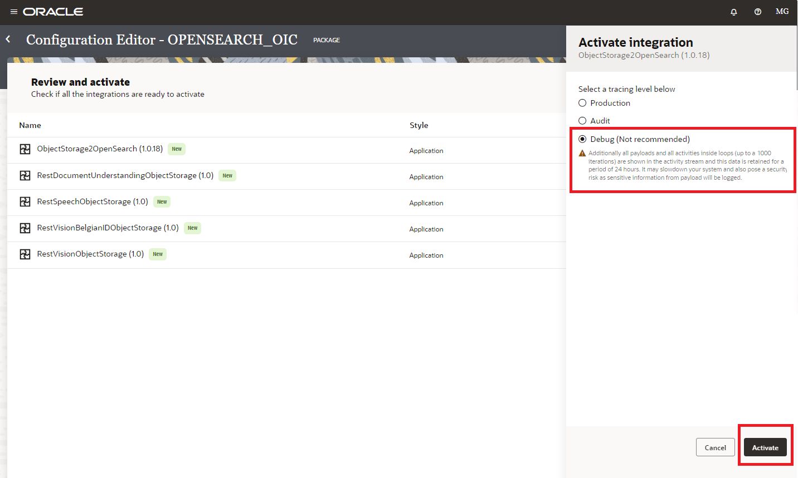

All integrations should be up and running.
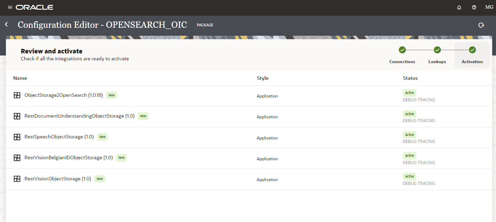

## Task 3: Test OIC

- In OCI console go back to the Object Storage bucket.
- On your desktop go to the directory that you downloaded from GITHUB
- Alternatively you can download the files form the Cloud Shell:

Enter the file name: oci-searchlab/sample_files/shakespeare_macbeth.tif and click Download button.

Upload the sample files to OCI Object Storage bucket: 

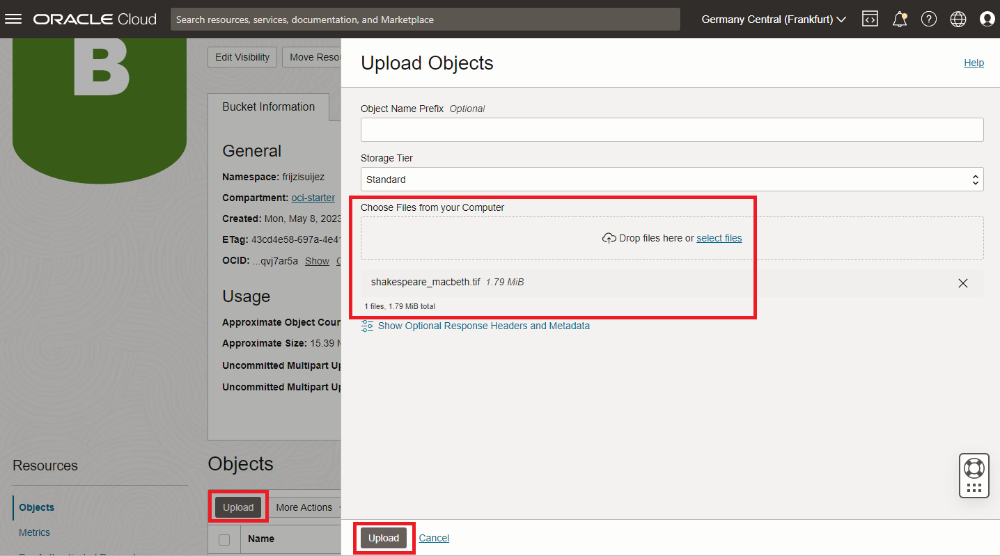

Check the result in OIC. 
- Go to OIC Home page
- Menu *Obeservability* 
- Menu *Integrations*

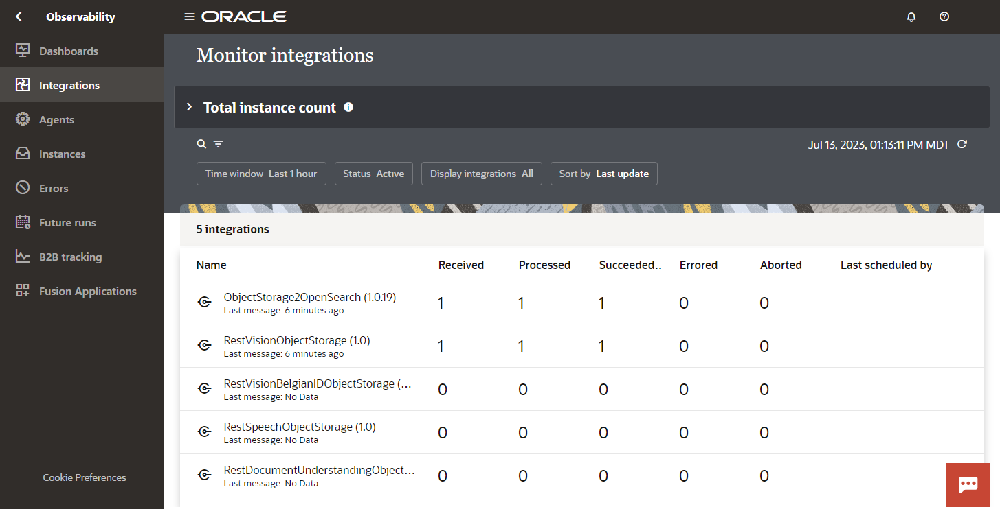

## Acknowledgements

- **Author**
    - Marc Gueury
    - Badr Aissaoui
    - Marek Krátký 
- **History** - Creation - 19 May 2023
