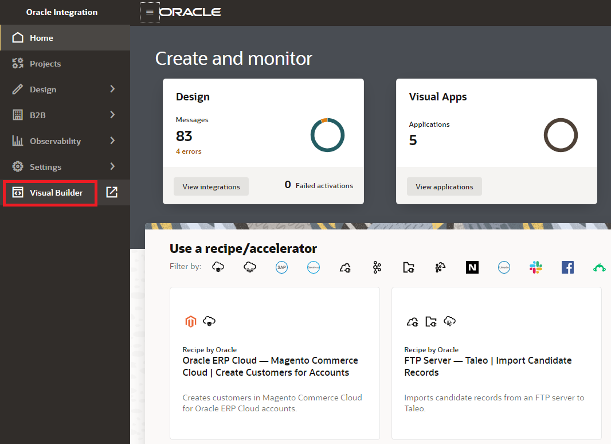
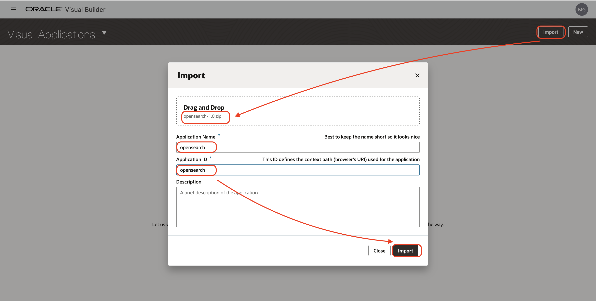
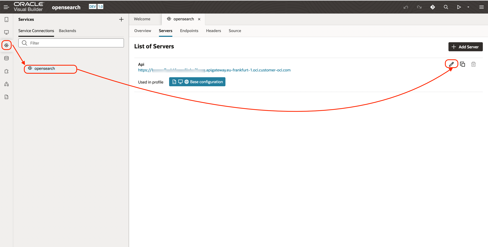
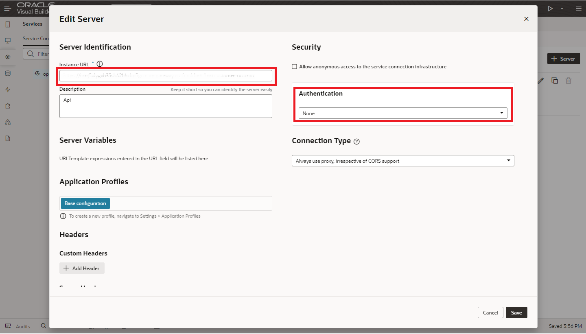
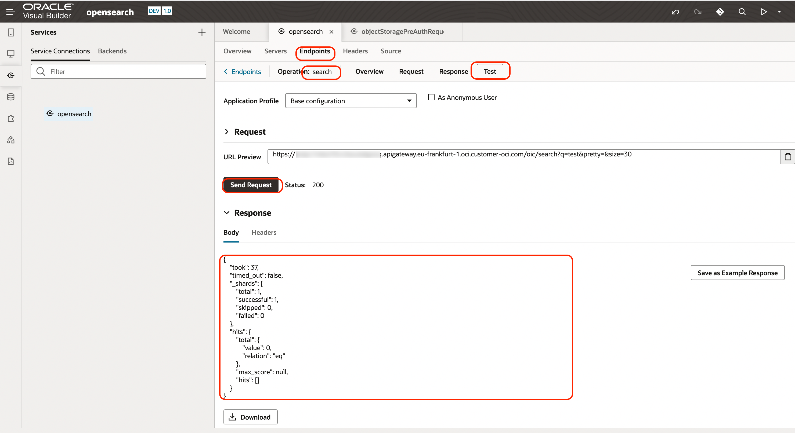
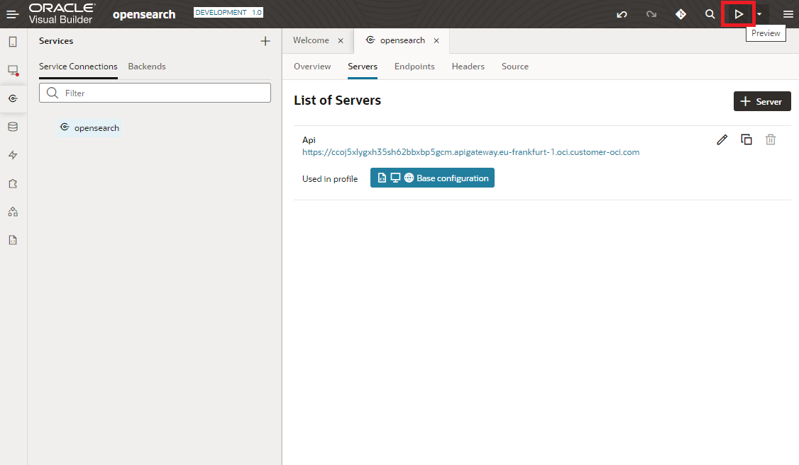
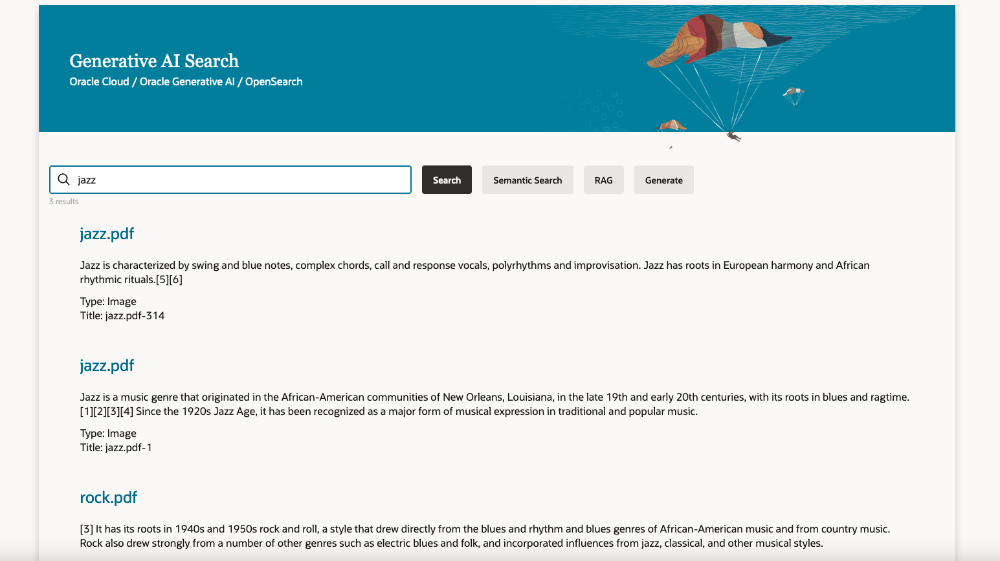

# Create a Google like user interface

## Introduction

Estimated time: 20 min

### Objectives

- Create a user interface with Visual Buidler

### Prerequisites

You need the VB application archive *opensearch-1.0.zip* in the Git folder on your laptop you cloned in the previous lab or
alternatively you can download the files form the Cloud Shell:

Enter the file name: oci-searchlab/vb/opensearch-1.0.zip and click Download button.

## Task 1: Import the project

First, lets go in Visual Builder. Go back to the homepage of Oracle Integration Cloud and choose Visual Builder.

Then let's import the project from the Github repository that you downloaded before in the "Integration" lab.
- Click *Import*
- Choose the file *vb/opensearch-1.0.zip*
- Name: *opensearch*
- Description: *opensearch*
- Click *Import*

##Task 2: Edit the connections

Let's edit the connection to connect to our OpenSearch server.

### Connection opensearch
Go to the imported application.
- Click on the *Service icon*
- Choose the *opensearch* connection 
- Click on *Servers* tab 
- Then *Edit icon* 

- Instance URL: *https://##APIGW_HOSTNAME##*
  Ex: https://xxxxxxxx.apigateway.eu-frankfurt-1.oci.customer-oci.com
- Authentication: None
- Click *Save*

You can also test the connection:
- Tab *Endpoints*
- Then *Get - Get Many*
- Tab *Test*
- Click *Send Request*

## Test the application

Click on the run button on the top

- Type *shakespeare* : This will return the image of a text scanned by Document Understanding Artificial Intelligence
 

## Acknowledgements

- **Author**
  - Marc Gueury
  - Badr Aissaoui
  - Marek Krátký 
- **History** - Creation - 23 May 2023

