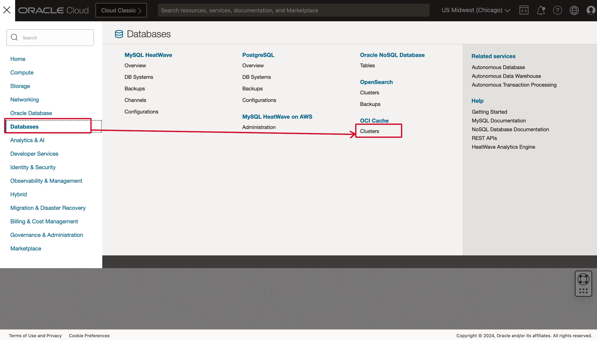
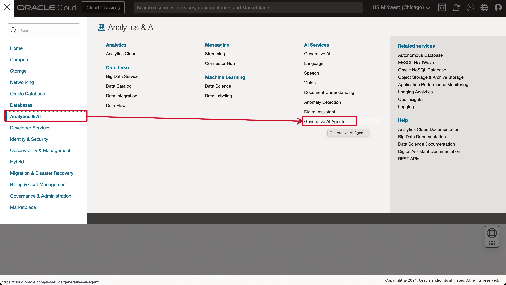
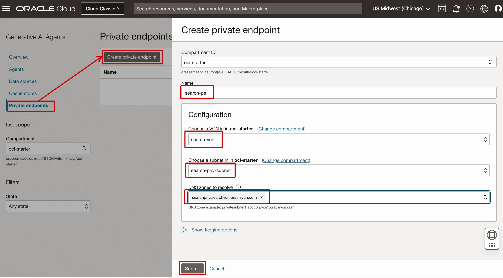
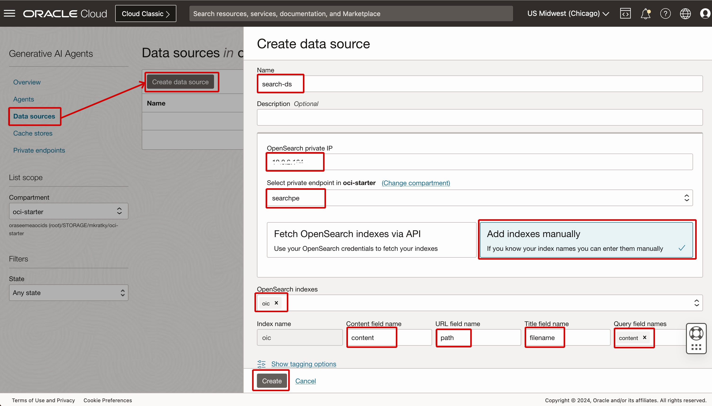
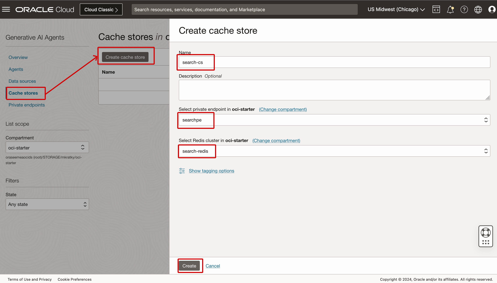
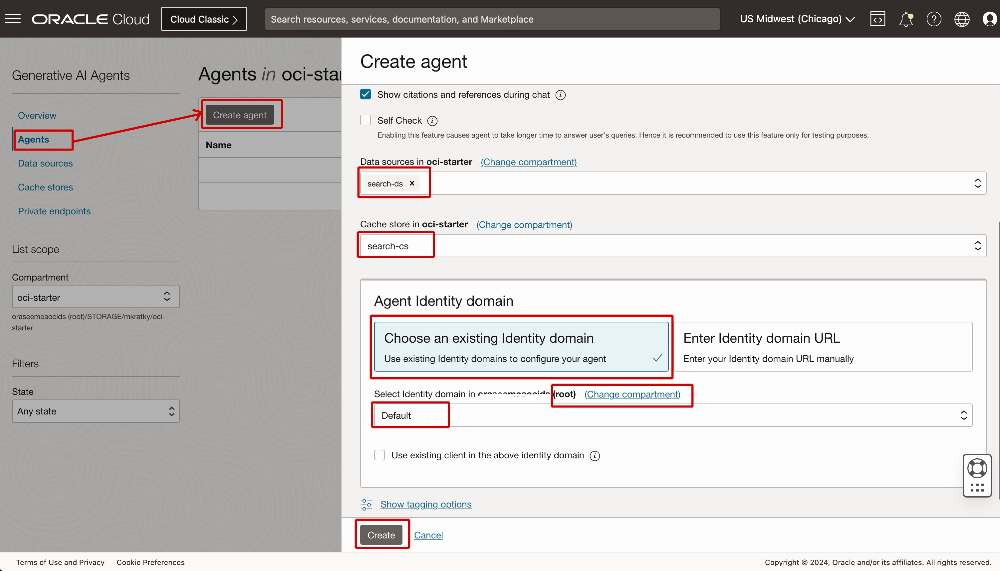
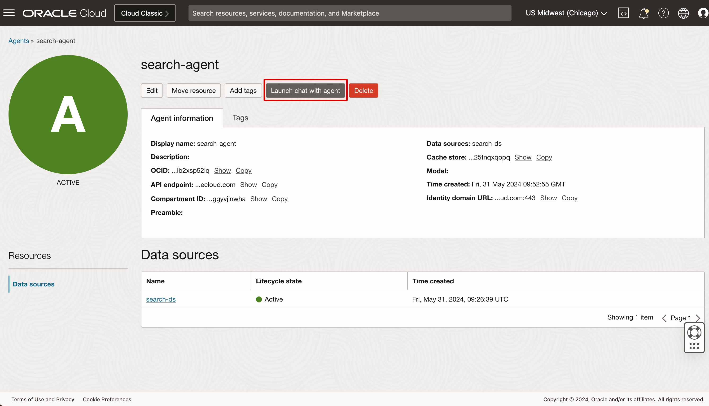
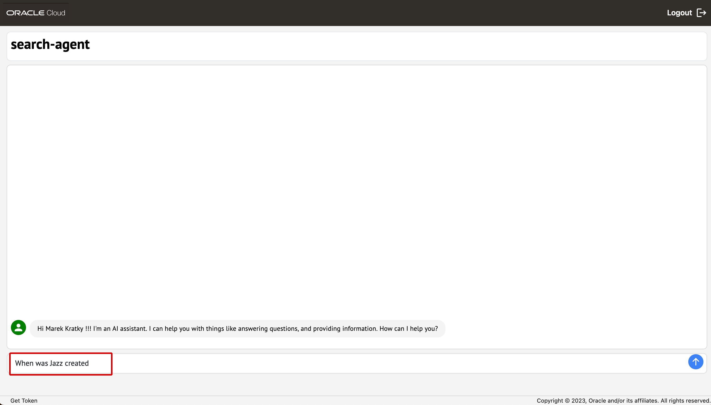
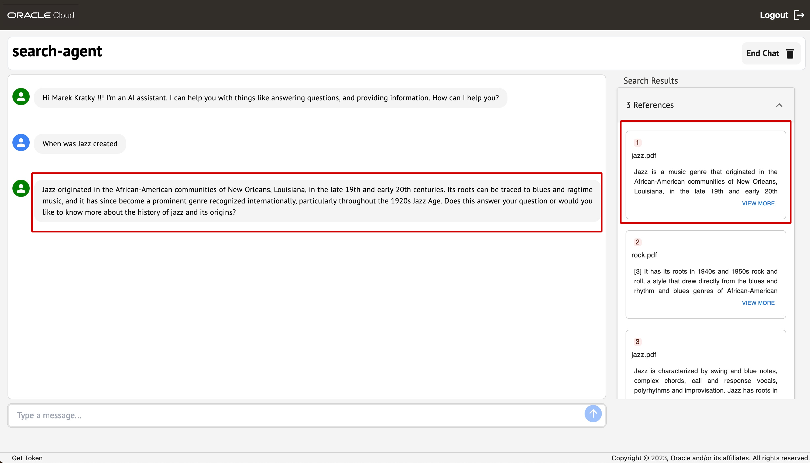

# Create a conversational user interface with Generative AI Agent

## Introduction
In this lab you will create a conversational user interface with Generative AI Agent that can be used to chat with the content that has been processed by the AI services and loaded into OpenSearch. 

Estimated time: 10 min

Ref: https://docs.oracle.com/en-us/iaas/Content/generative-ai-agents/home.htm

### Objectives

- Create a conversational user interface with Generatvie AI Service and use it to chat with the content that has been processed by the solution

### Prerequisites
- You've completed the previous labs.

## Task 1: Create a OCI Cache with Redis Cluster
You will need the OCI Cache with Redis Cluster for the Generative AI Agent. The agent stores a chat context in Redis cache.

1. Go the Cloud console 3-bar/hamburger menu and select the following    
   1. Databases
   2. Clusters (under OCI Cache)
   
  
  
2. Check that you are in the intended compartment. (*oci-starter* was the recommended compartment name.)

3. Click **Create cluster** button
   Name: *search-redis*
   Create in compartment: *oci-starter*

4. Click the **Next** button. It will open the Node configuration tab.
   You can leave everything as default

5. Click the **Next** button. It will open the VCN tab.
   Select existing virtual cloud network
      Virtual cloud network: *search-vcn*
      Subnet: *search-priv-subnet*
    
6. Click the **Next** button. It will open the Review tab.

8. Click the **Create cluster** button.

9. Wait about 10 mins until Redis cluster state is Active.

## Task 2: Create a Generative AI Agent

1. Go the Cloud console 3-bar/hamburger menu and select the following    
   1. Analytics & AI
   2. Generative AI Agents (under AI Services)

  
  
### 1. Private endpoint
1. Click *Private endpoints*
2. Click *Create private endpoint* button. It will open the Create private endpoint form.
   Compartment ID: *oci-starter*
   Name: *search-pe*
   Configuration
      Choose a VCN: *search-vcn*
      Choose a subnet: *search-priv-subnet*
      DNS zones to resolve: *searchpriv.searchvcn.oraclevcn.com*
   
  
   
4. Click the **Create cluster** button.

5. Wait about 3 mins until Private endpoint state is Active.

### 2. Data source
1. Click *Data sources*
2. Click *Create data source* button. It will open the Create data source form.
   Compartment ID: *oci-starter*
   Name: *search-ds*
   OpenSearch private IP: <your opensearch private IP> //You will find it on opensearch cluster details by going to OCI Console https://cloud.oracle.com/opensearch/clusters and clicking on *search-opensearch* link which will open your opensearch cluster details page.
   Select private endpoint: *search-pe*
   Click on *Add indexes manually*
   OpenSearch indexes: type *oic* , press Enter
   Content field name: *content*
   URL field name: *path*
   Title field name: *filename*
   Query fields: type *content*, press Enter
   
  
   
4. Click the **Create** button.

### 3. Cache store
1. Click *Cache stores*
2. Click *Create cache store* button. It will open the Create cache store form.
   Name: *search-cs*
   Select private endpoint: *search-pe*
   Select Redis cluster: *search-redis*

   
  
   
4. Click the **Create** button.

### 4. Agent
1. Click *Agents*
2. Click *Create agent* button. It will open the Create agent form.
   Name: *search-agent*
   Data sources: *search-ds*
   Cache store: *search-cs*
   Agent Identity domain
      Click on *Choose an existing Identity domain*
      Select Identity domain in ... (root): *Default* // you need to change compartment to root 

   
  
   
4. Click the **Create** button.

## Task 3: Test the Generative AI Agent

1. Click *search-agent* in the list of Agents
   
2. In the Agent details screen, click *Launch chat with agent*. It will open a new tab that you will use in the next Step. Sign in with your username and password. 

The agent will welcome you with the following message: Hi <Your name> !!! I'm an AI assistant. I can help you with things like answering questions, and providing information. How can I help you? 

1. In the Type a message box, type *When was Jazz created* and press **Enter**. 

2. The Agent will respond with a response generated from the content of jazz.pdf. The response will read something like:
   "Jazz originated in the African-American communities of New Orleans, Louisiana, in the late 19th and early 20th centuries. Its roots can be traced to blues and ragtime music, and it has since become a prominent genre recognized internationally, particularly throughout the 1920s Jazz Age. Does this answer your question or would you like to know more about the history of jazz and its origins?"

   
3. You can contine the conversation with the agent by typing aditional mesasges. Here's some hints.

    | Search Terms |
    | ------------------------------------- | --------------------------------------- |
    | When was rock created 
    | What are the main differences between jazz and rock music 

**Congratulations! You have completed this workshop.**

Here's what you accomplished. You provisioned multiple services into a compartment in your OCI tenancy. These included Oracle Integration Cloud (OIC), several AI services (such as OCI Document Understanding and OCI Language), and Oracle Search with OpenSearch. You imported a project into OIC that ingests document files from Object Storage, sends them to AI services based on the file type, and then loads extracted data into an OpenSearch index. You configured all of the service connections used by that OIC project and then you ran the integration project. You imported an application project into Visual Builder, you configured the connection to OpenSearch, and then you ran the project to display a search user interface. You used that search tool to query the content added to the OpenSearch index. Finally, you created a conversational user interface using Genarative AI Agent and had a conversation with the agent about the content. This workshop has illustrated how different OCI services can be integrated together to use AI to make many types of content more searchable.

## Acknowledgements
- **Author**
    - Marek Krátký, Principal Cloud Storage Specialist
    - Marc Gueury, Master Principal Account Cloud Engineer

