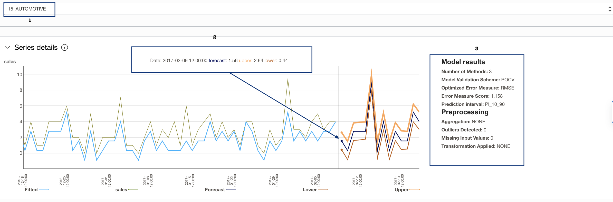
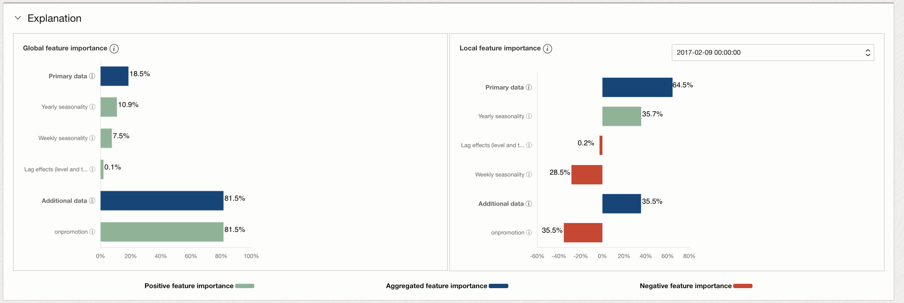
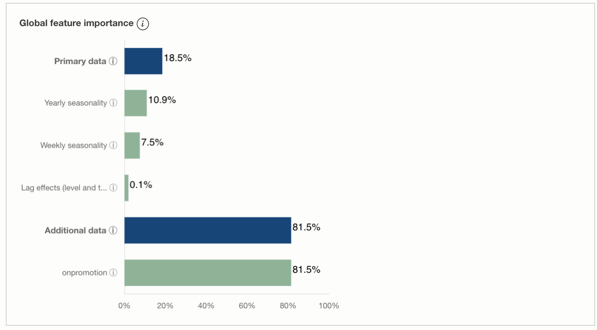

# Lab 1: Learn how to access Forecast Service from OCI Console

## Introduction

In this section, we will learn how to create the forecast project, upload data into object storage, create the data assets, train the model, and get forecasts and predictions intervals for the desired forecast horizon from OCI Console

***Estimated Time***: 20 minutes

### Objectives
- Learn how to set up pre-requisites for using the OCI console
- Learn about data requirements and download data
- Learn how to create a forecast project from the console
- Learn how to upload data into the OCI object storage
- Learn how to create a data asset to refer to data in the OCI object storage
- Learn to train a forecasting model with created data asset
- Explore forecast results and prediction intervals

### Prerequisites
- A free tier or paid tenancy account in OCI
- Tenancy must be whitelisted to use OCI Forecasting Service
- Tenancy must be subscribed to US West (Phoenix)
- Completed ***Introduction and Getting Started*** sections

## Task 1: Set up pre-requisites for console

1. If the user tenancy is not subscribed to US West (Phoenix) then we should look for the tenancy region drop-down for US West (Phoenix) and select it as shown below:
        

2. Create a Dynamic group in the user tenancy by below steps:

    - Go to Identity & Security from the Sidebar Menu of the OCI console and select Dynamic Groups
        

    - Create Dynamic Group
        

    - Fill in the below details in the relevant fields as shown in image:
        Name: DynamicGroupRPSTAccess 
        Rule: ANY {resource.type='aiforecastproject'}
        

    - We can verify that the dynamic group DynamicGroupRPSTAccess is created:
        

3. Create a Policy in the user tenancy by below steps:

    - Go to Identity & Security from Sidebar Menu of the OCI console and select Policies
        

    - Create policy
        

    - Fill in the below details in the relevant fields as shown in the image:

        Name: FC_POLICY

        Policy statements:
        ```
        Allow dynamic-group DynamicGroupRPSTAccess to manage objects in tenancy
        Allow dynamic-group DynamicGroupRPSTAccess to read buckets in tenancy
        Allow dynamic-group DynamicGroupRPSTAccess to manage objects in compartment <compartment-name>
        Allow dynamic-group DynamicGroupRPSTAccess to read buckets in compartment <compartment-name>       
        ```

        


    - We can verify that the FC_POLICY policy has been created:     
        

    - Now, we are ready to use Object Storage for the OCI Forecasting service   
    
4.  In addition to the above, the **tenancy admin** should allow the group to manage the OCI forecasting service. Admin can do so by modifying the existing policy for the user group or new policy for the user group
    ```
    Allow group <group-name> to manage ai-service-forecasting-family in tenancy
    Allow group <group-name> to manage ai-service-forecasting-family in compartment <compartment-name>
    ```
    ``` <group-name> ``` is the name of the group to which user is added

    ``` <compartment-name> ``` is the name of the compartment to which user is added 
 

## Task 2: Understand Data Requirements
OCI forecasting service provides an AutoML solution with multiple univariate/multivariate algorithms that can run on single series or multiple series at once. There are some data validations and data format requirements that the input data must satisfy.
### **Data Validations**
For a successful forecast, the input data should pass the following data validations:

* Number of rows for a time series >= 5 and <= 5000
* Series length >= 2 X Major Seasonality
* If the series is non-seasonal, at least one non-seasonal method needs to be available for running.
* If the ensemble method is selected, at least 2 other methods need to be selected as well.
* Number of missing values <= 10% of series length
* If there are missing values for 5 consecutive time steps, throw an error.
* Input Data Frequency : 'MINUTE','HOUR', 'DAY', 'WEEK', 'MONTH' or 'YEAR'  and custom frequency depending on frequency of input data
* Forecast Frequency: 'HOUR', 'DAY', 'WEEK', 'MONTH' or 'YEAR' and custom frequency depending on forecast frequency required. For custom frequency: If the input data frequency multiplier is more than 1, then the forecast frequency should be also at the same base frequency as the input. 
Eg. If Input Data Frequency: 2HOURS , then the forecast frequency: 24HOURS if we want Forecast Frequency to be a DAY level
* All the timestamps in the primary data source should exist in the secondary data source also the number of rows in the additional data source should be equal to the number of rows in the primary data source + forecast horizon size (adjusted by input and output frequency).
* Check if there are any duplicate dates in time-series after grouping also (Check for both additional and primary data)

### **Data format requirements**
The data should contain one timestamp column and other columns for target variable and series id (if using grouped data):
- timestamp column should contain dates in standard [ISO 8601]('https://en.wikipedia.org/wiki/ISO_8601') format. Allowed formats: "yyyy-MM-dd","yyyy-MM-dd HH:mm:ss","yyyy-dd-MM HH:mm:ss","MM-dd-yyyy HH:mm:ss" ,"dd-MM-yyyy HH:mm:ss","dd-MM-yyyy","MM-dd-yyyy", "yyyy-dd-MM" 
- target_column should contain target values of time series. For example it be sales number of a sales data 
- series_id column should contain identifiers for different series e.g., if the data is having sales for different products, then series id can have product codes. 

**Note**: The column names used in the examples here are just for representation and actual data can have different custom names.  

Currently, our APIs support datasets that can be in one of the following formats:

1.  Single time series without any additional data:
    Such datasets have only two columns in them. The first column should be a timestamp column and the second column should be the target column.

    **Here is a sample CSV-formatted data:**
    ```csv
    timestamp,target_column
    2020-07-13T00:00:00Z,20
    2020-07-14T00:00:00Z,30
    2020-07-15T00:00:00Z,28
    ...
    ...
    ```
2.  Multiple time series without any additional data: 
    The input data can have multiple time series. Such datasets are called grouped data and there must be a column to identify different time series.

    **Here is a sample CSV-formatted data:**
    ```csv
    timestamp,target_column,series_id
    2020-07-13T00:00:00Z,20,A
    2020-07-14T00:00:00Z,30,A
    2020-07-15T00:00:00Z,28,A
    ....
    ....
    2020-07-13T00:00:00Z,40,B
    2020-07-14T00:00:00Z,50,B
    2020-07-15T00:00:00Z,28,B
    ....
    ....
    2020-07-13T00:00:00Z,10,C
    2020-07-14T00:00:00Z,20,C
    2020-07-15T00:00:00Z,30,C
    ....
    ....
    ``` 
3.  Time series with additional data:
    The input data can have additional influencers that help in forecasting. We call the two datasets primary and additional. The primary data should have three columns - timestamp, target column, and a column for the series id. The additional data should have a timestamp column, a series id column, and columns for additional influencers.   

    **Here is a sample CSV-formatted data:**

    Primary data 
    ```csv
    timestamp,target_column,series_id
    2020-07-13T00:00:00Z,20,A
    2020-07-14T00:00:00Z,30,A
    2020-07-15T00:00:00Z,28,A
    ....
    ....
    2020-07-13T00:00:00Z,40,B
    2020-07-14T00:00:00Z,50,B
    2020-07-15T00:00:00Z,28,B
    ....
    ....
    2020-07-13T00:00:00Z,10,C
    2020-07-14T00:00:00Z,20,C
    2020-07-15T00:00:00Z,30,C
    ....
    ....
    ```
    Additional data 
    ```csv
    timestamp,feature_1,series_id
    2020-07-13T00:00:00Z,0,A
    2020-07-14T00:00:00Z,1,A
    2020-07-15T00:00:00Z,2,A
    ....
    ....
    2020-07-13T00:00:00Z,0,B
    2020-07-14T00:00:00Z,0,B
    2020-07-15T00:00:00Z,1,B
    ....
    ....
    2020-07-13T00:00:00Z,1,C
    2020-07-14T00:00:00Z,0,C
    2020-07-15T00:00:00Z,0,C
    ....
    ....
    ```
    **Note:**
    * Missing values are permitted (with empty), and boolean flag values should be converted to numeric (0/1)

## Task 3: Download Sample Data

Here is a sample dataset to help us easily understand what the input data looks like, Download the files to our local machine.

* [Primary data](files/primary-15-automotive.csv)
* [Additional data](files/add-15-automotive.csv)
  

## Task 4: Upload Data to Object Storage

After downloading the dataset, we need to upload the sample training data into the OCI object storage, to be used for Data Asset creation for model training in the next steps.


1.  Create an Object Storage Bucket (This step is optional in case the bucket is already created):

    - Navigate to the OCI Services menu, select Object Storage

    

    - Select compartment from the left dropdown menu and choose the compartment and select create bucket 

    

    - Fill out the dialog box, fill in bucket Name & select the STANDARD option for storage tier and create bucket
    


2.  Upload the downloaded training CSV data file into Storage Bucket:

    - Switch to OCI window and select the bucket name that we created just now.
    
    

    - Bucket detail window should be visible. Scroll down and click Upload
    


    - Browse to the file to upload and click the Upload button 
    

    More details on OCI Object storage can be found [here](https://oracle.github.io/learning-library/oci-library/oci-hol/object-storage/workshops/freetier/index.html?lab=object-storage) to see how to upload.

## Task 5: Create a project 

A project is a way to organize multiple data assets and forecasts in the same workspace.

1.  Log into the OCI Cloud Console. Using the Ham Burger Menu on the top left corner, navigate to Analytics and AI, then select the Forecasting  under AI services

    

2.  Selecting the Forecasting option will navigate us to the OCI Forecast Console.
    
    Under Projects, select compartment and click create Project

    

3.  The Create Project button navigates us to a form where we can specify the compartment we want to create a Forecast Project. Once the details are entered click the create button.
    

4.  If the project is successfully created it will show up in the projects pane. From here onwards, select livelabs_forecast_demo.
    

5.  Select the project we just created and go to project page.
    

## Task 6: Create Forecast

1.  Clicking on the Create Forecast button will take us to Create Forecast Page:
    

2.  Create Data Asset:
    We need to select a Data Asset needed to train a model and forecast. There are two types of Data Assets i.e. Primary and Additional. For each type of Data Asset, Either, we can select a previously existing Data Asset or create a new Data Asset. As we don't have any existing Data Asset, we will click on the Create New Data Asset 
    

    In the Create Data Asset window, we can specify the bucket name of Object storage and select the data file. Next, Click Create Button.
    

    After a few seconds, the data asset will be shown in the data asset main panel, select the
    data that we just created now

    
    
    Similarly, we can create Data Asset for Additional Data (Optional)
    
    

    Now, select the Addtional Data Asset created just now, and click Next
    

3.  Configure Schema :

    We need to provide a schema for the primary and additional data in this window. In addition to schema, we also provide Timestamp format, Input data frequency, and Timestamp column

    

    After filling in the details, click Next

4.  Configure Forecast :

    

5.  Review the Configuration for Forecast and click Submit :
    
     
    Once submitted, the model training and forecast are started and the status is **Creating**

    


## Task 7: Forecast Results
1. Forecast Status:
    After 3-4 minutes the status will change to **Active**. Now, click on the Forecast Link as we can see below
    

2. Review Forecast Results:
    
    Now, let's review the forecast results
    1. We get general information like OCID (forecast ID), description, etc.
    2. We get the generation time of the forecast, the total number of series provided for the forecast, and the forecast horizon, we can also download the forecast results in the download.zip
    3. Dropdown list of series for which we want to see the visualization of forecast

    

## Task 8: Explore the Forecast and Explainability  
1.  Forecast:

    The next step is to explore the forecast graph which has forecast and historical data along with prediction intervals
    - Highlighted box 1 highlights the forecast for a particular time step
    - Highlighted box 2 highlights information on forecast metrics like lowest error metric measure, the number of methods ran, etc.

    

2.  Explainability: 

    The forecast will also give explainability for each of the target time series in the dataset. The explainability report includes both global and local level explanations. Explanations provide insights into the features that are influencing the forecast. Global explanation represents the general model behavior - e.g., which features does the model consider important? A local explanation tells the impact of each feature at a single time step level. The forecast provides local explanations for all the forecasts that it generates. Here we get a global and local explanation for the best model chosen by the forecast, to understand the features that are influencing the forecast

    


    - Global Feature Importance:
    

    
    - Local Feature Importance:
       We can select the time step for which we want to see the local feature importance
    

## Task 9 (Optional): Download the results zip file 
1. Finally, we can download the results zip file **Download.zip**. It can be leveraged directly to plot graphs, deep dive results or load into the system for dashboard view etc.
2. **Download.zip** contains three files:
    - **forecast_results.csv**: Input and Forecast, Upper Bound and Lower Bound Prediction Intervals
    - **explanation\_results\_global.csv**: Global Explainability
    - **explanation\_results\_local.csv**: Local Explainability

    


Congratulations on completing this lab! 

Additionally, We can also try out Lab 2 which is Optional if we want to use a data science notebook. 

Please feel free to contact us if any additional questions.

## Acknowledgements
* **Authors**
    * Ravijeet Kumar, Senior Data Scientist - Oracle AI Services
    * Anku Pandey, Data Scientist - Oracle AI Services
    * Sirisha Chodisetty, Senior Data Scientist - Oracle AI Services
    * Sharmily Sidhartha, Principal Technical Program Manager - Oracle AI Services
    * Last Updated By/Date: Ravijeet Kumar, May 2022
