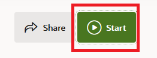

# Introduction

## About this Workshop

Oracle Cloud Infrastructure (OCI) Vision is a fully managed cloud service providing computer vision. It has two main capabilities: image analysis and document AI. Image analysis can detect objects in images and classify images with descriptive labels. Document AI works on document images or other images of text and extracts text, classifies the document type, detects language, and extracts both tabular data and key-value pairs.

This workshop is focused on image analysis. OCI Vision provides pre-trained computer vision models that can detect many different kinds of common objects and classify many different scenes. However, it is recognized that the pre-trained models will not address all business uses. Therefore, OCI Vision provides the ability to custom-train the models to recognize objects and scenes that the pre-trained models do not. This workshop shows the user how to train the models to detect objects in space telescope images while enjoying viewing of these images. 

To train a custom Vision model, you need labeled images and this lab uses OCI Data Labeling to prepare the images. The lab provides data sets of pre-labeled images but you will also learn to label additional images. To view and explore the images, Oracle Analytics Cloud will be used to process the images through OCI Vision and display them for viewing.

These are the major steps required to train and use custom Vision models with **no programming required!**
  1. Obtain images that can be used for training and for testing
  1. Label the training images for object detection or image classification
  1. Create & train the custom OCI Vision model using the labeled images
  1. Create an Oracle Analytics Cloud data flow to process the test images through the custom OCI Vision model
  1. Create a dashboard in Oracle Analytics Cloud to view the images

*Estimated Workshop Time*: 90 minutes

### Workshop Objectives
* Access and work with OCI Vision in the OCI Console
* Label images using OCI Data Labeling
* Train a custom image analysis model in OCI Vision
* Process images through your custom image model using Oracle Analytics Cloud

### Prerequisites

This workshop assumes you are using a reserved Oracle LiveLabs sandbox environment that is automatically provisioned.
* There are no other prerequisites

## **Task 1:** Reserve your workshop environment though LiveLabs

> **Note:** you may be seeing these procedures because you've already reserved a workshop environment through LiveLabs. However, if you are attending an event that uses this workshop, you may need to reserve your environment now.

1. Open this workshop in LiveLabs (or search for *11181*).
    https://apexapps.oracle.com/pls/apex/r/dbpm/livelabs/view-workshop?wid=11181  TODO - verify

1. Click the **Sign In** button in the upper right corner of the LiveLabs page then sign in with your existing Oracle account or create an account if you don't have one. 

    

1. Click the **Start** button
    
    

1. Click the green button labeled **Run on LiveLabs Sandbox**. Login with your Oracle account if prompted. Create an Oracle account if you don't already have one.
    

1. Complete the fields in the reservation form
    

    a. Confirm your correct **timezone** is set.

    b. Change slider to on to **start the workshop now**.

    c. Read the consent and **check the box**.

1. Click **Submit Reservation**. 

1. The LiveLabs *My Reservations* page will appear showing the status of your reservation. An environment will now be provisioned for you. This will take a few minutes. Wait until provisioning is complete and the status changes to *Available*.

**Please proceed to the next lab.**

## Acknowledgements

- **Author** - Wes Prichard, Sr Principal Product Manager, Data Science & AI
- **Contributors** -  Mark Heffernan, Sr Principal Product Manager, Data Science & AI
- **Last Updated By/Date** - Name, Month Year