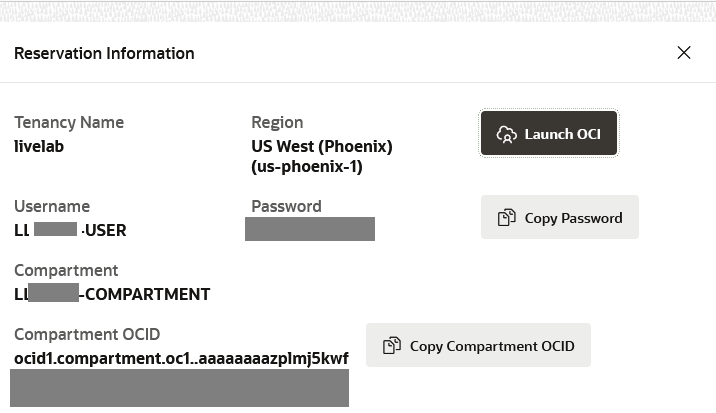
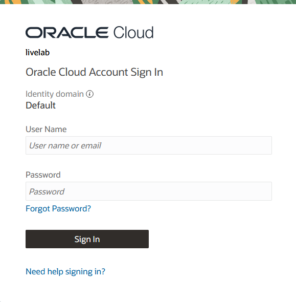
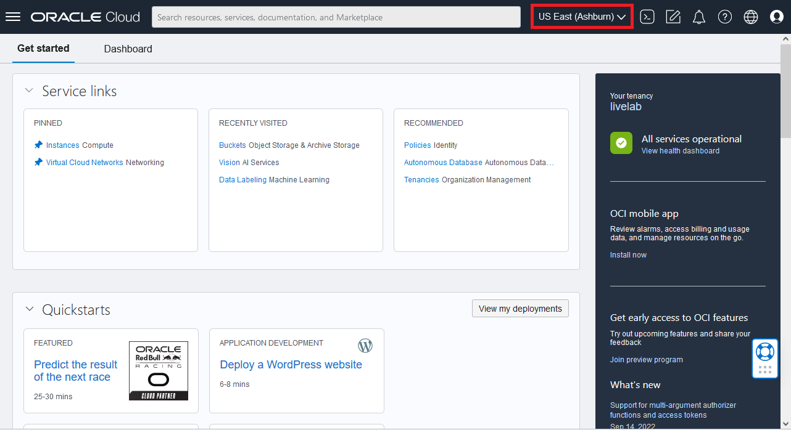
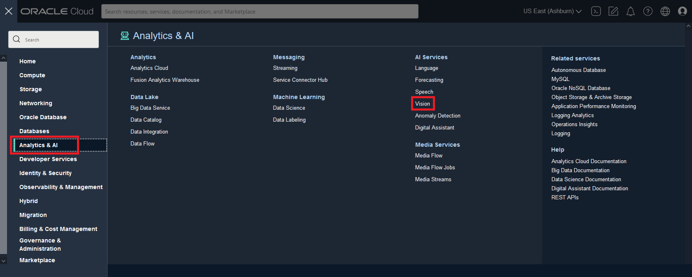
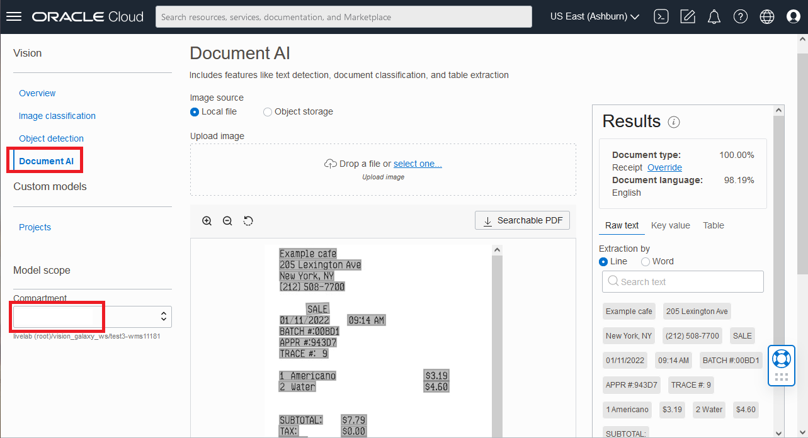
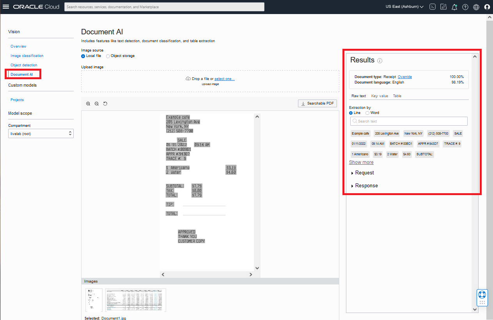
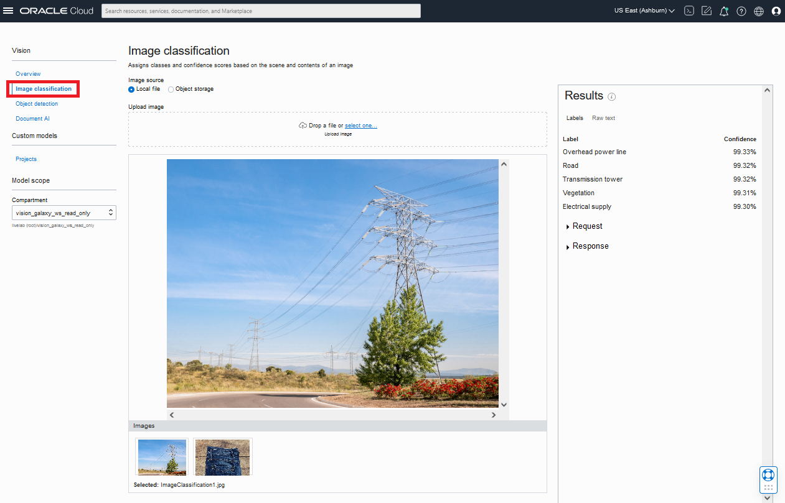
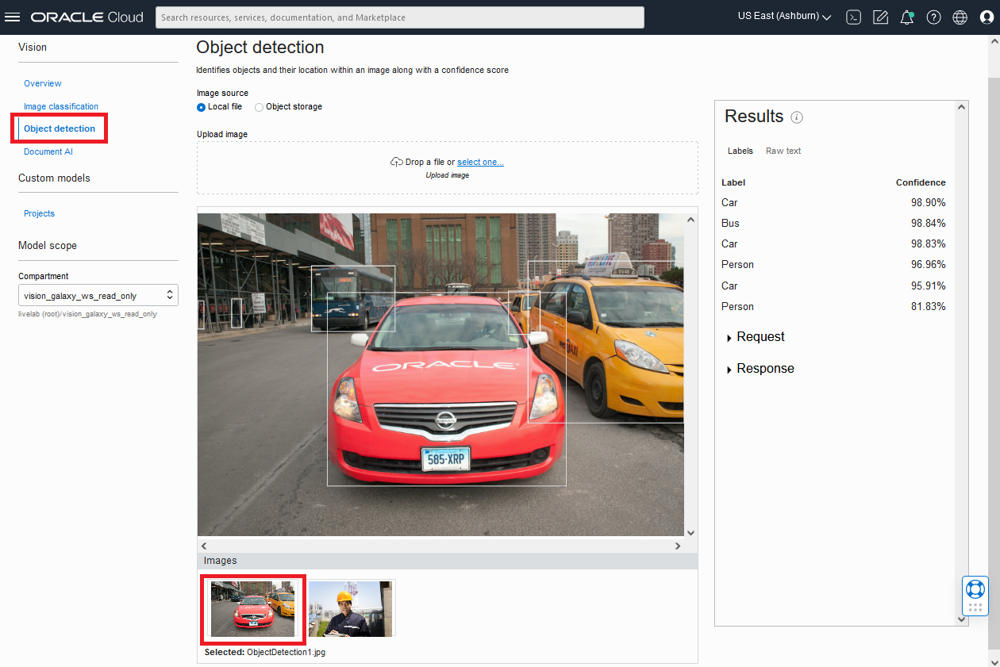

# Use OCI Vision through the OCI Console

## Introduction
In this lab, you will use the OCI Console to become familiar with the features of OCI Vision. You will learn how to do image classification and object detection on sample images in the OCI Console. This is a good way to easily test images that reside on your local machine or in object storage.

*Estimated Time*: 15 minutes

### Objectives

In this lab, you will:
- Get familiar with navigating the OCI Console
- Use OCI Vision to analyze some sample images

### Prerequisites
- Access to a LiveLabs sandbox environment

> **Note:** To use OCI Vision in a new tenancy, there are policies that need to be configured that give user groups access to the service. By using the LiveLabs sandbox environment, this configuration has already been performed.
For additional information about Vision policies, see the [product documentation](https://docs.oracle.com/en-us/iaas/vision/vision/using/policies_quick_set_up.htm#policies_quick_set_up).

## **Task 1:** Get familiar with the OCI Console
Sign-in and get familiar with the user interface.

1. Click **View Login Info** to navigate to your LiveLabs *Reservation Information* if you are not still there from the previous lab.
    
    

1. Click the **Launch OCI** button. This opens the OCI Console in a separate browser tab.

1. On the *Oracle Cloud Account Sign In* page enter the **username** and **password** provided to you on *Reservation Information*, then click **Sign In**.
    
    

1. If prompted to reset your password, **enter a new password** that meets the following characteristics, and **save it on your local machine** for later reference:
    - The password must have at least 12 characters.
    - The password cannot exceed 40 characters.
    - The password cannot contain the First Name of the user.
    - The password cannot contain the Last Name of the user.
    - The password cannot contain the user name.
    - The password must have at least 1 lowercase characters.
    - The password must have at least 1 uppercase characters.
    - The password must have at least 1 numeric characters.

1. On the home page of the OCI Console, if the Region displayed in the upper right is not *US East (Ashburn)*, then change it to that.

    

## **Task 2:** Use OCI Vision in the OCI Console
Try out OCI Vision in the console.

1. Navigate to the Vision Page of OCI Console by clicking the **3-bar hamburger icon**, then clicking **Analytics & AI**, then, under *AI Services*, click **Vision**

    

    

1. To use Document AI, select **Document AI** on the left navigation menu. (You might see a *404 error* because you're using a compartment you don't have access to.) Under *Model Scope*, set your *Compartment* to the one assigned with your sandbox registration. You will find it under *livelab (root)* > *LiveLabs*.

    

1. A sample image is displayed by default. View the results on the right side of the screen. (There is also another sample image available for selection at the bottom of the page.)

    

1. Features of Document AI you can test out: 

    | Feature | Description | Details on Console |
    | --- | --- | --- |
    | OCR (Optical Character Recognition) | Locates and digitizes text information from images | Text will appear under the *Raw text* tab of the results pane of the console |
    | Document Type | Classifies documents into different types based on their visual appearance, high-level features, and extracted keywords | Classification along with confidence score appears directly under *Results* pane as *Document type* |
    | Document Language | Classifies the language of document based on visual features | Classification along with confidence score listed as *Document language* in *Results* pane |
    | Table extraction | Extracts content in tabular format, maintaining row/column relationships of cells | Select the *Table* tab to get table information |
    | Searchable PDF output | Embeds a transparent layer on top of document image in PDF format to make it searchable by keywords | You need to test on a PDF document to use this feature. When you've selected a PDF, the searchable PDF button will be clickable. Clicking on it will download an OCR'd PDF to your computer. |

1. To use Image Analysis, start by selecting **Image Classification** on the left navigation. A sample image is displayed by default.

    

    > Image classification provides labels describing describing the scene in an image. Labels and confidence scores will appear under the Results pane.

1. Select a different sample image displayed on the screen and view the results on the right side of the screen. 

1. Now select **Object Detection** on the left navigation menu. A sample image is displayed by default.

    

    > Object Detection locates and identifies objects within an image. Objects, confidence scores, and highlighted bounding boxes will all appear under the Results pane. Clicking on one of the labels on the results pane will also highlight where on the image that object was detected.

1. Select a different sample image displayed on the screen and view the results on the right side of the screen.

Congratulations, you now know how to navigate to OCI Vision in the OCI Console and use it to analyze images.

**Please proceed to the next lab**

## Acknowledgements

- **Author** - Wes Prichard, Sr Principal Product Manager, Data Science & AI
- **Contributors** -  Mark Heffernan, Sr Principal Product Manager, Data Science & AI
- **Last Updated By/Date** - Wes Prichard, 28 September 2022