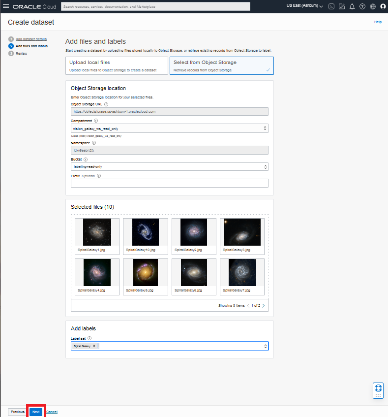
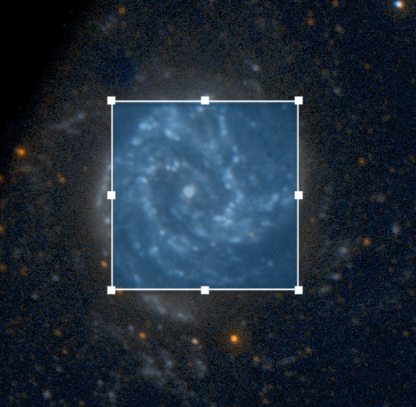

# Use OCI Data Labeling to label images

## Introduction
Training a custom OCI Vision model requires a set of images that have been labeled for the type of model that is to be created. For example, if you want to train a model to detect sharks, you need pictures of sharks and then the shark(s) in each image must be identified with a bounding box and the box is labeled with the name "shark". If you want to train a model to classify an image according to the contents of the scene, you will need to assign labels to each image in the training dataset.

In this lab, you will get some experience with labeling images. You will label some of the space telescope images to identify the galaxies that appear in the images. 

*Estimated Time*: 15 minutes

Watch the video below for a quick walk-through of the lab.
[Use OCI Data Labeling to label images](videohub:1_u3l9fxrf)

### Objectives

- Create an OCI Data Labeling dataset containing images to be labeled
- Label the images in the dataset

### Prerequisites
- Access to a LiveLabs sandbox environment

## **Task 1:** Create a Data Labeling Dataset
The images to be labeled have already been staged in an object storage bucket in the LiveLabs sandbox environment. You'll create a dataset from those images.

1. From the OCI services menu, select *Analytics & AI*, then under *Machine Learning* click **Data Labeling**.

    

1. On the *Data Labeling* page, click **Datasets**.

1. On the *Dataset list* page, select the *Compartment* you were assigned in your LiveLabs *Reservation Information*. Then begin creating your dataset by clicking the **Create dataset** button.

     

1. In the *Create Dataset* dialog, set the following values:

    

    a. Enter a **Name** for your dataset, e.g. *dl-lab-dataset*

    b. Set *Dataset format* to **Images**

    c. Set *Annotation class* to **Object Detection**

1. Click **Next**
  
1. In the next page of the *Create dataset* dialog, set the following values:

     
 
    a. Retrieve files from Object Storage by choosing **Select from Object Storage**.
 
    b. Choose compartment **vision\_galaxy\_ws\_read\_only**.
    
    c. Choose Bucket **labeling-read-only**

    d. Add Labels: type the word ***Spiral Galaxy*** in the box, then click  **Spiral Galaxy (New)** in the drop-down list

    

1. Click 'Next'
  
    

1. On the next page of the *Create dataset* dialog, review the information and click **Create**.
  

1. You will return to the *Dataset list* page. Wait until your new dataset's status is **Active**. This will take about 2-3 minutes. The progress is shown in the page.

    

## **Task 2:** Label the images in your dataset
Now that you have a dataset created, you'll proceed with labeling those images.

1. On the page showing your active dataset, the data record view is listed by default. This is a list of all the image files in the dataset. (There is also a *Gallery view* that displays the files as images.) **Click the top file name** to open it.
    >**Note:** You can label the images in any order.

    

1. The *Add labels* page is displayed for the selected image.
    
    

1. The bounding box tool is enabled by default. Add a bounding box tightly around each distinguishable spiral galaxy. When done, click **Save & next**.
    >**Note:** If you make a mistake when placing the bounding box, you can click **Bounding box** (under *Tools*) and then move the sides of the box, or you can click **Remove box** and then add a new one.

    

1. Add bounding boxes to galaxies in the remaining images in the dataset. There are galaxies of different sizes in the other images. For larger galaxies with a faint halo, put the box around the inner structure. Positioning the box is a judgement call but it can affect how the model detects galaxies in new images.

     

    

1. After the last image is labeled, the data set page is displayed, but this time, the image status for each is listed as *Labeled*.

    

Congratulations, you have completed labeling a set of images for object detection.

**Please proceed to the next lab.**

## Acknowledgements

- **Author** - Wes Prichard, Sr Principal Product Manager, Data Science & AI
- **Contributors** -  Mark Heffernan, Sr Principal Product Manager, Data Science & AI
- **Last Updated By/Date** - Name, Month Year