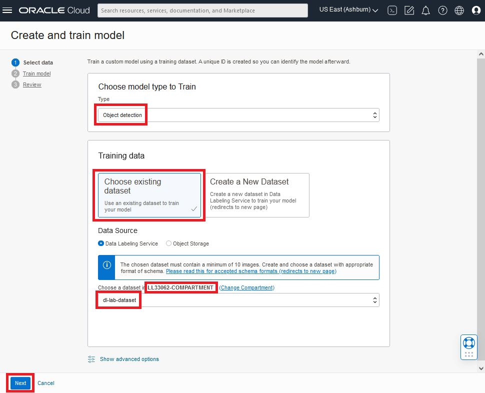

# Create a Custom AI Vision Model

## Introduction
In this lab, you will use a pre-labeled set of images to train a custom object detection model. It will take about 15 minutes for the model training to occur so we will start the model training in this lab and then learn to label images in the next lab while the model is being trained.

*Estimated Time*: 15 minutes

### Objectives
- Create a custom object detection model using the OCI Vision AI service

### Prerequisites

- Access to a LiveLabs sandbox environment

## **Task 1:** Understand Data Requirements

OCI Vision supports multiple formats of image data in order to detect objects, assign labels to images, extract text, and more. Of particular importance are the limits on file type and file size. The service offers synchronous and asynchronous APIs to analyze images, with data requirements for each detailed below:

| API | Description | Supported Input Format |
| --- | --- | --- |
| sync API (analyzeImage, analyzeDocument) | Analyzes individual images | * JPG, PNG, (PDF and Tiff for analyzeDocument) * Up to 8 MB * Single image input |
| async API   /jobs/startImageAnalysisjob   /jobs/start | Analyze multiple images or multi-page PDFs | * JPG, PNG, (PDF and Tiff for Document AI) * Up to 2000 images per batch * Supports multi-page PDF |

For this lab, we've already collected a set of images for training the model that meet the data requirements. We labeled those ahead of time so the workshop can be completed in 90 minutes.

## **Task 2:** Create a Vision Project

1. From the OCI services menu, click **Analytics & AI** then, under *AI Services*, click **Vision**.
  
    

1. On left side of the Vision page, click **Projects** under *Custom models*.

    

1. Click *Create Project* and enter details for your Project.
    
    

    a. Select the compartment you were assigned in your LiveLabs *Reservation Information*. This is where your project will be created. 

    b. Enter a name for your project, e.g. **galaxy-detection**.

1. Click the **Create project** button. Wait for the project to become "Active".
  

## **Task 3:** Create a Custom Object Detection Model

1. Click the active project you just created.

    

1. On the *Project details* page, click **Create Model**.
    
    

1. In the *Create and train model* dialog, set the required inputs.

    
    TODO - update image

    a. For *Type*: select **Object Detection**

    b. For *Training Data*: select **Choose existing dataset**

    c. For *Data Source*: select **Data Lableing Service**

    d. For *Choose a dataset...*, click **Change compartment**
    
    e. Select compartment **vision_galaxy_ws_read_only**

    f. When the dataset picklist populates, choose: **dataset-read-only**

   1. Click **Next**
  
1. In the next page of the *Create and train model* dialog, enter training details for the model.

    

    a. Enter a *Model display name* that you will recognize later: **galaxy-detection-model-1**

    b. Select *Training duration*: **Recommended training (May take up to 24 hours)**

1. Click **Next**

1. Review that the model information is correct then click **Create and train**.

    

> **Note:** Training may take 15 to 20 (TODO) minutes. Training is complete when the model status becomes 'Active'. Proceed to the next lab while the model is training.

Congratulations, you have trained a custom Vision object detection model.

## Please proceed to the next lab

***
### Acknowledgements
* **Author** - <Wes Prichard, Sr Principal Product Manager, Data Science & AI>
* **Contributors** -  <Mark Heffernan, Sr Principal Product Manager, Data Science & AI>
* **Last Updated By/Date** - <Name, Month Year>