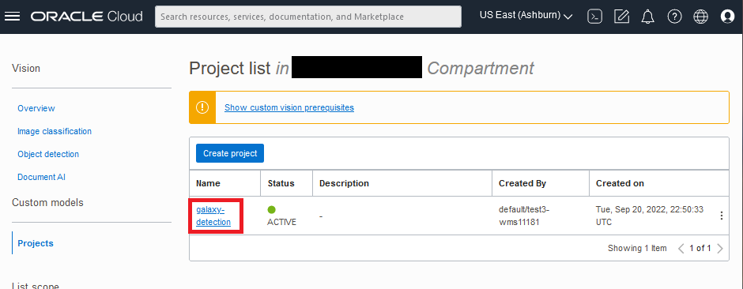

# Create a Custom AI Vision Model

## Introduction
In this lab, you will use a pre-labeled set of images to train a custom object detection model. It will take about 30 minutes for the model training to complete, so we will start the model training in this lab and then continue with the next lab. (We have a previously-trained model to use in the next lab.)

*Estimated Time*: 15 minutes

### Objectives
- Create a custom object detection model using the OCI Vision AI service

### Prerequisites

- Access to a LiveLabs sandbox environment

## **Task 1:** Create a Vision Project

1. From the OCI services menu, click **Analytics & AI** then, under *AI Services*, click **Vision**.
  
    

1. On left side of the Vision page, under *Custom models*, click **Projects**.

    

1. Select the **Compartment** you were assigned in your LiveLabs *Reservation Information*. This is where your project will be created. Then click **Create Project**.

    

1. In the *Create Project* dialog, enter details for your Project.
    
    

    a. Confirm the compartment is the one you were assigned in your LiveLabs *Reservation Information*. If it's not correct, change it. This is where your project will be created. 

    b. Enter a name for your project, e.g. **galaxy-detection**.

1. Click the **Create project** button. Wait for the project to become "Active". This usually takes less than a minute.
  

## **Task 2:** Create a Custom Object Detection Model

1. Click the active project you just created to open the project.

    

1. On the *Project details* page, click **Create Model**.
    
    

1. In the *Create and train model* dialog, set the required inputs.

    

    a. For *Type*: select **Object Detection**

    b. For *Training Data*: select **Choose existing dataset**

    c. For *Data Source*: select **Data Labeling Service**

    d. Next to *Choose a dataset*, ensure the compartment is your assigned user compartment

    f. In the dataset picklist, choose: **dl-lab-dataset**

1. Click **Next**

> **Note:** The data being used to train the model contains more images than the dataset that you labeled in the previous lab to produce better results.
  
1. In the next page of the *Create and train model* dialog, enter training details for the model.

    

    a. Enter a *Model display name* that you will recognize later: **galaxy-detection-model-1**

    b. Select *Training duration*: **Recommended training (May take up to 24 hours)** (this is the default).

1. Click **Next**

1. Review that the model information is correct then click **Create and train**.

    

> **Note:** Training may take 30 minutes or more. Training is complete when the model status becomes 'Active'. Proceed to the next lab while the model is training.

Congratulations, you have trained a custom Vision object detection model.

**Please proceed to the next lab**

## Acknowledgements

- **Author** - Wes Prichard, Sr Principal Product Manager, Data Science & AI
- **Contributors** -  Mark Heffernan, Sr Principal Product Manager, Data Science & AI
- **Last Updated By/Date** - Name, Month Year