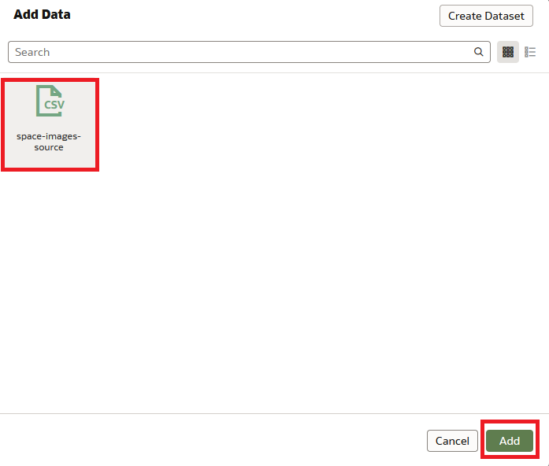
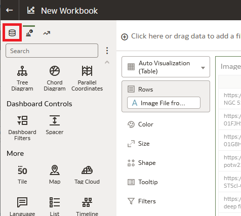

# Explore space images

## Introduction

In the previous labs we learned how to label images and use them to create a custom OCI Vision AI model. In this lab, we'll put that custom model to use to analyze space images. 

The features of OCI Vision are exposed through an API, which makes those features consumable by any application that can benefit. Consuming the API requires writing code to invoke the API, pass in the required data, and process the response. However, it is not always necessary to write code to use OCI Vision. Oracle provides the OCI Console user interface to exercise the Vision service as experienced in a previous lab. And Oracle Analytics Cloud (OAC) also provides a codeless interface for consuming OCI Vision. It's this OAC capability that will be used in this lab.

*Estimated Time*: 30 minutes

### Objectives
* Create a source dataset of images for processing by OAC
* Create an OAC dataflow to process the images through OCI VIsion
* Create an OAC workbook to view images processed through OCI Vision

### Prerequisites
* You are using a LiveLabs sandbox environment
* You successfully built a custom Vision model in a previous lab and the model is *Active*.

> Note - the LiveLabs sandbox environment has a pre-configured OAC instance that is used for this lab. In other environments, OAC would need to be provisioned and configured.

## **Task 1:** Download a file representing the source dataset
You'll download a csv file that contains the name and location of the space images to be processed through the OCI Vision custom model you previously created. This file is needed for the dataflow that will be created in this lab.

1. Use the OCI console to navigate to Storage > Buckets

    

1. Set compartment to **vision_galaxy_ws_read_only**, then click the bucket named **data-flow**.

    

1. Find the row containing *space-images-source.csv* and click the **3 dot icon** at the end of the row, then click **Download**. Save the file on your local machine to be used in a later step.

    

1. Open *space-images-source.csv* on your local machine. You don't need to edit it but notice what it contains.

    a. The name of a bucket that contains the images to be processed, i.e. *object-detection-read-only*

    b. The url for the bucket, i.e. *https://cloud.oracle.com/object-storage/buckets/idxv5eebn2fx/object-detection-read-only/objects?region=us-ashburn-1*

    > Note - the bucket containing the images was prepared in advance, as was the csv file.

1. Close the csv file.

## **Task 2:** Collect tenancy data for the OAC connection
You'll need the tenancy ID and user ID for your LiveLabs tenancy to be able to connect to the Vision model from OAC.

1. In the OCI Console, click the Profile icon in the upper right corner of the page, then click *Tenancy: livelab*

    

1. On the tenancy details page, click **Copy** next to the *OCID* and paste the tenancy OCID in a text document on your local machine to use in a later step.

    

1. In the OCI Console, click the Profile icon in the upper right corner of the page, then click *My profile*

    

1. On the *my profile* page, click **Copy** next to the *OCID* and paste the user OCID in a text document on your local machine to use in a later step. (Your user name will be different than the one shown.)

    

You should now have two OCIDs saved in a text document. You can tell them apart because one contains *tenancy* in the string and the other contains *user*. 

## **Task 3:** Access Oracle Analytics Cloud (OAC)
Login to OAC.

1. Keep your OCI tab/window open and open the url below in a new tab in your web browser to access the OAC user interface: 

    https://analyticscloudlivelabs-idxv5eebn2fx-ia.analytics.ocp.oraclecloud.com/ui/

    

> Note 
>
> If you are prompted to login, use the same credentials as you used for the OCI console.
> 
> You'll later need to switch back and forth between the OCI and OAC tabs.

## **Task 4:** Create an OAC connection to OCI
Create a connection to the tenancy containing the Vision model to be used.

1. On the OAC home page, click the *Create* button and then click *Connection*. 
    

1. In the *Create Connection* dialog, select *OCI Resource*.

    

1. Fill out the fields in the *Create Connection* dialog
    

    a. Set *Connection Name* to **LiveLabs Galaxy**

    b. Set *Description* to **Connection to liveLabs tenancy for Vision model**

    c. Set *Region Identifier* to **us-ashburn-1**

    d. Set *Tenancy OCID* to the tenancy OCID you saved in the earlier task.

    e. Set *User OCID* to the user OCID you saved in the earlier task.

    f. Click the **Generate** button to generate an *API Key*.

    g. **Copy** and then save the API key in a text file on your local machine.

    h. DO NOT yet hit Save in the **Create Connection** dialog. The API key needs to be added to OCI first. (If you click Save before completing the next steps you will get an error, but it's not fatal.)

1. Switch to your OCI Console. If you are not already on the *My Profile* page, click the Profile icon in the upper right corner of the page, then click *My profile* 

    

1. Under *Resources*, select **API keys**, and then click the **Add API key** button.
    
    

1. In the *Add API Key* dialog, select the **Paste a public key** option, then copy the key you previously saved in your local text file and paste it into the **Public Key** box. Then click **Add**.

    

1. The *Configuration file preview* dialog is displayed. Click **Close**.

    

1. Switch back to the OAC user interface and click **Save** in the *Create Connection* dialog to save the connection. The saved connection will be displayed as shown under *Data*.
    
    

## **Task 5:** Ensure that model training has successfully completed
Verify that the custom model you created in Lab 2 has completed training and is now active.

1. From the OCI services menu, click **Analytics & AI** then, under *AI Services*, click **Vision**.
  
    

1. On left side of the Vision page, under *Custom models*, click **Projects**.

    

1. Select the compartment you were assigned in your LiveLabs *Reservation Information*.  

1. Click on the name for your project: **galaxy-detection**.

1. Click on the name of your model: **galaxy-detection-model-1**

1. Check the status of the model to see if it is *Active*. If it's not yet active, wait until it is before proceeding to the next task.

## **Task 6:** Register the Vision model in OAC
Register the OCI Vision model with OAC so that it can be used in a data flow to process images.

1. In OAC, click the 3 dot icon (page menu) next to *Create* button in the upper right corner, then select **Register Model/Function**, and in the submenu select **OCI Vision Models**. 
    
    

1. In the *Register a Vision Model* dialog, select the **Livelabs Galaxy** connection that you previously configured. (Wait several seconds for the connection to be listed.)

    

1. In the *Select a Model* dialog, select your custom Vision model: **custom-model-read-only**
    
    

1. In the *Select a Model* sub-dialog for *custom-model-read-only*, set *Staging Bucket Name* to **vision-staging-bucket**, then click **Register**.

    

1. To confirm the model was registered, click the 3 bar icon in the upper left corner of the page and then select *Machine Learning*. The registered model is listed.
    

## **Task 7:** Create an OAC dataset for the images to be processed
Create a dataset that will be the input to the OAC data flow.

1. In OAC, click the 3 bar icon in the upper left corner of the page and then select *Data*. 

    

1. Drag and drop *space-images-source.csv* from your local machine (created earlier) to the Oracle Analytics page. This will trigger it to be added as a dataset.

1. In the *Create Dataset from space-images-source.csv* dialog, click **OK**.

    

1. The dataset is now listed.

        

## **Task 8:** Create an OAC data flow to process images
Create a dataflow that ingests the space images from object storage, submites them to OCI Vision for object detection using the custom model, and outputs a new dataset that can be used for visualization in OAC.

1. In the upper right corder of the OAC screen, click **Create** and then **Data Flow**.
    
    

1. A new data flow screen opens with the *Add Data* dialog on top. Scroll down to find *space-images-source*, select it, then click **Add**. This adds the image source as the first step of the data flow.
    
    

1. Click the **+** button next to *space-images-source* and select **Apply AI Model**.
    
    

1. In the *Select AI Model* dialog, select **custom-model-read-only**, then click **OK**.

    

1. In the *Apply AI Model* configuration, scroll down to *Parameters* and click **Select a column**, then in the pop-up, select **Bucket Location**.

    

1. Change *Maximum Number...* from 5 to 10.

    

1. In the *Outputs*, uncheck **Vertex 2**, **Vertex 4**, **Synonyms**, and **Status Summary**, as these fields are not needed.

    

1. In the data flow diagram, click the **+** next to *Apply AI Model* to add another step, then select **Save Data**.

    

1. In the *Save Dataset* configuration, change the *Dataset* to **Galaxy Object Detection Results**.

    

1. Under *Columns*, change *Treat As* for *ID* to **Attribute**. Then, under *Columns*, change *Default Aggregation* for *Confidence* to **Maximum**.

1. Click the **Save** icon on the top bar of the page and set the Data Flow *Name* to **Galaxy Object Detection Data Flow**. Then click **OK**  

    

1. Click the **Run** icon on the top bar of the page to run the dat flow. Wait for the data flow to complete. This may take 1-2 minutes.

    

## **Task 9:** Create an OAC workbook to view processed images
Create an OAC workbook to view the objects detected in the space images.

1. Click the **Go back** icon in the upper left corner of the page.

    

1. In the *Datasets* list, click **Galaxy Object Detection Results** to open it in a new workbook.

    

1. You now see a new workbook with the dataset contents listed on the left and an empty visualization pallete on the right.

    

1. In the data listing on the left, click and drag **Image File from Bucket** onto the vizualization palette on the right. This adds a table visualization. These are the images processed by the data flow.

    

1. Switch to the visualizations list by clicking the **Vizualizations** icon

    

1. Scroll down to the bottom of the list and drag **Vision Plugin** to the canvas to the right of the table.

    

1. Switch back to the data list by clicking the **Data** icon.

    

1. Drag **Image File from Bucket** to **Image Location** under *Vision Plugin*. Drag **Vertex 1** and **Vertex 3** to **Vertices**.

    

1. Drag **Vertex 1** and **Vertex 3** to **Vertices** under *Vision Plugin*.

    

1. Right click on any row of the table and, in the popup menu, click **Use as Filter**. Now, whichever row you select in the table will be displayed in the image viewer.

    

1. Save your workbook by clicking the **Save** icon in the upper right corner of the page.

    

1. In the *Save Workbook* dialog, provide a *Name* such as **My Galaxy Workbook** and cick **Save**.

    

1. You can now cursor down through the table to view all of the images in the dataset and see what galaxies were detected. Not every image will contain a galaxy, but they are all beautiful and interesting to look at. 

    todo 
                ,'/',''}
            ,'.jpg',''
        }
    validate & save
    add field ID to table 
    drop the full URL string from the table
    make map vizualization by duplicating the table then changing it to...

`Add Vision Plugin to canvas (from custom visualizations)
Drag "Image File from Bucket" to Image Location.
Drag Vertex 1 and Vertex 3 to Vertices`

`To show all images, drag ImageGalleryViz plugin to canvas. Drag "Image File from Bucket" to "Image URL". Drag "Image Name" to description". (Need image name extracted to a field for this. Use Add Column in data flow.)
    ex
    cast(left(right(Image File from Bucket, 19), 10) as date)
    RIGHT(Image File from Bucket, 19)
    Name it: Image Name 
https://www.youtube.com/watch?v=uYIo4XURymI`

> Note
>
> If you want to add the Vision Plugin to your own environment, you can download it from the Analytics vizualization extensions page available here:
https://www.oracle.com/business-analytics/data-visualization/extensions/
>
>This video shows how to install the visualization (or any) plugin:
https://www.youtube.com/watch?v=JjuOWm8whgQ

## Congratulations, you have completed this lab and the workshop!

***
### Acknowledgements
* **Author** - <Wes Prichard, Sr Principal Product Manager, Data Science & AI>
* **Contributors** -  <Mark Heffernan, Sr Principal Product Manager, Data Science & AI>
* **Last Updated By/Date** - <Name, Month Year>
