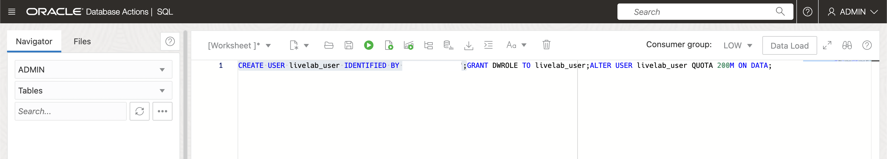

# Prepare data sources
​
## Introduction
​
This lab walks you through the steps to prepare the sample data that will be used to perform sentiment analysis. We will also create the buckets and databases to save the processed data.
​
Estimated Time: 60 minutes
​
### Objectives
​
In this lab, you will:
* Create Object Storage Bucket
* Download and Upload Sample Data
* Prepare Target Database
* Create Tables to Store Output Data
​
### Prerequisites
​
This lab assumes you have:
* An Oracle account
* Completed Lab 1
​
​
## **Task 1**: Create Object Storage Bucket
​
In this task, we'll create 3 buckets one for storing source audio files, one for storing the transcribed audio files and last for the merged transcribed files. The merged transcriptions bucket is a 'location' where OCI Data Integration needs to dump intermediate files before publishing data to a data warehouse.(Need to confirm)
​
1.	In the Oracle Cloud Infrastructure Console navigation menu, go to **Storage**, and then select **Buckets**.
​
   
​
2. In the buckets page, select the compartment you want to create the bucket and click create bucket button.
​
    
​
3. Next Fill the fields with name "FilesForTranscription" and make sure to tick box to **Emit Object Events**
​
    
​
4. Repeat steps **1** to **3** to create two new buckets named "MergedTranscriptions" and "TranscribedFiles"
​
    
​
​
​
## **Task 2**: Prepare Target Database
​
In this task, we'll create and configure your target Autonomous Data Warehouse database to add a schema and a table.
​
1.	In the Oracle Cloud Infrastructure Console navigation menu, go to **Oracle Database**, and then select **Autonomous Data Warehouse**.
​
   
​
2.	Select your compartment and click **Create Autonomous Database**.
​
    
​
3.	On the options, set a **Display Name** and **Database Name**
​
   
​
4.	Workload type: **Data warehouse**.
​
5.	Remember your password (**labDatabase01**)
​
6.	Access type **Secure access from allowed IPs and VCNs only**
​
7.	Click **Create Autonomous Database** (Wait for your dataset to provision which may take up to 15mins)
​
   
​
8. On the Autonomous Database details page, click **Database connection**.
    
​
9. CLick Download Wallet
    
​
10. Enter password of your choice and store the password. Then click on Download. Store the downloaded wallet zip file.
    
​
11.	On your database details page, click **Database Actions**.
​
   
​
12.	Under **Development**, click **SQL**.
​
   
​
13. Create a Contributor user. Autonomous Databases come with a predefined database role named **DWROLE**. This role provides the common privileges for a database developer or data scientist to perform real-time analytics. Depending on the usage requirements you may also need to grant individual privileges to users.
​
	Run the following script as shown in the image below:
		```
	    <copy>CREATE USER livelabUser IDENTIFIED BY "<enter user1 password here>";GRANT DWROLE TO livelabUser;ALTER USER livelabUser QUOTA 200M ON DATA;DEFAULT COLLATION "USING_NLS_COMP";
		DEFAULT TABLESPACE "DATA";
		TEMPORARY TABLESPACE "TEMP";</copy>
		```
		```
		<copy>GRANT CREATE SESSION TO livelabUser;</copy>
		```
​
   
​
​
## **Task 3**: Create Tables to Store Output Data
​
Whilst we are in the Database Actions dashboard, we will create 2 Tables
​
1. A table **WORDS** to store the extracted aspects and related entities
2. A table **SENTIMENT** to store the raw reviews. <br /><br />
Follow the scripts below:
​
       ```
       <copy>
       CREATE SEQUENCE livelabUser.CONVERSATION_ID
       MINVALUE 1
       START WITH 1
       INCREMENT BY 1
       NOCACHE;
       </copy>
       ```
​
	**Create Conversations Table**
	```
	<copy>
	CREATE TABLE livelabUser.conversations
	(
	create_date TIMESTAMP DEFAULT CURRENT_TIMESTAMP NOT NULL,
	conversation_file_id VARCHAR(64) NOT NULL,
	full_transcription NCLOB NOT NULL,
	channel1_transcription NCLOB NOT NULL,
	channel2_transcription NCLOB NOT NULL,
	CONSTRAINT CONVERSATIONS_ID_UNIQUE UNIQUE (conversation_file_id)
	);
	</copy>
	```
​
	**Create Raw Reviews Table**
	```
	<copy>CREATE TABLE livelabUser.words
	(
	conversation_file_id varchar(64) NOT NULL,
	text VARCHAR(64)NOT NULL,
	word_type VARCHAR(64)NOT NULL,
	audio_offset_seconds FLOAT NOT NULL,
	audio_duration_seconds FLOAT NOT NULL,
	belongs_to_channel CHAR(1) NOT NULL,
	character_offset_channel1 NUMBER ,
	character_offset_channel2 NUMBER ,
	character_offset_mixed NUMBER NOT NULL,
	CONSTRAINT fk_conversation FOREIGN KEY (conversation_file_id) REFERENCES livelabUser.conversations(conversation_file_id),
	CONSTRAINT check_belongs_to_channel CHECK (belongs_to_channel IN ('1','2'))
	);</copy>
	```
​
	**Create Key Phrases Table**
​
	```
	<copy>
	CREATE TABLE livelabUser.KEYPHRASES
	(
	CONVERSATION_FILE_ID VARCHAR2 (64) NOT NULL ,
	TEXT VARCHAR2 (64) NOT NULL ,
	ENTITY_TYPE VARCHAR2 (64) NOT NULL ,
	AUDIO_OFFSET_FIRST_WORD_SECONDS FLOAT (126) NOT NULL ,
	BELONGS_TO_CHANNEL CHAR (1) NOT NULL ,
	CHARACTER_OFFSET NUMBER NOT NULL
	)
	ALTER TABLE livelabUser.KEYPHRASES ADD CONSTRAINT ENTITIES_CHECK_BELONGS_TO_CHANNEL CHECK ( BELONGS_TO_CHANNEL IN ('1', '2'));
	ALTER TABLE livelabUser.KEYPHRASES ADD CONSTRAINT FK_CONVERSATION_IN_ENTITIES FOREIGN KEY(CONVERSATION_FILE_ID) REFERENCES livelabUser.CONVERSATIONS ( CONVERSATION_FILE_ID );
	</copy>
	```
​
	```
	<copy>
	CREATE TABLE livelabUser.KEYPHRASES2
	(
	CONVERSATION_FILE_ID VARCHAR2 (64) NOT NULL ,
	TEXT VARCHAR2 (64) NOT NULL ,
	BELONGS_TO_CHANNEL CHAR (1) NOT NULL ,
	CHARACTER_OFFSET NUMBER NOT NULL
	)
	ALTER TABLE livelabUser.KEYPHRASES2 ADD CONSTRAINT KEYPHRASES_CHECK_BELONGS_TO_CHANNEL CHECK ( BELONGS_TO_CHANNEL IN ('1', '2'))
	ALTER TABLE livelabUser.KEYPHRASES2 ADD CONSTRAINT FK_CONVERSATION_IN_KEYPHRASES FOREIGN KEY(CONVERSATION_FILE_ID) REFERENCES livelabUser.CONVERSATIONS ( CONVERSATION_FILE_ID );
	</copy>
	```
​
	**Create Sentiment Table**
​
	```
	<copy>CREATE TABLE livelabUser.SENTIMENT
	(
	conversation_file_id VARCHAR(64) NOT NULL,
	text VARCHAR(64) NOT NULL,
	sentiment VARCHAR(64) NOT NULL,
	character_offset NUMBER NOT NULL,
	belongs_to_channel CHAR(1) NOT NULL,
	AUDIO_OFFSET_FIRST_WORD_SECONDS FLOAT (126) NOT NULL
	CONSTRAINT fk_conversation_in_sentiments FOREIGN KEY (conversation_file_id) REFERENCES livelabUser.conversations(conversation_file_id)
	);</copy>
	```
 
	```
 	<copy>
	CREATE OR REPLACE VIEW livelabUser.KeyPhrasesWords AS
	select k.CONVERSATION_FILE_ID, k.TEXT, w.AUDIO_OFFSET_SECONDS
	from livelabUser.KEYPHRASES k
	left outer join livelabUser.WORDS w on w.CONVERSATION_FILE_ID = k.CONVERSATION_FILE_ID AND
	((w.BELONGS_TO_CHANNEL = 1 AND k.BELONGS_TO_CHANNEL = 1 AND w.CHARACTER_OFFSET_CHANNEL1 = k.CHARACTER_OFFSET)
	or (w.BELONGS_TO_CHANNEL = 2 AND k.BELONGS_TO_CHANNEL = 2 AND w.CHARACTER_OFFSET_CHANNEL2 = k.CHARACTER_OFFSET))
	ORDER BY upper(TEXT);
	</copy>
 	```
 
	```
	<copy>
	CREATE OR REPLACE VIEW livelabUser.KeyhpraseCounts AS
	select text, COUNT(TEXT) as count
	from livelabUser.KEYPHRASES
	group by text
	order by count desc
	fetch  first 10 rows only;
	</copy>
	```
	```
	<copy>
	CREATE OR REPLACE VIEW livelabUser.SentimentPerDate AS
	select c.CREATE_DATE,
	COUNT(CASE s.SENTIMENT 
	WHEN 'Positive' THEN 1
	WHEN 'Negative' THEN -1
	ELSE 0
	END) as SentimentCount
	from livelabUser.SENTIMENTS s
	inner join livelabUser.CONVERSATIONS c ON s.CONVERSATION_FILE_ID = c.CONVERSATION_FILE_ID
	group by c.CREATE_DATE
	order by SentimentCount desc;
	</copy>
	```
	```
	<copy>
	CREATE OR REPLACE VIEW livelabUser.SENTIMENTCOUNTS AS
	select text, COUNT(TEXT), SENTIMENT
	from livelabUser.SENTIMENTS
	group by text, SENTIMENT
	order by COUNT(TEXT) desc
	fetch first 20 rows only
	</copy>
	```
​
This concludes this lab. You may now **proceed to the next lab**.
​
## Learn More
 [Overview of Object Storage](https://docs.oracle.com/en-us/iaas/Content/Object/home.htm)
 [Overview of Autonomous Database](https://docs.oracle.com/en-us/iaas/Content/Database/Concepts/adboverview.htm)
​
## Acknowledgements
**Authors**
  * Rajat Chawla  - Oracle AI OCI Language Services
  * Sahil Kalra - Oracle AI OCI Language Services
  * Ankit Tyagi -  Oracle AI OCI Language Services
  * Veluvarthi Narasimha Reddy - Oracle AI OCI Language Services
​

**Last Updated By/Date**
* Veluvarthi Narasimha Reddy  - Oracle AI OCI Language Services, April 2023