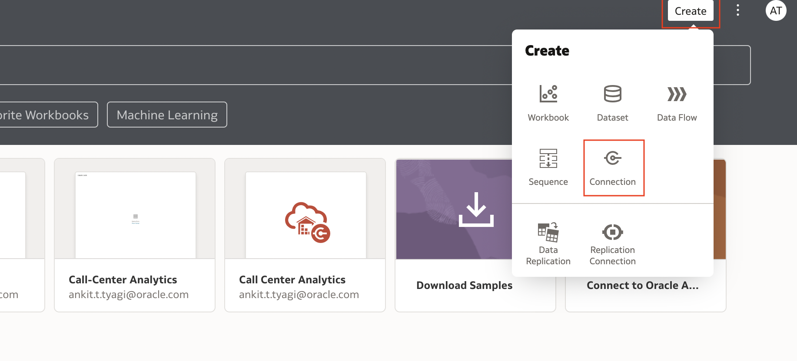

# Setup Oracle Analytics Cloud (OAC) instance

## Introduction

This section describes the process of deploying **Oracle Analytics Cloud** instances on Oracle Cloud Infrastructure Gen 2, which is the default for newly provisioned accounts in **EMEA** and **US**.

Your Oracle Cloud Free Tier account will use the Oracle Cloud Free Trial **credits** while this instance is provisioned, as Oracle Analytics Cloud is not part of the **Always Free** cloud services.

Provisioning an Oracle Analytics Cloud instance can take over **40 minutes**.

Watch our short video that explains how to provision your Oracle Analytics Cloud instance:

Estimated Lab Time: 5 minutes

### Objectives
- Create an Oracle Analytics Cloud Instance

## Task 1: Create an Oracle Analytics Cloud (OAC) Instance

1. Go to the **Home Console Page** and navigate to **Analytics & AI** section and then **Analytics Cloud**.

    

2. Select **Create Instance**.

    Complete the form using the following information:

    - **Compartment**: Select a valid compartment in your tenancy

    - **Instance Name**: `livelabCallCenterOAC`

    - **Description**: &lt;optional&gt;

    - **Edition**: Enterprise Analytics (important)

    - **Capacity**: 1 - Non Production

    - **License**: "Subscribe to a new Analytics Cloud software > license and the Analytics Cloud." (You will use this service as part of the free Oracle Cloud trial that you requested for this workshop).

3. Select **Create**.

    

4. This will the open the instance page, Wait for the status to change from **Creating** to **Active**.

   
    

## Task 2: Upload Workbook

1. In the Analytics Instance listing page, Open the Cloud Analytics URL associated with your instance by using the three dots menu button on the right-hand side of your instance information and select **Analytics Home Page**.
      
    The **Oracle Analytics** page will open in a new browser window/tab.

2. In the **Oracle Analytics** page click on the three dots beside create button and click on **Import Workbook/Flow..**.
    

3. This will open a UI to upload a workbook. download this [CallCenterAnalyticsWorkbookFile](./files/call-center-analytics.dva) workbook file  and upload it
    

## Task 3: Configure Workbook

1. On the top right-hand side of the **Analytics Home Page**, click **Create**, and then **Connection**.

    

4. Choose **Oracle Autonomous Data Warehouse**.

    

5.	Enter the credentials to the data warehouse (target database) you created in **Lab 2: Prepare data sources > Task 2: Prepare Target Database**. If you need a reminder on how to get the wallet, See [Download a Wallet](https://docs.oracle.com/en/cloud/paas/autonomous-data-warehouse-cloud/cswgs/autonomous-connect-download-credentials.html#GUID-B06202D2-0597-41AA-9481-3B174F75D4B1).  
Click **Save** to save your new connection **information**.

  

[Proceed to the next section](#next)

## Acknowledgements
**Authors**
  * Rajat Chawla  - Oracle AI OCI Language Services
  * Sahil Kalra - Oracle AI OCI Language Services
  * Ankit Tyagi -  Oracle AI OCI Language Services
  * Veluvarthi Narasimha Reddy - Oracle AI OCI Language Services

**Last Updated By/Date**
* Veluvarthi Narasimha Reddy  - Oracle AI OCI Language Services, April 2023
