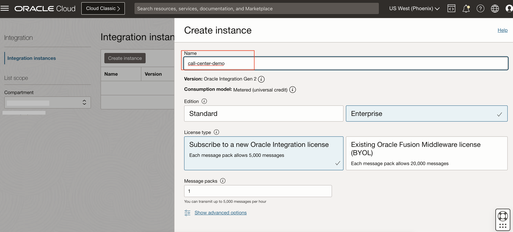

# Prepare Data Sources

## Introduction

This lab walks you through the steps to prepare an OAC instance.

Estimated Time: 

### Objectives

### Prerequisites

## **Task 1**: Create OIC Instance

1. In the Oracle Cloud Infrastructure Console navigation menu, go to **Developer Servicese**, and then select **Integration** under **Application Integration**.

   

2. In the Integrations page, select the compartment you want to create the bucket and click create instance button.

    

3. Fill the fields with name "call-center-demo" or any name your choice and keep the other fields as default

    

4. Now the Instance is created and wait for its state to change from **Creating** to **Active**. Once the state changes to active, open the integration details page by clicking on it and then click the service console button to open the OIC console page
    

5. Download the already created integration files to use in Task 2 and Task 3.

[Transcribe Audio Files](./files/Call-CenterAnalytics-TranscribeAudioFiles-Integration.iar)

[Process Transcriptions](./Call-CenterAnalytics-ProcessTranscriptions-Integration.iar)

## **Task 2**: Setup Speech Transcription Integration

1. In the service console, open the hamburger menu and click **Integration** and then **Integrations** again to open integrations home page.
    
    

2. This will navigate you to the integrations home page. Now you need to click import button in the top right to upload integration file.
    

3. Make sure include asserted recordings checkbox is not ticked and then Click on choose file and select the [Transcribe Audio Files](./files/Call-CenterAnalytics-TranscribeAudioFiles-Integration.iar) you downloaded from Task 1 to upload. Finally click on **Import and Configure** after upload is finished.

4. This will open the configuration page for the **Transcribe Audio Files** integration. We need to edit the two connections in this integrations. Hover over the *New Audio Files for Transcription* connection and then click on edit icon.
    

5. This will take you to connection details page, keep the security policy with the default and click **Test** button.
    

6. After the test is finished you will see a confirmation dialog box saying "Connection New Audio File For Transcription was tested successfully".

7. Now Click Save button
    

8. After the connection is saved you will see a confirmation dialog box saying "Connection New Audio File For Transcription was saved successfully".

9. Navigate back to configuration page for the **Transcribe Audio Files** integration and similarily to step 4, click on edit button for *Transcribe Audio File* connection.

10. This will take you to connection details page, fill the **Connection URL** field with "https://speech.aiservice.us-phoenix-1.oci.oraclecloud.com"
    

11. Fill the Tenancy OCID, User OCID, fingerprint and upload the **call-center-analytics-api-key-private.pem** created in Lab 1. Then click on Test button.
    

12. After the Test is successfull, click save.
    

13. Navigate back to configuration editor page, see that both the connections status is **configured**.
    

14. Hover over Transcribe Audio Files and click on **update property values**
    

15. Under *SpeechApiOutputBucketName* in the New value field fill **TranscribedFiles** and then click submit.
    

Now the Integration for speech is complete.

## **Task 3**: Setup Language Transcription Integration

1. Navigate to back to back to integrations home page and repeat the step 3 in Task 2 to import [Process Transcriptions](./Call-CenterAnalytics-ProcessTranscriptions-Integration.iar) integration file. This will open the configuration editor for **Process Transcriptions** integration.
    

2. This will open the configuration page for the **Process Transcriptions** integration. We need to edit the five connections in this integrations. Hover over the *New Transcription For Analysis* connection and then click on edit icon.

3. This will take you to connection details page, keep the security policy with the default and click **Test** button.
    

4. After the test is finished you will see a confirmation dialog box saying "Connection New Audio File For Transcription was tested successfully".

5. Now Click Save button
    

6. After the connection is saved you will see a confirmation dialog box saying "Connection New Audio File For Transcription was saved successfully".

7. Navigate back to the configuration page, Hover over **Read File From Storage Bucket** connection and click edit icon. This will open the connection details page.

8. Fill the **Connection URL** field with "https://objectstorage.us-phoenix-1.oraclecloud.com"
    

9. Fill the Tenancy OCID, User OCID, fingerprint and upload the **call-center-analytics-api-key-private.pem** created in Lab 1. Then click on Test button.
    

10. After the Test is successfull, click save.
    

11. Navigate back to the configuration page, Hover over **Transcription DB** connection and click edit icon. This will open the connection details page.

12. Fill the **Service Name** field with "livelabdb_high"
    

13. Under Security, upload the DB wallet you have downloaded in Lab 2, the wallet password, the database username and password created in Lab 2. Then click Test button
    

14. After the Test is successfull, click save.
    

15. Navigate back to the configuration page, Hover over **Language AI API** connection and click edit icon. This will open the connection details page.

16. Fill the **Connection URL** field with "https://language.aiservice.us-phoenix-1.oci.oraclecloud.com"
    

17. Fill the Tenancy OCID, User OCID, fingerprint and upload the **call-center-analytics-api-key-private.pem** created in Lab 1. Then click on Test button.
    

18. After the Test is successfull, click save.
    

<!-- 19. Navigate back to the configuration page, Hover over **Call Functions** connection and click edit icon. This will open the connection details page.

20. Fill the **Connection URL** field with "https://*unique-Id*.us-phoenix-1.functions.oci.oraclecloud.com"
    

21. Fill the Tenancy OCID, User OCID, fingerprint and upload the **call-center-analytics-api-key-private.pem** created in Lab 1. Then click on Test button.
    

22. After the Test is successfull, click save.
     -->

19. Now all the configurations for Language Transcription Integration done. Navigate back to the integrations home page, hover over the **Transcribe Audio Files** and click activate icon. 
    

20. In the dialog box, make sure to check the boxes to **Enable Tracing** and **Include Payload** and then click activate. 
    

21. Similarily, repeat the steps 23 and 24 to activate the **Process Transcriptions** integration.

This concludes this lab. You may now **proceed to the next lab**.

## Acknowledgements
**Authors**
  * Rajat Chawla  - Oracle AI OCI Language Services
  * Sahil Kalra - Oracle AI OCI Language Services
  * Ankit Tyagi -  Oracle AI OCI Language Services
  * Veluvarthi Narasimha Reddy - racle AI OCI Language Services

**Last Updated By/Date**
* Veluvarthi Narasimha Reddy  - Oracle AI OCI Language Services, April 2023