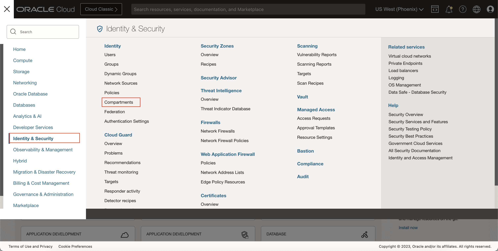
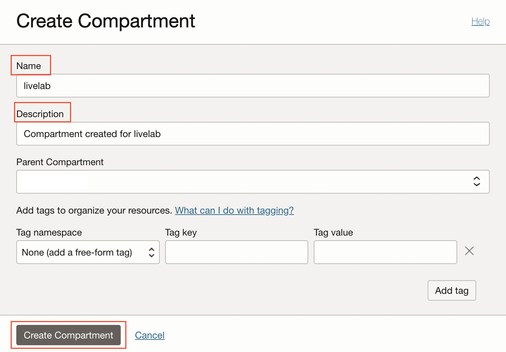
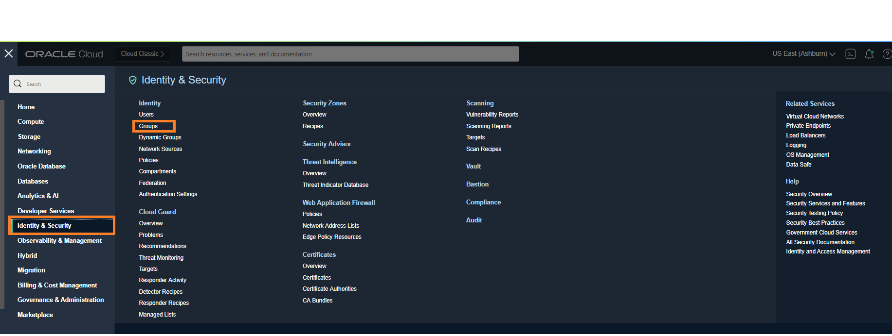
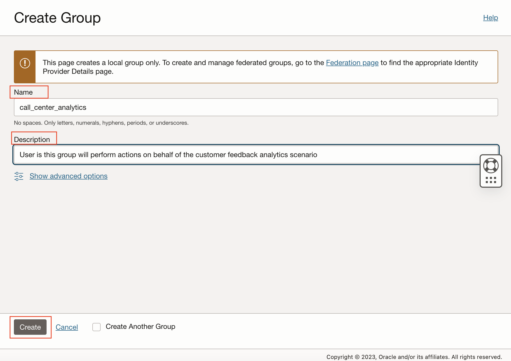
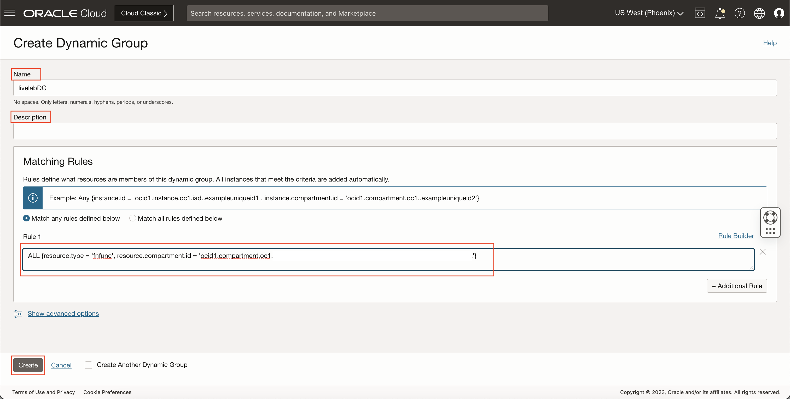
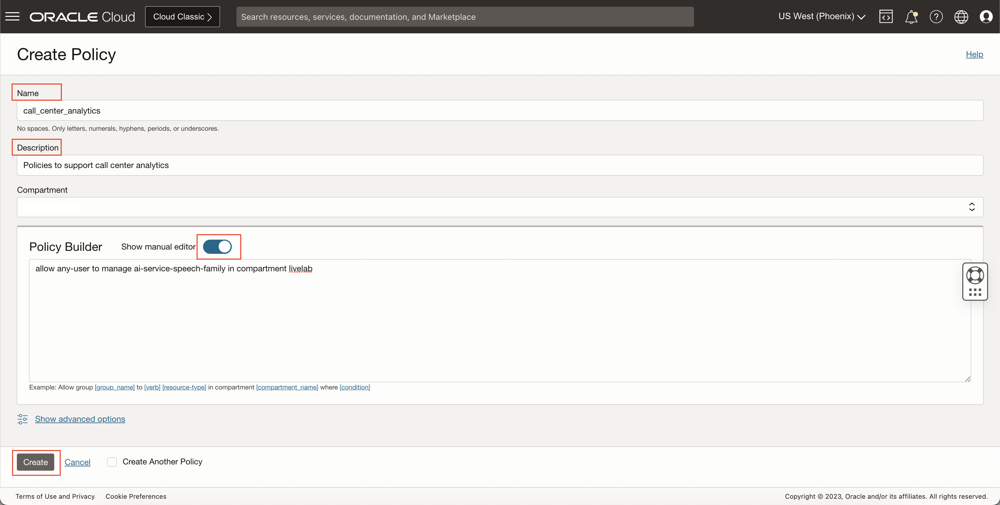
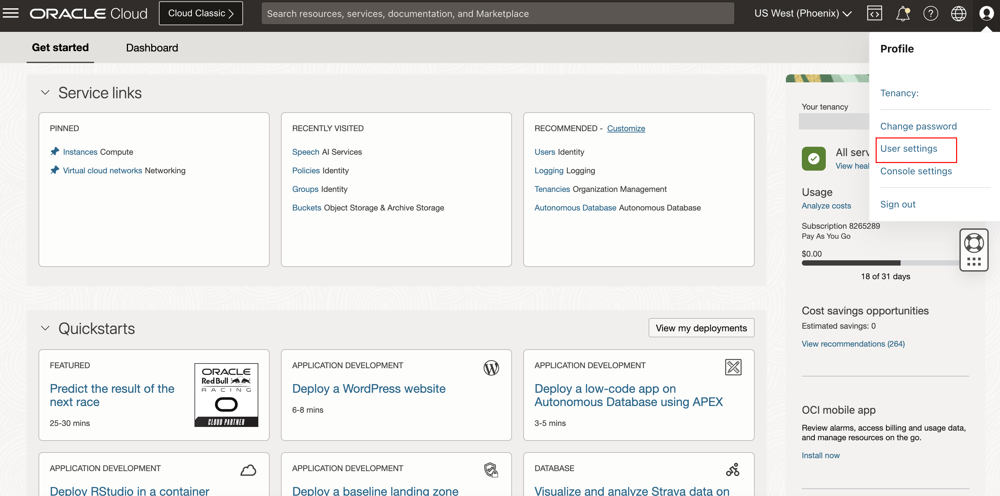
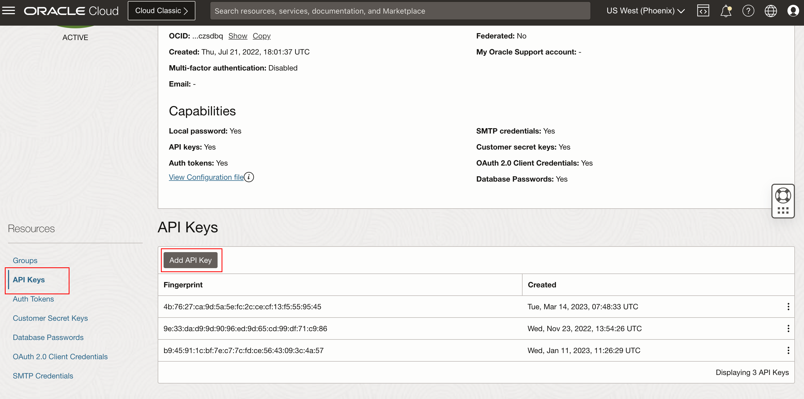
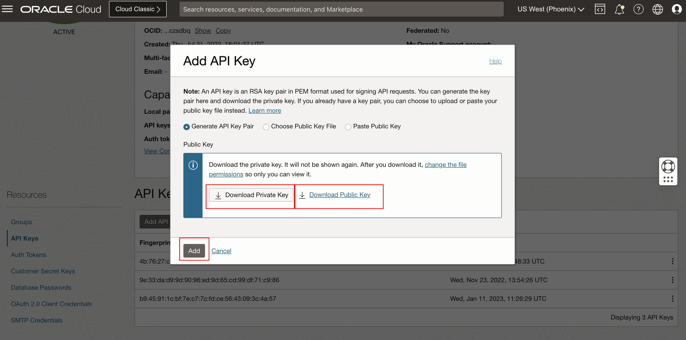

# Setup environment

## Introduction

This lab walks you through the steps to prepare your OCI Environment to be able to carry all the next steps needed to create a function, create data pipelines, run OCI Language Service as well as visualize your data in OAC.


### Objectives

In this lab, you will:
* Create compartment and group
* Set up policies
* Confirm access to OCI Language and Speech Services
* create an API signing key


### Prerequisites

This lab assumes you have:
* An Oracle account


## **Task 1**: Create Compartment, Group and Dynamic Group

This is an optional step, if you have an existing compartment or you prefer to perform all the setup in the root comapartment, skip to task 2.

Talk to your Administrator to verify the name of compartment you are to use for this lab as well as the group. In our scenario, we are using compartment "livelab" and "call-center-analytics" for the group. If these are not created you can refer to the below steps to create.

1.	Open the Oracle Cloud Infrastructure Console navigation menu and click **Identity & Security**. Under **Identity**, click **Compartments**. A list of the compartments you have access to is displayed.

    

2. Navigate to the compartment in which you want to create the new compartment:
    * To create the compartment in the tenancy (root compartment) click **Create Compartment**
    * Otherwise, click through the hierarchy of compartments until you reach the detail page of the compartment in which you want to create the compartment. On the **Compartment Details** page, click **Create Compartment**

3. Enter the following:
    * **Name**: A unique name for the compartment (maximum 100 characters, including letters, numbers, periods, hyphens, and underscores). The name must be unique across all the compartments in your tenancy. Avoid entering confidential information.
    * **Description**: A friendly description. You can change this later if you want to.
    * **Compartment**: The compartment you are in is displayed. To choose another compartment to create this compartment in, select it from the list.
    **Tags**: If you have permission to create a resource, then you also have permission to apply free-form tags to that resource. To apply a defined tag, you must have permission to use the tag namespace. For more information about tagging, see Resource Tags. If you are not sure whether to apply tags, skip this option (you can apply tags later) or ask your administrator.

    

4. Click **Create Compartment**.

  For compartment : See [Documentation](https://docs.oracle.com/en-us/iaas/Content/Identity/Tasks/managingcompartments.htm) for more details.

5. Open the Oracle Cloud Infrastructure Console navigation menu and click **Identity & Security**. Under **Identity**, click **Groups**. A list of the groups in your tenancy is displayed.

    

6. Click **Create Group**

7. Enter the following:
    * **Name**: A unique name for the group. The name must be unique across all groups in your tenancy. You cannot change this later. The name must be 1-100 characters long and can include the following characters: lowercase letters a-z, uppercase letters A-Z, 0-9, and the period (.), dash (-), and underscore (_). Spaces are not allowed. Avoid entering confidential information.
    * **Description**: A friendly description. You can change this later if you want to.
    * **Tags**: If you have permission to create a resource, then you also have permission to apply free-form tags to that resource. To apply a defined tag, you must have permission to use the tag namespace. For more information about tagging, see Resource Tags. If you are not sure whether to apply tags, skip this option (you can apply tags later) or ask your administrator.

    

8. Click **Create Group**.

    For Groups : See [Documentation](https://docs.oracle.com/en-us/iaas/Content/Identity/Tasks/managinggroups.htm) for more details.
  
9. Add your user to the created group.

10. Open the Oracle Cloud Infrastructure Console navigation menu and click **Identity & Security**. Under **Identity**, click **Dynamic Groups**. A list of the dynamic groups in your tenancy is displayed.

11. Enter the following:
    * **Name**: A unique name for the group. The name must be unique across all groups in your tenancy. You cannot change this later. The name must be 1-100 characters long and can include the following characters: lowercase letters a-z, uppercase letters A-Z, 0-9, and the period (.), dash (-), and underscore (_). Spaces are not allowed. Avoid entering confidential information.
    * **Description**: A friendly description. You can change this later if you want to.

12. Add the the following rule under the Matching Rules, where COMPARTMENT ID represents the OCID of the your compartment which was created in the Task 1.

        <copy> ALL {resource.type = 'fnfunc', resource.compartment.id = '<COMPARTMENT_ID>'} </copy>
    
    

13. Click **Create Dynamic Group**.

## **Task 2**: Setup Policies

1.	Open the Oracle Cloud Infrastructure Console navigation menu and click **Identity & Security**. Under **Identity**, click **Policies**

2.	Click **Create Policy**

3.	In the **Create Policy** panel, complete the following fields:
    * For **Name**, enter a name without any spaces. You can use alphanumeric characters, hyphens, periods, and underscores only.
    * For **Description**, enter a description to help other users know the purpose of this set of policies.
    * In **Policy Builder**, use the manual editor to add the following statements, then click **Create**.

   

   **Note** When creating policies the one which says 'in tenancy' must be created/run in the root compartment of the tenancy. All other policies should be created in the respective compartments.

4.	The following policies should be set:

    ```
    <copy>
    allow group <group-name> to manage all-resources in compartment <compartment-name>
    </copy>
    ```
    
    where **compartment-name** should be replaced with the name of your compartment, **group-name** is the name of your group .


## **Task 3**: Setup API Signing Key

Generate an API signing key pair

1. Open User Settings

    Open the Profile menu (User menu icon) and click User Settings.
        

2. Open API Key

    Navigate to API Key and then Click Add API Key.
        

3. Generate API Key

    In the dialog, select "Generate API Key Pair." Click "Download Private Key" and which will download the API key file into your local downloads.
        

4. From Config file preview copy the **user**, **fingerprint** and **tenancy**, then store the values somewhere, we will need these values in the later labs.

5. Open the terminal and navigate to the directory having the private key file we downloaded previously. then run the command
    
        <copy>openssl rsa -in <private-key-filename.pem> -out customer-feedback-analytics-api-key-private.pem</copy>

    where **private-key-filename.pem** is the key file we downloaded.

6. This will create a new private key file **customer-feedback-analytics-api-key-private.pem**, we will use this key file in the next labs.


To Know more visit [Generating API KEY](https://docs.oracle.com/en-us/iaas/Content/API/Concepts/apisigningkey.htm) and [SDK and CLI Configuration File](https://docs.oracle.com/en-us/iaas/Content/API/Concepts/sdkconfig.htm#SDK_and_CLI_Configuration_File)


This concludes this lab. You may now **proceed to the next lab**.

## Learn More
[Overview of OCI Networking](https://docs.oracle.com/en-us/iaas/Content/Network/Concepts/landing.htm)
[Users and Groups](https://docs.oracle.com/en-us/iaas/Content/GSG/Tasks/addingusers.htm)

## Acknowledgements
**Authors**
  * Rajat Chawla  - Oracle AI OCI Language Services
  * Sahil Kalra - Oracle AI OCI Language Services
  * Ankit Tyagi -  Oracle AI OCI Language Services
  * Veluvarthi Narasimha Reddy - Oracle AI OCI Language Services


**Last Updated By/Date**
* Veluvarthi Narasimha Reddy  - Oracle AI OCI Language Services, April 2023
