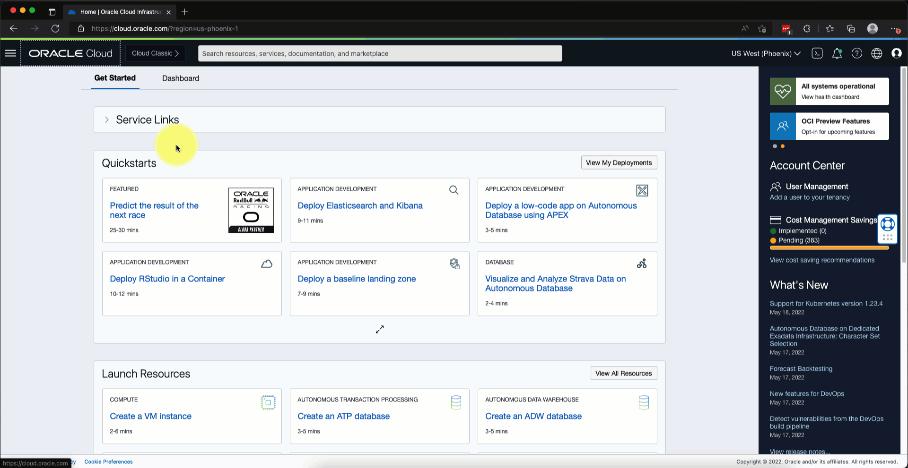
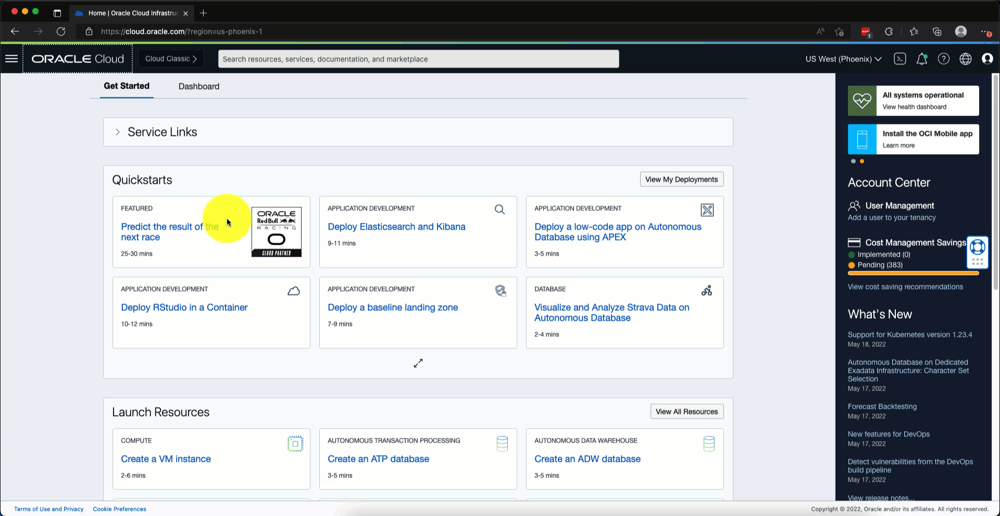
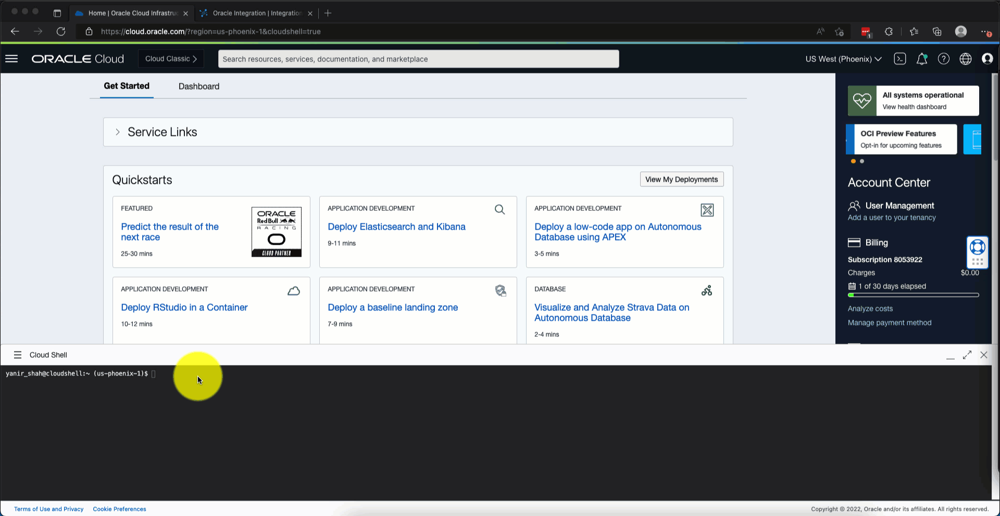
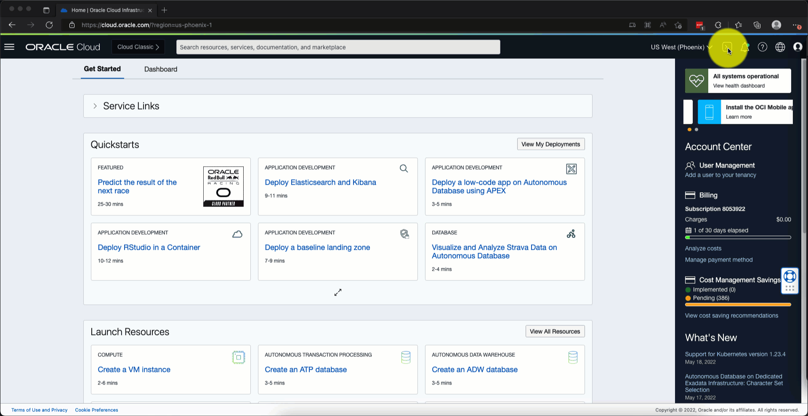
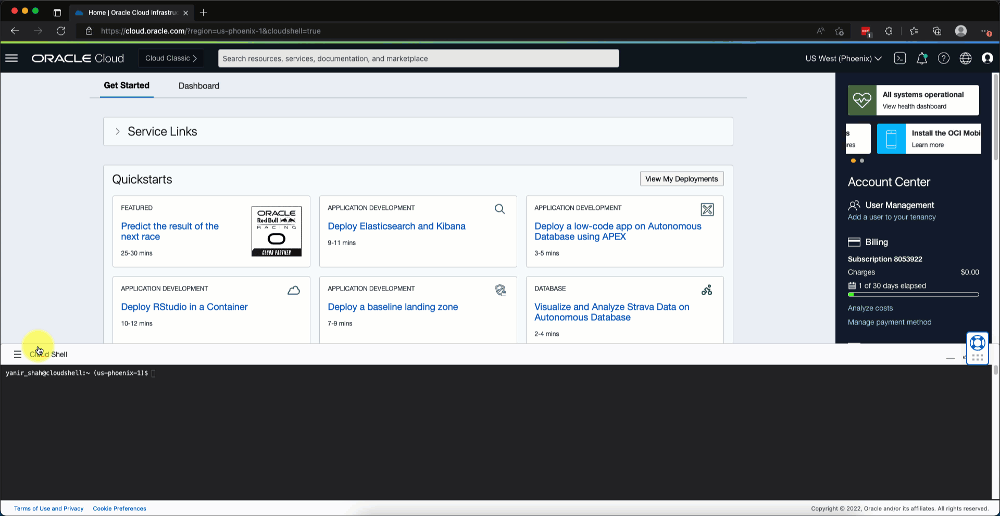
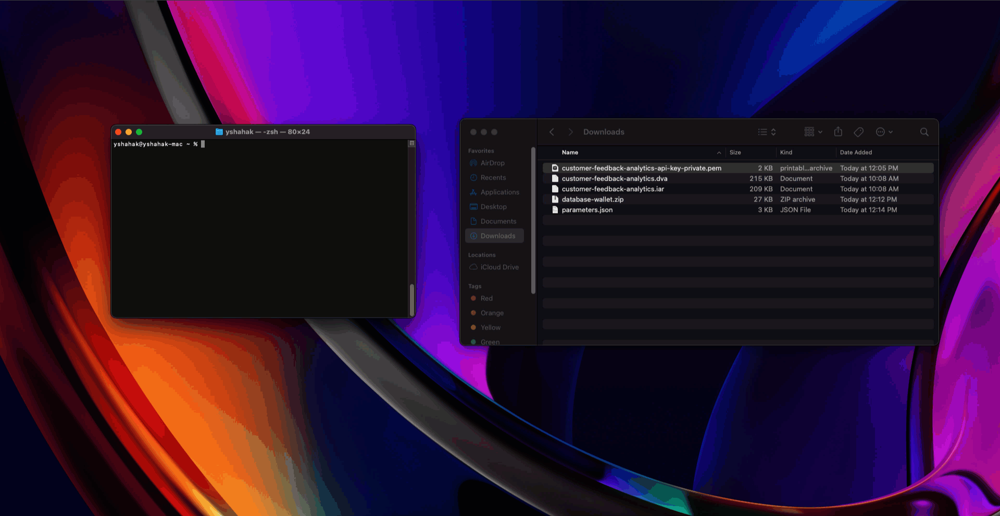
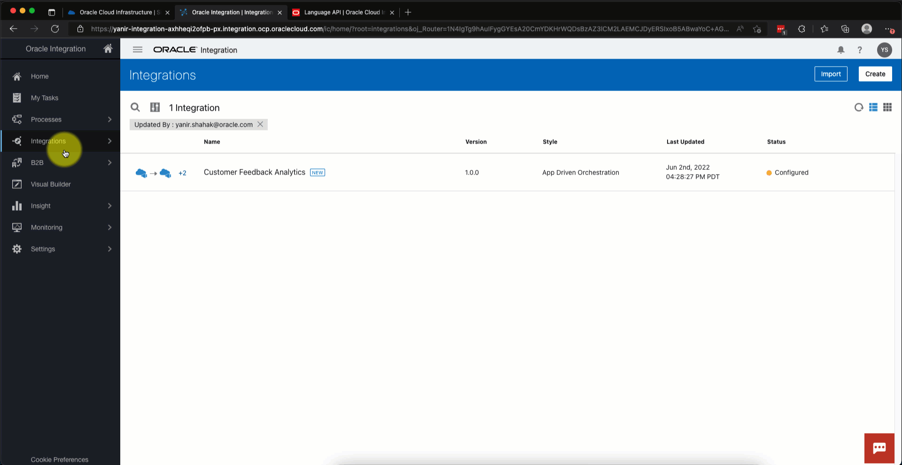

# Lab: Customer Feedback Analytics flow using AI Services, Oracle Integration Cloud (OIC)and Oracle Analytics Cloud (OAC)


## Introduction

In this lab you will create an integration flow that uses AI Services (OCI Language) to extract aspect level sentiment from unstructured text in object storage and visualize the extracted insights in an Oracle Analytics Cloud (OAC) Workbook.

About 80% of the world data is in unstructured formats, most of the time, written in natural language. In this lab we take a dataset of hotel reviews and use pre-built AI capabilities to analyze and explore the customer feedback to gain meaningful insights.

Time required : 30 minutes

### Objectives:
   To be added

### Prerequisites

The following elements have to be in place before we can continue with creating our environment:

1. You must have a functioning OCI account.
   
   If you do not currently have an OCI account, you can go to https://www.oracle.com/cloud/ to provision a new account.

2. You must have the proper permissions to perform the following operations:
   * Create a Compartment
   * Create a Federated user
   * Grant a role to the Federated user
   * Create a Local User
   * Create a User Group
   * Create a Policy
   * Create an API Key for a user
   * Create a Storage Bucket
   * Create a Notification Topic & Subscription
   * Create an ADW instance
   * Create an Integration Instance

   If you do not know whether you have the proper permissions, please reach out to your system administrator.


<!-- ## Procedure outline
After we complete all of our provisioning steps, we will be able to drop a CSV file containing the feedback information into a Storage Bucket. The Storage Bucket will emit an event which will be consumed by the Notification Service. The Notification Service will send a REST API request to our OIC instance with the information of the newly created file. OIC will then read the file and for each row of feedback in the CSV it will perform the following three actions:
1. Store the raw feedback in an Autonomous Data Warehouse (ADW) database.
2. Call the Language AI Entity Extraction API and store the results in ADW.
3. Call the Language AI Sentiment Analysis API and store the results in ADW.

After all of the rows in the CSV file have been processed, we will be able to see meaningful insights in our OAC Workbook.

Here is the outline for the operations we will perform in order to setup our environment:
1. We will manually create a Federated user who's credentials will be used to trigger our process to consume a new CSV file dropped in the Storage Bucket (more on this in a little bit).
2. We will manually create an OIC instance which will expose a REST API endpoint for triggering the process.
3. After creating the above to elements, we will launch the Cloud Shell and clone the GitHub repo which contains all of the files required for the setup.
4. We will update the information for the Federated user and OIC instance in the variables file so we could use this information in the automated steps.
5. At this point we will run the automated deployment script which will create the following objects:
   * **Compartment** - All of the elements created using the Terraform script will be created under this compartment for easy management.
   * **Local User** - This user will be granted permissions to perform API calls to the Language AI Service.
   * **API Key** for the *Local User* - This API Key will be used to authenticate the above mentioned API calls.
   * **User Group** - Our local user will be added to this group.
   * **Policy** - The policy will grant the ability to make API calls to all of the users added to our *User Group*.
   * **Storage Bucket** - Uploading a CSV file into this bucket will start our process.
   * **ADW Instance** - All of the reviews and extracted insights will be stored in this database. As part of the provisioning process, the following tables will be created:
      * FEEDBACK - Will contain the raw feedback as it exists in the CSV file.
      * ENTITIES - Will contain a list of entities extracted from each row of feedback using the Language AI API (typically more than one entity per row of feedback).
      * SENTIMET - Will contain a list of aspects and their sentiment extracted from each row of feedback using the Language guage AI API.
   * **ADW Wallet** - A file containing connection information for the ADW instance.
   * **Notification Topic & Subscription** - These objects will be responsible for receiving events from the Storage Bucket and transferring this information to the REST API exposed by our OIC instance which will trigger the process.
   * **Event Rule** - This rule will direct "object created" events from the Storage Bucket to the notification service topic.
6. We will import our pre-built integration process into our OIC instance and configure it. The integration process contains all of the logic required to support our process such as: reading the CSV file, making the necessary API calls and saving the results in the database.
7. We will configure the integration process for our specific environment.
8. The last set of steps will involve importing the pre-built OAC Workbook and configuring it to our specific environment.
9. At this point we will be able to drop a CSV file into the Storage Bucket and watch the magic happen. -->


## **Task 1**: Provisioning our environment

1. Our scenario relies heavily on OIC which is powerful a low-code integration service. We use OIC as the glue between all of the various parts in our integration.

   Please follow these instructions to select an existing OIC instance or to create a new one:
   * If you already have an OIC instance you would like to use for this scenario, please skip to the next set of instructions.
   To Create a new OIC instance, please follow these instructions:
      1. From the "Hamburger Menu", click "Developer Services" and then "Integration" (under "Application Integration").
      2. In the "Integration Instances" list, click the "Create" button.
      3. In the "Create Instance" dialog, provide a name for the new OIC instance, inspect the various options and make changes as appropriate (you can accept the defaults) and click the "Create" button.
      4. The creation can take several minutes to complete. When the new OIC instance is ready to use, you will see a state of "Active" next to its name on the "Integration Instances" list.
      5. Please proceed with the next set of instructions to complete this section.

[](images/create-new-oic-instance.gif)

   *  Please follow these instructions if/when you have an OIC instance provisioned:
      1. From the "Hamburger Menu", click "Developer Services" and then "Integration" (under "Application Integration").
      2. In the "Integration Instances" list, locate the OIC instance you wish to work with and click it.
      3. On the instance details page, locate the "Service console URL" field and click the "Show" link to see the full URL.
      4. Once the full URL is visible, copy and save only the host name portion (please exclude the HTTPS:// and the rest of the path starting with "/ic/home"). For example, if your full URL is *https://myinstance-name-namespace-region.integration.ocp.oraclecloud.com/ic/home*, the host name would be *myinstance-name-namespace-region.integration.ocp.oraclecloud.com*. Store the host name someplace handy as we will need it shortly.

[](images/select-existing-oci-instance.gif)

2. We will create a Federated user and use its credentials to make a call to the REST API exposed by our OIC instance.

   Please follow these instructions to create a Federated user and grant the appropriate permissions:

   1. From the "Hamburger Menu", click "Identity & Security" and then "Federation".
   2. In the providers list, click the Identity Provider name (OracleIdentityCloudService for example).
   3. Click the "Create User" button.
   4. Provide a user name (customer_feedback_analytics_oic_trigger for example), an email address you have access to (an email will be sent to this address with a password reset link), first and last name and click the "Create" button. Keep the user name handy as we will need it shortly.
   5. On the next screen click the "Assign Roles" button.
   6. On the next screen, in the services list, locate the "INTEGRATIONCAUTO" service and click the options menu at the end of the row.
   7. From the context menu, select the "Manage instance access" option.
   8. On the "Manage Access to INTEGRATIONCAUTO Instance" dialog, locate the OIC instance you've created (as mentioned above) or an existing one you wish to work with.
   9. In "Instance Role" drop down list for the selected instance, select the "ServiceInvoker" role and click the "Update Instance Settings" button.
   10. On the subsequent screen, make sure you should see an indication that this role has been granted at the end of the "INTEGRATIONCAUTO" row and click "Apply Role Settings".
   11. You should receive a confirmation that the entitlement has been granted to your newly created user. You can close the confirmation dialog by pressing on the "Close" button.
   12. You should receive an email when the new user is created prompting you to update the user's password. Copy and paste the password reset link to a browser in "private-mode" (this is required as you are logged in as a different user which will prevent you from resetting the password of the new user). Select a strong password while keeping this password somewhere safe as we will need it in the next section.

[](images/create-federated-user.gif)

3. Almost all of the next steps are automated with shell and [Terraform](https://www.terraform.io/) scripts. In order to download and run the relevant scripts, please follow these instructions:
   1. Login to you OCI account.
   2. Click the "Cloud Shell" button on the top right.
   3. In the "Cloud Shell" window, clone the GitHub repo using the following command:
   
      ```$ git clone https://github.com/oracle-samples/ai-customer-feedback-analytics```

      This command will copy all of the necessary files from GitHub and place them inside the *oci-customer-feedback-analytics* folder.

4. We will now update the variables file which the deployment process depends on.

    Editing this file will be more manageable when the Cloud Shell is maximized. We can do that using the "Maximize Cloud Shell" button on the top right of the Cloud Shell window.
    * Edit the variables file using the command:
    
      ```$ nano oci-customer-feedback-analytics/terraform/variables.tf```

    * At the top of the file, we will need to update three variables (please make sure not to update any of the other variables as some will be updated automatically by the deployment scripts):
        * *oic_instance_host_name* - In the default value for this variable, we will paste the OIC instance host name we created or selected in the previous steps replacing the place holder value (<oci_instance_host_name>) between the quotes.
        *  *oic_service_invoker_user_name* - Here we will paste the Federated user name we had created in the previous steps.
        *  *oic_service_invoker_user_password* - Similarly to the previous variable, here we will paste the password we had set for the Federated user.
        
      Here is an example of how the file would look like with sample values: 

      ```php
      ## UPDATE HERE ##

      variable "oic_instance_host_name" {
        default = "myinstance-name-namespace-region.integration.ocp.oraclecloud.com"
      }

      variable "oic_service_invoker_user_name" {
        default = "customer_feedback_analytics_oic_trigger"
      }

      variable "oic_service_invoker_user_password" {
        sensitive = true
        default = "H{HRfdg;45dgfW$#"
      }

      ## DO NOT UPDATE BELLOW THIS LINE! ##
      ```

      To save the changes, use the key-combination Ctrl+X, press Y to answer "Yes" and press Enter. This example makes use of the *nano* editor but you are free to use any other text editor you are familiar with and is available in the Cloud Shell.

[](images/edit-variables-tf.gif)

5. Now that our variables file is ready, we will execute the deployment script:
   1. Move into the *scripts* directory using:
    
      ```$ cd oci-customer-feedback-analytics/scripts```
    
   2. Execute the *deploy* script using:
    
      ```$ ./deploy.sh```
       
       This script will perform an initial setup and then run the Terraform script which will create all of the elements we need for our scenario. This operation will take several minutes to complete.

[](images/run-deployment-script.gif)

6. As part of the deployment, several files were created which we will use to configure parts of the environment.
    
    We will now download these files using the Download option in the Cloud Shell:
    1. Click the "Hamburger Menu" on the Cloud Shell window (not the main "Hamburger Menu" on the top left) and select "Download".
    2. Paste the following path into the filename field:
    
       ```oci-customer-feedback-analytics/assets/customer-feedback-analytics-api-key-private.pem```
       
       And click Download.  Please note that this file is a valid private key which can be used to perform API requests in production. Keep it safe!
    3. Repeat steps 1 & 2 for the following files:

       ```oci-customer-feedback-analytics/assets/database-wallet.zip```

       ```oci-customer-feedback-analytics/assets/customer-feedback-analytics.dva```

       ```oci-customer-feedback-analytics/assets/customer-feedback-analytics.iar```

       ```oci-customer-feedback-analytics/assets/parameters.json```

       ```oci-customer-feedback-analytics/assets/hotel-reviews.csv```

       Please note that *parameters.json* contains sensitive information such as passwords and various tenancy information. Please keep it and the information contained within it, safe!

[](images/download-assets.gif)

7. The private key we've just downloaded will be used to authenticate the REST API calls we will be making to the Language AI Service. In order for OIC to work with the certificate we need to convert it to a different format. Here are the steps:
    1. Locate the downloaded api key file (*customer-feedback-analytics-api-key-private.pem*) in your download folder.
    2. Using a command line shell (cmd on Windows or any terminal on Linux/MacOS) ```cd``` to the location of the file.
    3. Issue the following command to convert the key file to the required format:

       ```$ openssl rsa -in customer-feedback-analytics-api-key-private.pem -out customer-feedback-analytics-api-key-private.pem```

       This command will read the original file, convert it to the required format and write the result to the same file.

[](images/convert-private-key.gif)

8. We are now ready to import the OIC integration into our OIC instance:
   1. In the "Hamburger Menu", click "Developer Services" and then "Integration".
   2. Make sure that the right Compartment is selected on the left (the Compartment which contains the instance you have previously selected or created) and click the OIC instance name.
   3. In the instance details page, click the "Service Console" button.
   4. In the OIC console home page, click the "Hamburger Menu", "Integrations" and then "Integrations" again.
   5. In the integrations list page, click the "Import" button on the top right.
   6. Click the "Choose File" button, browse to the location of the *customer-feedback-analytics.iar* file we have previously downloaded and select it. Please make sure that the "Include Asserter Recordings" checkbox is unchecked and click "Import and Configure".
   7. When the integration has been imported, we will configure all of the various "Connections" used in the integration:
      1. First, we will configure the "New CSV added" connection by hovering over the connection and clicking the "Edit" button. This connection is a trigger connection which means it exposes a REST API used by other parts of our integration. All we need to do to configure this connection is to click the "Test" button on the top right, see the test confirmation dialog, click the "Save" button and then click "Save" again in the "Save Changes?" dialog. After that, click the "Go Back" button on the top left to go back to the connections list.
      2. Edit the "Storage Bucket API Connection" and update the following fields:
         1. "Connection URL" - Here we will input the base URL for the Storage Bucket REST API. This URL is region specific and you can find the URL which corresponds to your current region [here](https://docs.oracle.com/en-us/iaas/api/#/en/objectstorage/20160918/). Please paste the full URL (including the https://).
         2. The values for "Tenancy ID", "User OCID" and "Finger Print" can be found in *parameters.json* in the *tenancy_ocid*, *api_caller_user_ocid* and *api_key_fingerprint* fields respectively.
         3. "Private Key" - click the "Upload" button and select *customer-feedback-analytics-api-key-private.pem*.
         4. Click "Test", "Save", "Save" and "Go Back" as we did for the previous connection. If after clicking the "Test" button you get an error message, please go back and make sure you have filled the right information in the fields.
      3. Edit the "ADW Connection" and update the following fields:
         1. "Wallet" - click the "Upload" button and select *database-wallet.zip*.
         2. The values for "Service Name", "Wallet Password", "Database Service Username" and "Database Service Password" can be found in *parameters.json* in the *service_names*, *wallet_pasword*, *service_user_name* and *service_user_password* fields respectively. For "Service Name", you can select any of the service names in the list (for example, *customerfeedbackanalytics_medium*).
         4. Click "Test", "Save", "Save" and "Go Back" as we did for the previous connection.
      4. Edit the "Language API Call" and update the following fields:
         1. "Connection URL" - Here we will input the base URL for the Language AI REST API. This URL is region specific and you can find the URL which corresponds to your current region [here](https://docs.oracle.com/en-us/iaas/api/#/en/language/20210101/).
         2. The values for "Tenancy ID", "User OCID" and "Finger Print" can be found in *parameters.json* in the *tenancy_ocid*, *api_caller_user_ocid* and *api_key_fingerprint* fields respectively.
         3. "Private Key" - click the "Upload" button and select *customer-feedback-analytics-api-key-private.pem*.
         4. Click "Test", "Save", "Save" and "Go Back" as we did for the previous connection.

[](images/configure-integration.gif)

9. We can now activate our integration:
   1. Click the "Go Back" button on the top left.
   2. In the integrations list, hover over the "Customer Feedback Analytics" integration and click the "Activate" button.
   3. In the "Active Integration" dialog, check the "Enable Tracing" checkbox and the "Include Payload" checkbox and click the "Active" button.

   At this point we have an active and running integration waiting for messages.

[](images/activate-integration.gif)

10. The Notification service used in our environment to send events to our integration, requires a confirmation process before it will deliver messages to our integration. This is a safety mechanism designed to prevent sending messages to services which didn't opt in to receive them. Here are the steps to get this confirmation:
    1. In the OCI console, click the "Hamburger Menu", click "Developer Services" and then "Notifications".
    2. Make sure that you have the *customer-feedback-analytics* compartment selected and click the *customer-feedback-analytics* topic from the topics list.
    3. In the "Topics Details" page, under the Resources section, click the "three dots" menu to the right of the single subscription in the list and select "Resend Confirmation".
    4. You should see a "Confirmation Request" banner.
    5. In the "Hamburger Menu", click "Developer Services" and then "Integration".
    6. Make sure you have the right compartment selected and click the OIC instance we've been working with.
    7. In the "Integration instance details" page, click the "Service Console" button.
    8. In the OIC homepage, click the "Hamburger Menu", the click "Monitoring", click "Integrations", and finally, "Errors".
    9. You should see one or more items in the "Errors" list. On the first item on the list, click the "View Details" button.
    10. In the "Activity Stream" on the right, click the "Message" link on the line that reads: "Message dequeued and processed by Trigger process-new-csv".
    11. Within the message, locate a JSON portion which looks similar to this:

    ```json
    {"ConfirmationURL":"https://someurl.oci.oraclecloud.com/20181201/subscriptions/ocid1.onssubscription.oc1.somesubscription/confirmation?token=sometoken&amp;protocol=CUSTOM_HTTPS"}
    ```

    12. Copy the URL value only and paste it in a browser windows. The URL is escaped so please make sure to replace the ```&amp;``` portion at the end of the URL with a simple ```&``` before pressing Enter. After pressing Enter, you should see a confirmation screen.
    13. If you go back to the Notification subscription, it should show as "Active".

[](images/confirm-notifications.gif)

11. Next, we will import and configure an OAC Workbook which will visualize the insights for us:
    1. In the "Hamburger Menu", click "Analytics & AI" and then "Analytics Cloud".
    2. Make sure that the right Compartment is selected on the left and click the OAC instance name (if you do not have an OAC instance listed, you can easily create one by click the "Create Instance" button).
    3. In the "Instance Details" page, click the "Analytics Home Page" button.
    4. In the OAC home page, click "three dots" menu next to the "Create" button and then click "Import Workbook /Flow...".
    5. In the "Import Workbook/Flow" dialog, click the "Select File" button and select the previously download *customer-feedback-analytics.dva* file and click the "Import" button.
    6. When the import is complete, click the "Ok" button.
    7. Locate the "Customer Feedback Analytics" connection, click the "three dots" menu on the bottom right if it and select "Inspect".
    8. In the "Customer Feedback Analytics" dialog, click the "Select" button next to the "Client Credentials" input field and select the previously downloaded database-wallet.zip.
    9. The details for the "Username" and "Password" fields can be found in *parameters.json* in the *service_user_name* and *service_user_password* respectively.
    10. Click the "Save" button on the top right and then the "Close" button next to it.
    11. After we've configured our connection, click the "Customer Feedback Analytics" Workbook in the "Workbooks" section. The Workbook should load showing now data for now. We will come back to the Workbook once data has been saved in our database.

[](images/import-oac-workbook.gif)

12. Now for business! Our environment is all setup. It is now time to trigger our process into action by dropping a CSV file in the Storage Bucket provisioned by the Terraform script:
    1. In the "Hamburger Menu", click "Storage" and then "Buckets".
    2. Make sure that the right Compartment (*customer-feedback-analytics*) is selected on the left and click the *customer-feedback-analytics* bucket name.
    3. In the "Bucket Details" page, click the "Upload" button under the "Objects" section.
    4. In the "Upload Objects" dialog, click the "select files" link under the "Choose Files from your Computer" section and select the *hotel-reviews.csv* file we've previously downloaded and click the "Upload" button at the bottom of the dialog.
    5. Once the file is uploaded, an event will be fired by the Storage Bucket which will be routed through the Notifications service to our integration along with the information about our newly created file.
    6. In the "Hamburger Menu", click "Developer Services" and then "Integration".
    7. Make sure you have the right Compartment selected and click the OIC instance we've been working with.
    8. In the "Integration instance details" page, click the "Service Console" button.
    9. In the OIC homepage, click the "Hamburger Menu", the click "Monitoring", click "Integrations", and finally, "Tracking".
    10. You should an entry in the "Instances" list saying: "resource Name: hotel-reviews.csv" with an "In Progress" status. This is our integration hard at work, processing our data. If you do not yet see this line, you can click the "Refresh" button on the top right of the screen. It may take several seconds for the integration to kick-in.
    11. At this stage, we can verify that information is flowing to our database by clicking the "Hamburger Menu", then "Oracle Database" and finally "Autonomous Data Warehouse".
    12. Make that the *customer-feedback-analytics* Compartment is selected on the left and then click the database instance in the instances list.
    13. In the "Autonomous Database Details" page, click the "Database Actions" button.
    14. In the database actions page, click the "SQL" tile.
    15. In the "SQL" page, select the CFA user from the first list (instead of the ADMIN user selected by default).
    16. You will get a list of our three tables provisioned by the Terraform script. You can right-click any of the tables, select "Open" and then select the "Data" tab to get a glimpse into the data in the table. You should see at least several rows of data.
    17. The entire process should take about 15 minutes to complete. When done, the "Successful" status will show in the "Track Instances" page in the OIC console (see step #9). You can use the "Refresh" button on the top left to see an updated status.

[](images/run-integration.gif)

13. Now that all of the data has been gathered, let's take a look at our OAC Workbook to see the insights:
1. In the "Hamburger Menu", click "Analytics & AI" and then "Analytics Cloud".
    1. Make sure that the right Compartment is selected on the left and click the OAC instance name.
    2. In the "Instance Details" page, click the "Analytics Home Page" button.
    3. In the OAC home page, click the "Customer Feedback Analytics" Workbook under the "Workbooks" section.
    4. After the Workbook loads, you'll be able to see visualizations for the insights we've created in our Workbook:
        * On the top left, you'll see the top 20 aspects extracted with the Language AI Sentiment Analysis API. The aspects spoken of in a negative way will appear in red and positive in green. Larger text indicates aspects which have been mentioned more frequently.
        * On the lower left, you'll see the top 20 entities extracted with the Language AI Entity Extraction API.  Larger text indicates entities which have been mentioned more frequently.
        * On the top right you'll see a graph showing the amount of positive & negative sentiment per hotel location (in the sample data provided we only have data for Vancouver).
        * On the bottom right you'll see the raw reviews.
    
       You can click one of the aspects on the top left to see the rest of the visualizations filter according to this particular aspect.
       Please feel free to add additional visualizations and play with the data.

[](images/observe-insights.gif)

## **Task 2**: Conclusion
We have made use of several Oracle applications and infrastructure  elements to create a pipeline which derives insights from unstructured textual data by leveraging Oracle's AI APIs.
You can use this environment to gain insights from your own data.

If you wish to use your own data, please make sure that your CSV file conforms to the following format:
       
|feedback_id|feedback_date|feedback|location_name|
|---------|------|------|------|
|Number|YYYY-MM-DD|Text up to 5,000 characters|Text

In addition, please make sure to empty the existing database tables to make sure you won't have any data left over from the sample data.

Copyright (c) 2021 Oracle and/or its affiliates.
Released under the Universal Permissive License v1.0 as shown at https://oss.oracle.com/licenses/upl/.

## Acknowledgements
* **Author** - will be added
* **Contributors** -  will be added
* **Last Updated By/Date** - will be added