# Configurations io trigger integration

## Introduction

Learn how to trigger integrations


*Estimated Lab Time*: 2 hour

### Objectives:

* To create a setup to trigger sppech and language integration setup in the Lab 3

### Prerequisites:

* Lab 3


## **Task 1**: Create an Application
To add a function, first, we need to create an **Application**.
1.	Go to cloud console (cloud.oracle.com) and navigate to **Developer Services** > **Applications**

   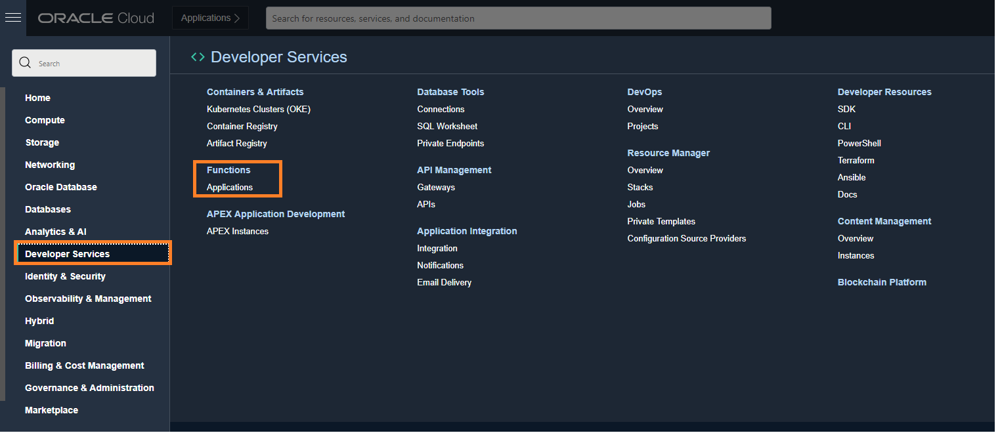

2.	Click **Create Application**
	You can think of an application as a bounded context where several functions can live.
3.	Give it a name (we will refer to this name as <app-name> for the rest of the tutorial), pick the VCN you just created, and the public subnet that was created for that VCN.(from **Lab 1**)
4.	Click **Create**


Set up CLI so that it can deploy functions to the right compartment and container registry are used.
1.	When you are in your Application, select **Getting Started**

   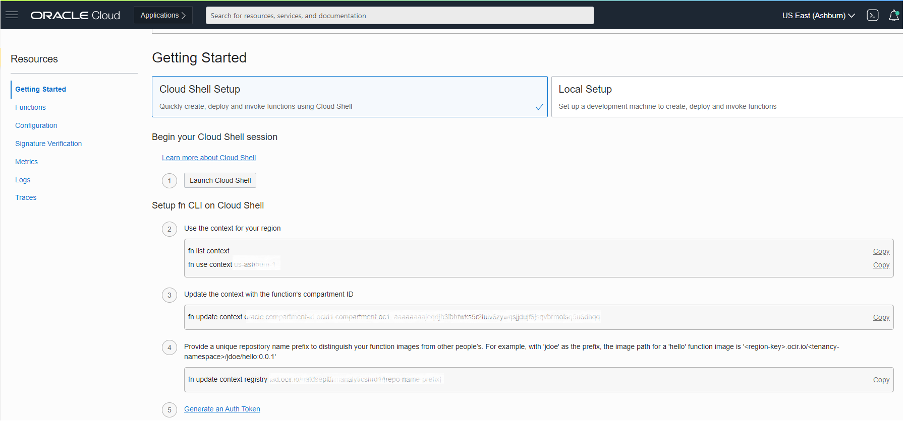

2.	Click **Cloud Shell Setup**
3.	Click the **Launch Cloud Shell** button.
 This will start a Linux virtual machine with all the configurations to set up functions.
4.	Follow steps **1** through **7** under the “Setup fn CLI on Cloud Shell” section
 	* If you need guidance, see this [Video](https://www.youtube.com/watch?app=desktop&t=483&v=TdQ6BL58Zfk&feature=youtu.be)
	* If you need more specific and detailed instructions, see this [Document](https://docs.oracle.com/en-us/iaas/Content/Functions/Tasks/functionscreatefncontext.htm)
	* You can select any term for OCIR-REPO, it is just a prefix that will be used as the name of the container registry to use to deploy the function.
5.	Before proceeding to the next lab test the connection to the docker and log in: steps **8** to **11**

   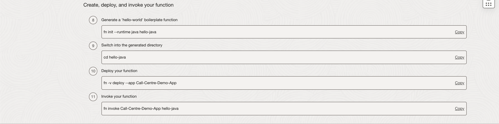

   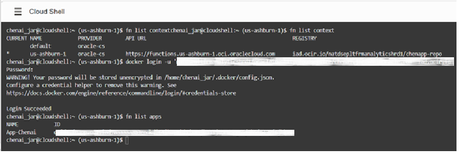

## **Task 2**: Create and Deploy a Sentiment Function

We will now create the function in the application. The function will do sentiment analysis on the input. The input will conform to the format that OCI Data Integration will generate (base 64 encoded Jason lines). The fastest way to set things up is to have the system generate a **python template** for us that then we will modify.

1.	Run the following commands on the cloud shell:

    ```
    <copy>
    cd ..
    </copy>
    ```
    ```
    <copy>
    fn init --runtime python sentiment
    </copy>
    ```
    ```
    <copy>
    cd sentiment
    </copy>
    ```
    ```
    <copy>
    ls
    </copy>
    ```


   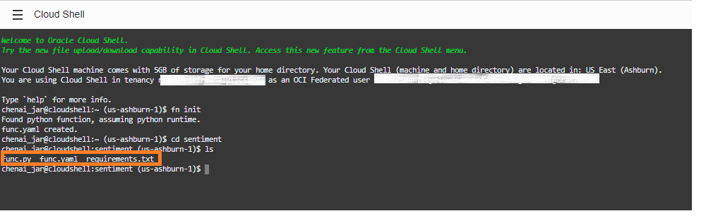

2.	Notice that this will generate three files for you (**func.yaml**, **requirements.txt** and **func.py** ). Modify the files with the content shown below. You can use an editor like **vi** [URL](https://docs.oracle.com/cd/E19683-01/806-7612/6jgfmsvqn/index.html) to do so.

3. 	**func.yaml**
        ```
		<copy>schema_version: 20180708
        name: merge
        version: 0.0.1
        runtime: python
        build_image: fnproject/python:3.9-dev
        run_image: fnproject/python:3.9
        entrypoint: /python/bin/fdk /function/merge_trascriptions.py handler
        memory: 256</copy>
        ```

4. 	**requirements.txt**
        ```
		<copy>fdk
        oci>=2.2.18
        pandas
        datetime/copy>
        ```

5. 	**merge_trascriptions.py**
        ```
		<copy>
        import io
        import os
        import json
        import sys
        import pandas as pd
        import datetime
        from fdk import response
        ​
        import oci.object_storage
        ​
        signer = oci.auth.signers.get_resource_principals_signer()
        client = oci.object_storage.ObjectStorageClient(config={}, signer=signer)
        namespace = client.get_namespace().data
        bucketNameInput = ''
        filenameOutput = ''
        bucketNameOutput = "MergedTranscriptions"
        ​
        def handler(ctx, data: io.BytesIO=None):
            print("Start")
            try:
                body = json.loads(data.getvalue())
                body_data = body['data']
                ad_details = body_data['additionalDetails']
                bucketNameInput = ad_details['bucketName']
                global filenameOutput
                filenameOutput = str(body['eventID'])+"_mixed.wav.json"
            except Exception:
                raise Exception('Input JSON error')
            print("Calling list_objects")
            resp = list_objects(bucketNameInput)
            print("ending list_objects")
        ​
            return response.Response(
                ctx,
                response_data=resp,
                headers={"Content-Type": "application/json"}
            )
        ​
        def list_objects(bucketName):
            print("Searching for objects in bucket " + bucketName, file=sys.stderr)
            object = client.list_objects(namespace, bucketName)
            print("found objects", flush=True)
            objects = [b.name for b in object.data.objects]
            filename1, filename2 = '', ''
            for b in objects:
                if b.endswith('1.wav.json'):
                    filename1 = b
                elif b.endswith('2.wav.json'):
                    filename2 = b
            if filename1=='' or filename2=='':
                raise Exception('Required files not transcribed')
            print("Starting get_objects")
            get_obj_resp = get_object(bucketName, filename1, filename2)
            print("Ending get_objects")
            return get_obj_resp
        ​
        def get_object(bucketName, object1, object2):
            try:
                print("Searching for bucket and object", flush=True)
                object = client.get_object(namespace, bucketName, object1)
                print("found transcription 1", flush=True)
                if object.status == 200:
                    print("Success: The object " + object1 + " was retrieved with the content: " + object.data.text, flush=True)
                    file1 = object.data.text
                else:
                    file1 = "Failed: The object " + object1 + " could not be retrieved."
                
                object = client.get_object(namespace, bucketName, object2)
                print("found transcription 2", flush=True)
                if object.status == 200:
                    print("Success: The object " + object2 + " was retrieved with the content: " + object.data.text, flush=True)
                    file2 = object.data.text
                else:
                    file2 = "Failed: The object " + object2 + " could not be retrieved."
            except Exception as e:
                raise Exception('Error in downloading transcriptions from bucket')
            
            final_result = merge_transcripts(json.loads(file1), json.loads(file2))
            return final_result
        ​
        def merge_transcripts(data_speaker_1, data_speaker_2):
            ## merging tokens
            token,sT,eT,conf,ty,channel, channelOffset,channelOffsetMixed =[],[],[],[],[],[],[],[]
            transcript_file1, transcript_file2 = [],[]
            merge_tokens_list(data_speaker_1,token,sT,eT,conf,ty,channel,1,channelOffset,transcript_file1)
            merge_tokens_list(data_speaker_2,token,sT,eT,conf,ty,channel,2,channelOffset,transcript_file2)
        ​
            ## sorting the tokens based on startTime 
            df = pd.DataFrame([token,sT,eT,conf,ty,channel,channelOffset,channelOffsetMixed]).T
            df.columns=['token','startTime','endTime','confidence','type','channel','channelOffset','channelOffsetMixed']
            df['startTime'] = df['startTime'].astype(float)
            df['endTime'] = df['endTime'].astype(float)
            df['channel'] = df['channel'].astype(int)
            df_final = df.sort_values(by=['startTime','endTime'])
            df_final['channelOffsetMixed'] = df.index 
        ​
            ## generating cumulative transcript from merged tokens
            transcription = ''
            for row in df_final['token']:
                if (row != '.') and (row!=',') and (row !='?') :
                    transcription = transcription + ' ' +row 
                else:
                    transcription = transcription + row 
            transcription.strip()
        ​
            token_collection = df_final.to_json(orient='records')
            token_collection = json.loads(token_collection)
            for row in token_collection:
                if row['channel'] == 1:
                    row['characterOffsetChannel1'] = row['channelOffset']
                elif row['channel'] == 2:
                    row['characterOffsetChannel2'] = row['channelOffset']
                del row['channelOffset']
        ​
            ## forming result dict
            try: 
                result, model_details, audio_format,transcriptions = {},{},{},[{}]
                result["status"] = "SUCCESS"
                result["timeCreated"] = datetime.datetime.now().strftime("%Y-%m-%d %H:%M:%S.%f")[:-3]
        ​
                model_details = data_speaker_1["modelDetails"]
                result["modelDetails"] = model_details
        ​
                audio_format = data_speaker_1["audioFormatDetails"]
                result["audioFormatDetails"] = audio_format
        ​
                transcriptions[0]["transcription"] = transcription
                transcriptions[0]["tokens"] = token_collection
                transcriptions[0]["confidence"] = 0.0
                transcriptions[0]["transcriptionChannel1"] = transcript_file1[0]
                transcriptions[0]["transcriptionChannel2"] = transcript_file2[0]
                result["transcriptions"]=transcriptions
            except Exception:
                result = "Error Processing transcriptions"
        ​
            output = put_object(bucketNameOutput, filenameOutput, json.dumps(result))
            return output
        ​
        def merge_tokens_list(data,token,sT,eT,conf,ty,channel,channelID,channelOffset,transcript_data):
            for row in data["transcriptions"]:
                cID1 = 0
                cID2 = 0
                transcript_data.append(row.get("transcription"))
        ​
                for component in row["tokens"]:
                    token.append(component.get('token'))
                    sT.append(component.get('startTime')[0:-1])
                    eT.append(component.get('endTime')[0:-1])
                    conf.append(component.get('confidence'))
                    ty.append(component.get('type'))
                    channel.append(channelID)
                    if channelID == 1:
                        channelOffset.append(cID1)
                        cID1 = cID1+1
                    elif channelID == 2:
                        channelOffset.append(cID2)
                        cID2 = cID2+1
        ​
        def put_object(bucketName, objectName, content):
            output=''
            try:
                object = client.put_object(namespace, bucketName, objectName, content)
                output = "Success: Put object '" + objectName + "' in bucket '" + bucketName + "'"
            except Exception as e:
                output = "Failed: " + str(e.message)
            return output
        </copy>
        ```

6. Verify your 3 files look exactly as above with no spaces, additional code, etc.

7. Once you have edited the files in **Task 3**, deploy the function to your application, by running this cloud shell command. Make sure to replace **app-name** for the name of your application

  	<copy>fn -v deploy -app app-name</copy>

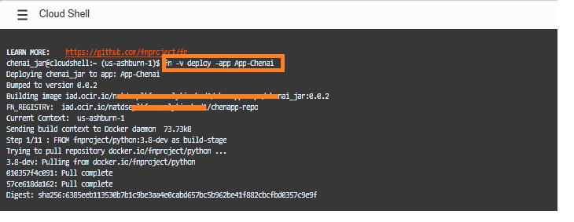

8. If successful you can see it listed under Functions in your Application

  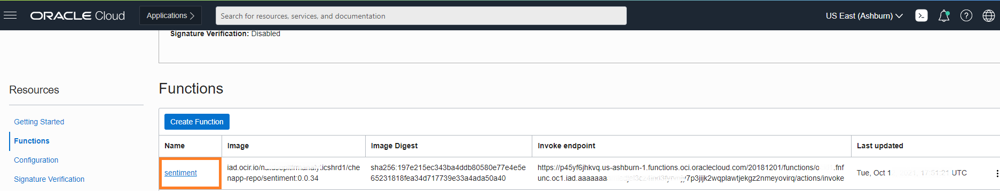


## **Task 3**: Setup and Integrate Notification with the Integration Service

1. Click on the hamburger menu, then click on **Developer Services**, under **Application Integration** Click on **Notification**.
    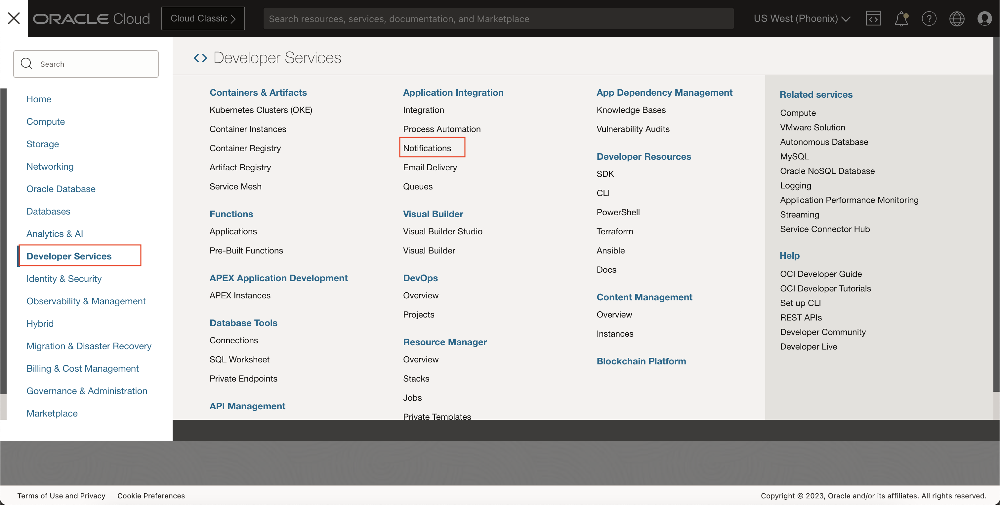

2. Select the compartment you are working on and then click **Create Topic**
    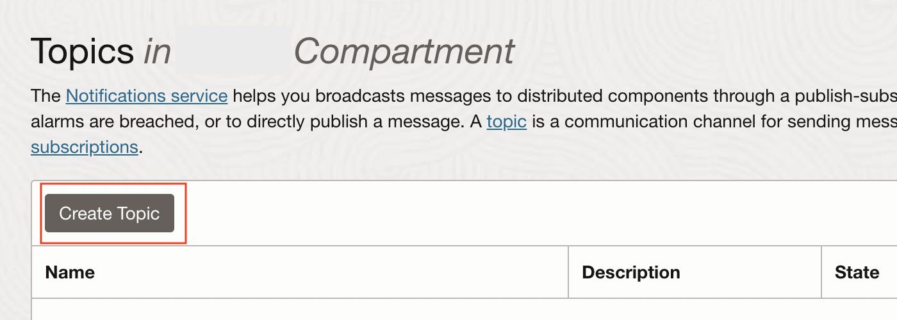

3. Fill the Name field with "NewAudioFileForTranscription" and click create.
    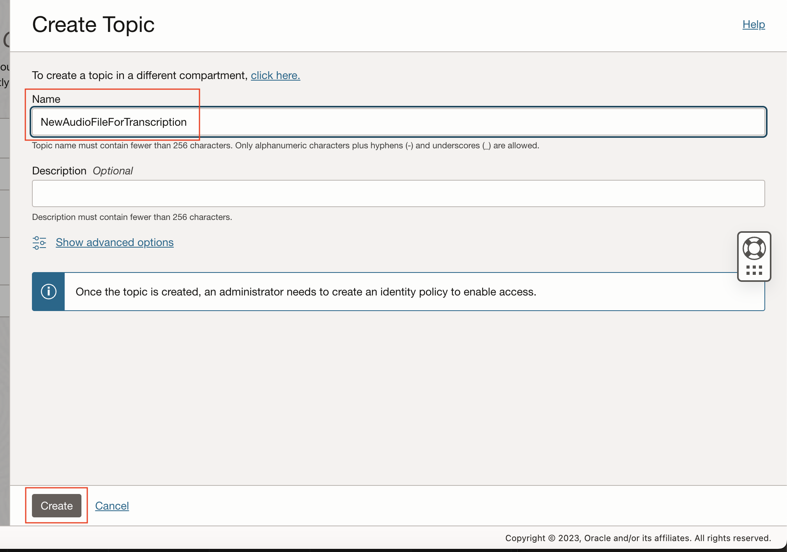

4. After the Topic is created, open the Topic details page, and click Create Subscription.

5. Under the Protocol choose "HTTPS (Custom URL)" from the dropdown. Fill the URL field with

        <copy>
        https:<userName>:<Password>@<Integration-URL>/ic/api/integration/v1/flows/rest/TRANSCRIBE_AUDIO_FILES/1.0/NewAudioFileForTranscription
        </copy>

    where the "userName" and "Password" are the login username and password in encoded text format(
    
    Example: user@gmail.com should be given as user%40gmail.com in the userName. 
    
    The "Integration-URL" is the URL of the integration that we have created in the Lab 3.

6. Click create button.
    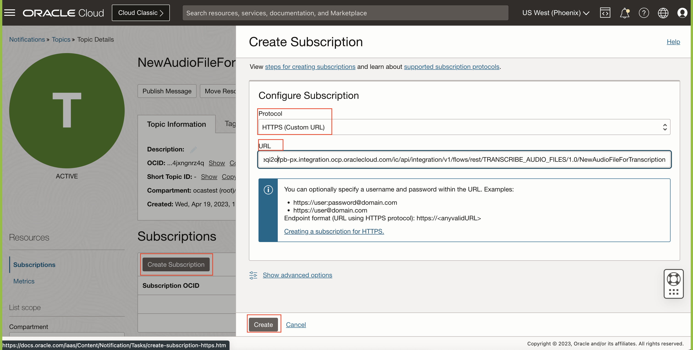

7. After the subscrption is created, it will be in pending state. To make it active first click on the three dots to the right and click "resend confirmation".
    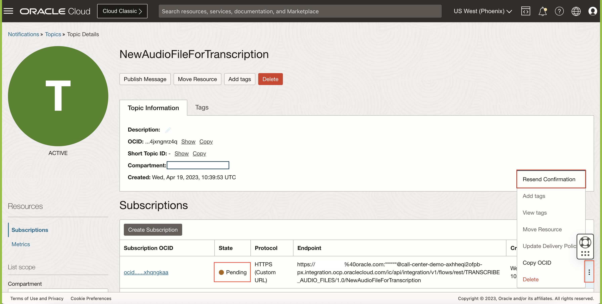

8. To activate the subscription, open the integrations URL. open hamburger menu, click on **Monitoring** then **Integrations** and then **Errors**.
    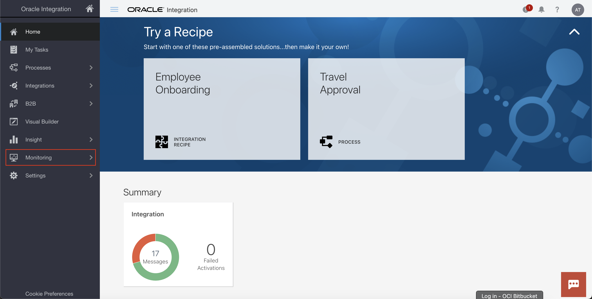
    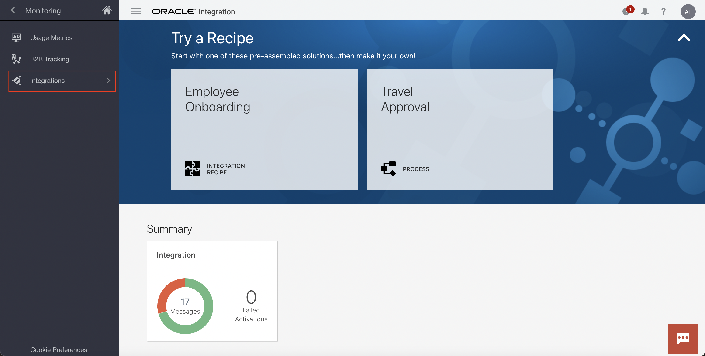

9. In the Errors page click on view details for the latest error.
    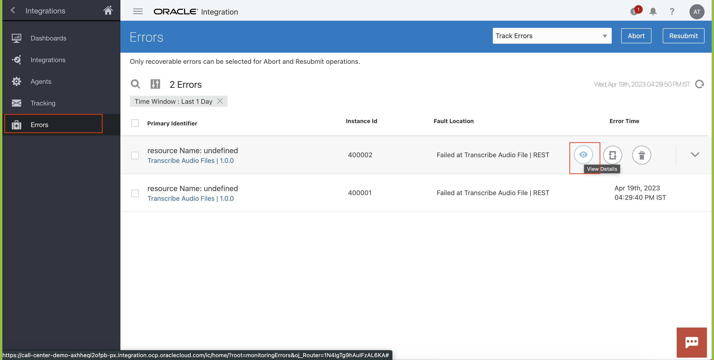

10. Now in the error click on Message URL link and store the confirmationURL that is shown.
    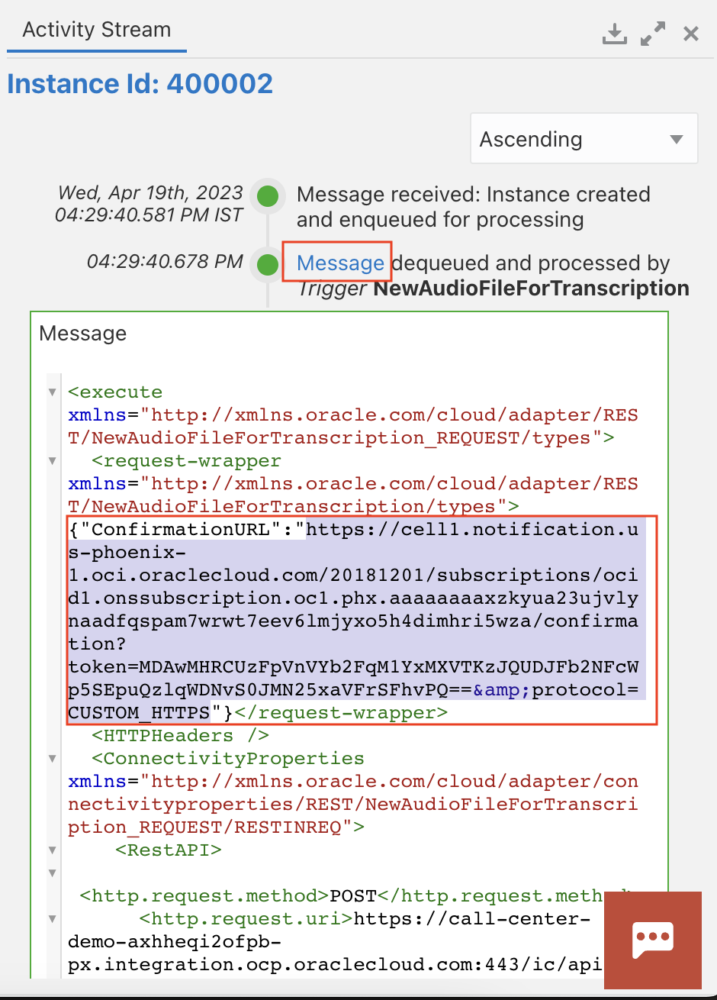

11. Modify the confirmation URL to remove "amp;" from the URL. For example modify
        
        <copy>
        https://cell1.notification.us-phoenix-1.oci.oraclecloud.com/20181201/subscriptions/ocid1.onssubscription.oc1.phx.aaaaaaaaxzkyua23ujvlynaadfqspam7wrwt7eev6lmjyxo5h4dimhri5wza/confirmation?token=MDAwMHRCUzFpVnVYb2FqM1YxMXVTKzJQUDJFb2NFcWp5SEpuQzlqWDNvS0JMN25xaVFrSFhvPQ==&amp;protocol=CUSTOM_HTTPS
        </copy>

    to 

        <copy>
        https://cell1.notification.us-phoenix-1.oci.oraclecloud.com/20181201/subscriptions/ocid1.onssubscription.oc1.phx.aaaaaaaaxzkyua23ujvlynaadfqspam7wrwt7eev6lmjyxo5h4dimhri5wza/confirmation?token=MDAwMHRCUzFpVnVYb2FqM1YxMXVTKzJQUDJFb2NFcWp5SEpuQzlqWDNvS0JMN25xaVFrSFhvPQ==&protocol=CUSTOM_HTTPS
        </copy>

12. Open the modified URL in the browser. You should see a page stating that you have been subscribed to the topic "NewAudioFileForTranscription".
    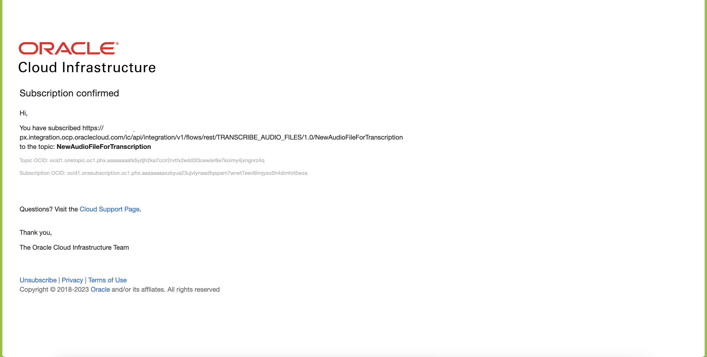

13. Create a new topic with Name "NewTranscriptionForAnalysis" following steps 2 and 3.

14. Repeat the steps 4 to 12 to create a subscription for the new topic "NewTranscriptionForAnalysis".


## **Task 4**: Event Setup for New Audio File for Transcription##

1. Open hanburger menu, click on **Observability & Management**, under **Events Service** Click on **Rules**.
    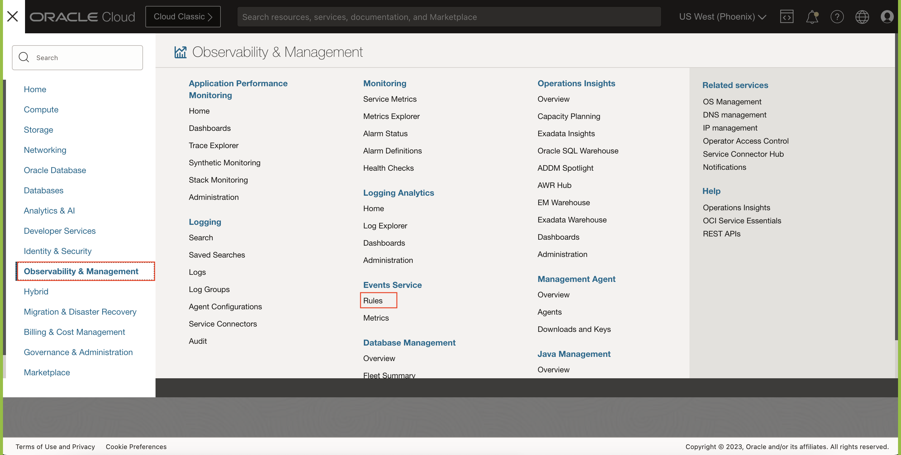

2. Select the compartment you are working on and then click **Create Rule**
    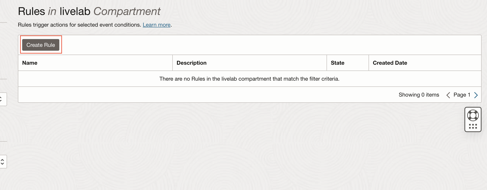

3. Fill Display Name with "NewAudioFileForTranscription"

4. Under Rule Conditions, Choose Condition as **Event Type**, Service Name as **Object Storage** and Event Type as **Object - Create**.

5. Click on **Another Condition**, Choose Condition as **Attribute**, Service Name as **bucketName** and fill Event Type with **FilesForTranscription** which is a bucket we created while preparing data sources in Lab 2.

6. Under Actions, Choose Action Type as **Notifications**, Notifications Compartment as *your-working-compartment* and Topic as **NewAudioFileForTranscription**.

7. Click Create Rule.
    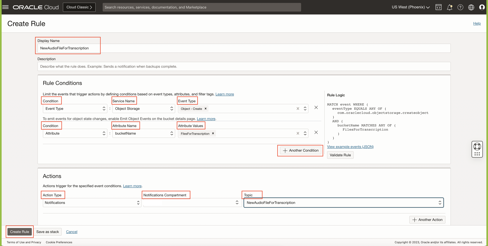

## **Task 5**: Event Setup for New Transcription for Merge Transcription##

1. Navigate back to the Rules listing page.

2. Click on **Create Rule**
    

3. Fill Display Name with "NewTranscriptionForMerge"

4. Under Rule Conditions, Choose Condition as **Event Type**, Service Name as **Object Storage** and Event Type as **Object - Create**.

5. Click on **Another Condition**, Choose Condition as **Attribute**, Service Name as **bucketName** and fill Event Type with **TranscribedFiles** which is a bucket we created while preparing data sources in Lab 2.

6. Under Actions, Choose Action Type as **Functions**, Function Compartment as *your-working-compartment*, Function Application as *Your-Appliction-Name* and Function as **merge-transcripts**.

7. Click Create Rule.
    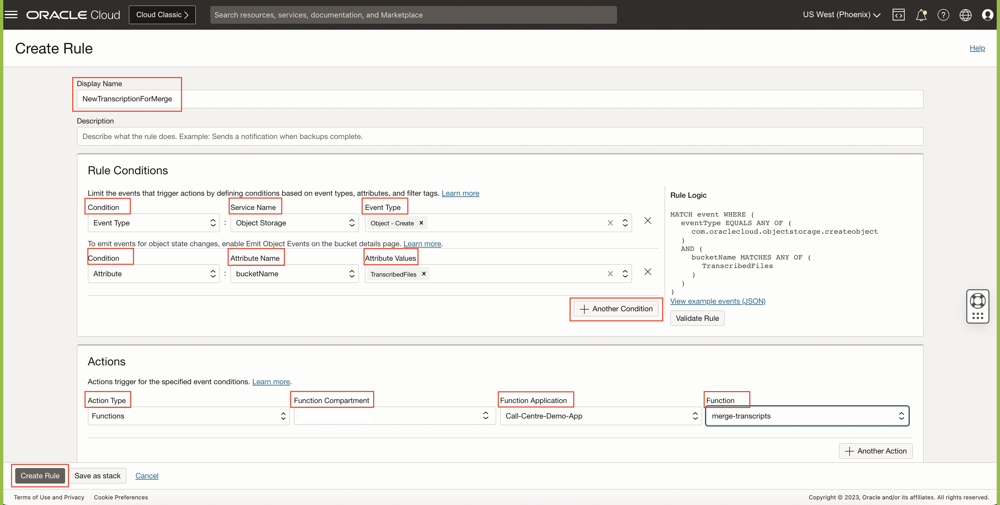

## **Task 6**: Event Setup for New Transcription for Analysis##

1. Navigate back to the Rules listing page.

2. Click on **Create Rule**
    

3. Fill Display Name with "NewTranscriptionForAnalysis"

4. Under Rule Conditions, Choose Condition as **Event Type**, Service Name as **Object Storage** and Event Type as **Object - Create**.

5. Click on **Another Condition**, Choose Condition as **Attribute**, Service Name as **bucketName** and fill Event Type with **MergedTranscriptions** which is a bucket we created while preparing data sources in Lab 2.

6. Under Actions, Choose Action Type as **Notifications**, Notifications Compartment as *your-working-compartment* and Topic as **NewTranscriptionForAnalvsis**.

7. Click Create Rule.
    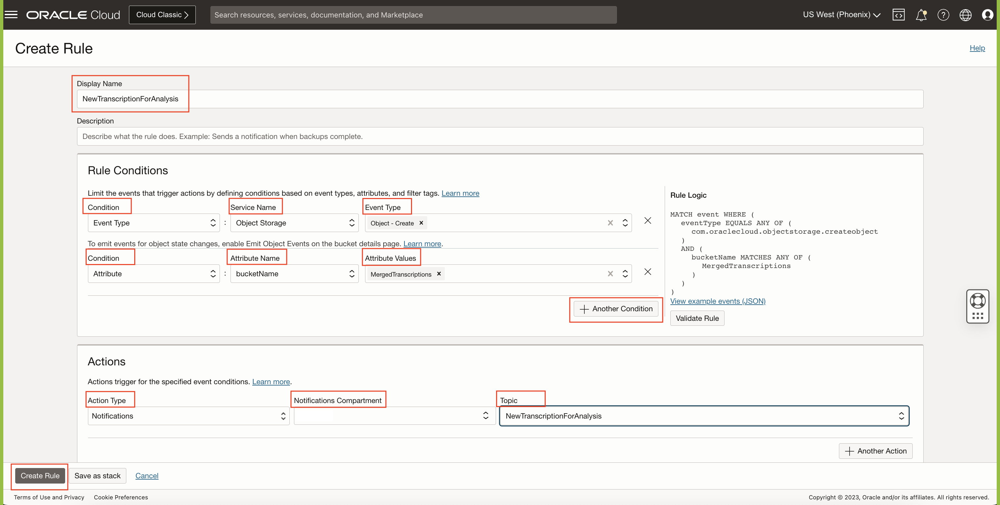

## Acknowledgements

**Authors**
  * Rajat Chawla  - Oracle AI OCI Language Services
  * Sahil Kalra - Oracle AI OCI Language Services
  * Ankit Tyagi -  Oracle AI OCI Language Services
  * Veluvarthi Narasimha Reddy - racle AI OCI Language Services

**Last Updated By/Date**
* Veluvarthi Narasimha Reddy  - Oracle AI OCI Language Services, April 2023
