# Configurations to trigger pipeline

## Introduction

Estimated Time 15 minutes.

### Objectives
* Run the Integration pipeline we created in previous lans
* Analyse data

### Prerequisites
* All previous labs

## **Task 1**: Upload files
Our environment is all setup. It is now time to trigger our process into action by dropping three audio files in the Storage Bucket provisioned by the Terraform script
1. In the Oracle Home Page, Open the hamburger menu, Click **Storage** under **Object Storage & Archive Storage** click **Buckets**
    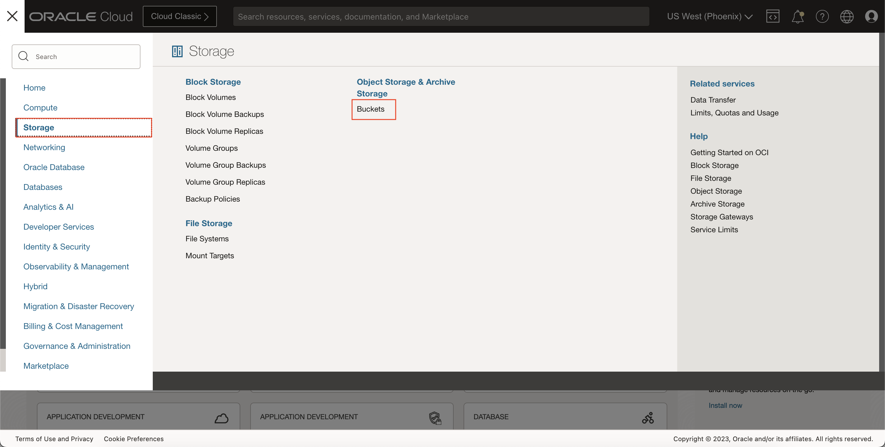
2. Make sure that the right Compartment is selected on the left and click the **FilesForTranscription** bucket name.

    *Note:* The bucketname might be different based on what name you haave given while following the Lab 2.

3. In the Bucket details page, click **Upload** button under the objects section

4. In the upload objects dialog, click the **select files** link under the **Choose Files from your Computer** section and select the three audio files that you need for transcription.
    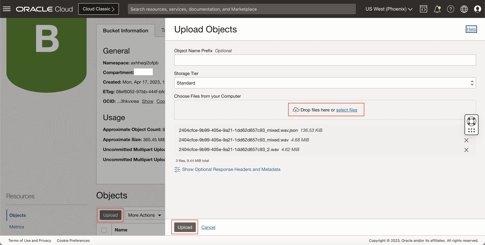

5. Once the file is uploaded, an event will be fired by the Storage Bucket which will be routed through the Notifications service to our integration along with the information about our newly created file.

## **Task 2**: Check All Jobs Completed in Speech

1. In the Oracle Home Page, Open the hamburger menu, Navigate to **Analytics and AI** menu and click it, and then select **Speech** item under **AI services**.
    

2. This will navigate you to the transcription jobs overview page. On the left you can toggle between overview and transcription jobs listing page. Click Jobs.
    

3. On the jobs listing page you can see two new jobs being created with same names as the files you uploaded to **FilesForTranscription** bucket in the Task 1.
    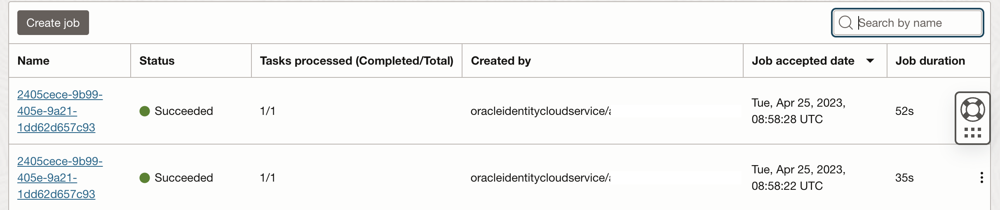

## **Task 3**: Tracking of Triggered Integrations

1. In the Oracle Cloud Infrastructure Console navigation menu, go to **Developer Servicese**, and then select **Integration** under **Application Integration**.

   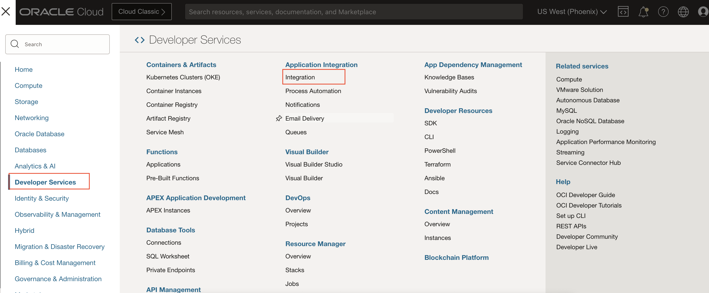

2. In the Integrations page, make sure that right comaprtment is selected. Open the integration details page by clicking on it.

3. Click the service console button to open the OIC console page
    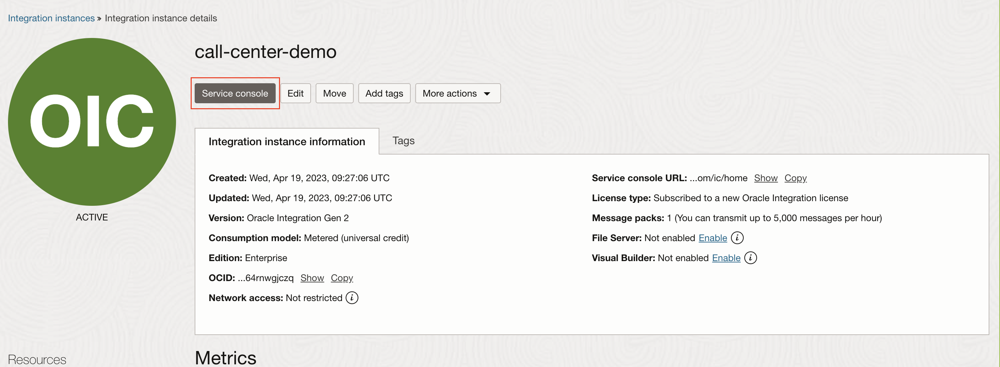

4. In the OIC homepage, click the **Hamburger Menu**, the click **Monitoring**, click **Integrations**, and finally, **Tracking**.

5. You should be able to see three instances in the list saying **resource Name: your-filename.wav** with an **In Progress** state. This is our integration hard at work, processing our data. If you do not yet see this line, you can click the "Refresh" button on the top right of the screen. It may take several seconds for the integration to kick-in.

6. After the three integrations have **Succeeded**, This will trigger a new instance for **Process Transcription** integration. Wait for this instance to also move from **In Progress** state to **Succeeded**.
    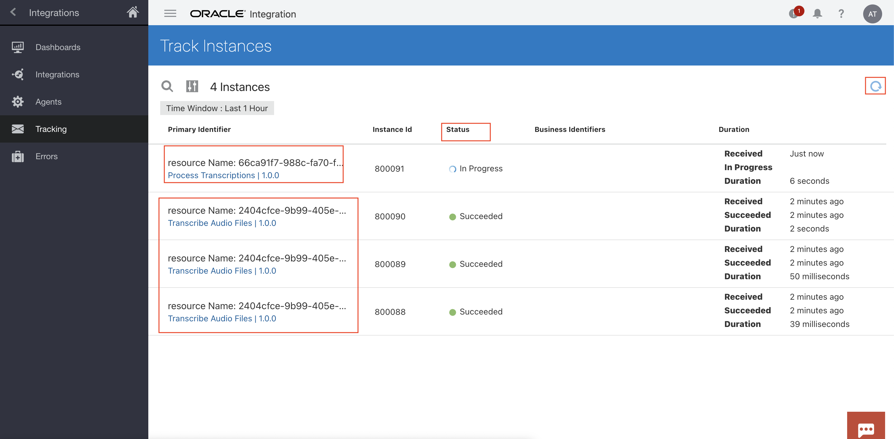

7. Once all the instances are successful, We can now view our data in Autonomous Database Warehouse.

## **Task 4**: Check Data in ADW

1. In the Oracle Cloud Infrastructure Console navigation menu, go to **Oracle Database**, and then select **Autonomous Data Warehouse**.

   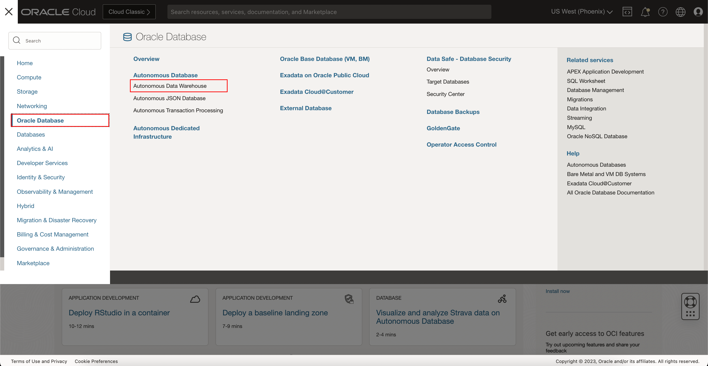

2. Select your compartment and click the Autonomous Database from the list to open the details page.

3. On your database details page, click **Database Actions**. This will open Analytics page in a new tab/window

   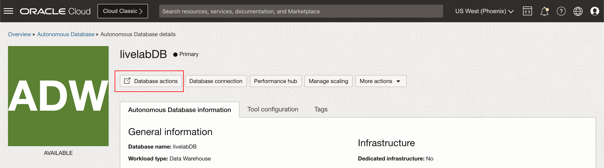

4. In the Analytics homepage, Under **Development** click **SQL**.

   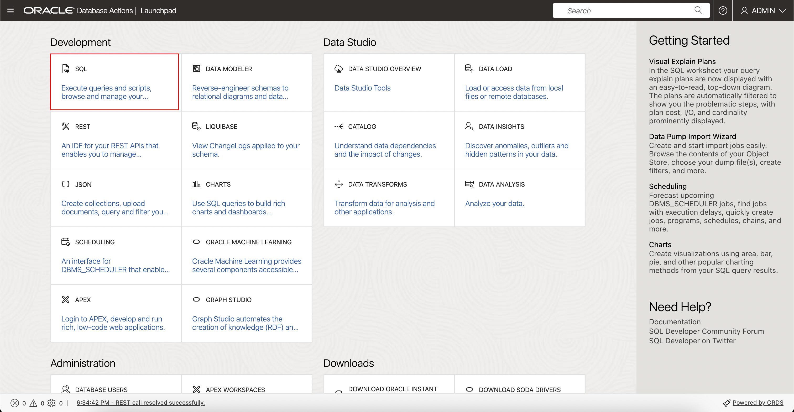

5. In the **SQL** page, select the **LIVELABUSER** user from the first list (instead of the ADMIN user selected by default).
You will get a list of our five tables provisioned by the Terraform script. 
    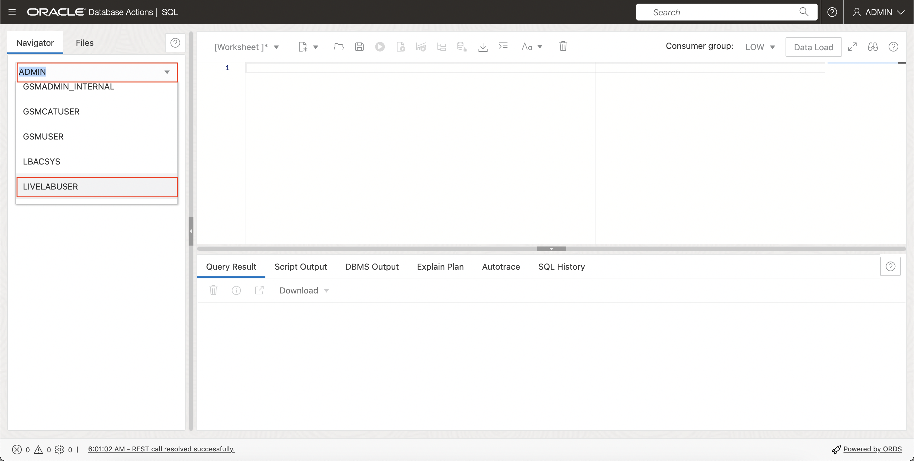

6. You can right-click any of the tables, select **Open** and then select the **Data** tab to get a glimpse into the data in the table. You should see at least several rows of data. 
    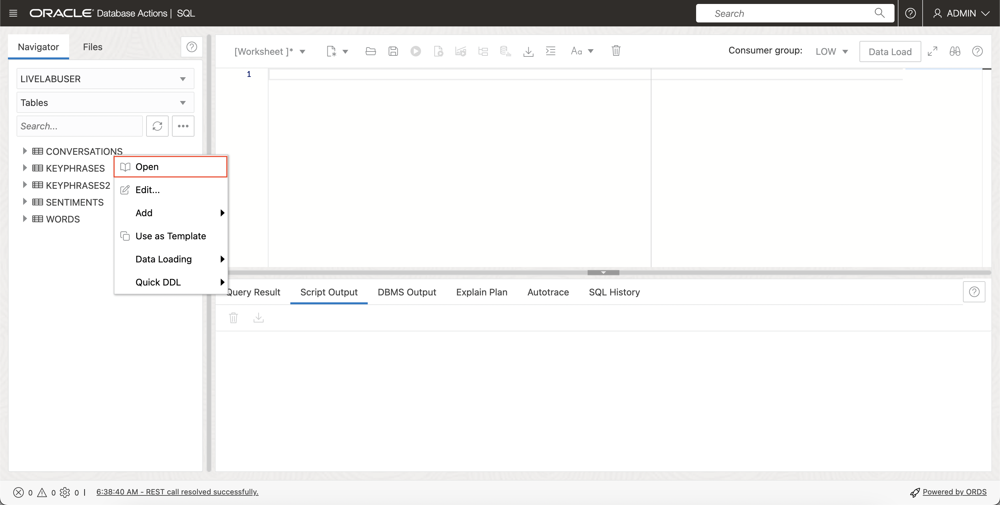
    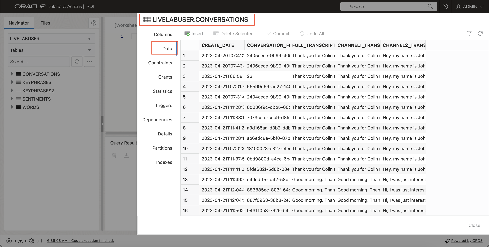

## **Task 5**: Analyse data in OAC

1. From the **Home Console Page** and navigate to **Analytics & AI** section and then **Analytics Cloud**.

    

2. In the Analytics Instance listing page choose the right compartment, Open the Cloud Analytics URL associated with your instance by using the three dots menu button on the right-hand side of your instance information and select **Analytics Home Page**.
    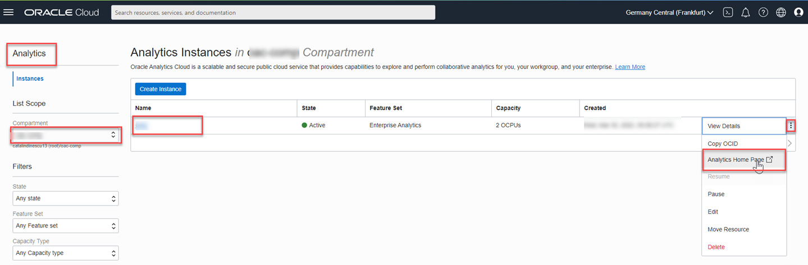  
    The **Oracle Analytics** page will open in a new browser window/tab.

3. In the **Analytics** homepage click on the workbook file under **Workbooks**
    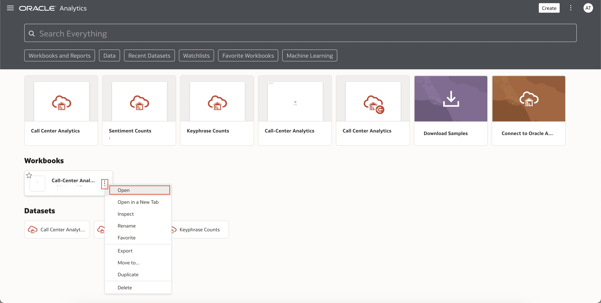

4. This will open up a new page with all the data visualized.
    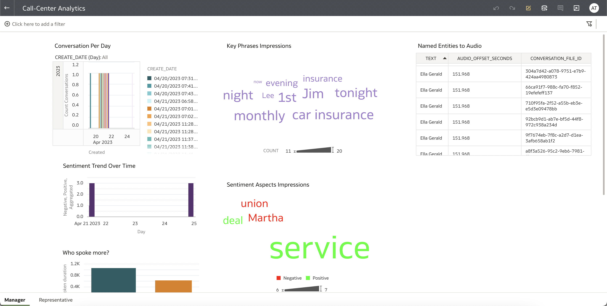

## Acknowledgements
**Authors**
  * Rajat Chawla  - Oracle AI OCI Language Services
  * Sahil Kalra - Oracle AI OCI Language Services
  * Ankit Tyagi -  Oracle AI OCI Language Services
  * Veluvarthi Narasimha Reddy - Oracle AI OCI Language Services

**Last Updated By/Date**
* Veluvarthi Narasimha Reddy  - Oracle AI OCI Language Services, April 2023