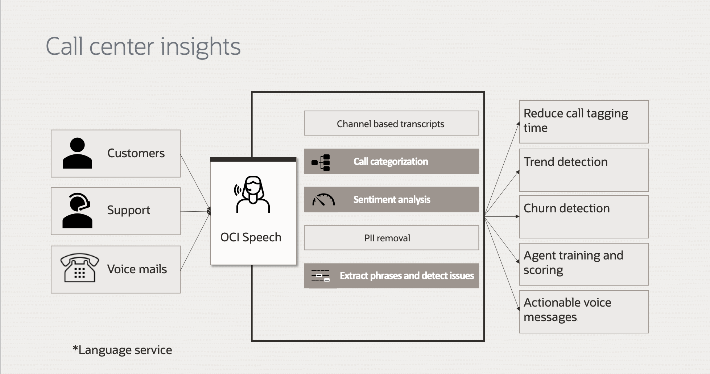

# Introduction

Our mission is to provide tools and resources that facilitate a deeper understanding of complex data sets, ultimately leading to informed decision-making and improved outcomes. Whether you're a data analyst or simply seeking to make more informed choices, our commitment to delivering innovative solutions and fostering a data-driven culture will help you harness the power of data to achieve your goals.

This live lab showcases a straightforward process for extracting valuable insights from call center audio, even without prior machine-learning expertise. The demo employs OCI Speech, OCI Language, Object Storage, ADW and OAC, providing a seamless means of analyzing sentiment, identifying key phrases, extracting named entities and finding personal information, all of which contribute to a better understanding of common themes and patterns.

Leveraging OCI Services for Advanced Call Center Analytics

### **OCI Speech Service**

OCI Speech enables developers to extract text from audio using production ready pre-trained ASR (Automatic Speech Recognition) models. OCI’s Speech service provides automated, accurate transcription at scale, without requiring any machine learning expertise.

### **OCI language Service**

OCI Language Service provides suite of services to distill a deeper understanding of opinions with sentiment analysis, identify key phrases and extract named entities such as people, places and organizations to understand common subjects and patterns. You can use out of the box pre-trained models and also customize the models to suite a specific domain.

### **Oracle Analytics Cloud(OAC)**

Oracle Analytics Cloud (OAC) is a scalable and secure public cloud service that provides a full set of capabilities to explore and perform collaborative analytics for you, your workgroup, and your enterprise. With Oracle Analytics Cloud, you also get flexible service management capabilities, including fast setup, easy scaling and patching, and automated lifecycle management.

### **Oracle Autonomous Data Warehouse (ADW)**

Oracle Autonomous Data Warehouse (ADW) delivers a self-driving, self-securing, self-repairing database service that can instantly scale to meet demands. It provides an autonomous warehousing environment, associated with fast query performance

### **Object Storage**

Oracle Cloud Infrastructure Object Storage service is an Internet-scale, high-performance storage platform that offers reliable and cost-efficient data durability. The Object Storage service can store an unlimited amount of unstructured data of any content type, including analytic data and rich content, like images and videos. With Object Storage, you can safely and securely store or retrieve data directly from the Internet or from within the cloud platform. Object Storage offers multiple management interfaces that let you easily manage storage at scale.

### **Oracle Infrastructure cloud**

OCI integration and digital assistant services accelerate process innovation by simplifying conversations between people and systems with prebuilt integrations, skills, adapters, and low-code automation.

### **OCI Functions**

Oracle Cloud Infrastructure Functions is a fully managed, multi-tenant, highly scalable, on-demand, Functions-as-a-Service platform. It is built on enterprise-grade Oracle Cloud Infrastructure and powered by the Fn Project open source engine.

&nbsp;
&nbsp;

*Estimated Lab Time*: 2 hour

### Objectives:

* Understand overview of the OCI Language, OCI Speech, OCI Object Storage, Oracle Integration cloud(OIC), Functions and Oracle Analytics Cloud(OAC)
* Learn how to setup data sources(Obejct Stoarge Creation and Autonomous Data Warehouse database)
* Learn how to create speech pipeline in Oracle Integration cloud(OIC)
* Learn how to create language pipeline in Oracle Integration cloud(OIC)
* Learn how to setup OAC instance
* Learn how to extract and visualize all the information from the audio using all the above services in OAC.

### Prerequisites:

* An Oracle Free Tier, or Paid Cloud Account
* Additional prerequisites (cloud services) are mentioned per lab
* Familiar with OCI Policy and SDK/CLI setup.
* Familiar with OCI services are recommended, but not required.
* Familiar with editing tools (vim, nano) or shell environments (cmd, bash, etc) (Optional for API integration)

[Proceed to the next section](#next)

## Acknowledgements

**Authors**
  * Rajat Chawla  - Oracle AI OCI Language Services
  * Sahil Kalra - Oracle AI OCI Language Services
  * Ankit Tyagi -  Oracle AI OCI Language Services

**Last Updated By/Date**
* Rajat Chawla  - Oracle AI OCI Language Services, April 2023
