# Sample Python Application to convert CSV into Parquet

## Clean and Convert Data with Data Flow    
This tutorial introduces you to build a sample python spark application to convert a CSV file into Parquet File locally. Once build, you will learn how to run the application on Oracle Cloud Infrastructure Data Flow, a fully managed service that lets you run any Apache Spark Application  at any scale with no infrastructure to deploy or manage. This tutorial requires basic knowledge of python spark. All the data used in the tutorial have been provided for you.

Estimated Time: 40 minutes

### Objectives

In Spark, your first step is usually to clean the data. Data Cleaning means the process of identifying incorrect, incomplete, inaccurate, irrelevant, or missing pieces of data and then modifying, replacing or deleting them as needed. Data Cleansing is considered the basic element of Data Science. Upon cleaning the data, you will convert data from a text format into a Parquet format. Parquet is an optimized binary format supporting efficient reads, making it ideal for reporting and analytics. In this lab, you take source data, convert it into Parquet, and then do a few interesting things with it. Your dataset is the [Nexflix Movies Data dataset](https://www.kaggle.com/shivamb/netflix-shows/downloada), downloaded from the Kaggle website under the terms of the Creative Commons CC0 1.0 Universal (CC0 1.0) "Public Domain Dedication" license.

The data is provided in CSV format and your objective is to convert this data to Parquet and store it in object store for downstream processing.Once the application is done, your next objective is to create a Data Flow Application which runs this Spark app, and execute it with the correct parameters. This lab guides you step by step, and provides the parameters you need. The python application is uploaded to the object store [here] (https://objectstorage.us-ashburn-1.oraclecloud.com/n/bigdatadatasciencelarge/b/dataflow-code/o/data-cleansing%2Fdatacleaning.py)


### Prerequisites

* Python 3.6+ setup locally.

* An Oracle Cloud log in with the API Key capability enabled. Load your user under Identity/Users, and confirm you can create API Keys.


* An API key registered and deployed to your local environment. See [Register an API Key](https://docs.oracle.com/iaas/Content/API/Concepts/apisigningkey.htm) for more information

* OCI Python SDK. See [Installing OCI python SDK](https://oracle-cloud-infrastructure-python-sdk.readthedocs.io/en/latest/installation.html#downloading-and-installing-the-sdk)

* A python IDE of your choice. The workshop uses [Visual Studio Code (VSCode)](https://code.visualstudio.com/download)

* Local environment setup with all the dependencies setup as described [Here](https://docs.oracle.com/en-us/iaas/data-flow/data-flow-tutorial/develop-apps-locally/front.htm#develop-locally-concepts)
 
* From the Console, click the hamburger menu to display the list of available services. Select Data Flow and click `Applications`

* Basic understanding of Python and PySpark


## Task 1: Create sample python application

1. Begin by importing the python modules
    
    ```
     <copy>
           import os
        import sys
        from pyspark import SparkConf
        from pyspark.sql import SparkSession, SQLContext  
        import pyspark.sql.functions as F
        from pyspark.sql.functions import isnan, when, count, col
        from functools import reduce
     </copy> 
    ```

2. In the main function we start with the program logic. The main function is a starting point of any python program. When the program is run, the python interpreter runs the code sequentially. As input we pass the the location of the object storage location that has the  netflix csv file.

     ```
     <copy>
         if __name__ == "__main__":
         main()
     </copy> 
    ```

    ```
     <copy>

     def main():
      # The first argument will be the input path.
      INPUT_PATH = sys.argv[1]
      pre, ext = os.path.splitext(INPUT_PATH)
      OUTPUT_PATH = pre + ".parquet"
      # Set up Spark.
      spark_session = get_dataflow_spark_session()
      sql_context = SQLContext(spark_session)
     </copy> 
    ```

3. Next, create a spark session and in the session config, add the OCI configuration. We pass the following configuration

     1. OCID of the user calling the API. To get the value, see [Required Keys and OCIDs](https://docs.oracle.com/en-us/iaas/Content/API/Concepts/apisigningkey.htm#Required_Keys_and_OCIDs).  
   
     2. Fingerprint for the public key that was added to this user. To get the value, see[Required Keys and OCIDs](https://docs.oracle.com/en-us/iaas/Content/API/Concepts/apisigningkey.htm#Required_Keys_and_OCIDs)  
    
     3. Full path and filename of the private key. The key pair must be in the PEM format. For instructions on generating a key pair in PEM forat, see [Required Keys and OCIDs](https://docs.oracle.com/en-us/iaas/Content/API/Concepts/apisigningkey.htm#Required_Keys_and_OCIDs)

     4. Passphrase used for the key, if it is encrypted. 

     5. OCID of your tenancy. To get the value, see [Required Keys and OCIDs](https://docs.oracle.com/en-us/iaas/Content/API/Concepts/apisigningkey.htm#Required_Keys_and_OCIDs)

     6. An Oracle Cloud Infrastructure region. see [Regions and Availability Domains](https://docs.oracle.com/en-us/iaas/Content/General/Concepts/regions.htm#top)


    ```
    <copy>
    def get_dataflow_spark_session(
    app_name="DataFlow", file_location=None, profile_name=None, spark_config={}
    ):
    """
    Get a Spark session in a way that supports running locally or in Data Flow.
    """
    if in_dataflow():
        spark_builder = SparkSession.builder.appName(app_name)
    else:
        # Import OCI.
        try:
            import oci
        except:
            raise Exception(
                "You need to install the OCI python library to test locally"
            )

        # Use defaults for anything unset.
        if file_location is None:
            file_location = oci.config.DEFAULT_LOCATION
        if profile_name is None:
            profile_name = oci.config.DEFAULT_PROFILE

        # Load the config file.
        try:
            oci_config = oci.config.from_file(
                file_location=file_location, profile_name=profile_name
            )
        except Exception as e:
            print("You need to set up your OCI config properly to run locally")
            raise e
        conf = SparkConf()
        conf.set("fs.oci.client.auth.tenantId", oci_config["tenancy"])
        conf.set("fs.oci.client.auth.userId", oci_config["user"])
        conf.set("fs.oci.client.auth.fingerprint", oci_config["fingerprint"])
        conf.set("fs.oci.client.auth.pemfilepath", oci_config["key_file"])
        conf.set(
            "fs.oci.client.hostname",
            "https://objectstorage.{0}.oraclecloud.com".format(oci_config["region"]),
        )
        spark_builder = SparkSession.builder.appName(app_name).config(conf=conf)

    # Add in extra configuration.
    for key, val in spark_config.items():
        spark_builder.config(key, val)

    # Create the Spark session.
    session = spark_builder.getOrCreate()
    return session
    </copy>
    ```


 > **Note:** This step requires OCI python library.

 4. Load the csv file into the input dataframe
     ```
    <copy>
    # Load our data.
    input_dataframe = (
        sql_context.read.option("header", "true")
        .option("multiLine", "true")
        .csv(INPUT_PATH)
    )
    </copy>
    ```

 5. Next, clean the data. First, count how many null values present in each column.  There are a few columns that contain null values, “director,” “cast,” “country,” “date_added,” “rating.”

    ```
    <copy>

    print("\nCount of the missing values in each column:")
    result = input_dataframe.select(
        [count(when(col(c).isNull(), c)).alias(c) for c in input_dataframe.columns]
    )
    print(result.show())
    </copy>
    ```

 6. Next, impute the missing data. Imputation is a treatment method for missing value by filling it in using certain techniques. Can use mean, mode, or use predictive modeling.
    In this lab, we  use of the `fillna` function from spark dataframe for this imputation. We also Drop rows containing missing values and for that we the `dropna` function.
    After that we verify if there are any more null values in the dataframe.

     ```
     <copy>
     #impute the data
    input_dataframe = input_dataframe.fillna(
        {"director": "No Director", "cast": "No Cast", "country": "Country Unavailable"}
    )
    input_dataframe = input_dataframe.dropna(subset=["date_added", "rating"])

    # Check if missing values are present after cleanup
    print("\nCheck if missing values are present after cleanup....")

    result = input_dataframe.select(
        [count(when(col(c).isNull(), c)).alias(c) for c in input_dataframe.columns]
    )
    print(result.show())
    </copy>
    ```

 7. Finally, we save the output to the parquet file at the same location where the input CSV was stored.
    
     ```
     <copy>
     # Save the results as Parquet.
    input_dataframe.write.mode("overwrite").parquet(OUTPUT_PATH)
    print("\nDone writing Parquet at location" + OUTPUT_PATH)
     </copy>
    ```

## Task 2: Upload application and data to the Object store

> **Note:** If you not familar on how to upload the content to object, it is recommended that you refer to this [lab](https://apexapps.oracle.com/pls/apex/dbpm/r/livelabs/view-workshop?wid=655) to learn more.


 1. From the Console navigate to the object storage
   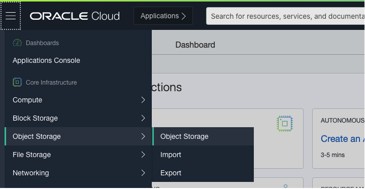

 2. For this workshop, we are reusing existing buckets `dataflow-code` and `dataflow-sample-data`  in compartment  `dataflow-tutorial`. Users can either use their buckets and upload the files as described [here](https://docs.oracle.com/en-us/iaas/Content/GSG/Tasks/addingbuckets.htm#Putting_Data_into_Object_Storage) or use the ones that are created already in the workshop as shown in the steps below. When using the workshops buckets, the user don't have to create, they are already present.
    
    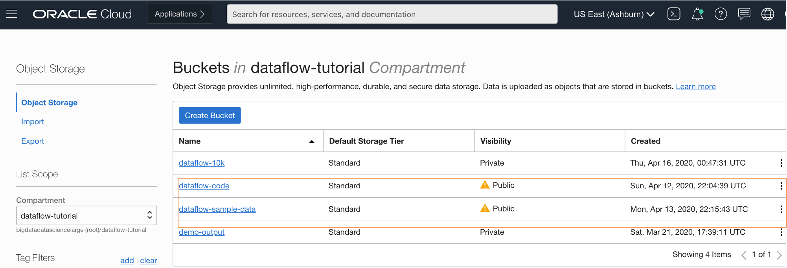

 3.  In the `dataflow-sample-data` find the `datacleaning.py` file
     
     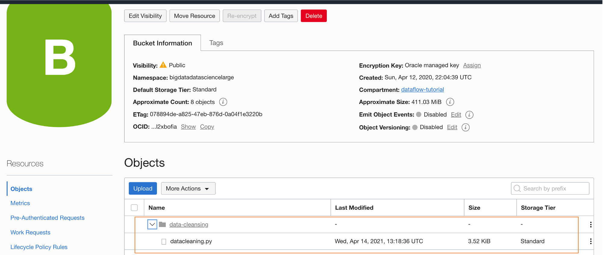

 4.  In the `dataflow-sample-data` find the input `netflix_titles.csv` file

     

## Task 3: Run the application locally

 1. Run the sample python application - locally first before running it on the Oracle Cloud Data Flow service. As input, supply the location of the CSV file 
    as input to the sample app. It prints the count of the missing values in each column as well as prints the missing values after cleanup and finally 
    writes the parquet file to output location.

   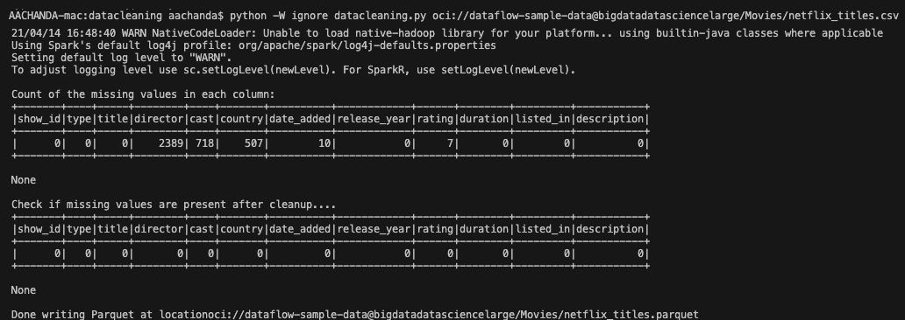 
    
      
## Task 4: Create a PySpark application in Oracle Cloud Infrastructure Data Flow 

1. Create an Application, and select the Python type. In the `Resource Configuration`. Leave all these values as their defaults.  
   
   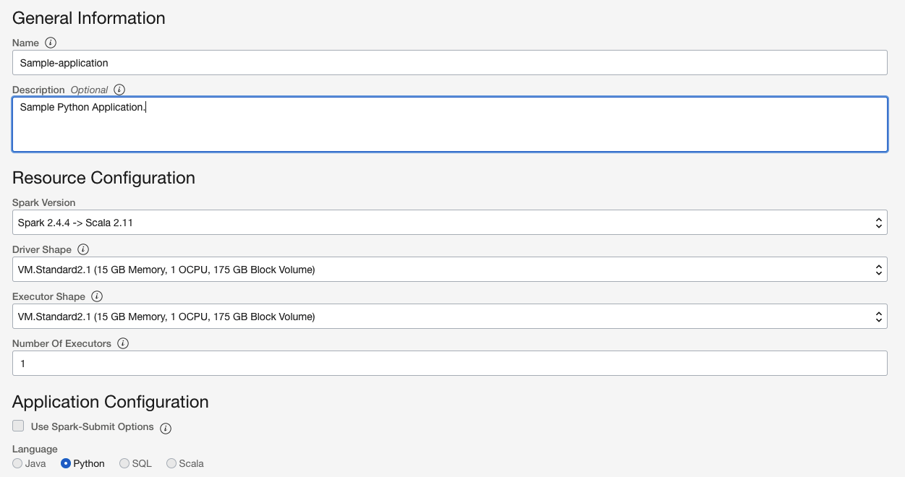


2. Scroll down to `Application Configuration`. Configure the application as follows:

     1. **File URL** is the location of the Python file in object storage. The location for this application is:

      ```
      <copy>oci://dataflow-code@bigdatadatasciencelarge/data-cleansing/datacleaning.py</copy>
      ```

     2. **Arguments** The Spark app expects one command line parameters,  the input location of the csv file. In the Arguments field, enter

      ```
      <copy>oci://dataflow-sample-data@bigdatadatasciencelarge/Movies/netflix_titles.csv</copy>
      ```
> **Note:** For this workshop the datacleaning.py file is already uploaded to the object storage.

3. Double-check your Application configuration, and confirm it is similar to the following
   
   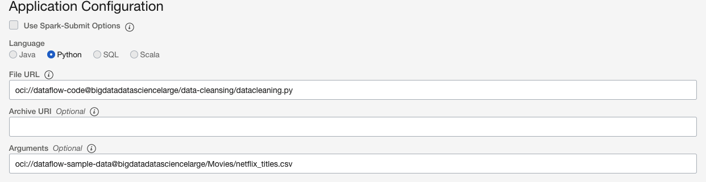

4. When done, click **Create**. When the Application is created, you see it in the Application list.

   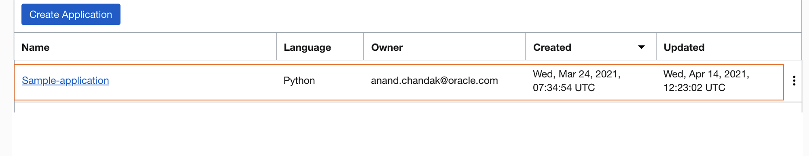

## Task 5: Run the Oracle Cloud Infrastructure Data Flow application

1. Highlight your Application in the list, click the **Actions** icon, and click **Run**

   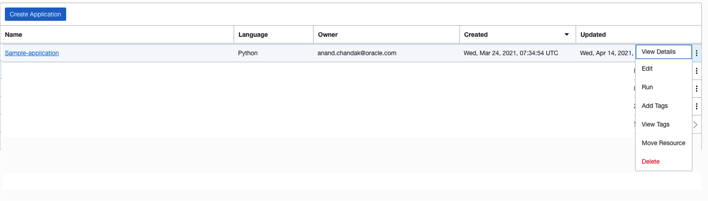


2. While the Application is running, you can optionally load the **Spark UI**  to monitor progress. From the **Actions** icon for the run in question, select **Spark UI**

   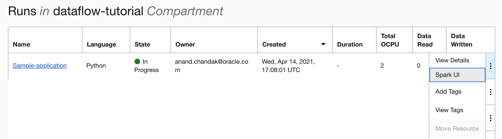

 
3. You are automatically redirected to the Apache Spark UI, which is useful for debugging and performance tuning.

   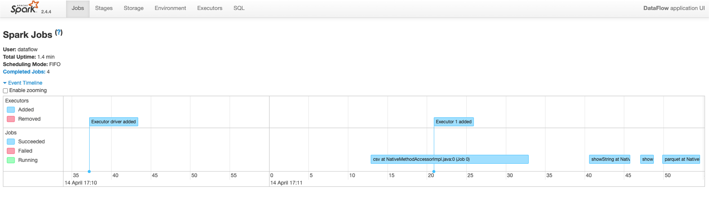

4. When the `Run` completes, open it and navigate to the logs

        

5. After a minute or so your `Data Flow Run`  should show successful completion with a State of Succeeded:

   

6. Drill into the Run to see more details, and scroll to the bottom to see a listing of logs.

   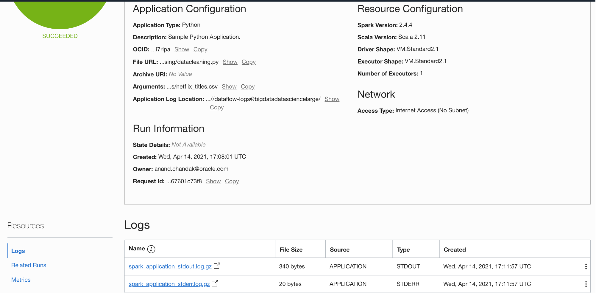

7. When you click the `spark_application_stdout.log.gz`  file, you should see the following log output

   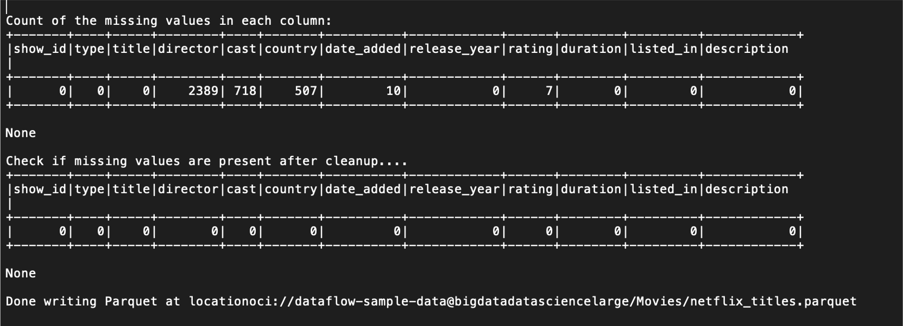

8. You can also navigate to your output object storage bucket to confirm that new files have been created.

   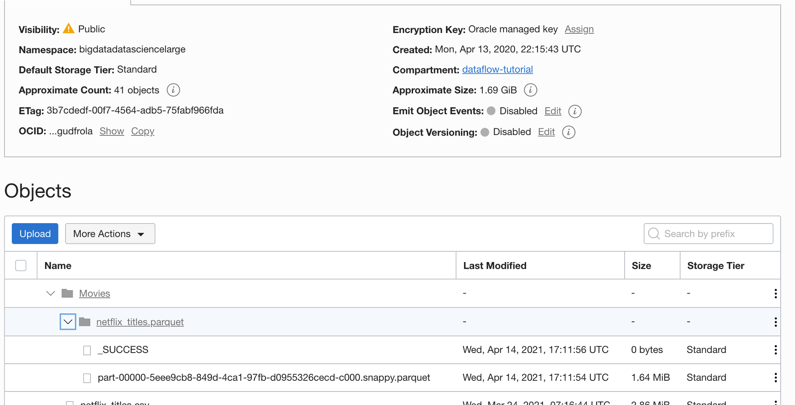
 
You may now **proceed to the next lab**.

## Acknowledgements

- **Author** - Anand Chandak
- **Last Updated By/Date** - Kamryn Vinson, March 2022
