# Build a Datapipeline with OCI DataFlow and Metastore

## Introduction

Today, the most successful and fastest-growing companies are generally data-driven organizations. Taking advantage of data is pivotal to answering many pressing business problems; however, this can prove to be overwhelming and difficult to manage due to data’s increasing diversity, scale, and complexity. One of the most popular technologies that businesses use to overcome these challenges and harness the power of their growing data is OCI Data flow that provides serverless Apache Spark at scale.

Oracle Cloud Infrastructure (OCI) Data Flow is a fully managed Apache Spark service to perform processing tasks on extremely large data sets without the infrastructure to deploy or manage. This enables rapid application delivery because developers can focus on app development, not infrastructure management.

ETL stands for extract, transform, and load and ETL tools move data between systems. If ETL were for people instead of data, it would be akin to public and private transportation. Companies use ETL jobs to move data from a source, transform it to the form that is required, and load the resulting data and schema into a target system.

OCI Data Flow integrates with OCI Data Catalog Metastore which acts as the platform’s centralized metadata store to enable different personas and applications to share data and metadata.

  

Estimated Time: 90 minutes

### Personas for this lab

There are three important personas for the lab. Mentioned below are the details of each of them:

#### Data Engineer

A Data Engineer is involved in preparing data. Data Engineers are responsible for designing, building, integrating, and maintaining data from multiple sources. Data engineers usually know SQL, Big Data systems, Apache Spark, and Hadoop, as well as Python, R, Java, etc. This class of users uses some of the above-mentioned languages to perform extract (collecting and reading data), transform (converting data into a compatible format), and load (migrate into data warehouses) duties. They do not have any role in analysing data as their purpose is to make data readily available for other users.

#### Data Scientist

A Data Scientist is a specialist who applies their expertise in statistics and building machine learning models to make predictions and answer key business questions. They help uncover hidden insights by leveraging both supervised (e.g., classification, regression) and unsupervised learning (e.g., clustering, neural networks, anomaly detection) methods toward their machine learning models. They are essentially training mathematical models that will allow them to better identify patterns and derive accurate predictions.

#### Data Analyst

Data Analysts usually collect data by collaborating with stakeholders to streamline processes. This class of users spends a considerable amount of time on generating insights from the data by creating business intelligence reports for internal use and clients. They usually know at least OAC, Microsoft Excel, SQL, and Tableau as well as Python and/or R.

### Objectives

In this workshop, you'll build an end-to-end data pipeline that performs extract, transform, and load (ETL) operations. The pipeline will use OCI Dataflow Apache Spark and OCI Data Catalog Metastore running on OCI for querying and manipulating the data. We will see how different personas (Data Engineer, Data Scientist, and Data Analyst) come together to share Data and Metadata as the data travel across pipelines. You'll also use technologies like OCI Object store for data storage, OCI Data Flow Interactive SQL Cluster, and Oracle Analytics Cloud (OAC) for visualization of the raw data. OCI Data Flow integrates with OCI Data Catalog Metastore which acts as the platform’s centralized metadata store to enable different personas and applications to share data and metadata.

Here's the summary of what you’d do in the workshop :

As a Data Engineer

* Navigate to the Data Catalog Console and explore the Metastore Instance under a Compartment.

* Build an OCI Data Flow Python batch application that does the following:

   1. Read the raw JSON dataset from the object store bucket
  
   2. Cleanse and Transform the data into Parquet Format for efficiency
  
   3. Create a Database in OCI Data Catalog Metastore
  
   4. Load the data into an OCI Data Catalog Metastore Managed Table
  
   5. Create a view in OCI Data Catalog Metastore which is then made available to OAC.

* Navigate to Data Flow Console and creates the Data Flow Application using the PySpark application created in above and selects the metastore that needs to be associated with the application

* Navigate to Data Flow Console and runs the Application.

* Navigate to the Object store to inspect the transformed data in the Metastore.

As a Data Scientist

* Build another OCI Data Flow Python batch application that does the following:
  
   1. Queries the data and metadata that are stored in the metastore #2 above.
  
   2. Build a sample machine learning model to explore to predict sentiment given a review text. Classifiy Yelp reviews as positive / negative and identify most relevant phrases based on the textual content .
  
As a Data Analyst navigate to :

* OAC to explore the dataset that was created by the data engineer.

* Write custom queries to create build visualization

Your dataset is the [Yelp Review and Business Dataset](https://www.kaggle.com/yelp-dataset/yelp-dataset), downloaded from the Kaggle website under the terms of the Creative Commons CC0 1.0 Universal (CC0 1.0) "Public Domain Dedication" license.

The dataset is in JSON format and it is stored  in object store for downstream processing.

This lab guides you step by step, and provides the parameters you need. The python application is uploaded to the [Bucket](https://console.us-ashburn-1.oraclecloud.com/object-storage/buckets/idehhejtnbtc/workshop-scripts/objects)

### Prerequisites

* Python 3.6+ setup locally.

* An Oracle Cloud log in with the API Key capability enabled. Load your user under Identity/Users, and confirm you can create API Keys.


* An API key registered and deployed to your local environment. See [Register an API Key](https://docs.oracle.com/iaas/Content/API/Concepts/apisigningkey.htm) for more information

* OCI Python SDK. See [Installing OCI python SDK](https://oracle-cloud-infrastructure-python-sdk.readthedocs.io/en/latest/installation.html#downloading-and-installing-the-sdk)

* A python IDE of your choice. The workshop uses [Visual Studio Code (VSCode)](https://code.visualstudio.com/download)

* Local environment setup with all the dependencies setup as described [Here](https://docs.oracle.com/en-us/iaas/data-flow/data-flow-tutorial/develop-apps-locally/front.htm#develop-locally-concepts)

* From the Console, click the hamburger menu to display the list of available services. Select Data Flow and click `Applications`

* Basic understanding of Python and Spark.

### What is not covered in the lab

* Policies and other Identity management related setup for OCI Data Flow, OCI Data Interactive SQL and OCI Data Catalog.They are already setup in the lab tenancy. You can read more about them in the [documentation](https://docs.oracle.com/en-us/iaas/data-flow/using/dfs_getting_started.htm) and the [here](https://objectstorage.us-ashburn-1.oraclecloud.com/n/idehhejtnbtc/b/workshop-scripts/o/Hackathon%20User%20Guide.pdf)

* Connection between OAC and  OCI Data Flow Interactive SQL server cluster is already setup. If you want to learn more, read the [Guide](https://objectstorage.us-ashburn-1.oraclecloud.com/n/idehhejtnbtc/b/workshop-scripts/o/Hackathon%20User%20Guide%20(1).pdf)

## Task 1: Inspect the Input JSON files and the scripts for the lab

1. From the Console navigate to the object storage

   

2. For this workshop, we are reusing existing buckets `workshop-scripts` that contains all the input python files and `workshop-data` that contains all the Input JSON files  in compartment  `dataflow-demo`. The process to upload the files is as described [File Upload](https://docs.oracle.com/en-us/iaas/Content/GSG/Tasks/addingbuckets.htm#Putting_Data_into_Object_Storage).

3. In the bucket `workshop-data` find the input JSON files ```yelp_business_yelp_academic_dataset_business.json``` in the folder `yelp_business` and the file ```yelp_review_yelp_academic_dataset_review.json``` in the folder ```yelp_review```

    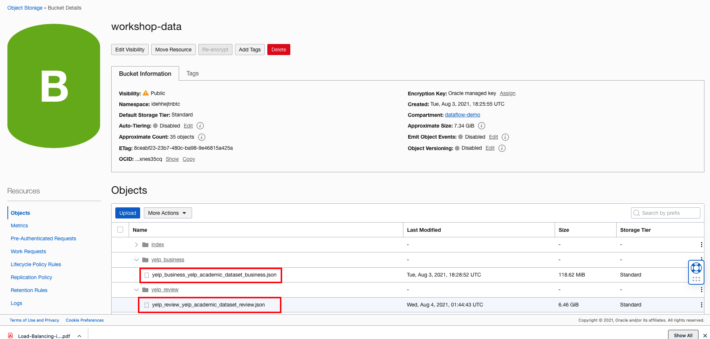

4. In the bucket `workshop-scripts` find the scripts `oci-df-lab-script.py` and `query_metastore_and_model.py` that will be used for the workshop

    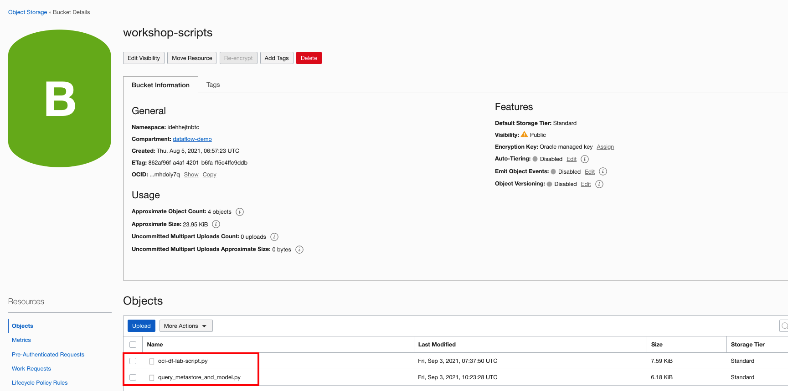

## Task 2: Inspect the MetaStore

1. In the Console, open the navigation menu and click ```Analytics & AI```. Click ```Data Catalog```.

    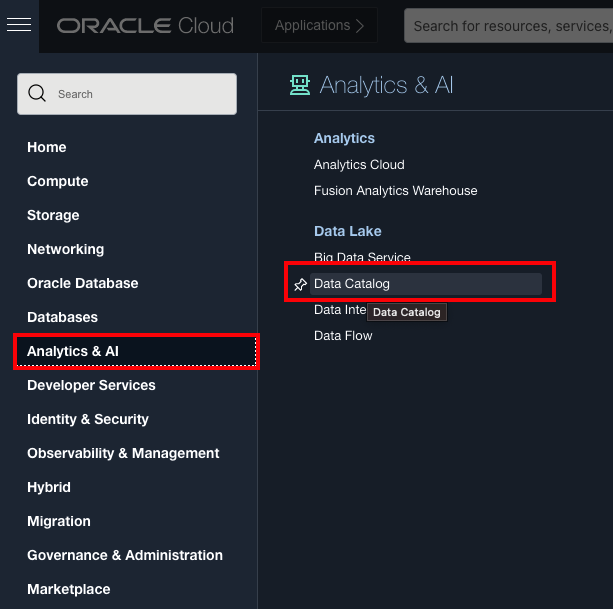

2. From the Data Catalog service page, click ```Metastores```.

    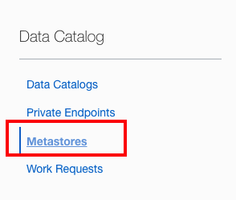

3. Change the Compartment to the ```dataflow-demo```

   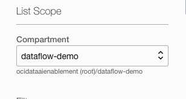

4. Should list the MetaStores in  ```dataflow-demo``` Compartment and you should find the ```DF-metastore``` Metastore that we will use for the workshop

    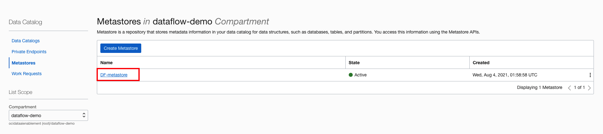

5. Open the metastore ```DF-metastore```  to inspect the location of the table for the MetaStore. This will hold the data for the tables that we create later.

    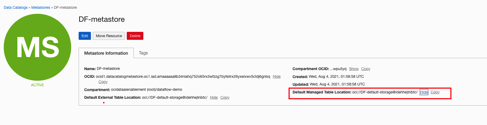

## Task 3: Create a python Data Flow Application in Oracle Cloud Infrastructure Data Flow

As a Data engineer we start by building a Python based batch application the application calls a script that does the following :

1. Reads the raw Yelp JSON data from Object Store into a spark dataframe

2. Cleanses the data by removes all the restaurant that are closed. The restaurant that are closed won't be very helpful in data analysis.

3. Creates managed tables by the name ```yelp_business_raw``` and ```yelp_review``` in the metastore. The metastore acts like a central repository for multiple applications to share data and metadata

4. Creates a view ```yelp_data```  joining the data from both the tables to make it available for Data Analyst to create visualization and reports on top of the data.

Perform the following steps to create an application

1. Navigate to  **Data Flow** from the console

   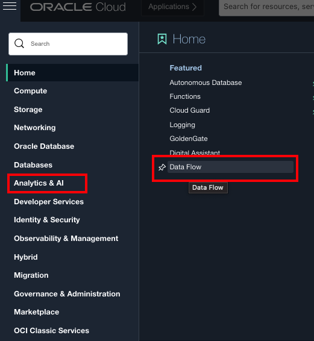

2. Click **Create Application** from the page to launch the Create Application page.

   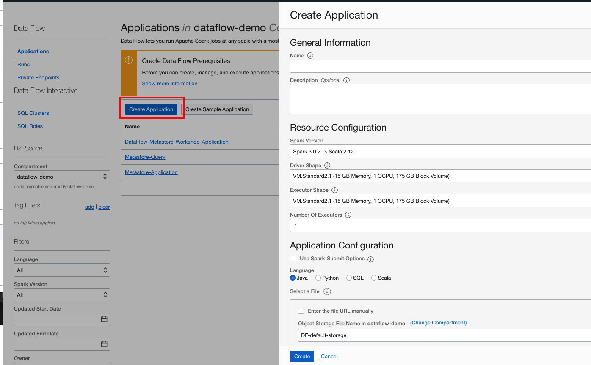

3. On the Create Application page, provide a **Name** and **Description**.

4. In the **Resource Configuration**, leave the default values for **Spark Version**, **Driver Shape** , **Executor Shape** and **Number of Executors**.

5. In the Application Configuration:

    - **Language**: Select **Python**

    - In **Select a File**: pick the Object Storage File Name bucket as **Field-Training** and file name as **oci-df-lab-script.py**

    - Leave the **Main class Name** and the **Archive URI** empty

    - In the **Arguments** field: enter the path for the Input Yelp JSON files (separated by space) that we saw in Step#1 above and also provide a unique name for the hive DB (for e.g the workshop participants can give your UUID + "DB"). The format of path is as follows ```oci://<<bucketname@namespace/folder-path>>```

        for e.g. `oci://workshop-data@idehhejtnbtc/yelp_review/yelp_review_yelp_academic_dataset_review.json oci://workshop-data@idehhejtnbtc/yelp_business/yelp_business_yelp_academic_dataset_business.json aachandaDB`

    - In the **Metastore in dataflow-demo**: choose **DF-metastore** and you should see the path of the Managed table getting populated automatically.

6. Double-check your Application configuration, and confirm it is similar to the following

   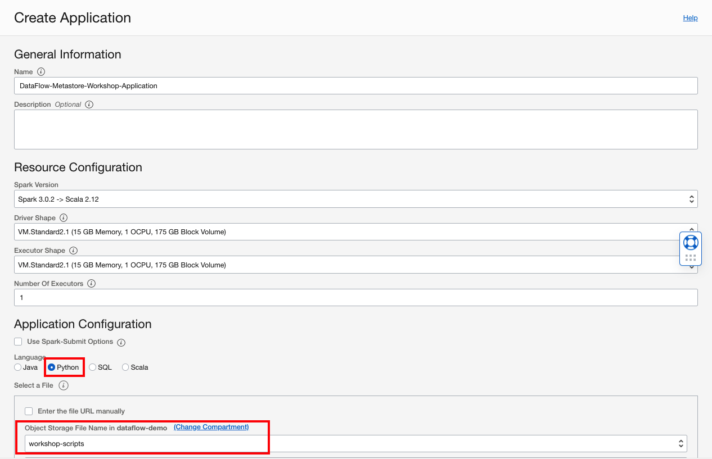

   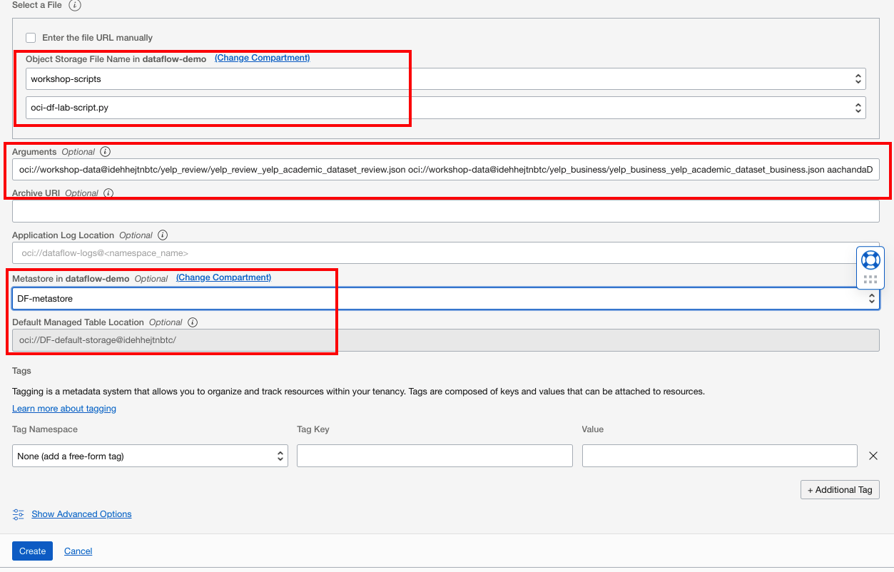

7. When done, click **Create**. When the Application is created, you should see it in the Applications list.

   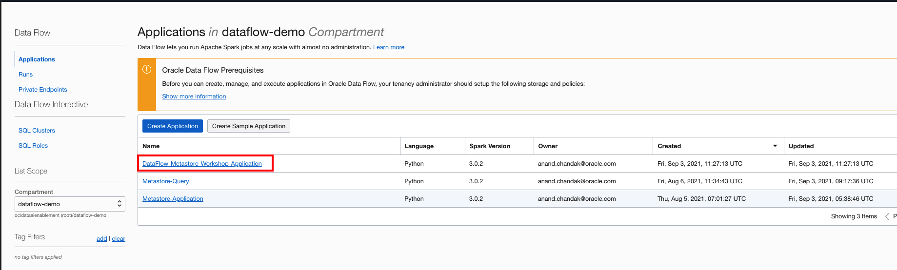

## Task 4: Run the Oracle Cloud Infrastructure Data Flow application

1. Launch the Application that was created in Task #3 above. The status of the application should be Active.

   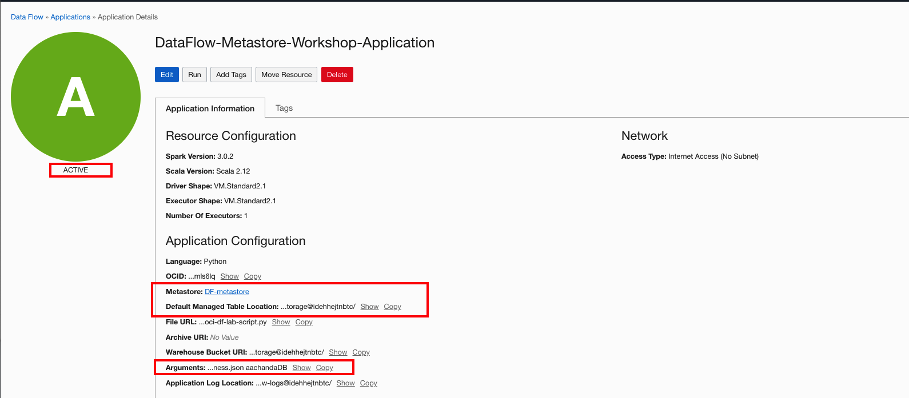

   Notice the application has the correct values for Metastore and Arguments.

2. Click **Run** to launch the run configuration screen.

   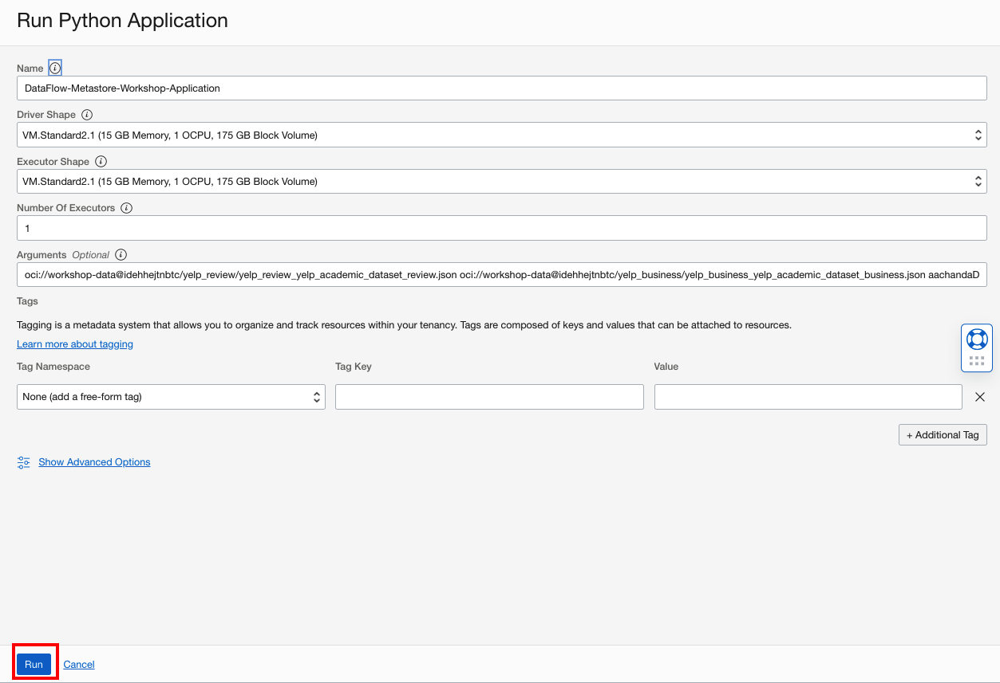

3. Click on **Run** and see all the applications. Initially the status of the run is Accepted.

   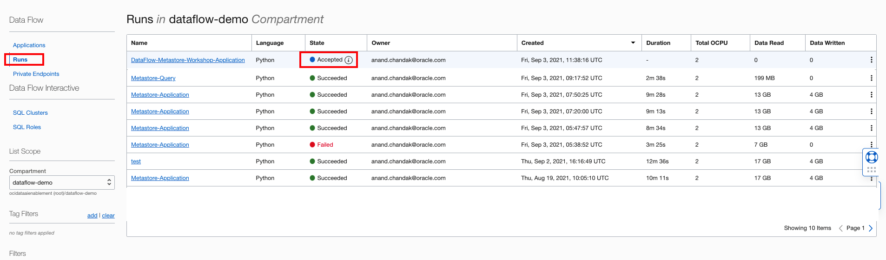

4. Click the application and its status should change to In Progress in few seconds.

    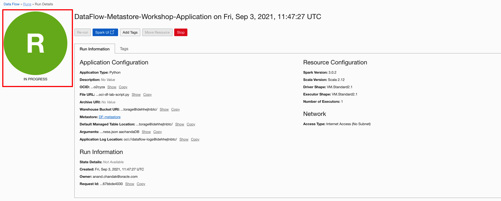

5. While the Application is running, you can optionally load the **Spark UI**  to monitor progress. From the **Actions** icon for the run in question, select **Spark UI**

   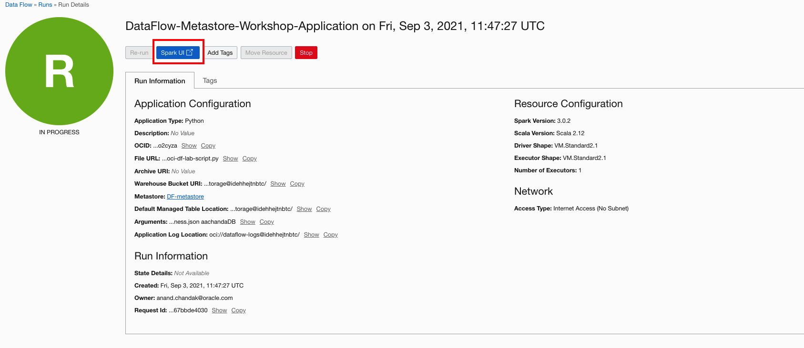

6. You are automatically redirected to the Apache Spark UI, which is useful for debugging and performance tuning.

   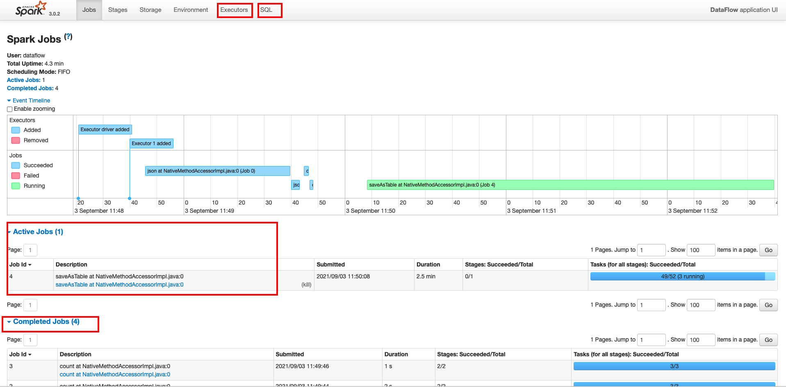

   On the screen users can look at:

    1. The list of the **Active Jobs**
  
    2. The list of **Completed Jobs**
  
    3. Navigate to the  **Executors** tab at the top to see the list of Executors.
      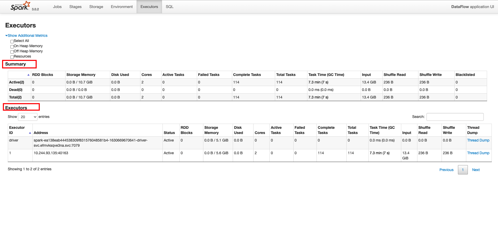
  
   4. Navigate to the **SQL** tab at the top to see the SQL Queries
      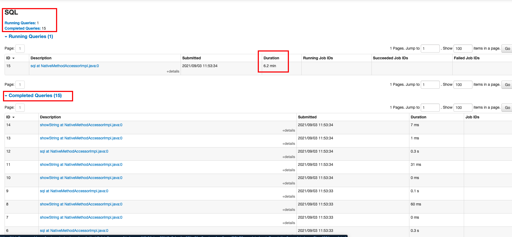

7. After few mins the Data Flow Run should complete and the State should change to Succeeded.

   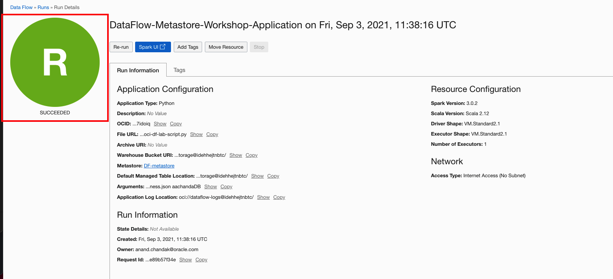

8. Drill into the Run to see more details and scroll to the bottom to see a listing of logs.

   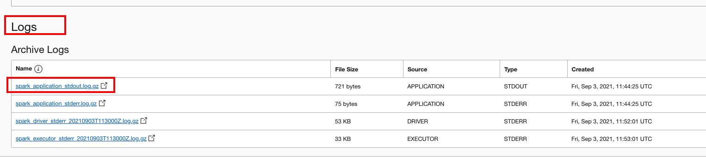

9. When you click the **spark\_application\_stdout.log.gz** file, it should download a file **View** to your local file system.

10. Open the file and you should see the following output:

    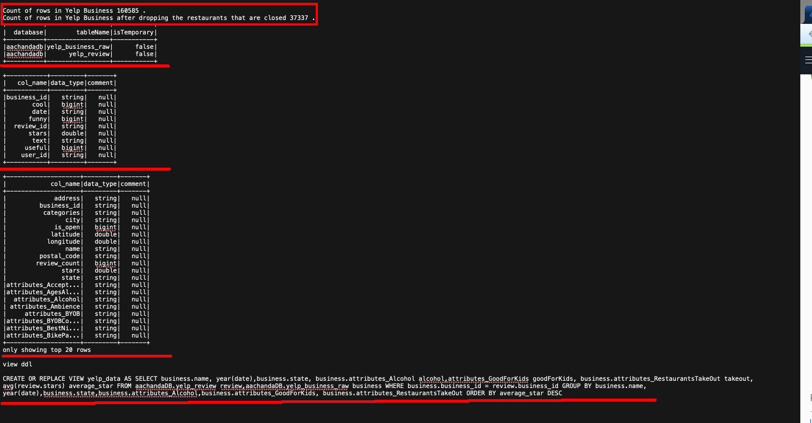

    The log file shows

    1. The Count of Business Dataset before and after cleaning (dropping the restaurants that are closed)

    2. The list of managed tables that got created

    3. The schema of the both the managed tables

    4. The DDL of the view

11. Navigate to the Object Store Bucket **DF-default-storage** that was used as location for the tables.

    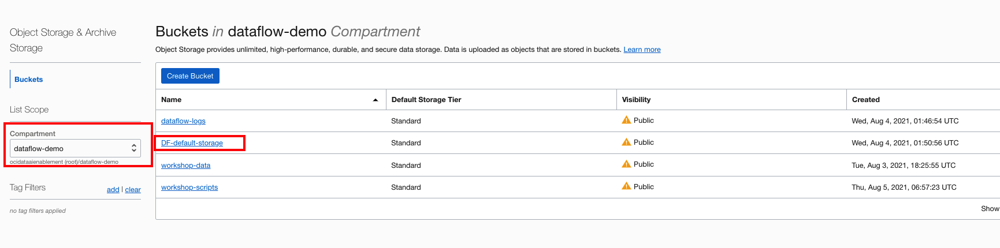

12. Open the Bucket **DF-default-storage** to show the content of the bucket and scroll to bottom of the page.  

13. The content of the Bucket shows the table and the parquet files

   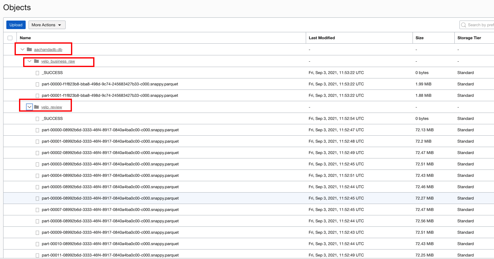

   You should see the following :

    1. The folder corresponding to the DB Name (for e.g. aachandadb.db) that was provided while running the application.

    2. A folder corresponding to tables name (for e.g. yelp\_business_raw and yelp\_review) that was provided to the application.

    3. Expanding the folder should show the data split across different .parquet files.

## Task 5: Create and Run a sample Application to Query the metastore and build a Machine learning Model

As a Data scientist, we create another OCI Data Flow Application. This application would do the following :

   * Query the review data  to get the count of review by avg rating from the table **yelp_review** which was created in Task #3 above. This makes metastore a central repository for applications across data platform.

   * Build an NLP machine learning model to predict sentiment given a restaurant review text.

   * Analyze which terms are most contributive to a positive or a negative restaurant review. We will be predicting whether a review is positive or negative using classifier algorithms Linear Support Vector Machine and Logistics Regression  

   1. Navigate to OCI Data Flow and create another Python Application in OCI Dataflow similar to how it was done in Task #4 above. Launch the **Create Application** page.

   2. On the Create Application page, provide a **Name** and **Description**.

   3. In the **Resource Configuration** field, leave the default values for **Spark Version**, **Driver Shape**, **Executor Shape**.

   4. For the  **Number of Executors** field, select **4**.

   5. In the Application Configuration:

      1. Select the **query\_metastore\_and\_model.py** from the bucket **workshop-scripts**.

      2. In the arguments field, Pass the DBName that used to create the Managed Table.

      3. In the **Metastore in dataflow-demo** field, choose **DF-metastore**. You should see the path of the Managed table getting populated automatically.

   6. The configuration should look like the snapshot shown below:

       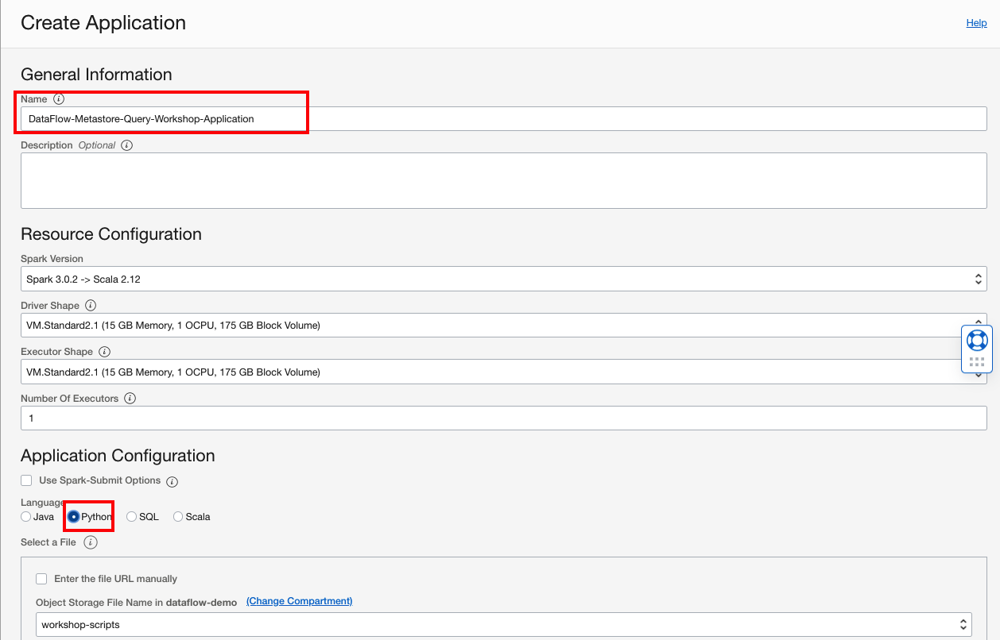

       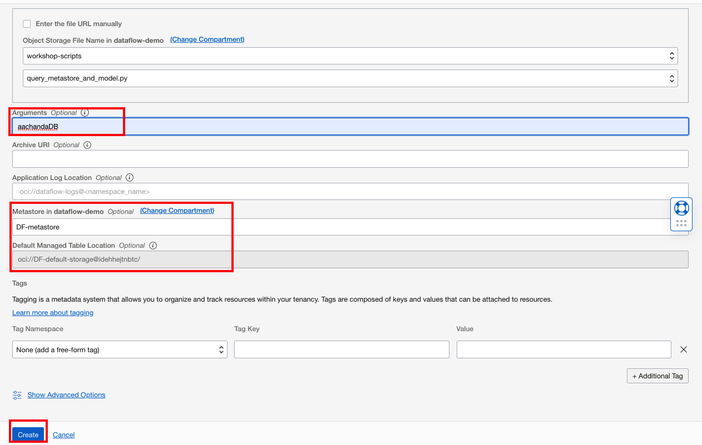

   7. Click **Create** and save the application.

   8. Next, run the application by launching the application and clicking on **Run**.

    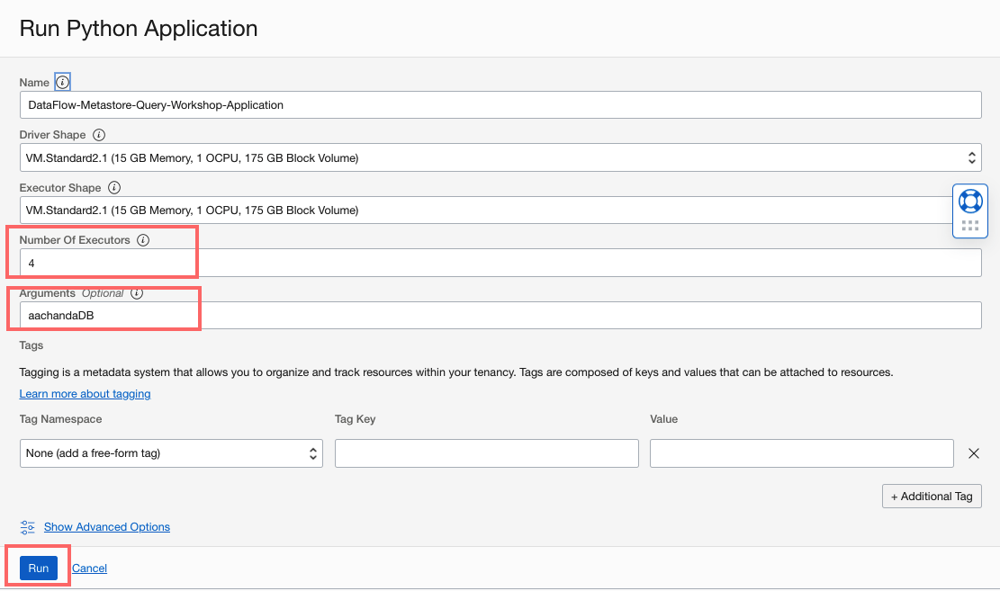

   9. The application status changes from Accepted to In-Progress and Succeeded.

   10. Open the logs. You should see the count of reviews by avg rating

    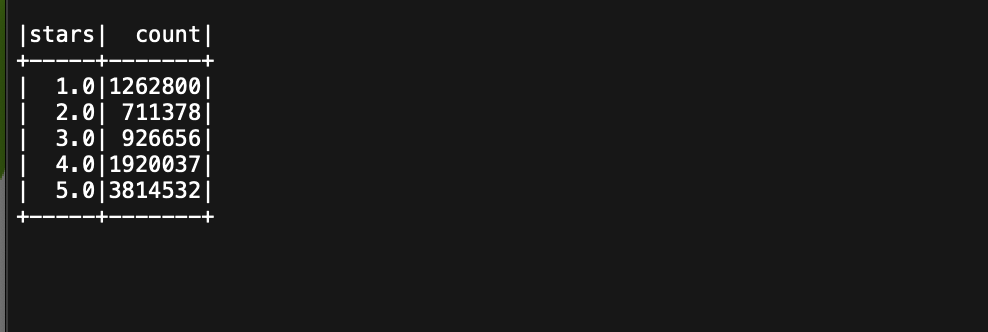

   11. Also seen in the logs is the F score, which is really the measure of the of Precision and Recall for the two algorithms. The higher the F1 score the better.

       We can see here that the terms that are most positive include ‘friendly staff’, ‘delicious’, ‘great customer service’, ‘great food’. This indicates that the important features for customer’s satisfaction is staff, food taste, and service.

       The terms that are most negative include ‘minutes’, ‘over priced’, ‘bland’, ‘food was ok’, ‘nothing special’. This suggests that negative reviews are driven by long wait times, overpriced food, bad food taste, an experience that isn’t deemed as anything special.

       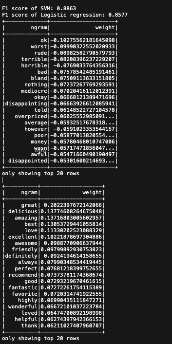

## Task 6: Connect to the Metastore from Oracle Analytics Cloud (OAC)

As a Data analyst, we want to build visualization on top of the raw data that was created by the data engineer. OAC can connect to the OCI Metastore via Data Flow Interactive (DFI) SQL Cluster. For this workshop DFI SQL Cluster is already setup. And the connection between DFI Cluster and OAC via Oracle Remote Data Gateway (RDG) is also established. 

1. From the Console navigate to  **Analytics Cloud**.

   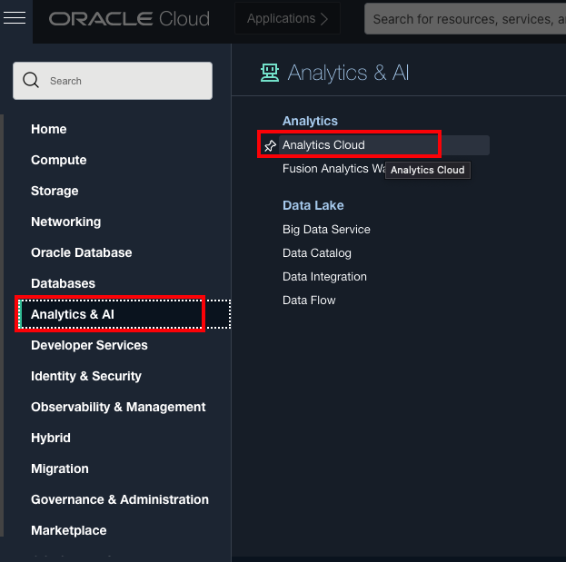

2. In the dataflow-demo compartment you should see the following instances created that are created for the workshop

   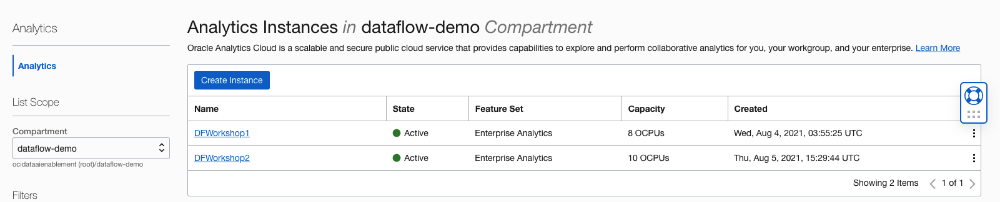

3. Click on the **DFWorkshop1** instance and click the URL.

   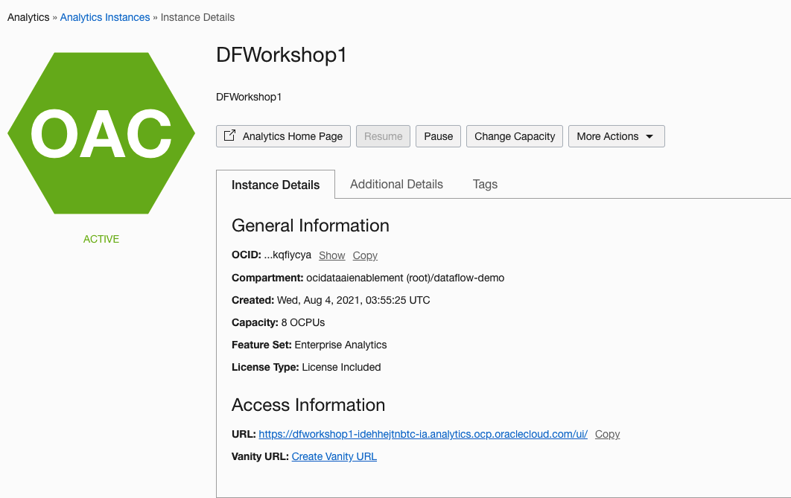

4. You should be re-directed to the OAC Console

   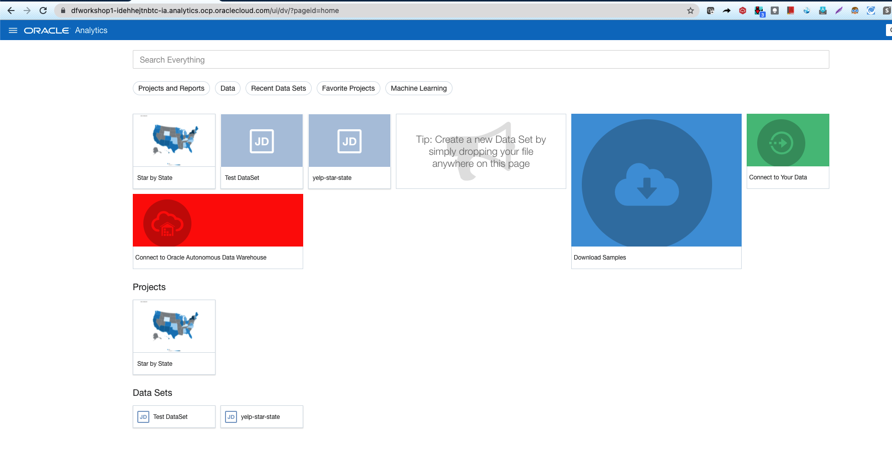

5. On the console, we will create a dataset first.

    1. Click **Connect to Your Data**

       

    2. Select the OAC DF-Workshop-1 instance

       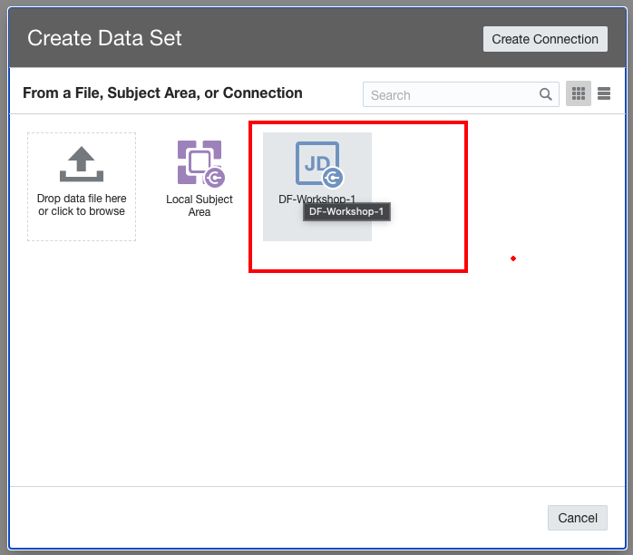

    3. It should show the databases that we created in Task #3 above .

       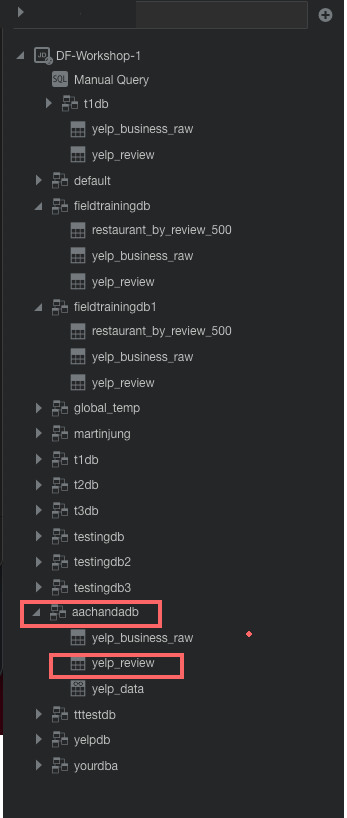

    4. Drag and drop (or double click) **yelp\_data** to the editor on the righthand side. It should load the data for **yelp\_data**. It can take a few minutes for the data to show up.

        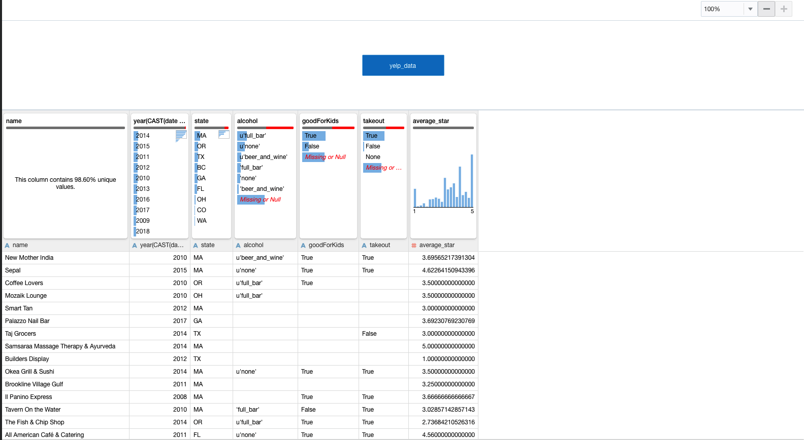

    5. Enter a name for the Dataset and Save.

    6. Open the Dataset and explore the data.

        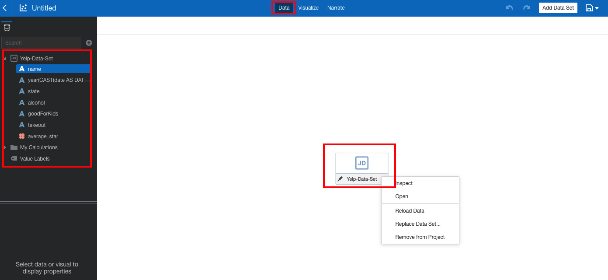

6. (Optional) Create a project to Visualize the data in Map Interface as described in [tutorial](https://docs.oracle.com/en/cloud/paas/analytics-cloud/tutorial-create-map-view-of-data/#background) and select the **state** and **average_star** columns.

    1. Add a new calculation by right clicking **My Calcuation** and then **Add Calculation**.

        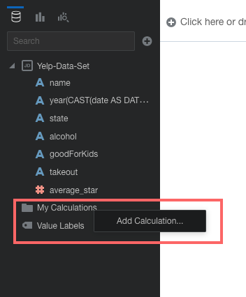

    2. Name the calculation and enter the calculation shown below in the editor

        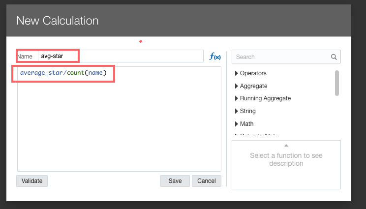

    3. Click **Save** and the new Calculation should be displayed under My Calculations.

         

    4. Click on **Visualize** on the top left and drop the map on the right side.

         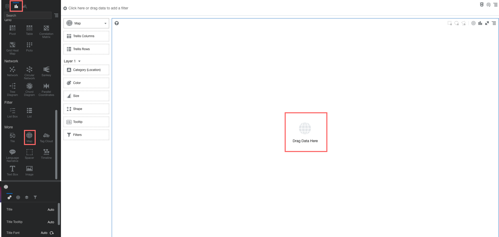

    5. On the **state layer** in the map, drag the **state** column in the **Location** field and drag the calculation **avg-star** on the **Color** field.

        

    6. Drag the **goodForKids**, **alcohol**, **years**, and **takeout** columns to Filters.

        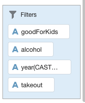

    7. Save the map and visualize the data.

         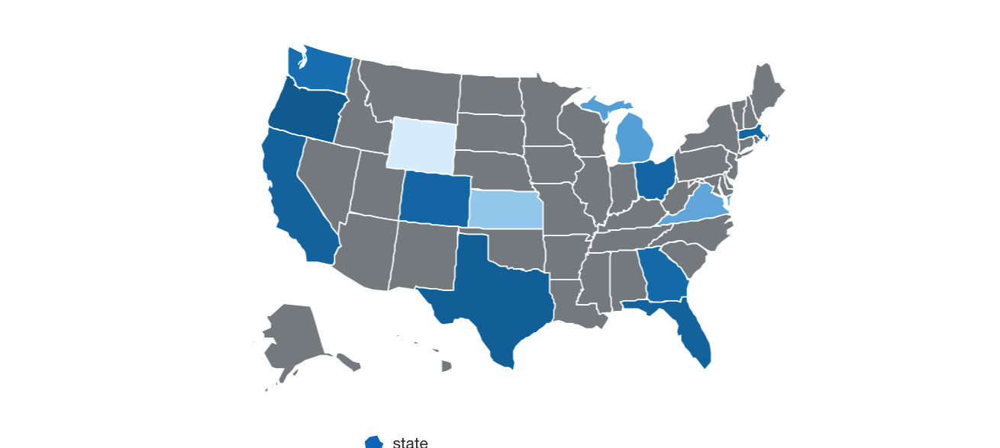

## Task 7: Advanced lab to look at the code for the Sample Application

1. Begin by importing the python modules

    ```python
       <copy>
       import os
       import traceback
       from pyspark import SparkConf
       from pyspark.sql import SparkSession
       from pyspark.sql.context import SQLContext
       from pyspark.sql.functions import *
       from pyspark.sql.types import *
     </copy>
    ```

2. In the main function we start with the program logic. The main function is a starting point of any python program. When the program is run, the python interpreter runs the code sequentially. As input we pass the the location of the object storage location that has the  netflix csv file.

    ```python
     <copy>
         if __name__ == "__main__":
         main()
     </copy>
    ```

    ```python
     <copy>

    def main():

   # Input Parquet files
    YELP_REVIEW_INPUT_PATH = sys.argv[1]
    YELP_BUSINESS_INPUT_PATH = sys.argv[2]
    db_name = sys.argv[3]

    YELP_REVIEW_OUTPUT_PATH = os.path.dirname(YELP_REVIEW_INPUT_PATH) + "/parquet"
    YELP_BUSINESS_OUTPUT_PATH = os.path.dirname(YELP_BUSINESS_INPUT_PATH) + "/parquet"


    # Set up Spark.
    # Set up Spark.
    spark_session = get_dataflow_spark_session()

    # Load our data.

    review_input_dataframe = spark_session.read.option("header", "true").option(
        "mergeSchema", "true").json(YELP_REVIEW_INPUT_PATH)

    review_input_dataframe = flatten(review_input_dataframe)

    review_input_dataframe.printSchema()

    business_input_dataframe = spark_session.read.option("header", "true").option(
        "mergeSchema", "true").json(YELP_BUSINESS_INPUT_PATH)

    business_input_dataframe = flatten(business_input_dataframe)

    business_input_dataframe.printSchema()

    # Create Hive External Table
    createHiveTable(spark_session, review_input_dataframe,
                    business_input_dataframe, db_name)

    def flatten(df):
    # compute Complex Fields (Lists and Structs) in Schema
    complex_fields=dict([(field.name, field.dataType)
                           for field in df.schema.fields
                           if type(field.dataType) == ArrayType or type(field.dataType) == StructType])
    while len(complex_fields) != 0:
        col_name=list(complex_fields.keys())[0]
        print("Processing :"+col_name+" Type : " +
              str(type(complex_fields[col_name])))

        # if StructType then convert all sub element to columns.
        # i.e. flatten structs
        if (type(complex_fields[col_name]) == StructType):
            expanded=[col(col_name+'.'+k).alias(col_name+'_'+k)
                        for k in [n.name for n in complex_fields[col_name]]]
            df=df.select("*", *expanded).drop(col_name)

        # if ArrayType then add the Array Elements as Rows using the explode function
        # i.e. explode Arrays
        elif (type(complex_fields[col_name]) == ArrayType):
            df=df.withColumn(col_name, explode_outer(col_name))

        # recompute remaining Complex Fields in Schema
        complex_fields=dict([(field.name, field.dataType)
                               for field in df.schema.fields
                               if type(field.dataType) == ArrayType or type(field.dataType) == StructType])
    return df                
     </copy>
    ```

3. Next, create a spark session and in the session config, add the OCI configuration. We pass the following configuration

     1. OCID of the user calling the API. To get the value, see [Required Keys and OCIDs](https://docs.oracle.com/en-us/iaas/Content/API/Concepts/apisigningkey.htm#Required_Keys_and_OCIDs).  

     2. Fingerprint for the public key that was added to this user. To get the value, see[Required Keys and OCIDs](https://docs.oracle.com/en-us/iaas/Content/API/Concepts/apisigningkey.htm#Required_Keys_and_OCIDs)  

     3. Full path and filename of the private key. The key pair must be in the PEM format. For instructions on generating a key pair in PEM forat, see [Required Keys and OCIDs](https://docs.oracle.com/en-us/iaas/Content/API/Concepts/apisigningkey.htm#Required_Keys_and_OCIDs)

     4. Passphrase used for the key, if it is encrypted.

     5. OCID of your tenancy. To get the value, see [Required Keys and OCIDs](https://docs.oracle.com/en-us/iaas/Content/API/Concepts/apisigningkey.htm#Required_Keys_and_OCIDs)

     6. An Oracle Cloud Infrastructure region. see [Regions and Availability Domains](https://docs.oracle.com/en-us/iaas/Content/General/Concepts/regions.htm#top)

    ```python
    <copy>
    def get_dataflow_spark_session(
    app_name="DataFlow", file_location=None, profile_name=None, spark_config={}
    ):
    """
    Get a Spark session in a way that supports running locally or in Data Flow.
    """
    if in_dataflow():
        spark_builder = SparkSession.builder.appName(app_name)
    else:
        # Import OCI.
        try:
            import oci
        except:
            raise Exception(
                "You need to install the OCI python library to test locally"
            )
        # Use defaults for anything unset.
        if file_location is None:
            file_location = oci.config.DEFAULT_LOCATION
        if profile_name is None:
            profile_name = oci.config.DEFAULT_PROFILE

        # Load the config file.
        try:
            oci_config = oci.config.from_file(
                file_location=file_location, profile_name=profile_name
            )
        except Exception as e:
            print("You need to set up your OCI config properly to run locally")
            raise e
        conf = SparkConf()
        conf.set("fs.oci.client.auth.tenantId", oci_config["tenancy"])
        conf.set("fs.oci.client.auth.userId", oci_config["user"])
        conf.set("fs.oci.client.auth.fingerprint", oci_config["fingerprint"])
        conf.set("fs.oci.client.auth.pemfilepath", oci_config["key_file"])
        conf.set(
            "fs.oci.client.hostname",
            "https://objectstorage.{0}.oraclecloud.com".format(oci_config["region"]),
        )
        spark_builder = SparkSession.builder.appName(app_name).config(conf=conf)

    # Add in extra configuration.
    for key, val in spark_config.items():
        spark_builder.config(key, val)

    # Create the Spark session. Enables Hive support, including connectivity to a persistent Hive metastore
     session = spark_builder.enableHiveSupport().getOrCreate()
    return session
    </copy>
    ```

4. Create Tables in Hive MetaStore.

    ```python
        <copy>
    def createHiveTable(spark_session, review_input_dataframe, business_input_dataframe, db_name):

        try:
            spark_session.sql("CREATE DATABASE IF NOT EXISTS " + db_name)
        except:
            print(traceback.format_exc())
            print(traceback.print_stack())

        spark_session.sql("USE " + db_name)

        try:
            review_input_dataframe.write.mode("overwrite").saveAsTable(
                db_name + ".yelp_review")
        except Exception as err:
            print(traceback.format_exc())
            print(traceback.print_stack())

        try:
            business_input_dataframe.write.mode("overwrite").saveAsTable(
                db_name + ".yelp_business_raw")
        except Exception as err:
            print(traceback.format_exc())
            print(traceback.print_stack())
            print("Table yelp_business_raw already exists")

        spark_session.sql("SHOW Tables").show()
        spark_session.sql("DESCRIBE TABLE yelp_review").show()
        spark_session.sql("DESCRIBE TABLE yelp_business_raw").show()

        ddl = 'CREATE OR REPLACE VIEW yelp_data AS SELECT business.name, year(date),business.state, business.attributes_Alcohol alcohol,attributes_GoodForKids goodForKids, business.attributes_RestaurantsTakeOut takeout, avg(review.stars) average_star FROM ' \
            + db_name + '.yelp_review review,' + db_name + '.yelp_business_raw business' \
            + ' WHERE business.business_id = review.business_id GROUP BY business.name, year(date),business.state,business.attributes_Alcohol,business.attributes_GoodForKids, business.attributes_RestaurantsTakeOut ORDER BY average_star DESC '

        print("view ddl" + ddl)

        try:
            spark_session.sql(ddl)
        except Exception as err:

        </copy>
    ```

## Acknowledgements

* **Author** - Anand Chandak
* **Last Updated By/Date** - Kamryn Vinson, March 2022