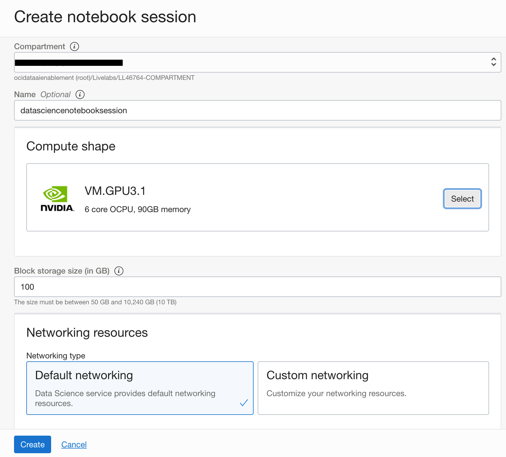

# Create a Notebook Session Running on a VM with A GPU

## Introduction

Data Science notebook sessions are interactive coding environments for building and training models. Notebook sessions provide access to a JupyterLab serverless environment that is managed by the Data Science service. All notebook sessions run in the Data Science service tenancy.

A notebook session is associated with a compute instance, VCN, subnet, and block storage. There are two block storage drives that are associated with a notebook session. There is a boot volume that is initialized each time the notebook session is activated. Any data on the boot volume is lost when the notebook session is deactivated or terminated. There is an additional block storage that is persisted when a notebook session is deactivated, but it is not persisted when a notebook session is terminated. This block volume is mounted in the ``/home/datascience`` directory and it is where the JupyterLab notebooks, data files, installed custom software, and other files should be stored.

When a notebook session is activated or created, the compute instance shape, block storage, VCN, and subnet are configured. These resources can only be changed by deactivating a notebook session, and then changing the configuration while activating the notebook session again. The size of the block storage can only be increased.

*Estimated Lab Time*: 15 minutes

### Objectives
In this lab, you:
* Use the Console to create a Data Science notebook session running on a virtual machine with a GPU
* Use the Console to open the Data Science notebook session

### Prerequisites

* A tenancy that is configured to work with the Data Science service.
* A configured project, VCN, and subnet.
* An account that has permission to create a Data Science notebook session.

## Task 1: Creating a Notebook Session

1. [Login to the OCI Console](https://www.oracle.com/cloud/sign-in.html).
1. Click the **Navigation Menu** in the upper left, navigate to **Analytics & AI**, and select **Data Science**. 
	

1. Select the compartment for the project.
1. Click the name of the project to contain the notebook session.
    

1. Click **Create Notebook Session**.
    

1. Confirm that the compartment that is selected is the compartment that is assigned to your account. The **Workshop Details** section at the top of the instructions page lists the compartment. If the compartment is different, change it to the one listed in the **Workshop Details** section.
1. (Optional, but recommended) Enter a unique name for the notebook session (limit of 255 characters). If you do not provide a name, a name is automatically generated for you.
1. Select a VM shape. The [Compute Shapes](https://docs.cloud.oracle.com/en-us/iaas/Content/Compute/References/computeshapes.htm) page has details on the specifications. For this lab, it is recommended that you use an NVIDIA GPU VM.GPU3.1. Click the **Select** button in the compute shape. This will open the select shape window. To choose the shape, click **NVIDIA GPU**, then check the box beside **VM.GPU3.1**, and finally click **Select**.
1. Enter the block volume in GB. The suggested size is 100 Gb or larger.
1. In the networking resources section, select the default networking option.
1. (Optional) Add tags to the notebook session by selecting a tag namespace, then entering the key and the value. You can add more tags to the compartment by clicking **+Additional Tags**, see [Working with Resource Tags](https://docs.cloud.oracle.com/iaas/Content/General/Concepts/resourcetags.htm#workingtags).
1. (Optional) View the details for your notebook session immediately after creation by selecting **VIEW DETAIL PAGE ON CLICKING CREATE.**.
1. Click **Create**.
    

    While the notebook session is being created, you can navigate away from the current page.
    

## Task 2: Opening a Notebook Session

Once the notebook session has been created the notebook session page shows the notebook in an **Active** or **Inactive** state. To open the notebook:

1. [Login to the OCI Console](https://www.oracle.com/cloud/sign-in.html).
1. Open the navigation menu.
1. Under **Data and AI** and select **Data Science**. This will open the **Projects** page.
1. Select the compartment for the project.
1. Click the name of the project to contain the notebook session. This will open the Projects page.
    

1. Click the name of the notebook session. This will open the Notebook Session page.
    

1. If the notebook is in the **Creating** state, then wait until it is in the **Active** state.

1. If the notebook is in an **Active** state, then click **Open**.
    

1. If the notebook is in an **Inactive** state, then:
    1. Click **Activate** to open the **Activate Notebook Session** dialog with the configuration from the last time the notebook session was activated or created.
    1. Select a VM shape. The [Compute Shapes](https://docs.cloud.oracle.com/en-us/iaas/Content/Compute/References/computeshapes.htm) page has details on the specifications. For this lab, it is recommended that you use an NVIDIA GPU VM.GPU3.1. Click the **Select** button in the compute shape. This will open the select shape window. To choose the shape, click **NVIDIA GPU**, then check the box beside **VM.GPU3.1**, and finally click **Select**.
    1. Enter the block volume in GB. The suggested size is 100 Gb or larger. The size of the block storage can be increased, but not decreased. 
    1. In the networking resources section, select the default networking option.
    1. Click **Activate** and the notebook session status changes to **Updating**.
    1. When the notebook session status changes to **Active**, click **Open**

You can *proceed to the next lab*.

## Acknowledgements

* **Author**: [John Peach](https://www.linkedin.com/in/jpeach/), Principal Data Scientist
* **Last Updated By/Date**:
    * [John Peach](https://www.linkedin.com/in/jpeach/), Principal Data Scientist, April 2022

