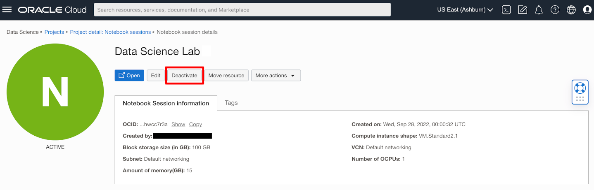
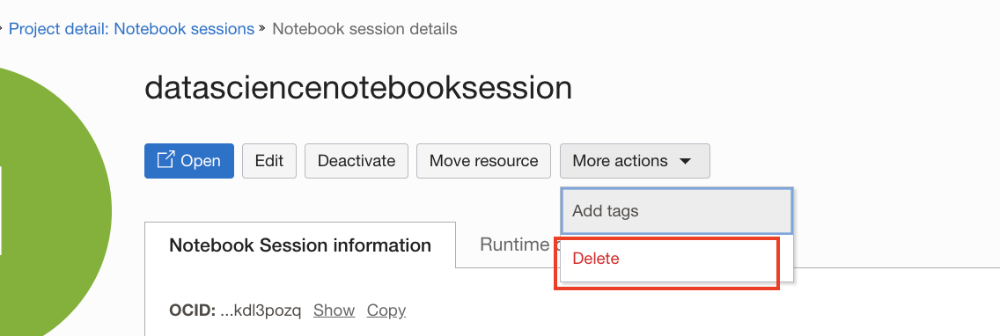
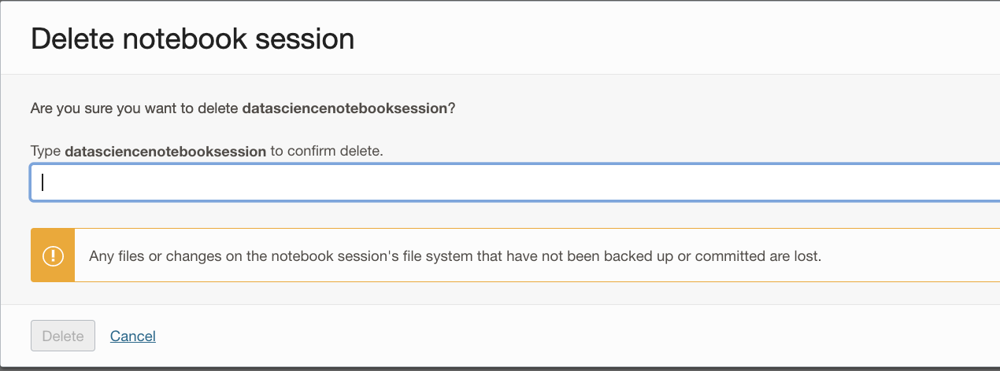

# Shutting Down a Notebook Session

## Introduction

When a notebook session is in an active state, there is a boot volume, block storage, and compute attached to it. When the notebook is not being used, it is possible to detach the computing resource and thus reduce costs. There are two methods for shutting down a notebook session. If a notebook session is deactivated, then the underlying computing resource is shut down and the boot volume and block storage are detached. However, the block storage, which is mounted at ``/home/datascience``, is persisted for later use. The boot volume is *not* persisted. Deactivated notebook sessions can be activated again and the block volume is automatically reattached. During activation, you can change the compute shape, increase the size of the block volume, and change the VCN and subnet.

If the notebook session and its block storage are no longer needed, then the notebook session can be terminated. Terminating a notebook session releases the underlying compute, boot volume and block storage. Since the boot volume and block storage are not persisted, any data on these volumes will be lost. It is not possible to reactivate a terminated notebook session.

*Estimated Time*: 10 minutes

### Objectives

In this lab, you will:
* Learn the different methods of shutting down a notebook session.
* Understand the differences between deactivating and terminating a notebook session.
* Become familiar with the steps needed to deactivate and terminate notebook sessions.

### Prerequisites

* (Optional) An active notebook session that can be deactivated or terminated.

## Task 1: Deactivating Notebook Sessions

Before deactivating a notebook session, save all your work to the attached block volume. Any data or files stored on the compute boot volume or held in memory are deleted when the notebook session is deactivated. The data and files saved on the block volume, which is mounted at ``/home/datascience``, are maintained while the notebook session is inactive. Access to the block volume is restored when the notebook session is activated.

1. [Login to the OCI Console](https://www.oracle.com/cloud/sign-in.html).
1. Open the navigation menu.
1. Under **Data and AI** and click **Data Science**. This will open the **Projects** page.
1. Select the compartment for the project.
1. Click the name of the project to contain the notebook session to open the Projects page.
    
1. Click the name of the notebook session to open the Notebook Session page.
    
1. Click **Deactivate**.
    

1. Click **Deactivate** to confirm the deactivation. The status changes to **Updating** and then **Inactive**.

    

## Task 2: Terminating Notebook Sessions

To keep the file changes in a notebook session’s boot volume and attached block volume, you must back them up before the notebook session is terminated. For example, copy the files to an object storage bucket, or commit and push changes to a Git repository outside the notebook session. Otherwise, all file changes in the notebook session’s boot volume and attached block volume are deleted.

1. [Login to the OCI Console](https://www.oracle.com/cloud/sign-in.html).
1. Open the navigation menu.
1. Under **Data and AI** and select **Data Science**. This will open the **Projects** page.
1. Select the compartment for the project.
1. Click the name of the project that contains the notebook session.
    

1. Click the name of the notebook session and open the Notebook Session page.
    

1. Click **More Actions**, then click **Delete**.
    

1. Type in the name of the notebook to confirm the termination. The status changes to **Deleting** and then **Deleted**.

    

## Acknowledgements

* **Author**: [Wendy Yip](https://www.linkedin.com/in/wendy-yip-a3990610/), Data Scientist
* **Last Updated By/Date**:
    * [Wendy Yip](https://www.linkedin.com/in/wendy-yip-a3990610/), Data Scientist, Sept 2022
