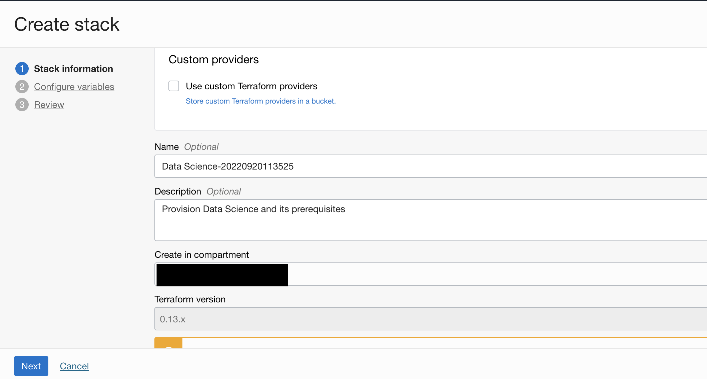

# Data Science Service Setup

## Introduction

To use the Oracle Cloud Infrastructure (OCI) Data Science service, your tenancy has to be configured to grant permission to users and resources. If your tenancy is not configured, you will need administrator permissions to configure it. If you created a free tier account, your account has administrator permissions . There are two ways to configure the tenancy. It can be [manually configured](https://docs.cloud.oracle.com/en-us/iaas/data-science/using/configure-tenancy.htm) or configured via the [Oracle Resource Manager](https://www.oracle.com/cloud/systems-management/resource-manager/). In this lab, your tenancy is configured using the [Data Science Solution Hub](https://docs.cloud.oracle.com/en-us/iaas/data-science/using/orm-configure-tenancy.htm), which is part of the Oracle Resource Manager. The Oracle Resource Manager provides an interface that assists in creating customized stacks that configure a tenancy to work with the Data Science service.

The instructions below allow you to set up a basic configuration to work with the Data Science service. We recommend this path for free tier accounts and other tenancies that have a standard configuration. For more elaborate tenancy configurations, you can [manually configure the resources](https://docs.cloud.oracle.com/en-us/iaas/data-science/using/configure-tenancy.htm).

By default, a tenancy is not configured to work with the Data Science service. If the tenancy is already configured to work with the service, then you can skip the following setup instructions and move to the next lab. If you do not know if your account is configured for the service or not, ask your system administrator.

*Estimated Time:* 20 minutes

### Objectives

In this lab, you:
* Use the Oracle Resource Manager Solution Hub to create a stack
* Become familiar with the options available to configure a tenancy to work with the Data Science service.
* Apply a stack to create the policies, groups, dynamic groups and other resources need to access the Data Science service.
* Destroy a stack if the stack fails to be applied.

### Prerequisites

* Log into the tenancy using an administrator account.

## Tenancy Configuration

Configuring a tenancy using Oracle Resource Manager includes creating a solution stack, selecting the solution, providing identifying information for the new stack, and updating variables. For most tenancies, the default options are sufficient. These instructions outline the minimal requirements needed for configuring a tenancy to work with the Data Science service. 

1. [Login to the OCI Console](https://www.oracle.com/cloud/sign-in.html) with an account with administrator permissions.

1. Click the **Navigation Menu** in the upper left, navigate to **Developer Services**, and select **Stacks**.

	

1. Choose a compartment you have permission to work in (on the left side of the page). The page updates to display only the resources in that compartment. If you are not sure which compartment to use, contact an administrator.

1. Click **Create Stack**.

    

1. Click **Template**, and then click **Select template**. 
    

1. Select **Data Science**, and then click **Select template**.
    
1. Enter a **Name** for the new stack, or use the default.
1. (Optional) Enter a **Description**.
1. Select the compartment where you want to create the stack. This compartment contains all of the resources the stack creates.
    

1. (Optional) You can apply tags.
1. Click **Next**. The **Configure Variables** panel displays variables that are automatically populated from the Terraform configuration for the Data Science solution.
    

1. (Optional) 
Select **Enable Vault Support?** to enable storing secrets, encrypted passwords, and keys, and then enter vault values to create a vault.

1. Click **Next** and review the stack configuration.
1. Click **Create** to create your stack. This creates the stack, but does not create any Data Science resources. The **Stack Details** page appears.
    

1. Click **Terraform Actions**, and then click **Apply** to apply the Terraform script and create the Data Science resources. If the stack generates an error, click **Terraform Actions**, and then click **Destroy** to remove the resources. Fix any issues, and then repeat this step.
    
1. Wait for the stack to complete the creation of the resources.

You may now **proceed to the next lab**.

## Acknowledgements

* **Author**: [Wendy Yip](https://www.linkedin.com/in/wendy-yip-a3990610/), Data Scientist
* **Last Updated By/Date**:
    * [Wendy Yip](https://www.linkedin.com/in/wendy-yip-a3990610/), Data Scientist, Sept 2022
