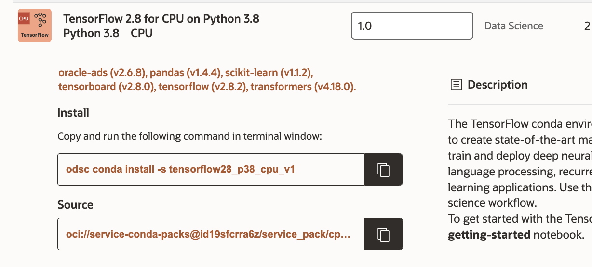

# Image Classification Model

## Introduction

Image classification with a machine learning model is the task of training a model with a set of images labeled in different classes and using the model to predict the label of an image the model has not encountered before.  It has many broad applications ranging from quality control for manufacturing to crop monitoring for precision agriculture. An important application is using machine learning models to classify medical images for disease diagnosis.  

In this lab, you’ll learn how to create your own deep learning model to diagnose pneumonia on chest x-ray images of patients. You’ll use Data Science notebook sessions to train a custom deep learning model and also use transfer learning to tune a pre-trained model on the x-ray images. You will learn how to deploy your model for consumption by third-party applications.

*Estimated Time*: 60 minutes

### Objectives

In this lab, you will:

* Learn how to work with a JupyterLab notebook.
* Perform data exploration with Accelerated Data Science (ADS) SDK.
* Define a custom deep learning model and train the model.
* Apply transfer learning on a pre-trained model.
* Save a model to the Data Science model catalog.
* Deploy a model with Data Science model deployment.

### Prerequisites

This lab assumes that you have:
* A Data Science notebook session.
* A working knowledge of Python

## Task 1: Set up Conda Environment

1.  After you log into OCI Data Science and create a notebook, open the notebook.  Once inside, go to **File** and select **New Launcher**.  You will see the **Environment Explorer**. When you click on **Environment Explorer**, you will see a list of pre-built conda environments you can install. A conda environment is a collection of libraries, programs, components and metadata. It defines a reproducible set of libraries that are used in the data science environment. 

    

1.  For this lab, we are going to use the TensorFlow 2.7 for CPU on Python 3.7 conda v 1.0.  Scroll through the list of pre-built conda environments to find it.

    

1.  Under **Install**, copy the command and execute it in a terminal.  You can launch a new terminal by going to the Launcher and finding the icon for terminal.

    

    

1.  When prompted for the version number, press Enter.

    


1.  After you have set up your conda environment, when you start a new notebook, choose tensorflow27_p37_cpu_v1 for the Kernel.

    

## Task 2: Download Image Classification JupyterLab Notebook from Object Storage

1. To access the image classification JupyterLab notebook, first open a new terminal window.  Go to **File**, select **New**, choose **Terminal**. Copy and paste the following commands one by one in the terminal window and press Enter after each command. The commands will create a folder named **demo** inside the directory `/home/datascience/conda/notebooks/tensorflow27_p37_cpu_v1/` and get the image classification notebook and related files in a folder called **xray\_diagnostics\_hol** from Object Storage.

    ```
    cd /home/datascience/conda/notebooks/tensorflow27_p37_cpu_v1
    mkdir demo
    cd demo 
    wget https://objectstorage.us-ashburn-1.oraclecloud.com/p/1WQi6Uy62t-z1EcgFBTQf7QusdKn9xImkI8c1q7XYjjT1DMVqllFx7QX_mnaXsvl/n/bigdatadatasciencelarge/b/hosted-datascience-docs/o/Cloudworld22hol/xray_diagnostics_pneumonia/xray_diagnostics_hol.zip
    ```
2.  Navigate to the **xray\_diagnostics\_hol** folder

* Go to the home directory


* Click on the **conda** folder

* Click on the **notebooks** folder

* Click on the **tensorflow\_27\_p37\_cpu\_v1** folder

* Click on the **demo** folder

* Click on the **xray\_diagnostics\_hol** folder

* Open **ChestXrays\_Train.ipynb** file 

This is the notebook where we will work through an image classification problem.  

3.  Select TensorFlow 2.7 for CPU on Python 3.7 conda in the top right corner of the notebook


4.  Go through the **ChestXrays\_Train.ipynb**.  You can run each cell in the JupyterLab notebook by clicking on it and pressing *shift + enter*. That will execute the cell and advance to the next cell. Or you can go to the `Run` tab and choose "Run Selected Cells".

You may now **proceed to the next lab**.

## References

For more information, please refer to our:

* [Service Documentation](https://docs.oracle.com/en-us/iaas/data-science/using/data-science.htm)
* [Keras Documentation](https://keras.io/)

## Acknowledgements

* **Author**: [Wendy Yip](https://www.linkedin.com/in/wendy-yip-a3990610/), Data Scientist
* **Last Updated By/Date**:
    * [Wendy Yip](https://www.linkedin.com/in/wendy-yip-a3990610/), Data Scientist, Sept 2022

