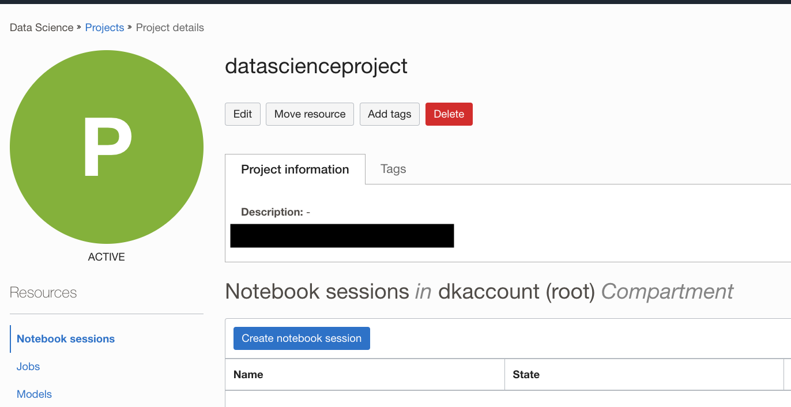
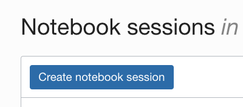
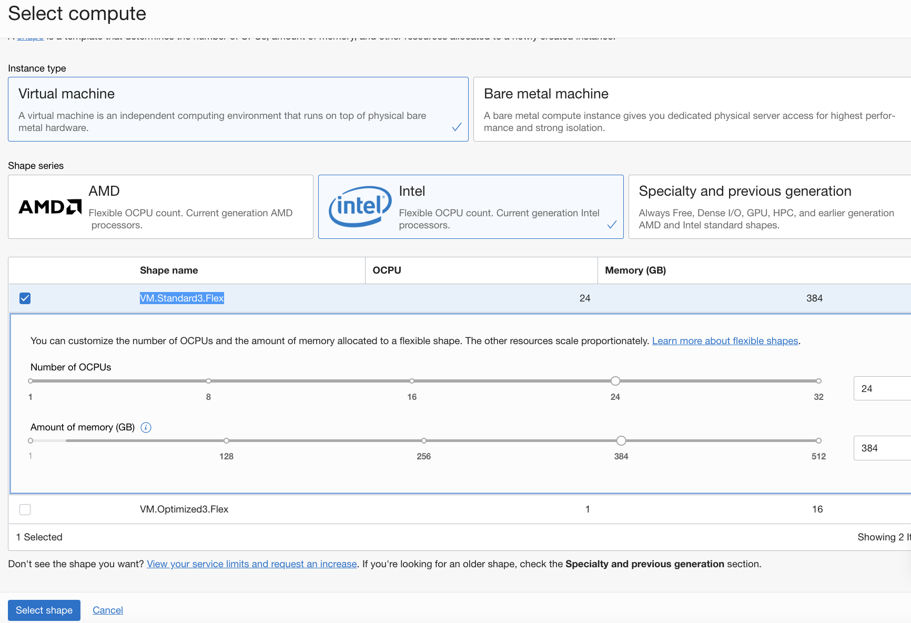
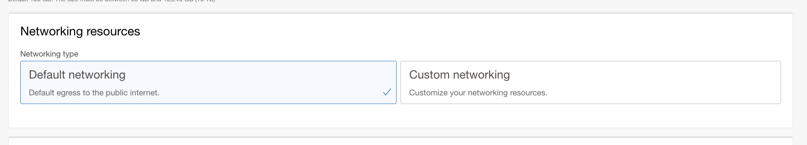
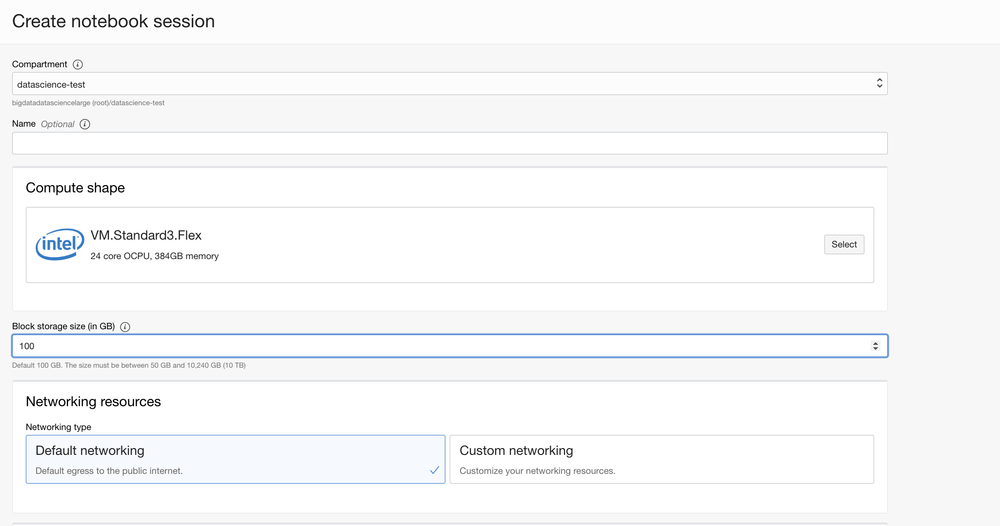

# Data Science Project Setup

## Introduction

Projects are used to collect related data science resources and artifacts, such that it enables you to organize your work. They contain a collection of notebook sessions and models.  Data Science notebook sessions are interactive coding environments for building and training models. Notebook sessions provide access to a JupyterLab serverless environment that is managed by the Data Science service. All notebook sessions run in the Data Science service tenancy.

A notebook session is associated with a compute instance, VCN, subnet, and block storage. There are two block storage drives that are associated with a notebook session. There is a boot volume that is initialized each time the notebook session is activated. Any data on the boot volume is lost when the notebook session is deactivated or terminated. There is an additional block storage that is persisted when a notebook session is deactivated, but it is not persisted when a notebook session is terminated. This block volume is mounted in the ``/home/datascience`` directory and it is where the JupyterLab notebooks, data files, installed custom software, and other files should be stored.

When a notebook session is activated or created, the compute instance shape, block storage, VCN, and subnet are configured. These resources can only be changed by deactivating a notebook session, and then changing the configuration while activating the notebook session again. The size of the block storage can only be increased.

*Estimated Time*: 15 minutes

### Objective

In this lab, you will:
* Use the Console to create a Data Science Project.
* Use the Console to create a Data Science notebook

### Prerequisites

* A tenancy that is configured to work with the Data Science service.
* An account that has permission to create a Data Science project.
* An account that has permission to create a Data Science notebook session.

## Task 1: Creating a Project

You can create a Data Science project to organize your notebook sessions and models within your project.

1. [Login to the OCI Console](https://www.oracle.com/cloud/sign-in.html).
1. Open the navigation menu.
1. Under **Data and AI** and select **Data Sciences**. This will open the **Projects** page.
1. Select the compartment where the project is to be created.

1. Click **Create Project**.

    
1. (Optional, but recommended) Enter a unique name (255 character limit) for the project. If you do not provide a name, a name is automatically generated for you.

1. (Optional, but recommended) Enter a description (400 character limit) for the project. If you do not add a description, it remains empty.

1. (Optional) Add tags to easily locate and track the project by selecting a tag namespace, then entering the key and value. To add more than one tag, click **+Additional Tags**. [Tagging](https://docs.cloud.oracle.com/iaas/Content/Tagging/Concepts/taggingoverview.htm) describes the various tags that you can use organize and find projects including [cost-tracking tags](https://docs.cloud.oracle.com/iaas/Content/Tagging/Tasks/usingcosttrackingtags.htm).

1. (Optional) To view the details for your project immediately after creation, select **VIEW DETAIL PAGE ON CLICKING CREATE.**.

    

1. Click **Create**.

    

    This creates the project and opens the project page.

## Task 2: Creating a Notebook Session

1. Click on the name of the project you just created.

1. Click **Create Notebook Session**.
    

1. Select the compartment that you want to contain the notebook session.
1. (Optional, but recommended) Enter a unique name for the notebook session (limit of 255 characters). If you do not provide a name, a name is automatically generated for you.
1. Select a VM shape. The [Compute Shapes](https://docs.cloud.oracle.com/en-us/iaas/Content/Compute/References/computeshapes.htm) page has details on the specifications. For this lab, it is recommended that you use an Intel VM.Standard3.Flex shape. Click the **Select** button in the compute shape. This will open the select shape window. To choose the shape, click **Intel**, then check the box besides **VM.Standard3.Flex**.  VM.Standard3.Flex is a flexible compute shape, meaning the number of OCPUs and memory are not fixed and can be specified by the user.  Select 24 OCPU and 384 GB in memory which is a 1 OCPU to 16 GB ratio.  Then click **Select**.
    

1. Enter the block volume in GB. The suggested size is 100 GB or larger.
1. In the networking resources section, select the default networking option.
    
1. (Optional) Add tags to the notebook session by selecting a tag namespace, then entering the key and the value. You can add more tags to the compartment by clicking **+Additional Tags**, see [Working with Resource Tags](https://docs.cloud.oracle.com/iaas/Content/General/Concepts/resourcetags.htm#workingtags).
1. (Optional) View the details for your notebook session immediately after creation by selecting **VIEW DETAIL PAGE ON CLICKING CREATE**.
1. Click **Create**.
    
1. When the notebook session status changes to **Active**, click **Open**.

You may now **proceed to the next lab**.

## Acknowledgements

* **Author**: [Wendy Yip](https://www.linkedin.com/in/wendy-yip-a3990610/), Data Scientist
* **Last Updated By/Date**:
    * [Wendy Yip](https://www.linkedin.com/in/wendy-yip-a3990610/), Data Scientist, Sept 2022
