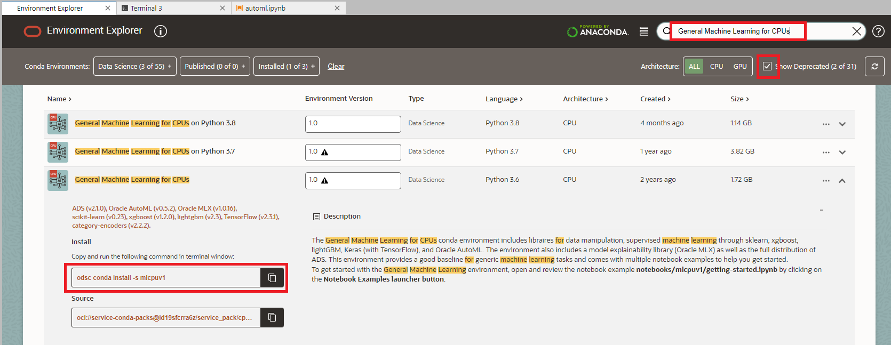

# Lab: AutoML

## Introduction

In this lab, we will use AutoML to train a model for the same problem as earlier (House Price Prediction), but this time automating Feature Selection, Algorithm Selection, Feature Encoding and Hyperparameter Tuning.

Once we've done that we will evaluate it using the ADS evaluation features and compare it with our "manually" built model that we created earlier.

This video covers a walkthrough of the lab.

Estimated lab time: 20 minutes

### Objectives

In this lab you will:
* Learn how to become more productive by using the ADS library.

### Prerequisites
* You've completed the previous labs in which you've trained the House Price Prediction model with Sci-kit Learn.

## Task 1: Install a Conda package that contains the AutoML libraries

1. Click on "Environment Explorer"

    

2. Search for a Conda environment that suits the type of development that we're going to do.

   - Search for the environments with the "automl" libraries with the search field at top right.
   - Open the details of the "General Machine Learning for CPUs" by clicking on the down arrow at the right.
   - Copy the installation command to the clipboard by clicking on the Copy button.

    

3. Open a terminal window by clicking on **File, New** and then **Terminal**.

    

4. Paste the command from the clipboard.

   `odsc conda install -s mlcpuv1 `

5. You will receive a prompt related to what version number you want. Press `Enter` to select the default.

6. Wait for the conda package to be installed.

    

   This will take about 5 minutes.

## Task 2: Train the model using AutoML

1. Download the notebook

  Download the [AutoML and Model Evaluation notebook](https://objectstorage.eu-frankfurt-1.oraclecloud.com/p/4BJdRs-n5LNQU6pAGuEvqNY4hoczgKX6LIO_FESCAxGgvxC6mA8ETCdm2K2WmZaK/n/fruktknlrefu/b/workshop-intro-to-ds/o/automl.ipynb). Depending on the browser you might have to use Left/Right click to do this. Make sure the extension of the saved file is .ipynb

2. Upload the notebook to OCI Data Science by dragging it to the left panel.

Open it by double clicking it.
    

3. Choose the right Conda environment

    You can do this by clicking on the Python icon on the top-right and selecting the mlcpuv1 environment.

    

4. Now go through each of the cells and run them one by one.

   This notebook demonstrates how you can be more productive by using the various features of  AutoML. You need far less code to create a well performing model quickly.

[Proceed to the next section](#next).

## Acknowledgements
* **Authors** - Jeroen Kloosterman - Product Strategy Director, Lyudmil Pelov - Senior Principal Product Manager
