# Basic Data Exploration

<!---->

## Introduction

In this lab our goal is to understand customer sentiment for a hotel called "The Lazy Dog". In an earlier lab we have extracted the sentiment from a collection of hundreds of written reviews from customers. We will now analyze the result of that extraction with the goal of finding aspects on which we can improve the business.

Estimated lab time: 20 minutes

### Objectives
- Learn how to use Oracle Analytics Cloud to explore data and find insights.

### Prerequisites
- An Oracle Free Tier, Always Free, Paid or Live Labs Cloud Account
- Oracle Analytics Cloud
- You've completed the previous lab that extracts sentiment from hotel reviews using the OCI Language API

## **Task 1**: Add the data to Oracle Analytics Cloud

1. From the **Oracle Cloud Infrastructure console** to **Analytics & AI** and then **Analytics Cloud**.

    

2. **Open** the Cloud Analytics **URL** associated with your instance (we created this earlier) by using the dots menu button on the right-hand side of your instance information and selecting **Analytics Home Page**.

   > Make sure your Oracle Analytics Cloud instance is in status `Active` (not `Creating`) before you go to the **Analytics Home Page**.
   >
   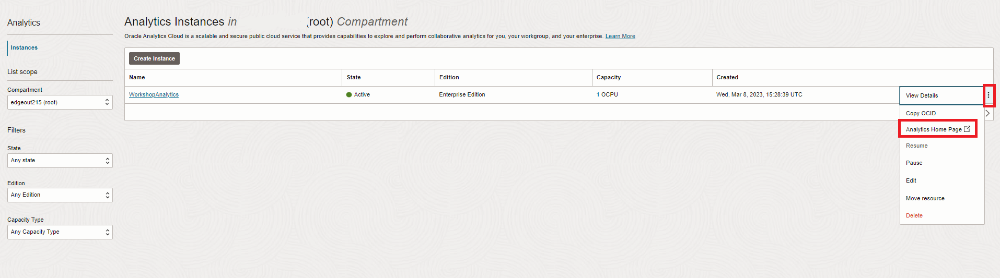

   The **Oracle Analytics** page will open in a new browser **window/tab**.

3. On the top right-hand side of the screen, click **Create**, and then **Dataset**.

    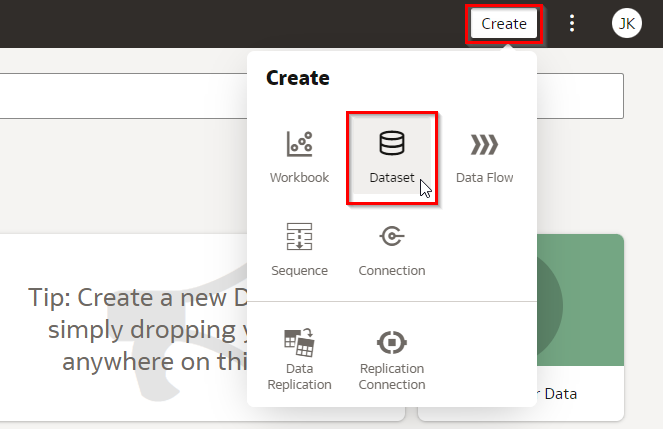

4. Upload the Review.csv data set from your local machine to the "Drop data file here or click to browse" area.

    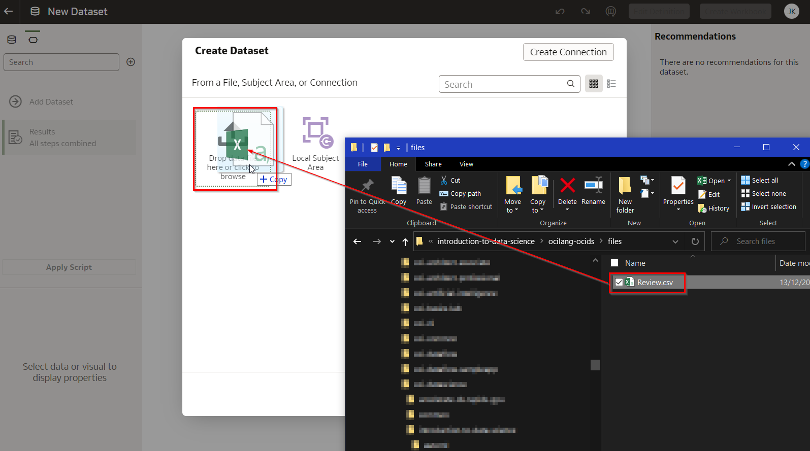

4. Click on the "ReviewId" column. Change its "Treat As" to "Attribute".

    

5. Click on the Left arrow on the top-left to go back to the main menu. Confirm by clicking on "Save".

    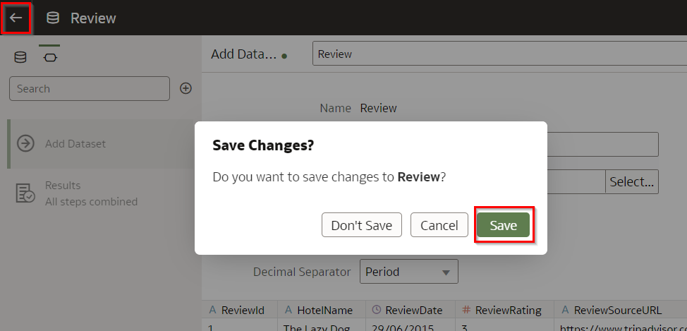

6. Back on the homepage, on the top right-hand side of the screen, click **Create**, and then **Dataset**.

    

4. The previous lab extracted the sentiment of the reviews and stored the results in a file called "Sentiment.csv".

    Upload the Sentiment.csv data set from your local machine to the "Drop data file here or click to browse" area.

    

4. Click on the "ReviewId" column. Change its "Treat As" to "Attribute".

    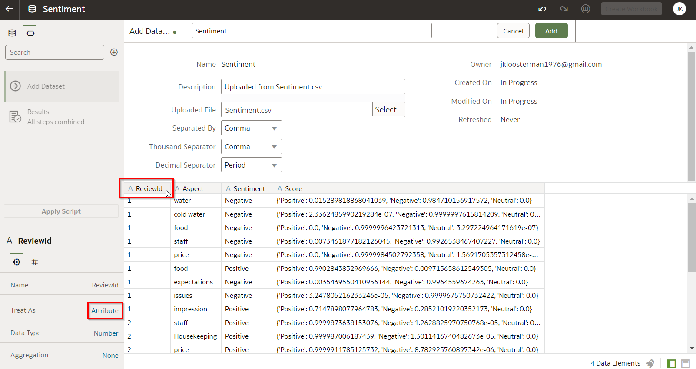

5. Click on the Left arrow on the top-left to go back to the main menu. Confirm by clicking on "Save".

    

## **Task 2**: First analysis of aspects (keywords)

We will now create a number of visualizations in a "Workbook", with the goal of finding insights in the data.

1. From the home page, click on "Data", then "Sentiment". This will create a new workbook that uses this dataset.

    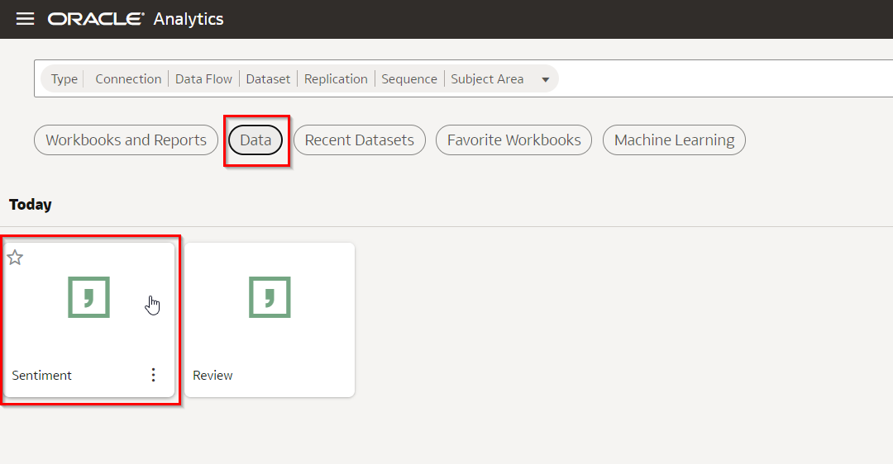

2. Our goal is to create a word cloud that shows the most common topics that are mentioned by our customers.

   Right click on the "Aspect" field, then choose "Pick Visualization", then the "Tag Cloud" icon.

	 

   You will now see a large tag cloud of all the aspects that have been talked about by our customers in the last few years.

	 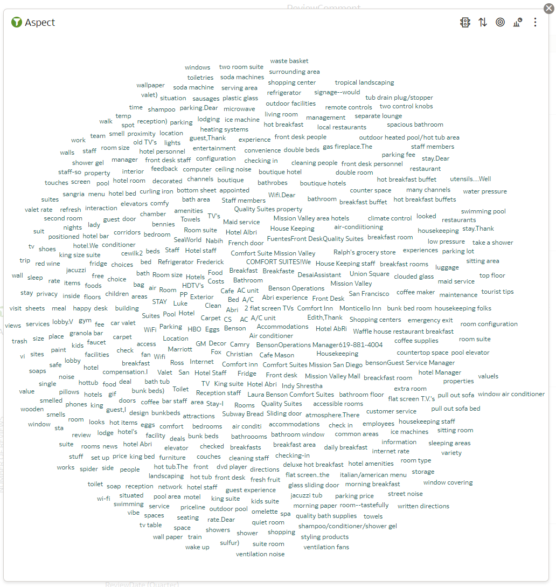

3. We'd like to show the more commonly talked about aspects more prominently. For this we'll create a simple calculation that counts the number of mentions of each aspect.

   - Right click on "My Calculations"
	 - Name the new field "NUMBER OF MENTIONS"
	 - Type <code>COUNT()</code> into the calculation field
	 - Drag the "ReviewId" field (from the left) to between the () symbols

	 The end result should look like in the screenshot.

    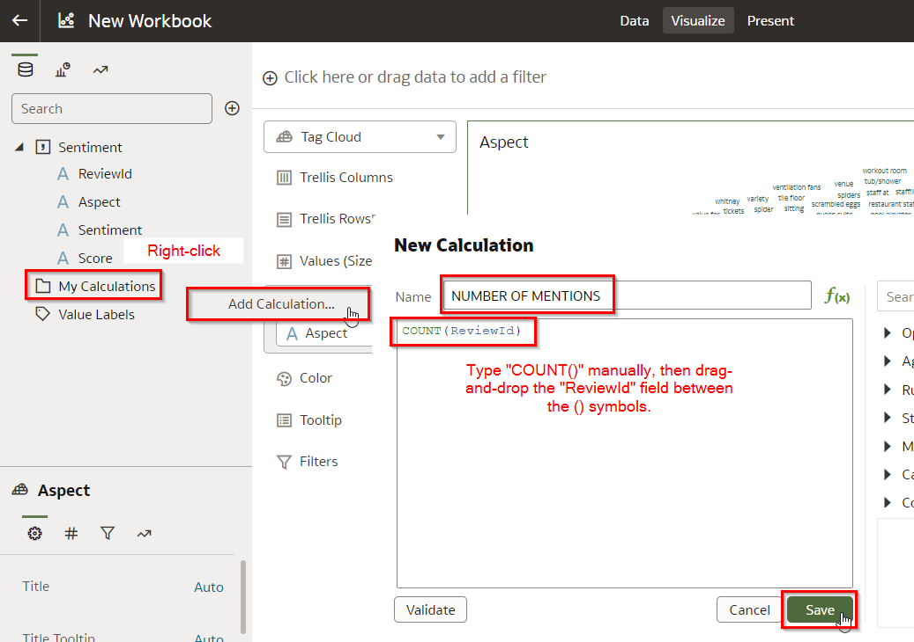

    Press "Save".

10. Drag the new "NUMBER OF MENTIONS" field to the "Values (Size)" section.

    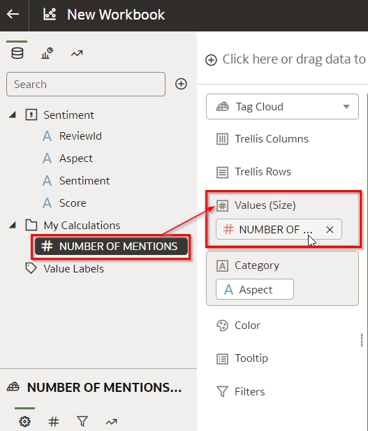

    You will see that aspects that are mentioned more often are now displayed in a bigger font.

    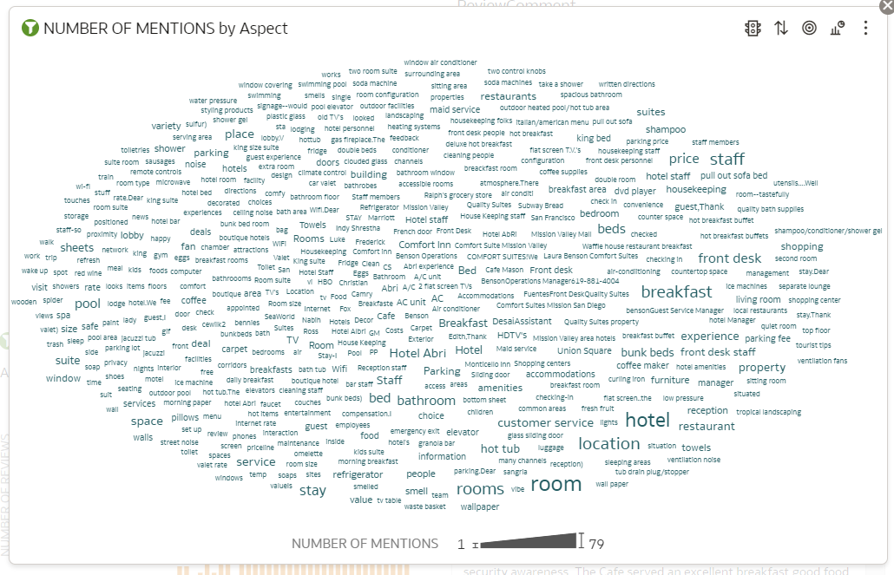

11. We'd also like to use color to indicate whether an aspect was mentioned in a negative way or a positive way.

    Drag the "Sentiment" field to the Color section.

    

12. Update the sentiment colors to something a bit more intuitive. Click on the drop-down icon, then choose "Manage Assignments".

    

13. Choose Red (#FF0000) for negative sentiment and Green (#00FF00) for positive sentiment.

    

    The result is the following tag cloud.

    

## **Task 3**: Find out which aspects require our most urgent attention

<!--This tag cloud shows aspects of reviews from many years in the past. To help us focus in on the most pressing aspects, let's limit our view and focus on the more recent reviews.

Notice that the Sentiment dataset does not contain any date information. Therefore, if we want to filter by time, we'll have to include the original Review dataset.-->

1. Let's focus only on the negative aspects first.

   Drag the Sentiment field to the Filter section. Then select "Negative".

	 

   We see that several aspects, such as "room", "bathroom" and "breakfast" show as negative.

	 

2. To have a deeper understanding how certain aspects have received a negative sentiment, we really need to see the original comments from the customers. Therefore, let's include the original Review dataset.

   Click on the "+" icon next to the search field on the top left.

    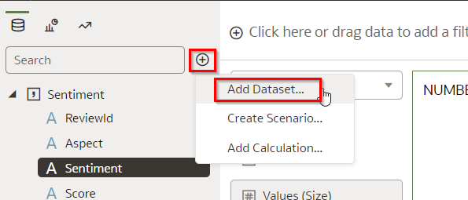

3. Click "Review", then "Add to Workbook".

    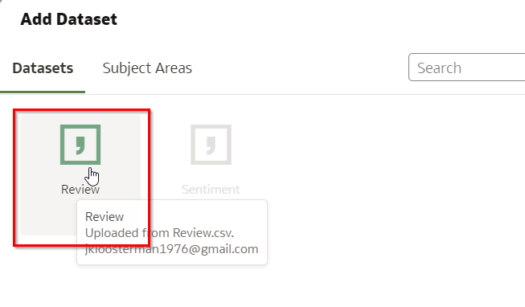

4. Make sure that the datasets are linked up correctly. Click on "Data" on the top. You will see the Data Diagram.

    

5. Click on the "1" to show the relationship that exists between the two datasets. Change the "This Connection Will..." setting to "Extend a Dimension" and press OK.

    

6. Go back to the visualization by choosing "Visualize" at the top of the screen.

    

<!--

7. Create a new calculation to count the number of reviews per time period.

   - Right click on "My Calculations"
   - Name the new field "NUMBER OF MENTIONS"
   - Type <code>COUNT()</code> into the calculation field
   - Drag the "ReviewId" field (from the **Review** dataset) to between the () symbols

   The end result should look like in the screenshot.

     

   Press "Save".

    

8. Now we'll build a visualization that shows the number of reviews over time.

   Open the "ReviewData" dataset and select Quarter. Also select the newly calculated field "NUMBER OF REVIEWS". You can use Control+click to select multiple fields.

	 Then right-click on any of the selected fields to bring up the context menu. Then "Pick Visualization" and choose the Bar Chart icon.

    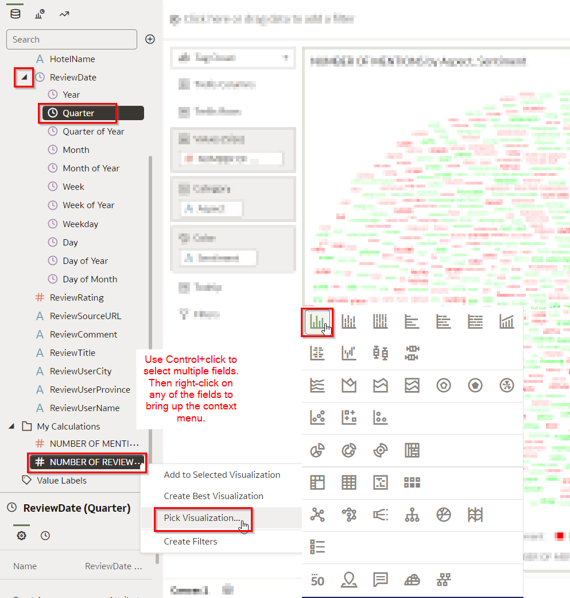

		The result should look like this.

    

6. Now, to zoom in on only the more recent reviews, right-click on the bar chart with the number of reviews by quarter, and choose "Use as Filter".

    

7. Draw a "window" on this chart to select the last 4 quarters.

    

-->

7. Now we are in a position to see the original reviews.

   Right-click on "ReviewComments", choose "Pick Visualization" and then the Table icon.

    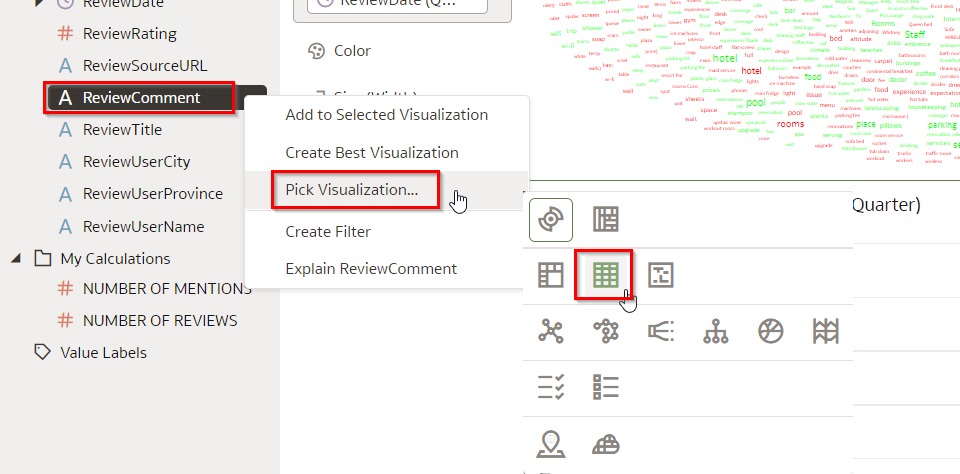

8. Our goal is to find those reviews that are associated with each of the most negatively mentioned aspects.

   Right-click on the tag cloud and choose "Use as Filter".

	 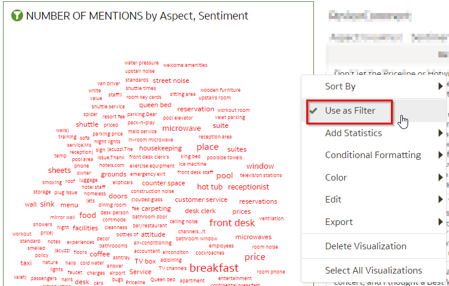

9. Now click on any of the aspects that you are interested in, e.g. "breakfast". Notice how the relevant reviews are automatically shown.

    

    (The word "breakfast" has been marked using the browser search option)

    During off-season, Lazy Dog doesn't provide breakfast for customers for efficiency reasons. This has been a conscious decision, to be able to offer the most competitive rate. However, looking at the negative reviews, we may have to reconsider.

    What else can you learn from this? See if you can come up with advice to give to the hotel.

## **Task 4:** Conclusion

In this use case, we saw how a hotel business found useful insights in textual data, and can use it to make better decisions on how to improve their business.

It's very useful to be able to leverage the value that's hidden away in textual data. In the past this type of data was difficult to leverage, but with the AI Language service you can find the insights that you're looking for.

Notice how we you don't require data science expertise to leverage the power of Natural Language Processing. We can use Analytics Cloud to work with this data in a use friendly way.

Congratulations on completing this lab!

## **Acknowledgements**
- **Author** - Jeroen Kloosterman, Technology Product Strategy Director, Luis Cabrera-Cordon - Senior Director of Product Management
