# Lab: Access OCI Language in OCI Data Science Notebook

## Introduction

In this lab you our goal is to understand customer sentiment for a hotel called "The Lazy Dog". We have collected hundreds of written reviews from customers, and now would like to understand the important topics that we should work on to improve customer satisfaction.

We will use the OCI Data Science service to call the OCI Language APIs and extract sentiment from the reviews. You will use the output from this lab in OAC later on (in the following lab) to do the analysis.

Estimated lab time: 20 minutes

### Objectives

In this lab you will:
* Become familiar with the Python API for the AI Language service.

### Prerequisites

* An Oracle Free Tier, Always Free, Paid or LiveLabs Cloud Account (see prerequisites in workshop menu)
* You've already provisioned OCI Data Science.

## Video

The following covers an introduction of this lab.
[](youtube:xvxSiPs5U-I)

## Task 1: Setup API Signing Key and Config File

The first step is to obtain an API Signing key for the AI service. We will need this later when actually call the service.

1. From the cloud console, open the Profile menu (User menu icon) and click User Settings.

   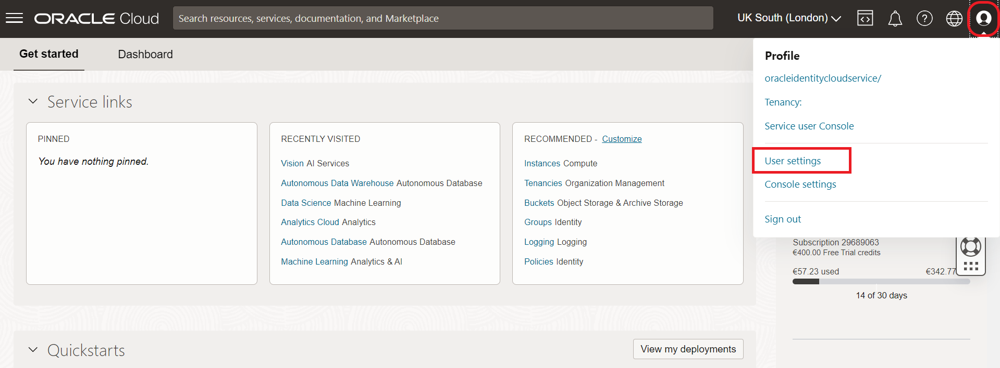

2. Navigate to API Key and then click "Add API Key".

   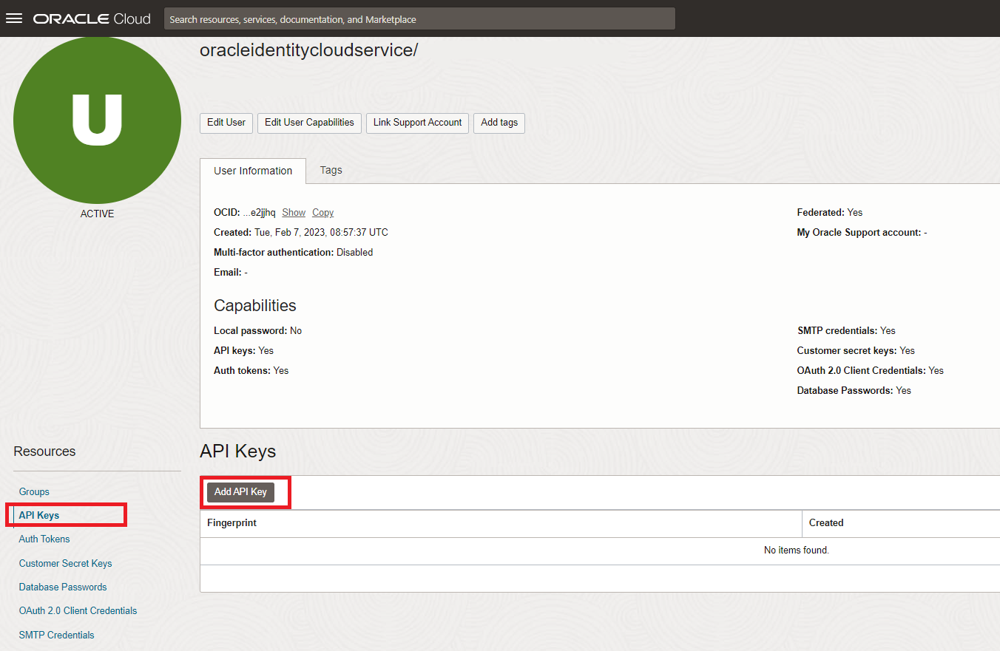

3. In the dialog, select Generate API Key Pair. Click Download Private Key and save the key to your local machine and then click Add.

   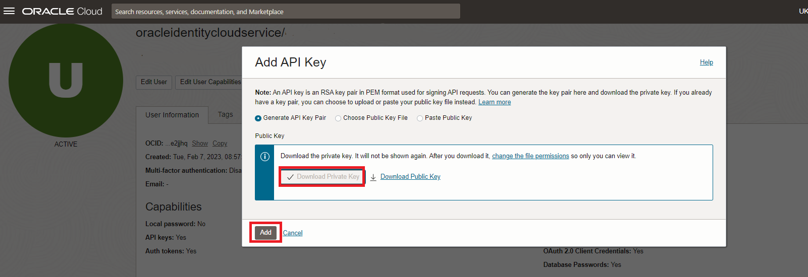

4. By default the key has a long name, similar to the following: **oracleidentitycloudservice_mytenancyname-12-17-12-50.pem**. Rename your local file to **key.pem**.

5. Select the text in the contents field and copy it to the clipboard.

   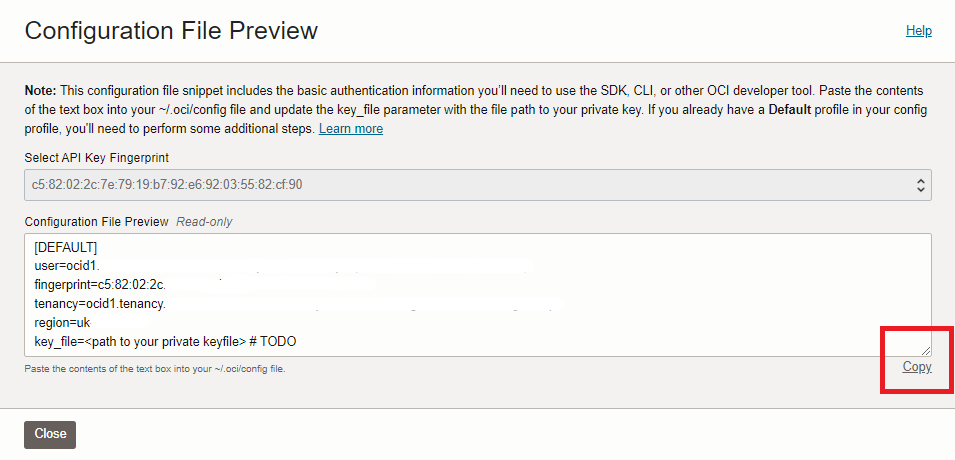

6. Create a file on your local machine called "config" (no extension)

   - Paste the contents of the clipboard into the new file.
   - Modify the second line to be exactly as shown in the screenshot
     <code>key_file=/home/datascience/.oci/key.pem</code>

   

## Task 2: Open the OCI Data Science notebook

1. From the OCI console, go to "Analytics & AI", then choose "Data Science".

    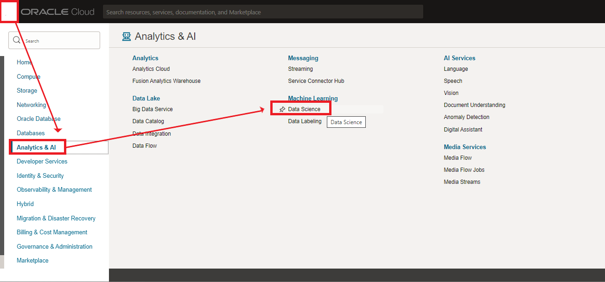

2. Select the OCI Data Science project that you created earlier.

    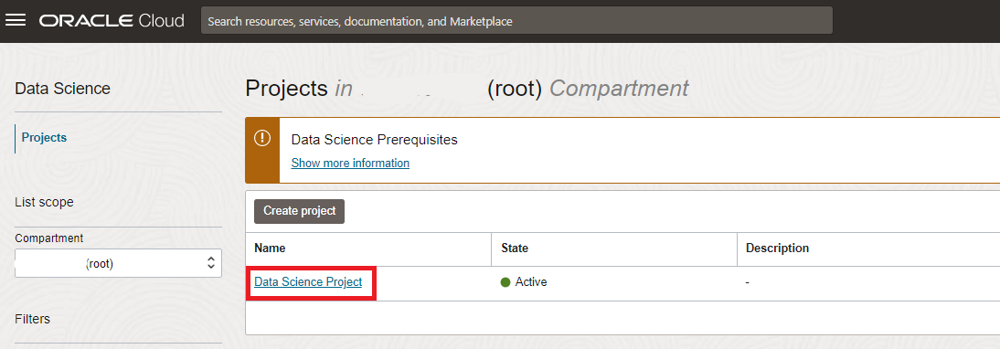

3. Select the notebook that you created earlier.

    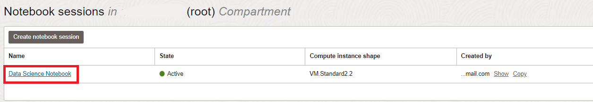

4. Open the notebook.

    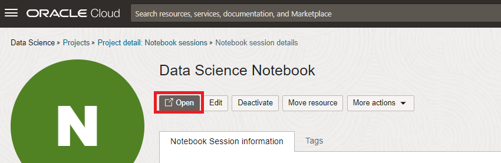

## Task 3: Setup API Signing Key and Config File in OCI Data Science

1. Drag and drop the "config" and "key.pem" files from your local machine to the notebook session.

    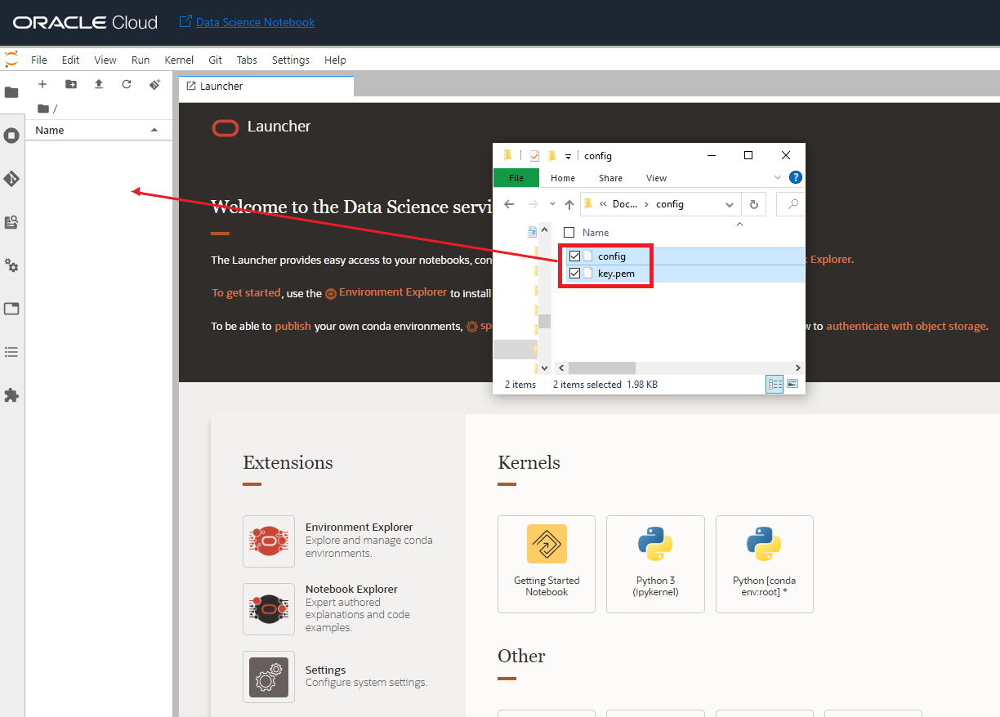

2. Open the Terminal by clicking the Terminal icon in the Launcher Tab.

    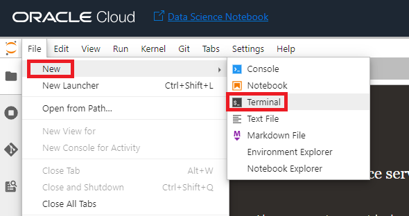

3. Create a new directory **.oci** and move the "config" and "key.pem" files to here by executing the following commands in the terminal.

    ```
    <copy>
    mkdir ~/.oci
    </copy>
    ```

    ```
    <copy>
    mv config ~/.oci
    </copy>
    ```

    ```
    <copy>
    mv key.pem ~/.oci
    </copy>
    ```

## Task 4: Call the AI Language service

1. Download the [Hotel Reviews dataset](https://objectstorage.eu-frankfurt-1.oraclecloud.com/p/DjRVSWNhvxbI65xeoOMPGUjdumYm54PDCS6rzo2--WBNyV6zoHRV8jIQwHapN4m-/n/fruktknlrefu/b/workshop-intro-to-ds/o/Review.csv). Depending on the browser you might have to use Left/Right click to do this. **Make sure the extension of the saved file is .csv, in some cases the browser may try to save it as .xls instead**.

2. Review the dataset (e.g. use Excel or a text editor).

    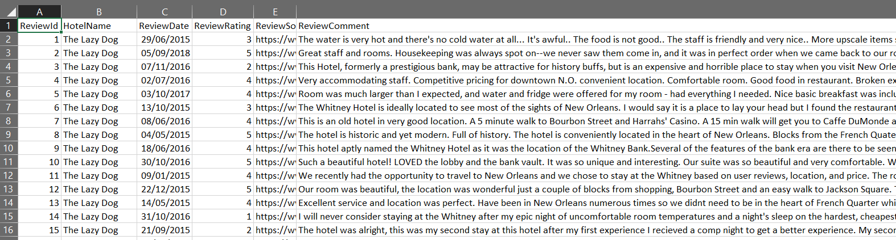

    Notice how each line contains a review for our hotel.

3. Upload the Review.csv files to the notebook (drag-and-drop).

    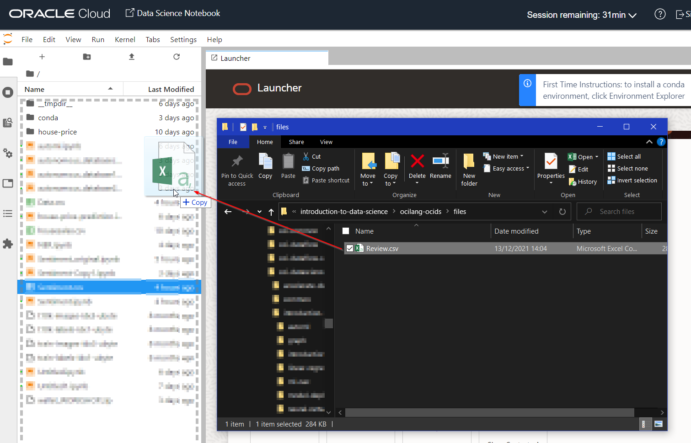

3. Create a new notebook by selecting File -> New -> Notebook.

    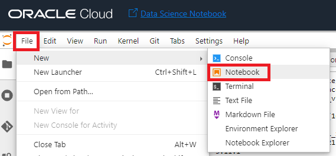

4. Select the Conda environment that you installed earlier (tensorflow27_p37_cpi_v1).

    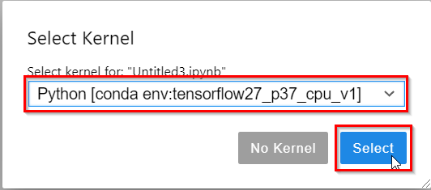

5. Now you are in the notebook.

   Copy the code for loading the required Python libraries by using the Copy button.

     ```python
     <copy>
     import oci
     import pandas as pd
     </copy>
     ```

   Paste the code into the Notebook and run it

   

   Follow the copy-paste approach every time you see a piece of code like this.

   Have a look at the bottom left of the window. When a command is still running it will show "Busy". When it has finished, you will see "Idle".

   **Always make sure that the last command has finished running (status=Idle) before running another cell.**

   If all is well, in this case you should not see any error message. The cursor simply moves to the next cell.

   

6. Load the data

    ```python
    <copy>
    AllHotelData = pd.read_csv('Review.csv')
Data = AllHotelData[['ReviewId', 'ReviewComment','ReviewDate']].reset_index()
    </copy>
    ```

    This should not produce any output.

6. Call the OCI Language API for each review.

   An artificial delay has been built in to work around certain limitations of OCI Trials. If you do not have such limitations, feel free to remove the delay.

    ```python
    <copy>
    from time import sleep
ai_client = oci.ai_language.AIServiceLanguageClient(oci.config.from_file())
data_with_result=[]
result=[]
for data in range(Data['ReviewComment'].size):
        print(data)
        sleep(0.2)
        detect_language_sentiments_details = oci.ai_language.models.DetectLanguageSentimentsDetails(text=Data['ReviewComment'][data])
        output = ai_client.detect_language_sentiments(detect_language_sentiments_details)
        Dict = {'Result':output.data, 'Date':Data['ReviewDate'][data], 'ReviewId':Data['ReviewId'][data]}
        result.append(Dict)
    </copy>
    ```

    You will see a counter as the API calls are taking place (about a 100). The process should take about 5 minutes.

7. Convert the result to an easy to read table format.

    ```python
    <copy>
    no_of_sentences = len(result)
    aspects=[]
    for res in range(no_of_sentences):
        for i in result[res]['Result'].aspects:
            temp_aspects = (result[res]['ReviewId'], i.text, i.sentiment, i.scores)
            aspects.append(temp_aspects)
            aspects_frame = pd.DataFrame(aspects, columns=['ReviewId', 'Aspect', 'Sentiment', 'Score'])
    aspects_frame
    </copy>
    ```

    You should see a list of all the aspects of a review and their sentiment. Note that a single review can have multiple aspects (e.g. "breakfast", "staff" and "price"). For example, in this screenshot you see that the first review has 5 aspects (the ReviewId is the same).

    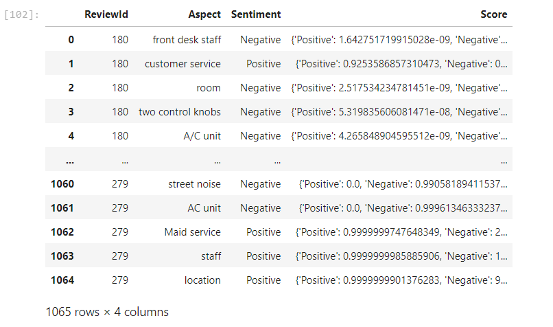

8. Save the resulting aspect+sentiment table to disk.

    ```python
    <copy>
    aspects_frame.to_csv('Sentiment.csv', index=False)
    </copy>
    ```

    You should see the file "Sentiment.csv" show up in the file navigator on the left.

    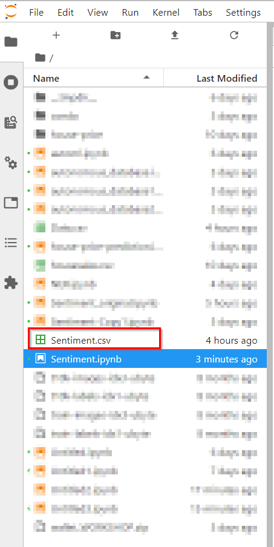

9. Download the sentiment file to your local machine.

   Right click on the Sentiment.csv file and choose Download.

    

Congratulations on completing this lab!

[Proceed to the next section](#next).

## Acknowledgements
* **Authors** - Jeroen Kloosterman - Product Strategy Director, Luis Cabrera-Cordon - Senior Director of Product Management
