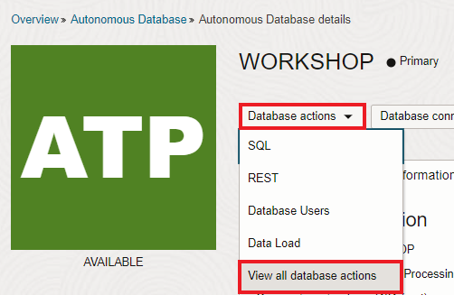
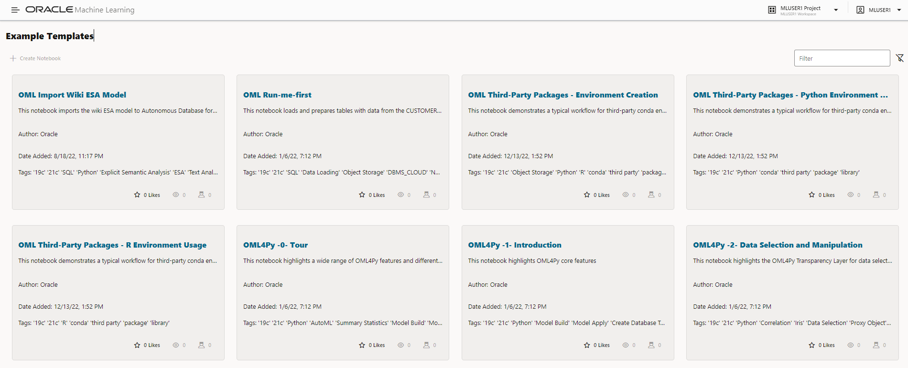
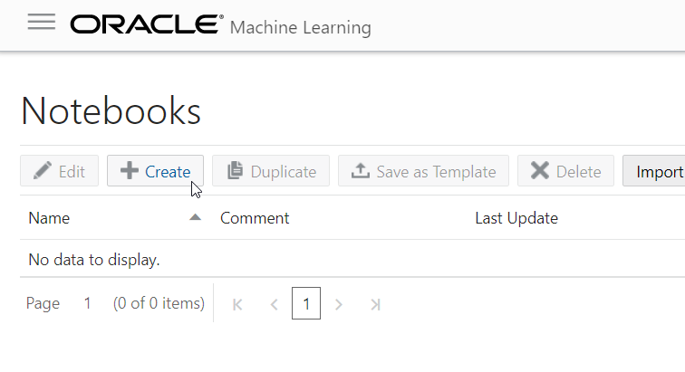
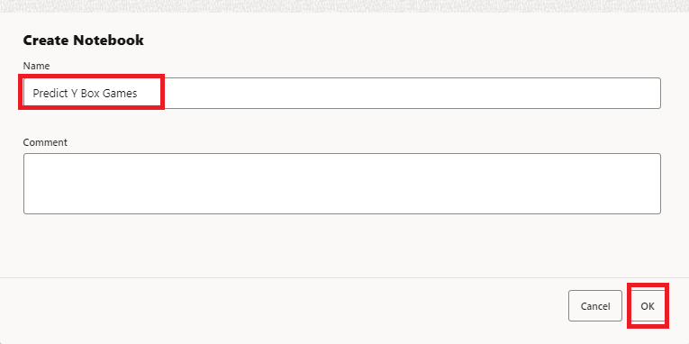
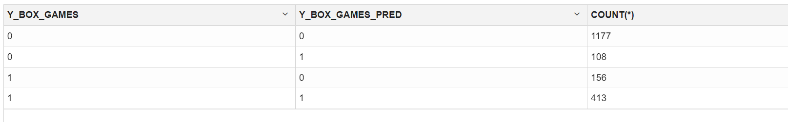

# Lab: In-database ML (using Autonomous Database)

## Introduction

In this lab you create an in-database ML model and operationalize it with an APEX application. The actual machine learning logic takes place in the database and the APEX application will pick up the predictions.

As this example we will apply machine learning on a sales scenario, in this case we will predict which customers are most likely to buy a certain product.

### Objectives

In this lab you will:
* Become familiar with in-database machine learning, in particular OML4SQL.
* Understand how APEX can be used to operationalize ML models.
* Get familiar with the business value of identifying customers that are likely to buy a certain product.

### Prerequisites

* An Oracle Free Tier, Always Free, Paid or LiveLabs Cloud Account (see prerequisites in workshop menu)

## Task 1: Open the machine learning notebook

1. Back in the ATP console, Open the Machine Learning Notebooks.

   Click on Service Console, then Development, then Oracle Machine Learning Notebooks.

   

   

2. Sign in

   Sign in with the new user MLUSER1 (password Oracle_12345).

   

6. Review examples

   Navigate around to get familiar with the ML pages. Click on "Examples".

   

   Note the various ML notebook examples. Feel free to review some of these.

   

## Task 2: Build the machine learning model with Zeppelin

Our goal is to predict which customers are interested in buying Y Box Games. In this case we will build a model by letting it learn from existing customers purchasing behavior.

1. Create a new notebook

   Back in the main menu, click on the upper left icon to bring back the menu.  Then select "Notebooks" and "Create".

   

   

   Name the new notebook "Predict Y Box Games".

   

2. Review the input data

    Review the following table with customer information that we'll use as input data for the model:

    ```
    <copy>
    SELECT * FROM SH.SUPPLEMENTARY_DEMOGRAPHICS
    </copy>
    ```

    Copy-paste this to the first cell in the notebook. Then use the Run icon to execute the cell. Follow this approach for the rest of this task.

    

    The result looks like this:

    

    See the column `Y_BOX_GAMES`, which tells us whether the customer already owns Y Box Games.
    And we see many other attributes of which we believe they may have some influence on whether a customer owns Y Box Games.
    For example, the level of education might be an influencing factor for Y Box Games ownership, and so may  Occupation, Household Size, et cetera.

    The magic of machine learning is that it will find out exactly what the relationships are between these variables and our target variable, Y Box Games.

3. Split the input data into test and training

   Split the input data into two sets: 60% for training and 40% for testing.

    ```
    <copy>
    CREATE TABLE N1_TRAIN_DATA AS SELECT cust_id, education, occupation, household_size, yrs_residence, affinity_card, bulk_pack_diskettes, flat_panel_monitor, bookkeeping_application, printer_supplies, y_box_games, os_doc_set_kanji FROM SH.SUPPLEMENTARY_DEMOGRAPHICS
 SAMPLE (60) SEED (1);
    </copy>
    ```

    ```
    <copy>
    CREATE TABLE N1_TEST_DATA AS SELECT cust_id, education, occupation, household_size, yrs_residence, affinity_card, bulk_pack_diskettes, flat_panel_monitor, bookkeeping_application, printer_supplies, y_box_games, os_doc_set_kanji FROM SH.SUPPLEMENTARY_DEMOGRAPHICS MINUS SELECT * FROM N1_TRAIN_DATA;
    </copy>
    ```

    Make sure that you paste these into separate cells and execute them one by one.

4. Prepare for training with a parameters table

   The model will contain the definition of the relationship between the driving attributes and the target attribute (Y Box Games).
   Creating those relationships is done during the training phase.
   Defining a model requires several parameters. We first store those parameters in a table. This table can have any name.
   In our case the only parameter is to specify the type of algorithm, in this case a **Linear Regression** model.

   Enter the following SQL to create the parameters table.

    ```
    <copy>
    CREATE TABLE N1_BUILD_SETTINGS (SETTING_NAME VARCHAR2(30), SETTING_VALUE VARCHAR2(4000));
    </copy>
    ```

    ```
    <copy>
    INSERT INTO N1_BUILD_SETTINGS (SETTING_NAME, SETTING_VALUE) VALUES ('ALGO_NAME', 'ALGO_GENERALIZED_LINEAR_MODEL');
    </copy>
    ```

5. Execute the training process

   Now we are ready to create and train the model.
   Run the following PL/SQL to do this.

   The parameters mean the following:
   * The name that our model will have. This is stored in the database as a special type of object.
   * Whether it's a classification or a regression algorithm. In this case it's a classification algorithm, because we're predicting a class (ownership yes/no) rather than a continuous value.
   * The name of the table to use for training. We created this earlier when we split the dataset.
   * The name of the target column that we want to find the driving factors for, Y Box Games.
   * The name of the column that uniquely identifies each row in the training data. In this case the customer ID.
   * Lastly, the name of the hyperparameters table. In this case it only contains a parameter with the type of model (decision tree).

    ```
    <copy>
    %script
    CALL DBMS_DATA_MINING.CREATE_MODEL('N1_CLASS_MODEL', 'CLASSIFICATION',
      'N1_TRAIN_DATA', 'CUST_ID', 'Y_BOX_GAMES', 'N1_BUILD_SETTINGS');
    </copy>
    ```

   Make sure that this cell does not contain ""%sql".

   Check the result

   

## Task 3: Validate the results and the quality of the model (using test set)

   We would like to know in what percentage of the cases, the model makes a correct prediction of Y Box Games ownership.
   This is where the test set, that we created earlier, comes in handy. Since the test set contains real customers, we know whether they actually own Y Box Games.
   We will verify the performance by letting our model predict Y Box Games for those same records.
   This will allow us to verify if the predicted value of Y Box Games is the same as the actual value.

1. Create a placeholder column

   First, create a new placeholder column in the test set that will hold the predicted value.

    ```
    <copy>
    ALTER TABLE N1_TEST_DATA ADD Y_BOX_GAMES_PRED NUMBER(1);
    </copy>
    ```

2. Run the prediction

   Next, actually make the prediction.

   You see that this uses special SQL syntax. The above means that we want to predict the value using model ```N1_CLASS_MODEL``` and all of the driving columns in the dataset will be used.

    ```  
    <copy>
    UPDATE N1_TEST_DATA SET Y_BOX_GAMES_PRED = PREDICTION(N1_CLASS_MODEL USING *);
    </copy>
    ```

3. View the result

    ```
    <copy>
    SELECT CUST_ID, Y_BOX_GAMES, Y_BOX_GAMES_PRED FROM N1_TEST_DATA;
    </copy>
    ```

   

4. Verify accuracy of the prediction

   Let's see in what percentage of cases our prediction is correct.

    ```
    <copy>
    SELECT TO_CHAR(((SELECT COUNT(*) FROM N1_TEST_DATA WHERE Y_BOX_GAMES = Y_BOX_GAMES_PRED)
                    / (SELECT COUNT(*) FROM N1_TEST_DATA)) * 100, '999.99') CORRECT_PRED_PERCENTAGE FROM DUAL;
    </copy>
    ```

    The result is an accuracy of about 86%.

    

5. Review the confusion matrix to understand model performance

   We can look into this number in more detail with a [confusion matrix](https://en.wikipedia.org/wiki/Confusion_matrix).

   This can easily be created by grouping on the two Y Box Games columns.

    ```
    <copy>
    SELECT Y_BOX_GAMES, Y_BOX_GAMES_PRED, COUNT(*)
    FROM N1_TEST_DATA GROUP BY Y_BOX_GAMES, Y_BOX_GAMES_PRED ORDER BY 1, 2;
    </copy>
    ```

    You will see, from top to bottom:
    - 1. The true negatives (customer didn't buy Y Box Games and correct prediction)
    - 2. The false positives (customer didn't buy Y Box Games and wrongly predicted that customer did)
    - 3. The false negatives (customer bought Y Box Games and wrongly predicted that customer did buy)
    - 4. The true positives (customer bought Y Box Games and correct prediction)

    

## Task 4: Run the prediction

1. Choose between batch and single prediction

    So far we've built and validated the model.
    You can basically run the prediction in two ways:
    - In batch: Make a prediction for ALL customers at a certain point in time.
    - Single record: Make a prediction per customer when it is needed. For example when opening the customer details screen.

    We choose to run in batch and store the results in a table, so that the application can simply pick up the results from that table later.

2. Run the prediction in batch

    We select all the customers that don't have Y Box Games yet, then predict whether they are likely to be interested in a purchase.

    ```
    <copy>
    CREATE TABLE CUST_PREDICTION AS
      SELECT CUST_ID, PREDICTION(N1_CLASS_MODEL USING *) PREDICTION,
      PREDICTION_PROBABILITY(N1_CLASS_MODEL USING *) PRED_PROBABILITY
      FROM SH.SUPPLEMENTARY_DEMOGRAPHICS WHERE Y_BOX_GAMES = 0;
    </copy>
    ```

3. Finally, grant access for others to access these predictions. This will come in handy later when our APEX application (schema WORKSHOPATP) wants to access the prediction results.

    ```
    <copy>
    grant select on cust_prediction to public;
    </copy>
    ```

    Congratulations on completing this lab!

[Proceed to the next section](#next).

## Acknowledgements
* **Authors** - Jeroen Kloosterman - Product Strategy Director, Lyudmil Pelov - Senior Principal Product Manager
