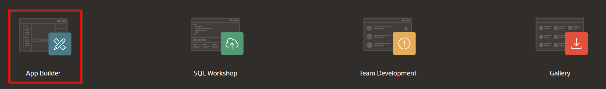
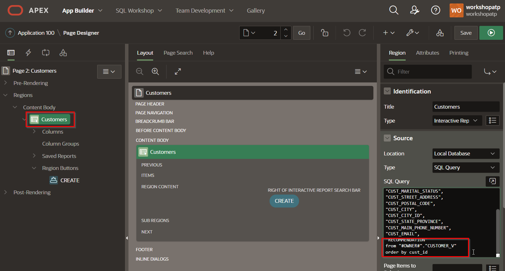
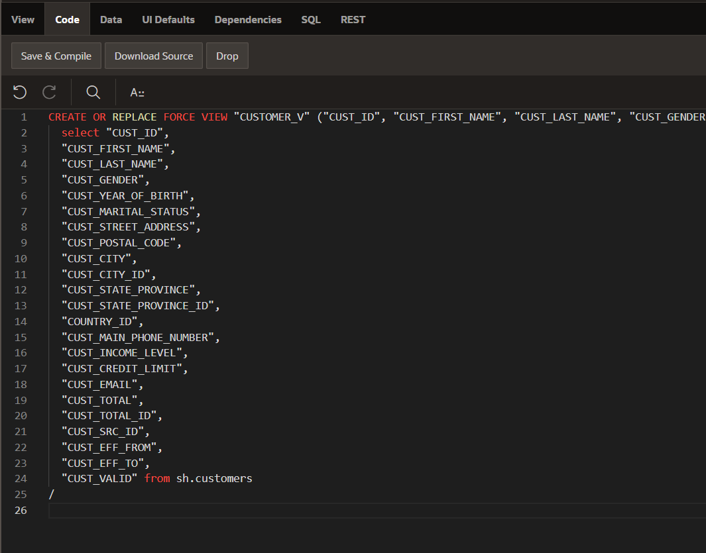
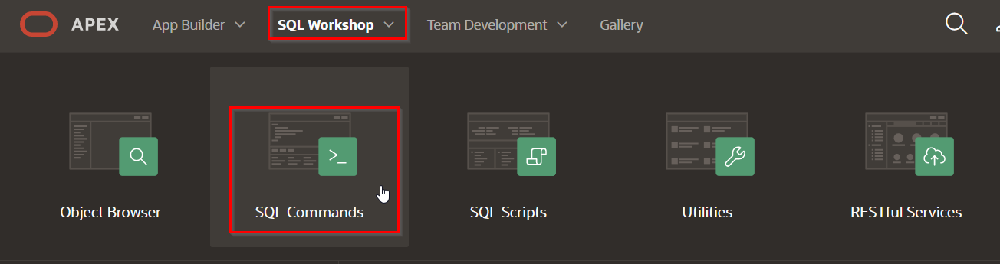
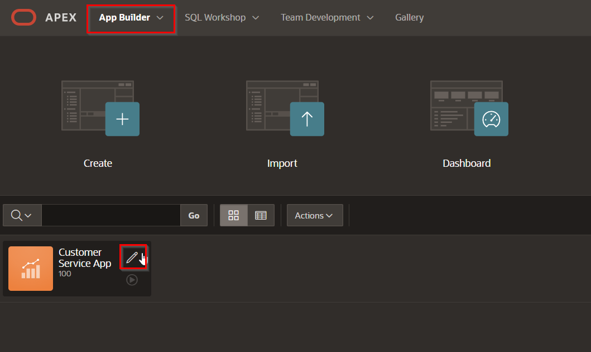
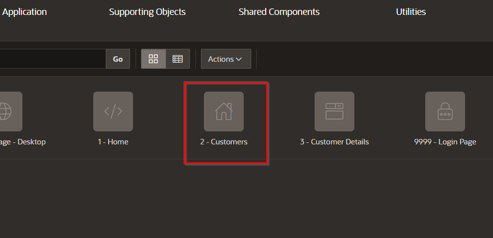

# Lab: Operationalize predictions (Application Express)

## Introduction

In this lab you create an in-database ML model and operationalize it with an APEX application. The actual machine learning logic takes place in the database and the APEX application will pick up the predictions.

As this example we will apply machine learning on a sales scenario, in this case we will predict which customers are most likely to buy a certain product.

### Objectives

In this lab you will:
* Become familiar with in-database machine learning, in particular OML4SQL.
* Understand how APEX can be used to operationalize ML models.
* Get familiar with the business value of identifying customers that are likely to buy a certain product.

### Prerequisites

* An Oracle Free Tier, Always Free, Paid or LiveLabs Cloud Account (see prerequisites in workshop menu)

## Task 1: Prepare the APEX workspace

We will prepare the APEX application.

1. Inside of the ATP instance console, go to Tools, and then "Open APEX".

   

2. Log in

   You will see the login page of APEX Administration Services. Use the ADMIN password that you entered when you provisioned ATP (Oracle_12345).

   

5. Create a new workspace

   Follow the instructions to create a new workspace. 

   **The workspace (and database user) must be named "WORKSHOPATP"** (there is some hardcoding in the installation scripts to use this schema name).

   As a password, choose "Oracle_12345"

   

## Task 2: Import the APEX application

1. Download prepared application

    First download the application that we will install. You can find it [here](files/f100.sql).

    Save the file on your local machine. Make sure that the file is saved with extension `.sql`.

2. Currently, you're logged into the INTERNAL workspace in APEX. First __Log out__ of this workspace. You can do this by clicking on the icon of your user (top right), then choose "Sign Out".

    

3. Log in to the new workspace that we just created.

   Workspace name: WORKSHOPATP, User name: WORKSHOPATP, use the password that you entered when you created the workspace (Oracle_12345).

   

4. Start the import wizard

   Import the example APEX application. Go to "App Builder", then "Import".

   
   

5. Drag the file that you downloaded earlier to the Drag and Drop area, then "Next", "Next" and "Install Application".

   

6. On the dialog for supporting objects, choose "Next", then "Install". You should now see the following:

   

## Task 3: Review the APEX application (situation before ML)

1. Start the application that you just imported

   Open the existing application by clicking on "Run Application".

   

2. Login using the password (Oracle_12345) that you used when creating the workspace.

   

3. Review the application. You see the Customer Service Application, with a list of customers.

   

   Our goal is to upsell something to these customers. We want to alert our employee whenever he/she has a customer on the screen that is a good candidate for a particular product that we're trying to sell.
   In practice this means that we want to add a column on this screen that shows whether it's a good idea to try to upsell to this customer.
   This will be the topic for the rest of the exercise.

   

## Task 4: Integrate the result into the APEX application

Now let's tie it all together by modifying the APEX application.

Remember, we want to show a recommendation to our employee when the customer he's speaking to it a likely candidate to buy Y Box Games.

1. Open the application for editing.

   

2. Open the Customers pag.

   

3. Find out which database view we need to update

   Find out which database view is being used to show the customer information.

   

   You see that the data comes from the *CUSTOMER_V* view. Now we know which view we need to modify to include the prediction.

4. Open the view

   We are going to edit the definition of this view to add a column that contains our recommendation.

   Find the view in APEX. Open the SQL Workshop, then Object Browser, then select Views from the drop down, and click on our view "CUSTOMER_V". Then open the "Code" for the view.

    

5. Review the current view definition

   Have a look at the view definition. It basically selects all its values from the SH.CUSTOMERS table.

   

6. Download the new view definition (already prepared for you) to your local PC.

   We will extend the view by adding a "RECOMMENDATION" column to it.

   Open the new view definition from [here](files/customers-v-new-SQL.sql). Make sure that the file is saved with extension .sql.

   

   Review the SQL file in a text editor. Note how this SQL will add a column "Recommendation", and it will be a text that explains whether the employee should try to upsell Y Box Games to this customer. In addition, the recommendation will only be added when the probability of an upsell is high enough.

7. Overwrite the view definition

   Open the SQL Workshop, select SQL Commands and paste in the contents of the SQL script to overwrite the view with the new definition.

   

   Paste in the SQL that you have just downloaded. Execute it. You should see "View created" at the bottom of the page.

   

7. Modify the APEX application to add the new column

   Go back to the APEX application (App Builder, then edit Customer Service App.

   

8. Choose thee Customers page.

    

13. Choose Customers section in Content body.

    Add the "RECOMMENDATION" column in the select statement at the right.

    **Don't forget the comma just after the previous column (CUST_EMAIL).**

    Then Save the page.

    

    

    

## Task 5: Review the ML-enabled APEX application

1. Run the APEX application again

    

    In the main screen you see that for most customers it's not recommended to try to upsell Y Box Games.
    It's unlikely that these customers will be interested.

    

2. Look for a customer and verify whether they're interested in the offer

   Now look for a customer with first name "Connor" and last name "Clark".
   Note that in this case we see a recommendation to try to upsell Y Box Games, because the customer is very likely to be interested in this offer.

   

## Task 6: Conclusion

   One added column in an application might not look like much, but the value to the business can be significant.
   In this case an employee receives very valuable advise on which customer to try to upsell a product to and he/she can use that to be more effective.

Congratulations on completing this lab!

[Proceed to the next section](#next).

## Acknowledgements
* **Authors** - Jeroen Kloosterman - Product Strategy Director, Lyudmil Pelov - Senior Principal Product Manager
