# Upload Data Through ADW (optional)

## Introduction

This lab will guide you through a practical example of how to upload your dataset in Oracle Data Science directly from ADW (Autonomous Data Warehouse).

Oracle ADW is Oracle's premier easy-to use, fully autonomous database. It delivers fast query performance, while requiring no database administration.

Estimated time: 30 minutes

### Objectives

In this lab you will:
* Become familiar with Autonomous Data Warehouse.
* Become familiar with the OCI Data Science service.

### Prerequisites

* An Oracle Free Tier, Always Free, Paid or LiveLabs Cloud Account (see prerequisites in workshop menu)

## **Task 1**: Provision ADW

This guide shows how to provision an Oracle Autonomous Data Warehouse 

1. Pull up Autonomous Data Warehouse on the Console

    You will proivision the database manually in the OCI Service Console. Once you are logged into your tenancy, select the hamburger icon in the top left corner. 
    Then select Oracle Database from the menu on the left hand side, followed by Autonomous Data Warehouse.

    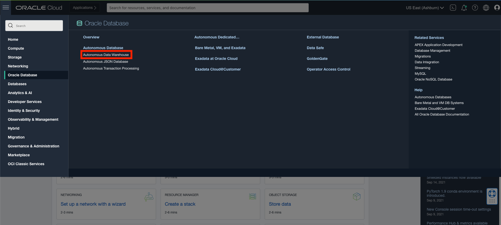

2. Create Autonomous Database

    Select the blue 'Create Autonomous Database' button. Make sure the credentials match the following. Anything not included below can be left as is.

    Compartment - whichever compartment you are working out of
    Display name - AprioriLab
    Workload Type - Data Warehouse
    Deployment Type - Shared Infrastructure
    Database Version - 19c
    OCPU count - 1
    Storage (TB) - 1
    Password - We will set the admin password to <Welcome12345>. Feel free to change it as desired, but make sure to save this password as you will need it later.
    Access Type - Allow secure access from everywhere
    Choose a license type - License Included

    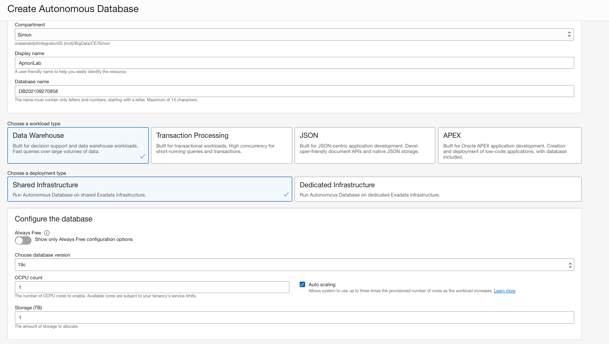
    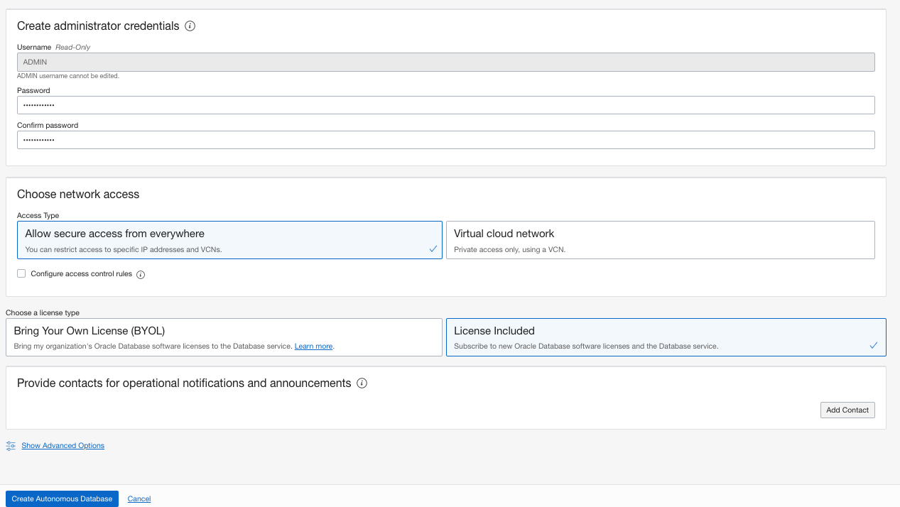

    Once you've configured your Autnonomous Database, select the blue "Create Autonomous Database" button at the bottom of the page. 

    The database will take a couple of minutes to provision. Once it is done, the ADW icon will turn from orange to green, and will read 'Available' instead of 'Provisioning'.

    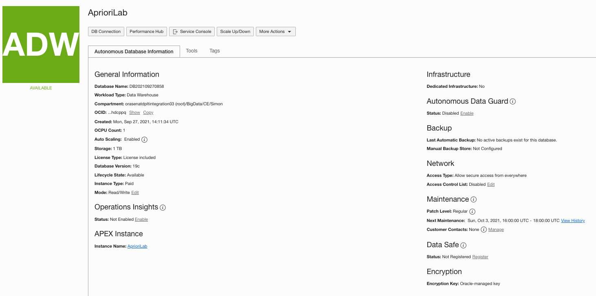

## **Task 2**: Create OML User

This guide shows you how to create a new user for your autonomous database and grant that user appropriate permissions.

1. On your instance, click the Tools tab and then click Open Oracle ML User Administration.

    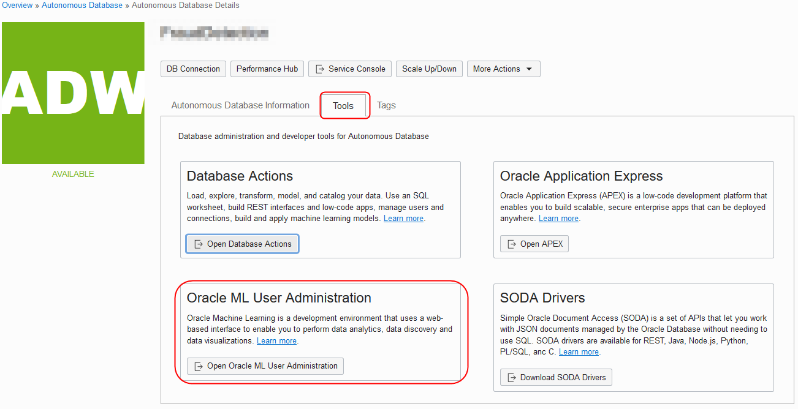

2. Sign in as admin with the password you used when you created your Autonomous instance.

    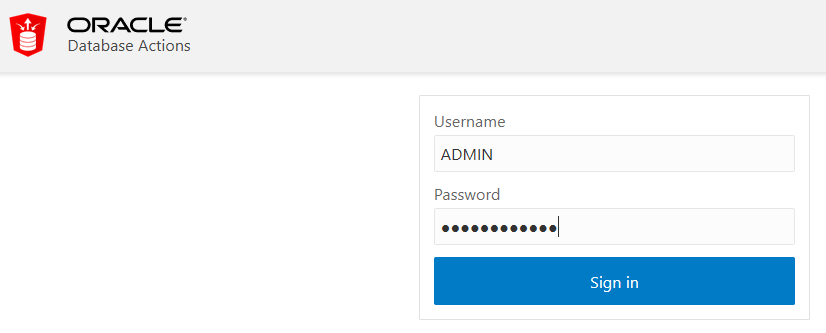

3. Click on Create

    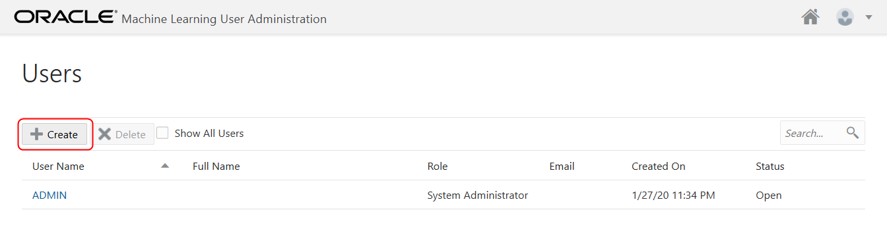

4. Create User

    On the Create User tab, enter the username omluser, an email address (you can use admin@oracle.com), uncheck Generate Password, and enter a password you will remember. You can use the same password you used for ADMIN account. Then click Create.

    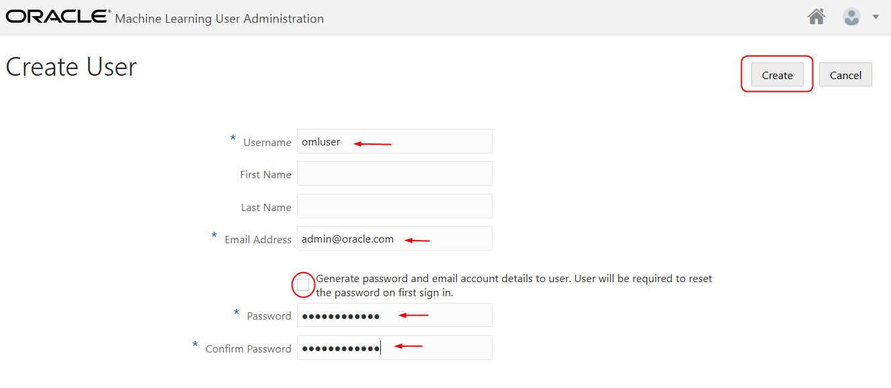

5. Return to you ADW instance on the OCI service console, and click on Open Database Actions.

    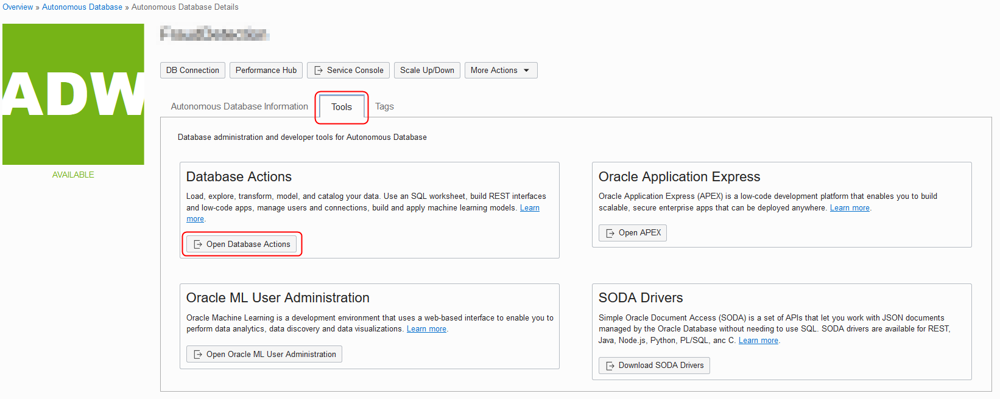

6. Login as ADMIN using the same password you created for ADMIN when you created the ADW instance.

    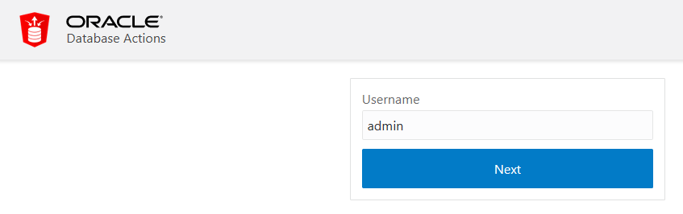
    

7. From Database Action menu, select SQL.

    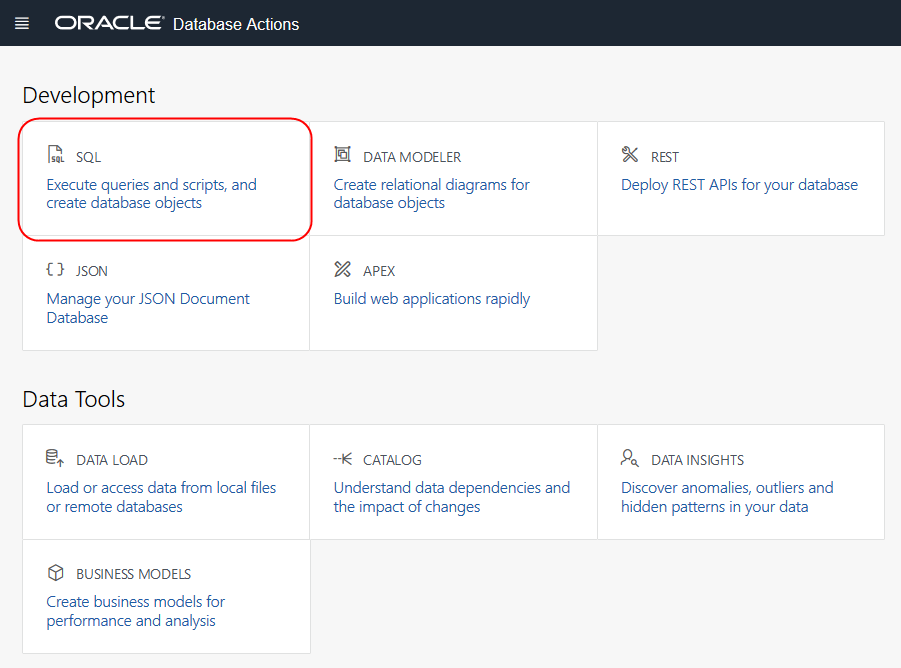

8. Dismiss the Help by clicking the X in the popup.

    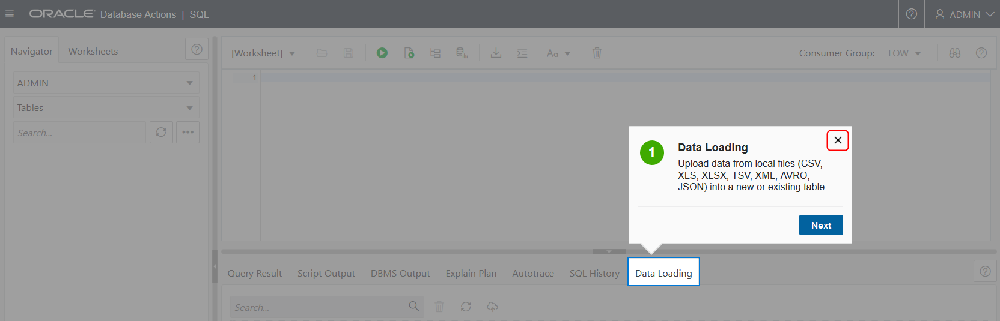

9. Copy and paste the SQL below into the SQL panel to allow OMLUSER to use the Database Actions.

    ```SQL
    <copy>
    BEGIN
    ORDS_ADMIN.ENABLE_SCHEMA(
        p_enabled => TRUE,
        p_schema => 'OMLUSER',
        p_url_mapping_type => 'BASE_PATH',
        p_url_mapping_pattern => 'omluser',
        p_auto_rest_auth => TRUE
    );
    COMMIT;
        END;
        /
    </copy>
    ```

10. Click Run Script to execute the SQL.

    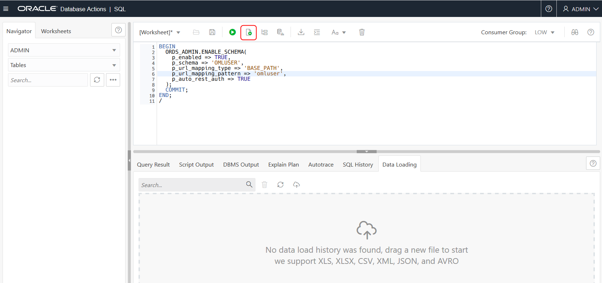
    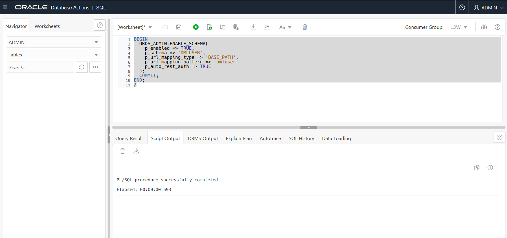

## **Task 3**: Upload Data to ADW

1. Download the CSV file that contains the data to your machine locally. The CSV file already exists in the notebook session,
   so just right click on the file and select Download.

    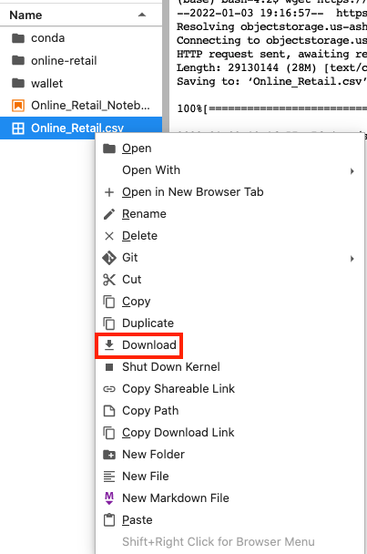

2. On the tab with your ADW instance, click on Open Database Actions

    

3. This time sign in as omluser

    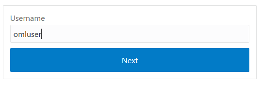
    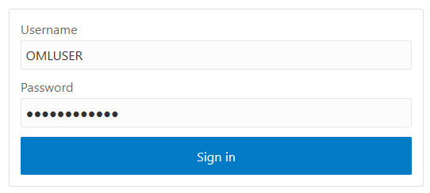

4. Select Data Load from Database Actions

    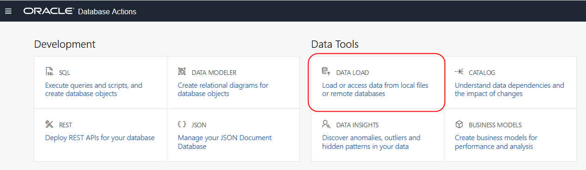

5. Leave the default selections (Load Data and Local File) and click Next.

    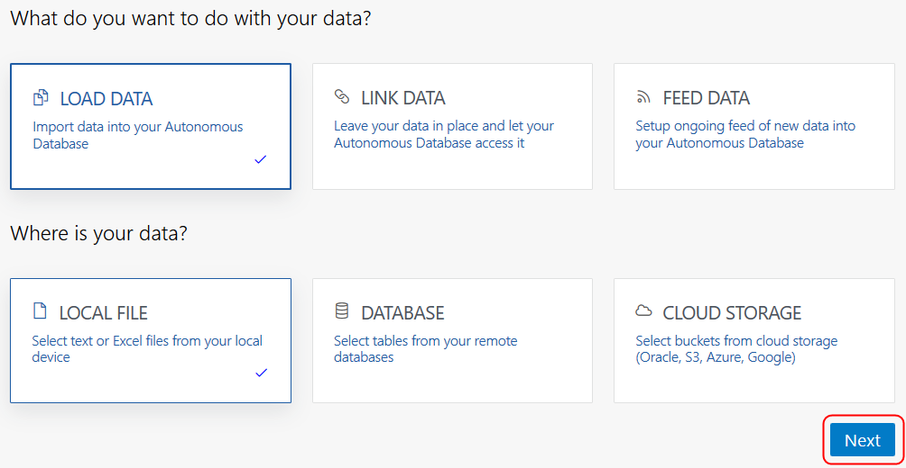

6. When the upload is complete, click Start and click Run in the confirmation dialog.

    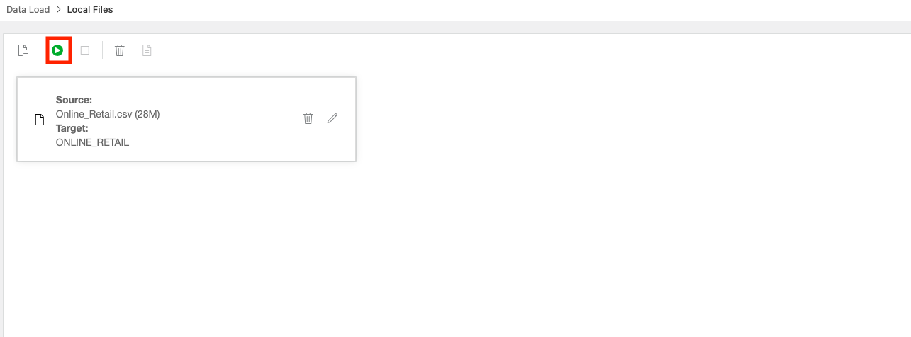
    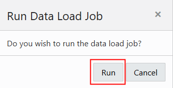

7. When the job is completed, clik on the hambuerger menu to open the database tools menus and select SQL.

    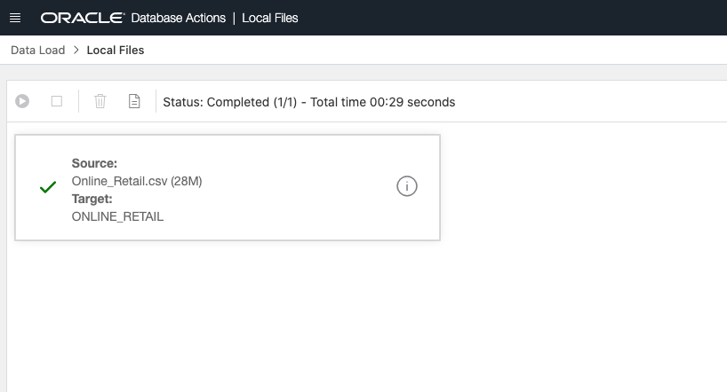
    

8. The SQL Web Developer shows the two tables have been successfully created (and associated with OMLUSER)

    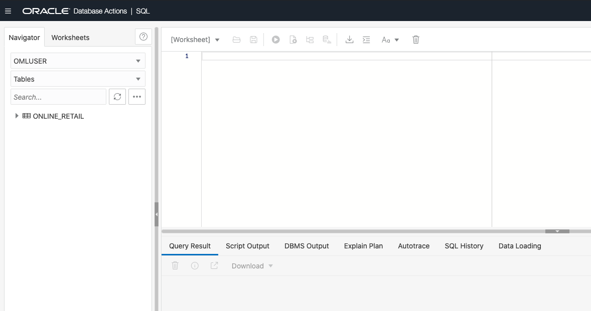

## **Task 4**: Connect ADW to OCI Data Science

1. Download the wallet from your ADW instance by selecting Database Connection. Make sure that the Wallet Type is Instance Wallet. When asked for a password, enter the password that you set for admin.

    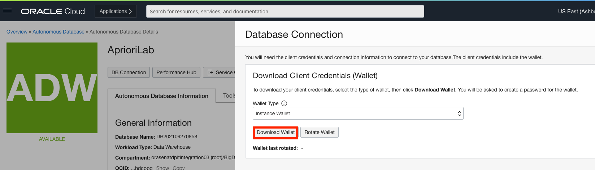

2. Open the OCI Data Science notebook that you created earlier in the lab. You can do so by selecting the hamburger menu icon -> Data Science (under Machine Learning) -> the project you created -> the active notebook session -> blue 'Open' button

    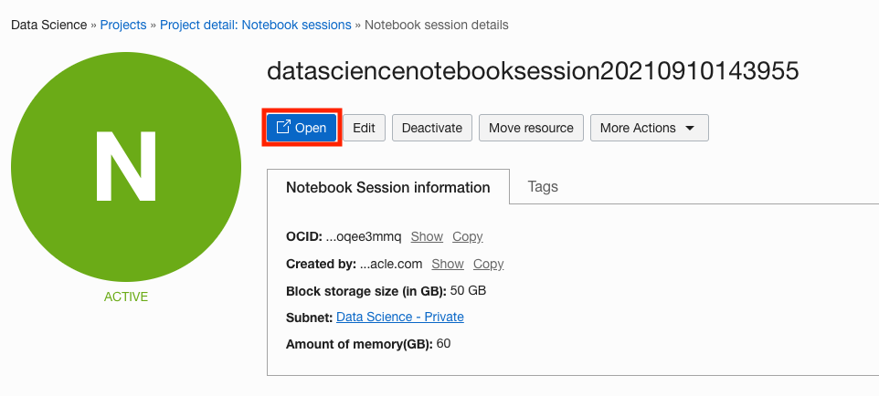

3. Create a new folder inside your notebook session by selecting the folder icon with a + sign
   and name this new folder 'wallet'.

    Note: it is okay if your notebook is not identical to this example one. At this point, you should only have a conda folder, and the onlineretailnotebook.ipynb file.

    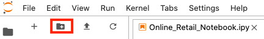

    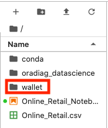

4. Unzip the wallet file that you downloaded from the ADW instance and move all the conents from its folder into the wallet folder in your data science notebook.

    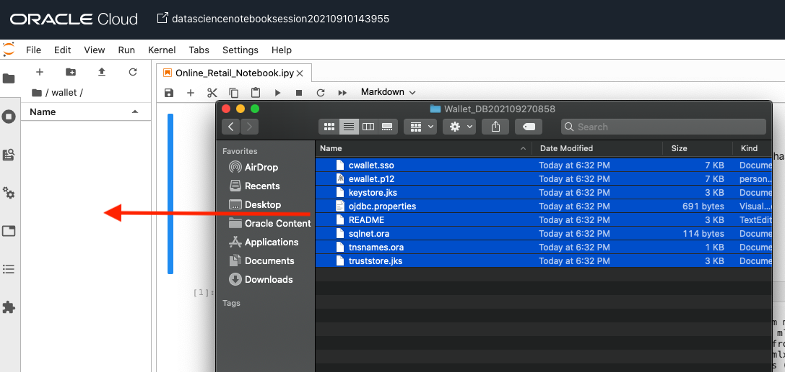

5. Move to the first cell under Oracle Autonomous Database (ADB).

    First we will fetch the ADW SID. Inside the wallet folder, open the tnsnames.ora file. Copy the name the ends with "low" and paste it as the value in the ADW SID line.

    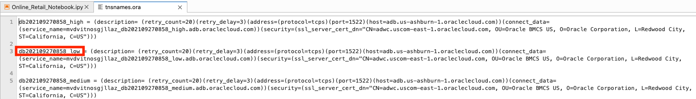

    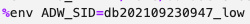

    The TNS ADMIN should be set to the path of the wallet folder which we created earlier. In this case, it would be /home/datascience/wallet. This wallet path must also
    be specificied in the sqlnet.ora file inside the wallet folder. Open the file and set DIRECTORY="/home/datascience/wallet".

    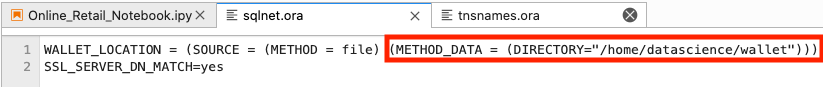

    Set the ADW_USER to omluser (which we created earlier) and the password that you set. The cell should look like this.

    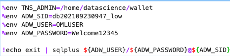

    Go ahead and run the cell. The cell tests your connection to the database. If successful, the output should appear as follows.

    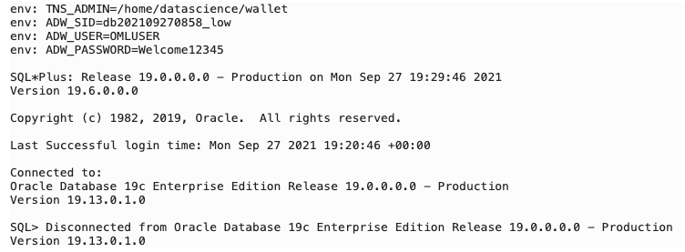

6. The next cell defines a URI as your connection source. It also creates an engine to connect to your database. Go ahead and run it.

    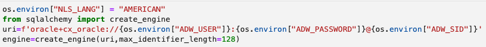

7. You are now ready to read the data from the ADW instance into a pandas dataframe.

    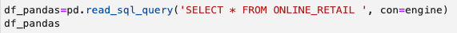

    The read sql query uses the specified query to create the pandas dataframe. In this case, we will be selecting all the rows from the table we uploaded into the ADW instance.
    Here, you would have the ability to filter out some of your data prior to uploading into the notebook, which would ultimately make the data wrangling and data explortation
    much cleaner. In addition, you have also set the con attribute (SQLAlechemy connetable) to the enginer that you previously specified.

    The output should appear as follows.

    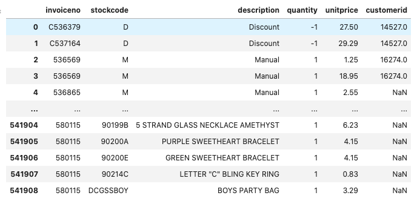

You may now proceed to the next lab.

## Acknowledgements
* **Authors** - Simon Weisser, Cloud Engineer
* **Last Updated By/Date** - Simon Weisser, December 2021

