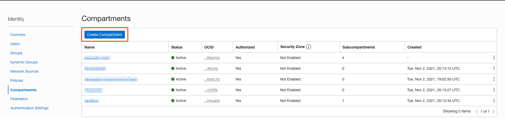
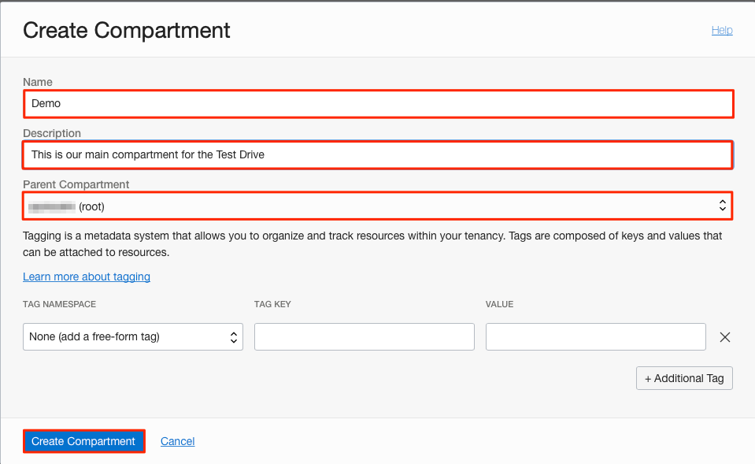
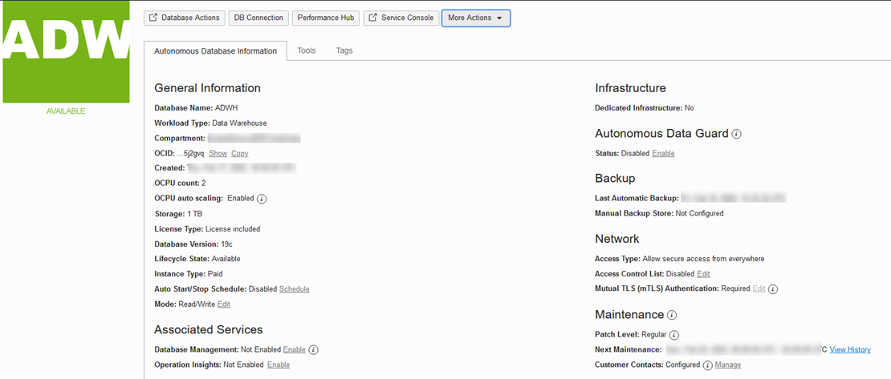
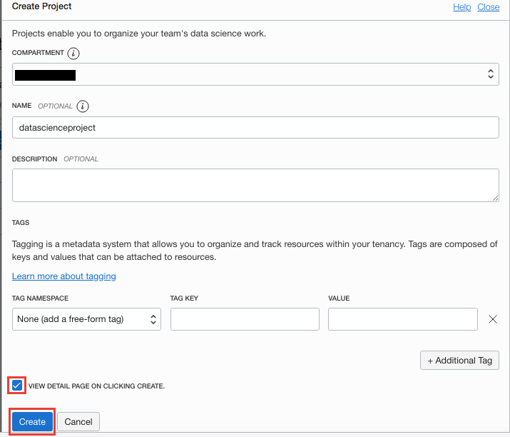
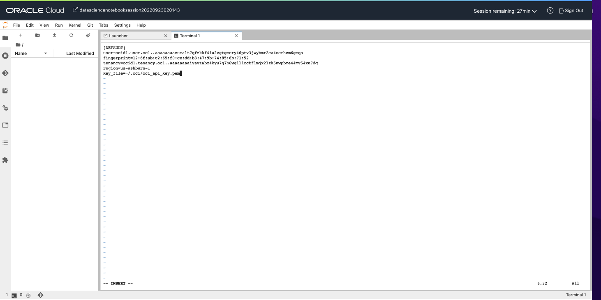
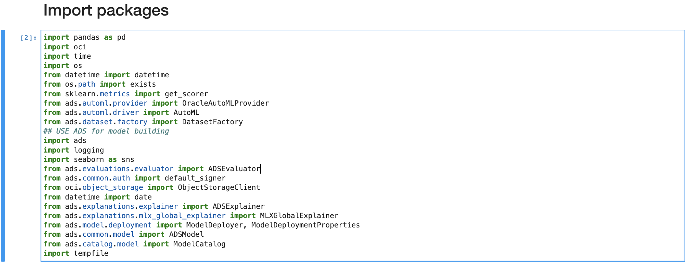
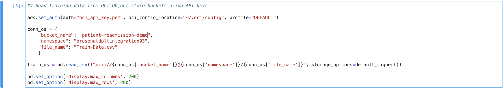

# Leveraging Data Science for Predictive Modeling 

## Introduction 

Oracle Cloud Infrastructure (OCI) Data Science is an end-to-end machine learning (ML) service that offers JupyterLab notebook environments and access to hundreds of popular open source tools and frameworks.

In this lab, we will show you how to build a machine learning model that will predict if a given patient is likely to get admitted within a specific time period, 30 days following the previous hospital visit. 

Health insurance companies spend ~ 80% of the cost on ~20% of the insured members. One of the main contributors to this cost is readmission events. Health insurance companies have specialized nurse support to outreach members with an in-hospital admission, to ensure that they are properly treated at the hospital and to send them to a right triage after discharge. Readmission predictive model would help health insurance companies to utilize nurse resources to target members with high risk of readmission and reduce the medical cost.

A healthcare provider is looking to track which patients are likely to be readmitted based on historical data, so that they can anticipate their patient's needs and provide them the appropriate care.

Patients who have been hospitalized are getting their vitals monitored periodically, and this data is added to a dataset. When each of the patient's vitals have been recorded, the recorded measurements populate a new row in a dataset, along with the patient's age, gender, name, place of residence, diagnosed condition, the date of the onset of the condition, the date of the recorded measurement, and the time since the patient has been discharged from the hospital.

For many patients, their status as patients who have been readmitted to the hospital within 30 days of discharge has been recorded. This is the historical data that the healthcare provider can used to make informed decisions about patients whose status as 30-day-readmitted patients is still to be determined.


***Estimated Time***: 2 hours

### Objectives

In this lab, you will:
- Become familiar with the process of provisioning OCI Data Science 

- Become familiar with Data Exploration, Data Preparation and Model training techniques.

- Become familiar with Python and its popular ML libraries, in particular Scikit Learn.

- Become familiar with the OCI Data Science service.


### Pre-requisites 

-	A free tier or paid tenancy in OCI (Oracle Cloud Infrastructure)
-	Familiarity with OCI Object Storage is desirable, but not required

## Data Science Service Concepts

Review the following concepts and terms to help you get started with the Data Science service.

* **Project**: Projects are collaborative workspaces for organizing and documenting Data Science assets, such as notebook sessions and models.

* **Notebook Session**: Data Science notebook sessions are interactive coding environments for building and training models. Notebook sessions come with many pre-installed open source and Oracle developed machine learning and data science packages.

* **Accelerated Data Science SDK**: The [Oracle Accelerated Data Science (ADS) SDK](https://docs.oracle.com/en-us/iaas/tools/ads-sdk/latest/index.html) is a Python library that is included as part of the Oracle Cloud Infrastructure Data Science service. ADS has many functions and objects that automate or simplify many of the steps in the Data Science workflow, including connecting to data, exploring and visualizing data, training a model with AutoML, evaluating models, and explaining models. In addition, ADS provides a simple interface to access the Data Science service model catalog and other Oracle Cloud Infrastructure services including Object Storage. To familiarize yourself with ADS, see the Oracle Accelerated Data Science Library documentation.

* **Model**: Models define a mathematical representation of your data and business processes. The model catalog is a place to store, track, share, and manage models.


## Task 1: Create Compartments

A compartment is a collection of cloud assets, like compute instances, load balancers, databases, etc. By default, a root compartment was created for you when you created your tenancy (i.e. when you registered for the trial account). It is possible to create everything in the root compartment, but Oracle recommends that you create sub-compartments to help manage your resources more efficiently.

1. Click the **Navigation Menu** in the upper left, navigate to **Identity & Security** and select **Compartments**.


Click Create Compartment.




2. Name the compartment **Demo** and provide a short description. Be sure your root compartment is shown as the parent compartment. Press the blue **Create Compartment** button when ready.



3. You have just created a compartment for all of your work in your tenancy.


## Task 2: Manage Users, Groups, and Policies to Control Access

A user's permissions to access services comes from the *groups* to which they belong. The permissions for a group are defined by policies. Policies define what actions members of a group can perform, and in which compartments. Users can access services and perform operations based on the policies set for the groups of which they are members.

We'll create a user, a group, a dynamic group and security policies. 

1. Click the **Navigation Menu** in the upper left. Navigate to **Identity & Security** and select **Groups**.

    

2. Click **Create Group**.

    In the **Create Group** dialog box, enter the following:

    * **Name**: Enter a unique name for your group, such as **oci-group**

        * **Note**: the group name cannot contain spaces.

    * **Description**: Enter a description, such as **New group for oci users**

    * Click **Create**

    

3. Click your new group to display it. Your new group is displayed.

    

4. Now, let’s create a security policy that gives your group permissions in your assigned compartment. For example, create a policy that gives permission to members of group **oci-group** in compartment **Demo**:

    a) Click the **Navigation Menu** in the upper left. Navigate to **Identity & Security** and select **Policies**.

    

    b) On the left side, select **Demo** compartment.

    **Note:** You may need to click on the + sign next to your main compartment name to be able to see the sub-compartment *Demo*. If you do, and you still don't see the sub-compartment, *refresh your browser*. Sometimes your browser caches the compartment information and does not update its internal cache.

    

    c) After you have selected the Demo compartment, click Create Policy.

    

    d) Enter a unique **Name** for your policy (for example, "Policy-for-oci-group").
        **Note:** the name can NOT contain spaces.

    e) Enter a **Description** (for example, "Policy for OCI Group").

    f) Select **Demo** for compartment.

    g) Click **Show manual editor** and enter the following **Statement**:

    ```
    <copy>
    Allow group oci-group to manage all-resources in compartment Demo
    </copy>
    ```

    h) Click **Create**.

    

5. Create a New User

    a) Click the **Navigation Menu** in the upper left, navigate to **Identity & Security** and select **Users**.


    

    b. Click **Create User**.

    In the **Create User** dialog box, enter the following:

    * **Name:** Enter a unique name or email address for the new user (for example, **User01**). *This value is the user's login name for the Console and it must be unique across all other users in your tenancy.*
    * **Description**: Enter a description (for example, **New oci user**).
    * **Email:** Preferably use a personal email address to which you have access (GMail, Yahoo, etc).

    Click **Create**.

    

6. Add User to a Group.

    a) Click the **Navigation Menu** in the upper left. Navigate to **Identity & Security** and select **Users**. From the **Users** list, click the user account that you just created (for example, User01) to go to the User Details page.

    

    b) Under the **Resources** menu on the left, click **Groups**, if it's not already selected.

    c) Click **Add User to Group**.

    

    d) From the **Groups** drop-down list, select the **oci-group** that you created.

    e) Click **Add**.

    

7. Create a **Dynamic Group**

    a) Open the **navigation menu** and click **Identity & Security**. Under **Identity**, click **Dynamic Groups**.

    b) Click **Create Dynamic Group**.

    c) Enter the following:
    * **Name**: A unique name for the group. The name must be unique across all groups in your tenancy (dynamic groups and user groups). You can't change this later. Avoid entering confidential information.
    * **Description**: A friendly description.
    d) Enter the Matching Rules, as below. Add OCID for your compartment in the below statement. Resources that meet the rule criteria are members of the group.

    ```
    <copy>
    Any {datasciencenotebooksession.compartment.id='<OCID of compartment Demo>'}
    </copy>
    ```

8. After you have created a dynamic group, you need to create policies to permit the dynamic groups to access Oracle Cloud Infrastructure services.

    a. Click the **Navigation Menu** in the upper left. Navigate to **Identity & Security** and select **Policies**.

    b) Add the following policies for your dynamic group that you just created. 

    ```
    <copy>
    Allow dynamic-group oci-dynamic-group to manage data-science-family in compartment Demo
    Allow dynamic-group oci-dynamic-group to manage object-family in compartment Demo
    Allow dynamic-group oci-dynamic-group to manage virtual-network-family in compartment Demo
    Allow service datascience to manage virtual-network-family in compartment Demo
    </copy>
    ```

## Task 3: Create Object Storage for storing training data

1. From the OCI services menu, click 'Buckets' under 'Object Storage & Archive Storage.'

        

2. Set your Compartment to the desired Compartment using the drop down under List Scope.

      

3. Click **Create Bucket** and enter details for your Bucket:

    a. **Bucket Name:** enter a name for your Bucket that you can recognize, e.g. patient-readmission-demo

    b. **Default Storage Tier:** Standard

    c. **Encryption:** Encrypt using Oracle managed keys

    d. Click **Create**

      

4. Now, upload the [training data](https://objectstorage.us-ashburn-1.oraclecloud.com/p/GglWgyHo0jwjXtzZsbOaXbU816JFsbT6FNhIRkiUkT7uzB9SkTCAC6snDNZGQSLa/n/orasenatdpltintegration03/b/CareClinics-bucket/o/Train-Data.csv) into your bucket that you just created. Clicking this link would download a csv file on your local machine. 

5. Select your bucket. 

6. Click on **Upload** to upload your training data file.  

    

7. Drop your training data file there, and click **Upload**.

    


## Task 4: Create Autonomous Data Warehouse for storing model-inference results

1. Click on the hamburger **MENU (Navigator)** link at the upper left corner of the page.

    This will produce a drop-down menu, where you should select **Autonomous Data Warehouse**.

    

    This will take you to the management console page.

2. To create a new instance, click the blue **Create Autonomous Database** button.

    

    Enter the required information and click the **Create Autonomous Database** button at the bottom of the form. For the purposes of this workshop, use the information below:

    **Compartment:** Verify that a compartment ( <tenancy_name> ) is selected.

    By default, any OCI tenancy has a default *root* compartment, named after the tenancy itself. The tenancy administrator (default root compartment administrator) is any user who is a member of the default Administrators group. For the workshop purpose, you can use *Demo* compartment.

    **Display Name:** Enter the display name for your ADW Instance. Use a user-friendly name to help you easily identify the resource. You can leave the name provided. That field is not a mandatory one. **Database Name:** Enter any database name you choose that fits the requirements for ADW. The database name must consist of letters and numbers only, starting with a letter. The maximum length is 14 characters. For this demo purpose, I have called my database **ADWH**. **Workload Type:** Autonomous Data Warehouse **Deployment Type:** Shared Infrastructure **Always Free:** Off


    

    **Choose Database version:** you can leave the default displayed version **CPU Count:** 2 **Storage Capacity (TB):** 1 **Auto scaling:** On

    

3. Under **Create administration credentials** section:

    **Administrator Password:** Enter any password you wish to use noting the specific requirements imposed by ADW. **Reminder:** Note your password in a safe location as this cannot be easily reset.

    Under **Choose network access** section:

    Select **'Allow secure access from everywhere'**

    

4. Under **Choose a license type** section, choose **License Type:** **Licence Included**.

    When you have completed the required fields, scroll down and click on the blue **Create Autonomous Database** button at the bottom of the form:

    

5. The Autonomous Database **Details** page will show information about your new instance. You should notice the various menu buttons that help you manage your new instance -- because the instance is currently being provisioned all the management buttons are greyed out.


6. A summary of your instance status is shown in the large box on the left. In this example, the color is amber and the status is **Provisioning**.

    

7. After a short while, the status turns to Available State and the "ADW" box will change color to green:

    

8. Once the Instance Status is **Available**, additional summary information about your instance is populated, including workload type and other details.

The provisioning process should take **under 5 minutes**.

9. After having the Autonomous Database instance **created** and **available**, you you may be prompted with a Pop Up window asking you to upgrade. You may choose to upgrade the database version after the hands-on session, otherwise the upgrade process can take a few minutes, and you may miss a few exercises during the session.

This page is known as the **Autonomous Database Details Page**. It provides you with status information about your database, and its configuration. Get familiar with the buttons and tabs on this page.




## Task 5: Download Wallet file

**Oracle Autonomous Database** only accepts secure connections to the database. This requires a *'wallet'* file that contains the SQL-NET configuration files and the secure connection information. Wallets are used by client utilities such as SQL Developer, SQL-Plus etc. For this workshop, you will use this same wallet mechanism to make a connection from OCI Data Science to the **Autonomous Database**.

1. Download your Autonomous Database wallet
    You need first to download the wallet file containing your credentials. There are two types of wallet:

    * **Instance Wallet:** Wallet for a single database only; this provides a database-specific wallet
    * **Regional Wallet:** Wallet for all Autonomous Databases for a given tenant and region (this includes all service instances that a cloud account owns)
    Note: Oracle recommends you provide a database-specific wallet, using Instance Wallet, to end users and for application use whenever possible. Regional wallets should only be used for administrative purposes that require potential access to all Autonomous Databases within a region.

    
2. Go back to* ***"Autonomous Database Details"*** page for your Autonomous Database, click the **DB Connection** button.

    You can access to the ***'Autonomous Database Details'*** page using the cloud console page.

    

    This will open a pop-up window. Select Wallet Type **Instance Wallet** and then **Download Wallet**.

    

    You will be asked to provide a **password** for the wallet. The password must meet the rules for the **Oracle Cloud password** complexity. This password is a password that you need to remember for your **wallet**. You can use the **admin password** that you created before.

3. Select **Download** and save the wallet to your **local machine**.

    

4. You can now **Close** the **Database Connection** pop up window.
    
    

    
Save the wallet file in your local machine, as we will later make use of it to create connection between OCI Data Science Platform and OCI Autonomous Data Warehouse. 


## Task 6: Configure the Data Science Service using Quick Start Tenancy Configuration

In this lab, your tenancy is configured using the Data Science Solution Hub, which is part of the Oracle Resource Manager. The Oracle Resource Manager provides an interface that assists in creating customized stacks that configure a tenancy to work with the Data Science service.

Configuring a tenancy using Oracle Resource Manager includes creating a solution stack, selecting the solution, providing identifying information for the new stack, and updating variables. For most tenancies, the default options are sufficient. These instructions outline the minimal requirements needed for configuring a tenancy to work with the Data Science service.


However, if you prefer a manual approach, to control all the aspects of the provisioning, you can find those instructions here OCI Data Science: [manual provisioning steps](https://docs.cloud.oracle.com/en-us/iaas/data-science/data-science-tutorial/tutorial/get-started.htm#concept_tpd_33q_zkb).


1. [Login to the OCI Console](https://www.oracle.com/cloud/sign-in.html) with an account with administrator permissions.

2. Click the **Navigation Menu** in the upper left, navigate to **Developer Services**, and select **Stacks**.


3. Choose a compartment you have permission to work in (on the left side of the page). The page updates to display only the resources in that compartment. If you are not sure which compartment to use, contact an administrator.

4. Click **Create Stack**.


5. Click **Template**, and then click **Select Template**.


6. Select **Service**, **Data Science**, and then click **Select Template**.


7. Click **Next**. The **Configure Variables** panel displays variables that are automatically populated from the Terraform configuration for the Data Science solution.


8. Deselect **Enable Vault Support?**


9. Click **Next** and review the stack configuration.

10. Click **Create** to create your stack. This creates the stack, but does not create any Data Science resources. The **Stack Details** page appears.


11. Click **Apply** to apply the Terraform script and create the Data Science resources. If the stack generates an error, click  **Destroy** to remove the resources. Fix any issues, and then repeat this step.


## Task 7: Create a Project 

Projects are used to collect related data science resources and artifacts, such that it enables you to organize your work. They contain a collection of notebook sessions and models. You create a Data Science project to organize your notebook sessions and models within your project.

1. Open the navigation menu.

2. Under **Analytics and AI** and select **Data Sciences**. This will open the **Projects** page.

3. Select the compartment where the project is to be created.

    

4. Click Create Project.

    

5. (Optional, but recommended) Enter a unique name (255 character limit) for the project. If you do not provide a name, a name is automatically generated for you.

6. (Optional, but recommended) Enter a description (400 character limit) for the project. If you do not add a description, it remains empty.

7. (Optional) Add tags to easily locate and track the project by selecting a tag namespace, then entering the key and value. To add more than one tag, click **+Additional Tags**. [Tagging](https://docs.cloud.oracle.com/iaas/Content/Tagging/Concepts/taggingoverview.htm) describes the various tags that you can use organize and find projects including [cost-tracking tags](https://docs.cloud.oracle.com/iaas/Content/Tagging/Tasks/usingcosttrackingtags.htm).

8. (Optional) To view the details for your project immediately after creation, select **VIEW DETAIL PAGE ON CLICKING CREATE**.

    

9. Click **Create**.

    

This creates the project and opens the project page.


## Task 8: Create a Notebook Session

Data Science notebook sessions are interactive coding environments for building and training models. Notebook sessions provide access to a JupyterLab serverless environment that is managed by the Data Science service. All notebook sessions run in the Data Science service tenancy.

A notebook session is associated with a compute instance, VCN, subnet, and block storage. There are two block storage drives that are associated with a notebook session. There is a boot volume that is initialized each time the notebook session is activated. Any data on the boot volume is lost when the notebook session is deactivated or terminated. There is an additional block storage that is persisted when a notebook session is deactivated, but it is not persisted when a notebook session is terminated. This block volume is mounted in the /home/datascience directory and it is where the JupyterLab notebooks, data files, installed custom software, and other files should be stored.

When a notebook session is activated or created, the compute instance shape, block storage, VCN, and subnet are configured. These resources can only be changed by deactivating a notebook session, and then changing the configuration while activating the notebook session again. The size of the block storage can only be increased.

1. Open the navigation menu.

2. Under **Analytics and AI** and select **Data Science**. This will open the **Projects** page.

3. Select the compartment for the project.

4. Click the name of the project to contain the notebook session.

    

5. Click **Create Notebook Session**.

    

6. Select the compartment that you want to contain the notebook session.

7. (Optional, but recommended) Enter a unique name for the notebook session (limit of 255 characters). If you do not provide a name, a name is automatically generated for you.

8. Select a VM shape. The [Compute Shapes](https://docs.cloud.oracle.com/en-us/iaas/Content/Compute/References/computeshapes.htm) page has details on the specifications. For this lab, it is recommended that you use an Intel VM.Standard2.4. Click the **Select** button in the compute shape. This will open the select shape window. To choose the shape, click **Intel**, then check the box beside **VM.Standard2.4**, and finally click **Select**.

9. Enter the block volume in GB. The suggested size is 100 Gb or larger.

10. In the networking resources section, select the default networking option.

11. (Optional) Add tags to the notebook session by selecting a tag namespace, then entering the key and the value. You can add more tags to the compartment by clicking **+Additional Tags**, see [Working with Resource Tags](https://docs.cloud.oracle.com/iaas/Content/General/Concepts/resourcetags.htm#workingtags).

12. (Optional) View the details for your notebook session immediately after creation by selecting **VIEW DETAIL PAGE ON CLICKING CREATE..**

13. Click **Create**.

    

14. While the notebook session is being created, you can navigate away from the current page.

    


## Task 9: Opening a Notebook Session

Once the notebook session has been created the notebook session page shows the notebook in an Active or Inactive state. To open the notebook:

1. Click the name of the notebook session. This will open the Notebook Session page.

    

2. If the notebook is in the **Creating state**, then wait until it is in the **Active** state.

3. If the notebook is in an **Active** state, then click **Open**.

    

4. If the notebook is in an **Inactive** state, then:
Activate
    * Click **Activate** to open the **Activate Notebook Session** dialog with the configuration from the last time the notebook session was activated or created.
    * Select a VM shape. The [Compute Shapes](https://docs.cloud.oracle.com/en-us/iaas/Content/Compute/References/computeshapes.htm)page has details on the specifications. For this lab, it is recommended that you use an Intel VM.Standard2.4. Click the **Select** button in the compute shape. This will open the select shape window. To choose the shape, click **Intel**, then check the box beside **VM.Standard2.4**, and finally click **Select**.
    * Enter the block volume in GB. The suggested size is 100 Gb or larger. The size of the block storage can be increased, but not decreased.
    * In the networking resources section, select the default networking option.
    * Click **Activate** and the notebook session status changes to **Updating**.
    * When the notebook session status changes to **Active**, click **Open**.

## Task 10: Working with Jupyter Lab

Now that JupyterLab is open, it can be seen that the screen is split into two sections. By default, the left side has the file browser open but it can change based on what navigation icons are selected on the far left side of the screen. The right side of the screen contains the workspace. It will have a notebook, terminal, console, launcher, Notebook Examples, etc.


There is a menu across the top of the screen. For this lab, the most interesting menu item is **Run**. It will allow you to execute code cells in the document. It is recommended that you manually execute the cells one at a time as you progress through the notebook. It is, generally important, that you execute them in order. To do this from the keyboard, press *shift + enter* in a cell and it will execute it and advance to the next cell. Alternatively, you can run all of the cells at once. To do this, click on Run then "Run Selected Cells".

## Task 11: Setup API keys for authenticating with other OCI Services 

1. Scroll down on the Welcome page, and select **'Terminal'** under the '**Other**' options. This will open up a terminal session. 

    

2. We will use the [OpenSSL](http://www.openssl.org/) commands to generate the key pair in the required PEM format.

    a. Create an **.oci** directory to store the credentials. Copy the following command to create **.oci** directory:

    ```
    <copy>
    mkdir ~/.oci  
    </copy>
    ```
    

    b. Generate the private key with no passphrase:
    
    ```
    <copy>
    openssl genrsa -out ~/.oci/oci_api_key.pem 2048  
    </copy>
    ```        
    

    c. Change the file permission to ensure that only you can read the private key file:

    ```
    <copy>
    chmod go-rwx ~/.oci/oci_api_key.pem   
    </copy>
    ```

    d. Generate the public key from your new private key:

    ```
    <copy>
    openssl rsa -pubout -in ~/.oci/oci_api_key.pem -out ~/.oci/oci_api_key_public.pem             
    </copy>
    ```
    

    e. Copy the contents of the public key to the clipboard using pbcopy, xclip or a similar tool (you'll need to paste the value into the Console later):

    ```
    <copy>
    cat ~/.oci/oci_api_key_public.pem | pbcopy     
    </copy>
    ```
    

3. Now we will upload the PEM public keys in the console. 

    a. Open the Console, and sign in.

    b. View the details for the user who will be calling the API with the key pair:

    * If you're signed in as the user:
        Open the Profile menu (User menu icon) and click User Settings.

    * If you're an administrator doing this for another user: Open the navigation menu and click Identity & Security. Under Identity, click Users. Select the user from the list.

    c. Click Add Public Key.

    d. Paste the contents of the PEM public key in the dialog box and click Add.

    e. You will see the **Configuration File Preview**. Copy the content under **Configuration File Preview** and paste it in your local machine. We will later use this config information. 

    The key's fingerprint is displayed (for example, 12:34:56:78:90:ab:cd:ef:12:34:56:78:90:ab:cd:ef).

4. Oracle Cloud Infrastructure SDKs and CLI require basic configuration information, like user credentials and tenancy OCID. You can provide this information by using a configuration file. Now, we will create a configuration file using the config information we copied in the last step. 

    a. Go back to OCI Data Science service, and open a terminal window. 
    b. Navigate to the **.oci** folder using the following command:

    ```
    <copy>
    cd .oci
    </copy>
    ```
    

    

    c. Now we will create a file named **'config'** under **.oci** folder by using the following command:

    ```
    <copy>
    touch config
    </copy>
    ```
    

    d. Now we will edit the config file by using the following command. 
    ```
    <copy>
    vi config
    </copy>
    ```

    e. Paste the config information from Task 8 Step 3 into our config file we created in previous step. 

    Replace the value in **'key_file'** parameter with the location of our private api key, as below:

    ```
    <copy>
    key_file= ~/.oci/oci_api_key.pem
    </copy>
    ```

    f. Your config file should look similar to the screenshot below:

    

    Now you close the config file, once you hve pasted your information.


## Task 12: Install Conda Environment

A conda environment is a collection of libraries, programs, components and metadata. It defines a reproducible set of libraries that are used in the data science environment. There is an Environment Explore that allows you to learn about the different conda environments that are available. We are going to use the General Machine Learning for CPUs conda.

a. Open a terminal window by clicking on **File**, **New** and then **Terminal**.

b. Run the command: 

```
<copy>
odsc conda install -s generalml_p37_cpu_v1
</copy>

```

c. You will receive a prompt related to what version number you want. Press **Enter** to select the default.

d. Wait for the conda environment to be installed.


## Task 12: Summary of commands

The following is a summary of the steps that are covered in this lab along with the most important Python commands. You can use it as a reference guide for when you build your own models.

1. **Open dataset:** ds = DatasetFactory.open()
2. **Visualize dataset:** ds.show_in_notebook()
3. **Automatic feature engineering:** transformed_ds = ds.auto_transform()
4. **Split data into train and test sets:** train, test = transformed_ds.train_test_split()
5. **Train the model with AutoML:** model, baseline = automl.train()
6. **Evaluate the model:** evaluator = ADSEvaluator()
7. **Explain the model:** explainer = ADSExplainer(test, model)
8. **Global explanations:** global_explainer = explainer.global_explanation()
9. **Local explanations:** local_explainer = explainer.local_explanation()
10. **Feature important:** global_explainer.feature_importance_summary() and global_explainer.compute_feature_importance()


## Task 13: Accelerated Data Science(ADS) SDK for training Machine Learning Model 

Download the complete notebook [here](https://objectstorage.us-ashburn-1.oraclecloud.com/p/SVgHpFBvntVvV6xPMZ28dls4KcJO8CgLiKUCcBOcAfan6a2bRIQl9QGtovh3qvet/n/orasenatdpltintegration03/b/CareClinics-bucket/o/Patient_Readmission_Classifier-final.ipynb) that walks through the different steps to create a machine learning model using Oracle ADS SDK that will predict if a given patient is likely to get admitted within a specific time period, 30 days following the previous hospital visit. 

1. Import all the necessary packages that we will need for building our model. 



2. Set the required parameters

3. Connect to Object Storage and download training data in OCI Data Science notebook

Run the **'Read training data from OCI Object store buckets'** block of code. This will allow us to read our training data from Object Storage into a Pandas DataFrame. For authentication purposes, we will be using the API keys and config file we generated in the earlier step. 


Replace the values for 'bucket-name'and 'namespace' parameters with your respective **bucket-name** and **tenancy-namespace**, something like this:




The Oracle JupyterLab environment is pre-installed with default storage options for reading from and writing to OCI Object Storage. However, you can load your datasets into ADS from almost anywhere including:

    1. Oracle Cloud Infrastructure Object Storage
    2. Oracle Autonomous Data Warehouse
    3. Oracle Database
    4. Hadoop Distributed File System
    5. Amazon S3
    6. Google Cloud Service
    7. Microsoft Azure
    8. Blob
    9. MongoDB
    10. NoSQL DB instances
    11. Elastic Search instances
    12. Your local files

Some of the supported file formats include:

    1. csv
    2. tsv
    3. Parquet
    4. libsvm
    5. JSON
    6. Excel
    7. SQL
    8. HDF5
    9. XML
    10. Apache server log files
    11. arff

4. Next step is to process our raw training data to make it suitable for training purposes. Execute the 'Data Processing' block of code. 

    

    We are doing some portion of the data processing using manual techniques, but will also leverage ADS ```auto_transform()``` to transform the content of an ADSDataset object by applying all the recommended transformations at once. 

    

5. The ADS **show_in_notebook()** method creates a comprehensive preview of all the basic information about a dataset including:

    * The predictive data type (for example, regression, binary classification, or multinomial classification).

    * The number of columns and rows.

    * Feature type information.

    * Summary visualization of each feature.

    * The correlation map.

    * Any warnings about data conditions that you should be aware of.

    

6. The ADSDataset object comes with a comprehensive plotting API. It allows you to explore data visually using automatic plotting or create your own custom plots.Example of a bar-graph plotted between our target variable, i.e, **'Readmission_Flg'** and **'age'**
    
    

7. In this step, we will be training our model using Oracle AutoML. Oracle AutoML automates the machine learning experience. It replaces the laborious and time consuming tasks of the data scientist whose workflow is as follows:

    * Select a model from a large number of viable candidate models.

    * For each model, tune the hyperparameters.

    * Select only predictive features to speed up the pipeline and reduce over fitting.

    * Ensure the model performs well on unseen data (also called generalization).

    Execute **'Model Training using Oracle AutoML'** block to train our model using AutoML, as shown below. 

    The AutoML API is quite simple to work with. Create an instance of Oracle AutoML (```oracle_automl```). Then the training data is passed to the ```fit()``` function that does the following:

    a. Preprocesses the training data.

    b. Identifies the best algorithm.

    c. Identifies the best set of features.

    d. Identifies the best set of hyperparameters for this data.

    

A model is then generated that can be used for prediction tasks. ADS uses the roc-auc scoring metric to evaluate the performance of this model on unseen data (X_test).

8. Machine learning Explainability: Machine learning explainability (MLX) is the process of explaining and interpreting machine learning and deep learning models.

    MLX can help machine learning developers to:

    * Better understand and interpret the model’s behavior.

        * Which features does the model consider important?

        * What is the relationship between the feature values and the target predictions?

    * Debug and improve the quality of the model.

        * Did the model learn something unexpected?

        * Does the model generalize or did it learn something specific to the training dataset?

    * Increase trust in the model and confidence in deploying the model.

    

    In this workshop, we will just be looking at **global explainations**, where we try to understand the general behavior of a machine learning model as a whole.

    You can also view the **local explainations** to understand why the machine learning model made a specific prediction about a specific row. Read more about it [here](https://docs.oracle.com/en-us/iaas/tools/ads-sdk/latest/user_guide/model_explainability/overview.html).

9. Now we will use the **predict** function to predict if a given patient is likely to get admitted within a specific time period, 30 days following the previous hospital visit **(Y for Yes and N for No)**, and save the results in the **final-output** dataframe under **preds** column.


10. Lastly, we will store the results (**final-output dataframe**) in the **OCI Autonomous Data Warehouse** as a table. We will create a connection between OCI Data Science and OCI Autonomous Data Warehouse using the wallet file that we downloaded in Step 4. 

    a. Create a ```<path-to-wallet-folder>``` folder for your wallet on the notebook environment environment.

    b. Upload your wallet files into the ```<path-to-wallet-folder>``` folder using the Jupyterlab **Upload Files**:

    

    c. Open the ```sqlnet.ora``` file from the wallet files, then configure the ```METHOD-DATA```:

    ```
    METHOD_DATA = (DIRECTORY="<path_to_wallet_folder>")

    ```

    d. Execute this block of code to upload our final_output dataframe as a table to ADW. Replace the **"user-name"**, **"password"**, **"service-name"** and **"wallet-location"** with your own credentials. 

    

    It should look similar to this:

    


Congratulations on completing the lab!


