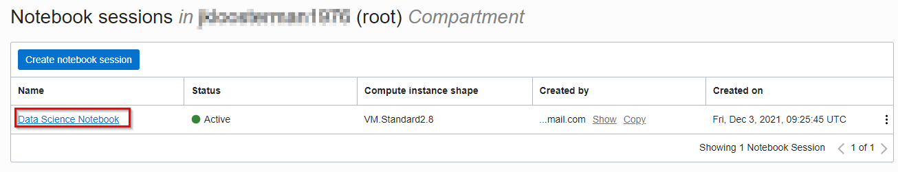

# Leveraging Data Science for Predictive Modeling 

## Introduction 

Oracle Cloud Infrastructure (OCI) Data Science is an end-to-end machine learning (ML) service that offers JupyterLab notebook environments and access to hundreds of popular open source tools and frameworks.

In this lab, we will show you how to build a machine learning model that will predict if a given patient is likely to get admitted within a specific time period, 30 days or 90 days, following the previous hospital visit. 

Health insurance companies spend ~ 80% of the cost on ~20% of the insured members. One of the main contributors to this cost is readmission events. Health insurance companies have specialized nurse support to outreach members with an in-hospital admission, to ensure that they are properly treated at the hospital and to send them to a right triage after discharge. Readmission predictive model would help health insurance companies to utilize nurse resources to target members with high risk of readmission and reduce the medical cost.


***Estimated Time***: 2 hours

### Objectives

In this lab, you will:
- Become familiar with the process of provisioning OCI Data Science 

- Become familiar with Data Exploration, Data Preparation and Model training techniques.

- Become familiar with Python and its popular ML libraries, in particular Scikit Learn.

- Become familiar with the OCI Data Science service.


### Pre-requisites 

-	A free tier or paid tenancy in OCI (Oracle Cloud Infrastructure)
-	Familiarity with OCI Object Storage is desirable, but not required


## Task 1: Configure prerequisites for the OCI Data Science service

This guide shows how to use the Resource Manager to provision the prerequisites for the OCI Data Science service. This includes the configuration network (VCN) and security configuration (groups, dynamic groups and policies).

This process is automated. However, if you prefer a manual approach, to control all the aspects of the provisioning, you can find those instructions here OCI Data Science: [manual provisioning steps](https://docs.cloud.oracle.com/en-us/iaas/data-science/data-science-tutorial/tutorial/get-started.htm#concept_tpd_33q_zkb). In all other cases, please continue with the steps below for automated provisioning.

1. Press this button below to open the Resource Manager. 

[Resource Manager](https://cloud.oracle.com/resourcemanager/stacks/create?zipUrl=https://github.com/oracle-quickstart/oci-ods-orm/releases/download/1.0.6/oci-ods-orm-v1.0.6.zip)

You may have to log in first in case you were not logged into to Oracle Cloud Infrastructure already.


2. Configure the Stack.

    * Check "I have reviewed and accepted the Oracle Terms of Use".

    * Select the right compartment. If you have just created your Oracle cloud account you may choose the root compartment.

    * Click Next.

    

3. **Important** In the section "ODS Configuration" uncheck "Create a Project and Notebook Session" (we will create them using the console later).


4. In the section "Vault Configuration" uncheck "Enable Vault Support".


5. In the section "Functions/API Gateway Configuration", uncheck "Provision Functions and API Gateway".


6. Click "Next".


7. Make sure that that the "Run Apply" option is checked.


8. Click "Create".


Provisioning should take about 5 minutes after which the status of the Job should become "Succeeded".


## Task 2: Upload data in Object Storage 

1. For building the predictive modeling of readmission use case, synthetic patient data from [Synthea](https://github.com/synthetichealth/synthea) is used. Download the [training dataset](https://objectstorage.us-ashburn-1.oraclecloud.com/p/Pjoa0G84rC3DkMCY47qH5_rCMOsW8-KI0cNJQhMZhlg2QzC35xU0gb4ZzvXHC5vS/n/orasenatdpltintegration03/b/Synthea/o/csv2.zip) . Depending on the browser you might have to use Left/Right click to do this. Make sure the extension of the saved file is .csv, in some cases the browser may try to save it as .xls instead.

2. Upload this dataset to Object storage in your bucket, as explained in previous labs on this workshop. 

3. Review the dataset (e.g. use a text editor).

Here is the meta-data for the data we will be using. Synthea creates below csv files. Of these "patients.csv" is the key file with "ID" column as the primary key to link all other csvs


## Task 3: Load CSVs and create features in OCI Autonomous Data Warehouse (ADW)

1. Use this [SQL-based script](https://objectstorage.us-ashburn-1.oraclecloud.com/p/XkSvrJfzo0BweQfgJp6RRVBnmCTY0ecaJfgxzT8TgRAvo1xFw-pxfd7riGU6VXZr/n/orasenatdpltintegration03/b/Synthea/o/001_load_tables.sql) to load training data files to OCI ADW. 

2. In the ADW SQL Worksheet, run this [SQL script](https://objectstorage.us-ashburn-1.oraclecloud.com/p/mMMkTw6PEDbnhLgKmGgWJU6C2-WKhcn0dVi5XK9NMRONjohuByDqTWIXdVu_IfiW/n/orasenatdpltintegration03/b/Synthea/o/002_create_features.sql) to create features from our training data. 

Refer to this [livelab](https://oracle.github.io/learning-library/data-management-library/autonomous-database/shared/workshops/freetier-indepth/?lab=adb-query) for more information. 


## Task 4: Create a Project and Notebook

1. Open the OCI Data Science projects and choose "Create Project".


* Select the right compartment. If you have just created your Oracle cloud account you may choose the root compartment.
* Choose a name, e.g. "Data Science Project" and press "Create".


2. The newly created project will now be opened. Within this project, provision an Oracle Data Science notebook by clicking "Create notebook session".


* Select the right compartment. If you have just created your Oracle cloud account you may choose the root compartment.
* Select a name, e.g. "Data Science Notebook"
* We recommend you choose VM.Standard2.2 (under Intel SKYLAKE) as the shape.
* Set blockstorage to 50 GByte.
* Select defaults for VCN and subnet. These should point to the resources that were created earlier by the resource manager.


Finally click "Create". The process should finish after about 5 minutes and the status of the notebook will change to "Active".

3. Open the notebook that was provisioned

The name of the notebook may be different than shown here in the screenshot.




You should now see the Jupyter environment


## Task 5: Install the required pre-requisites on OCI Data Science


1. On desktop machine, install [OCI Command Line Interface](https://docs.oracle.com/en-us/iaas/Content/API/SDKDocs/cliinstall.htm).

2. Install pre-built 'generalml\_p37\_cpu\_v1' conda environment in datascience notebook. 

    i.  To install a pre-built Conda environment, launch the environment explorer.
    
    

   ii.  Next, select 'generalml\_p37\_cpu\_v1' environment from the available list.

    

   iii. Once you have selected a Conda environment to install, copy the install command that is provided in Environment Explorer.

   

   iv.  Paste the install command into a Terminal and run. You may have to enter additional information once the service is running. For example, it may ask for a version.

   

3. Upgrade ads package using by copy-pasting the commands in terminal below:

```
pip uninstall  oracle-ads==2.5.9
pip Install oracle_ads==2.5.9

```

## Task 6: Create ML Model

1. Download [003_combine_features.ipynb](https://objectstorage.us-ashburn-1.oraclecloud.com/p/91NbrFHdr8IAeLSEs7YsyCgk3xH-spjY-4z-J7uktOm2K9emM8Filh9f0zfN5Wmx/n/orasenatdpltintegration03/b/CareClinics-bucket/o/003_combine_features.ipynb). Run 003_combine_features.ipynb to create ML ready dataframe. Refer to [livelab](https://oracle.github.io/learning-library/data-management-library/autonomous-database/shared/workshops/freetier-indepth/?lab=adw-connection-wallet) for getting ADW wallets

2. Download [004_build_model.ipynb](https://objectstorage.us-ashburn-1.oraclecloud.com/p/GvsWfwwmCYRsnHLmjunWS2BInvFrV9njLw5MZYR1PR9SD73RU6yamkNqbM81ANcH/n/orasenatdpltintegration03/b/CareClinics-bucket/o/004_build_model.ipynb). Run 004_build_model.ipynb to create , catalog and deploy a ML model using Oracle ADS


Congratulations on completing the lab!


