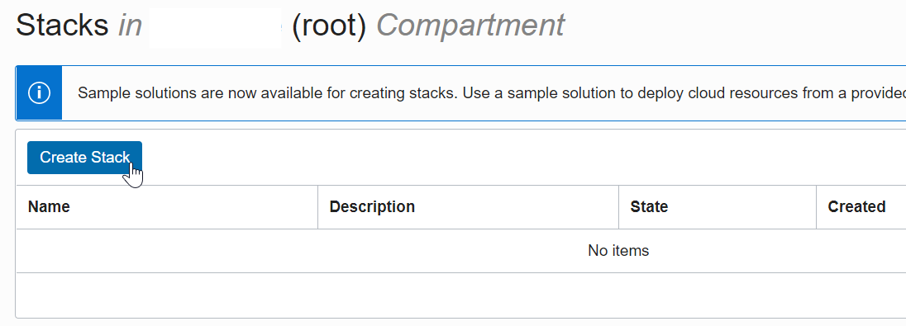
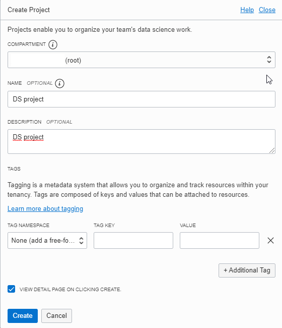
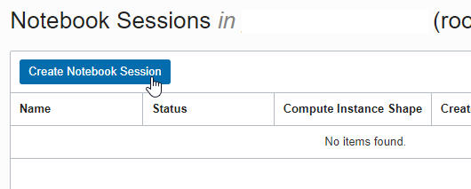
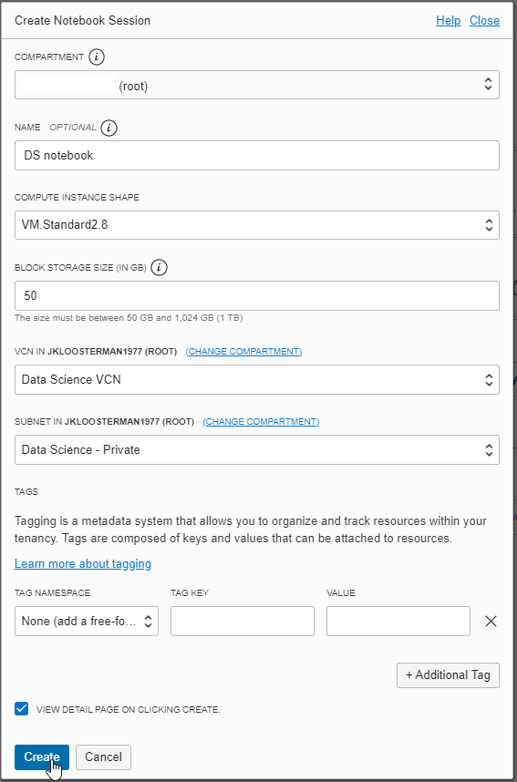
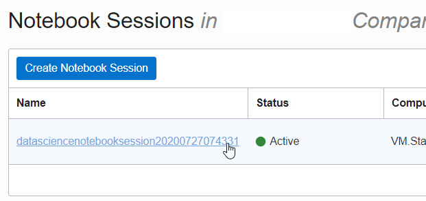
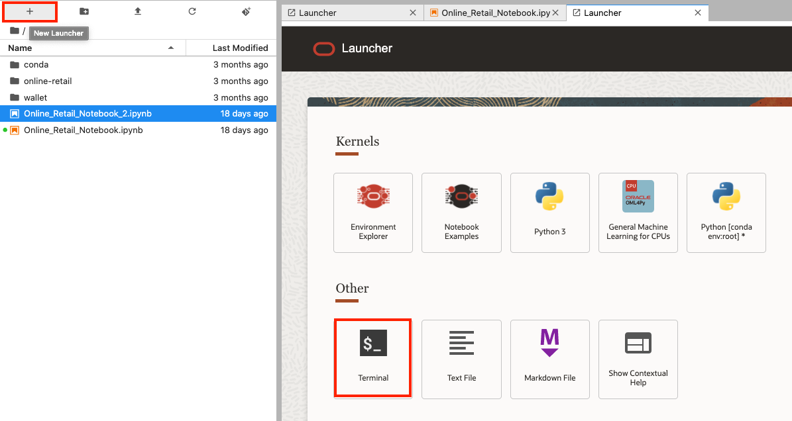
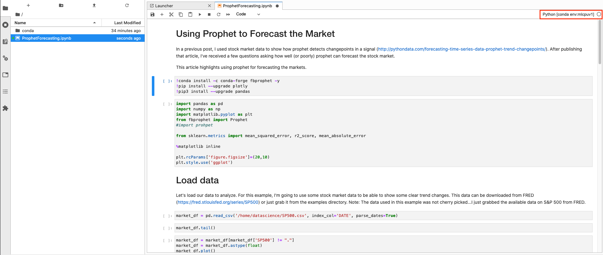
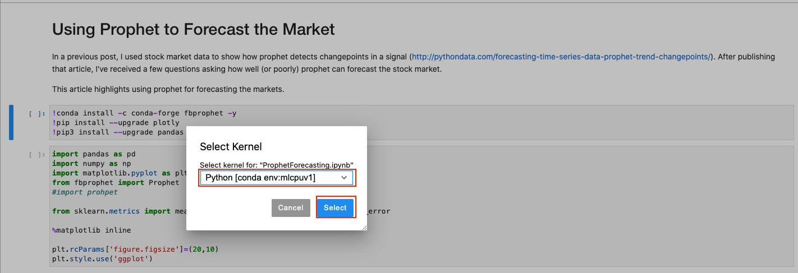
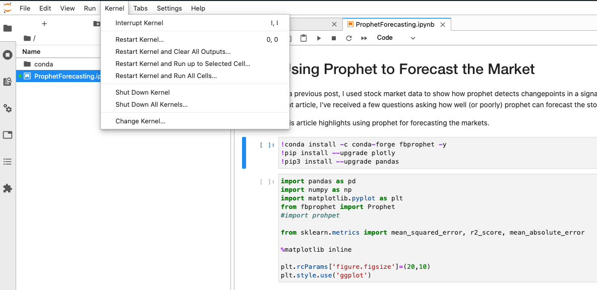
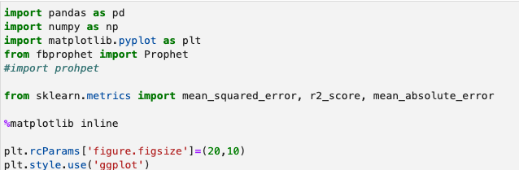

# Deploy OCI Data Science Environment

## Introduction

This lab will guide you on provisioning an OCI Data Science environment.

Estimated Time: 20 minutes

### Objectives

In this lab you will:
* Become familiar with the set up of the OCI Data Science service.

### Prerequisites

* An Oracle Free Tier, Always Free, Paid or LiveLabs Cloud Account (see prerequisites in workshop menu)

## **Task 1:** Provision OCI Data Science

This guide shows how to use the Resource Manager to provision Data Science using Resource Manager. This process is mostly automated. However, if you prefer a step-by-step manual approach to control every aspect of the provisioning, please follow the following instructions instead: [manual provisioning steps](https://docs.cloud.oracle.com/en-us/iaas/data-science/data-science-tutorial/tutorial/get-started.htm#concept_tpd_33q_zkb).

1. Download the terraform configuration source

    Download [Terraform configuration source](https://objectstorage.eu-frankfurt-1.oraclecloud.com/p/Y1AdqPkxQdFho1SEuMMO7W8DlMWAkr0FUwdnL-m3ysgXirfHz9IV48yyAkRARF-b/n/odca/b/datascienceworkshop/o/oci-ods-orm.zip) and store it on your local PC. Depending on the browser you might have to use Left/Right click to do this. Make sure the extension of the saved file is .zip

2. In your Oracle Cloud console, open the menu.
   

3. Select Resource Manager -> Stacks.

   

4. Click the "Create Stack" button.

   

5. Select the configuration source you download earlier

    Select ".ZIP" and drag the file you downloaded into the box.

    

6. Choose a compartment that you've created or use Root.

   

7. Click "Next".

   

8. Disable Project and Notebook creation

    In the section "Project and Notebook Configuration" *uncheck* the checkbox "Create a Project and Notebook Session" (we will create them using the console later).

    

9. Make sure "Enable Vault Support" is disabled

   

10. Make sure "Provision Functions and API Gateway" is disabled

   

11. Click "Next".

   

12. Click "Create".

   

13. Run the job

   Go to "Terraform Actions" and choose "Apply".

   

14. Click Apply once more to confirm the submission of the job.

   Provisioning should take about 5 minutes. Once complete, the status of the Job should become "Succeeded".

15. Create Oracle Data Science Project

    Open the OCI Data Science projects and choose "Create Project".

    

    

    Choose a name and description and press "Create".

    

16. Provision an Oracle Data Science notebook

    

    - Select a name.
    - We recommend you choose VM.Standard2.8 (*not* VM.Standard.*E*2.8) as the shape. This is a high performance shape, which will be useful for tasks such as AutoML.
    - Set blockstorage to 50 GByte.
    - Select defaults for VCN and subnet. These should point to the resources that were created earlier by the resource manager.

    

    Finally click "Create". The process should finish after about 5 minutes and the status of the notebook will change to "Active".

## **Task 2:** Open the OCI Data Science Notebook

1. Open the notebook that was provisioned.

   The name of the notebook may be different than shown here in the screenshot.

   

   

## **Task 3:** Install a Conda Package

1. Open a terminal window by clicking on **File**, **New** and then **Terminal**.
2. Run the command: 
   
   ```python
   <copy>
   odsc conda install -s mlcpuv1
   </copy>
   ```

3. You will receive a prompt related to what version number you want. Press `Enter` to select the default.
4. Wait for the conda package to be installed.


## **Task 4:** Upload the Notebook and Data

1. Download the notebook and save it on your virtual machine.

   The .ipynb notebook is accessed through a Pre Authenticated Request (PAR) in OCI Object Storage. Inside the data science notebook session, open the terminal.

   Select the + sign in the top left hand corner, and then select Terminal.

   

   Copy the following command into the terminal to download the Jupyter Notebook from OCI Object Storage to the active Data Science notebook session. 
   
   ```python
   <copy>
   wget https://objectstorage.us-ashburn-1.oraclecloud.com/p/1L2E2fw8OKpUcaCkDTYmIK8F3PK4xf7scnKQ_lJ4OB5W7YkvWT_okg8DXnGtHgxh/n/orasenatdpltintegration03/b/times_series_lab/o/ProphetForecasting.ipynb
   </copy>
   ```

   You should now see the following file in your directory on the left.

   

   This is the Jupyter notebook that you will use for the remainder of the lab.

2. Upload the Data

   The CSV file that consists of the retail data is stored in OCI Object Storage.

   Similar to the last step, open the terminal and run the following command to download the CSV file inside the Data Science Notebook Session.

   ```python
   <copy>
   wget https://objectstorage.us-ashburn-1.oraclecloud.com/p/wt8MQs2HjtJKn4PYXxmQiEtIydLAct4yh4_4VQrctXvmyIW13fVhWayMo6J7iEdn/n/orasenatdpltintegration03/b/times_series_lab/o/SP500.csv
   </copy>
   ```

   You should now see the following file in the directory.

   


3. Select the installed kernel

   Open the .ipynb file, and select the kernel on the top right side of the page.

   

   Select the kernel [conda env:mlcpuv1] from the drop down menu

   

4. Install fbprophet

   Next you will have to install the package fbprophet to the kernel. Fbprophet is a Python library that consists of useful time series forecasting tools.

   Run the first cell installs fbprophet and upgrades plotly and pandas libraries.

   

   

5. Restart the Kernel

   In order for the tools in the mlxtend package to become available, you must restart the kernel.

   Select kernel in the drop down bar at the top of the page and then "Restart Kernel". Make sure to save everything first by selecting File -> Save Notebook.

   

6. Import all the necessary libraries

   Run the second cell of the notebook that contains all the import statements. This will import the industry standard data science tools that we will use throughout the lab.

   

You may now **proceed to the next lab**

## Acknowledgements
* **Authors** - Jeroen Kloosterman - Product Strategy Manager - Oracle Digital, Lyudmil Pelov - Senior Principal Product Manager - A-Team Cloud Solution Architects, Fredrick Bergstrand - Sales Engineer Analytics - Oracle Digital, Hans Viehmann - Group Manager - Spatial and Graph Product Management, Simon Weisser - Cloud Engineer
* **Last Updated By/Date** - Simon Weisser, Dec 2021

