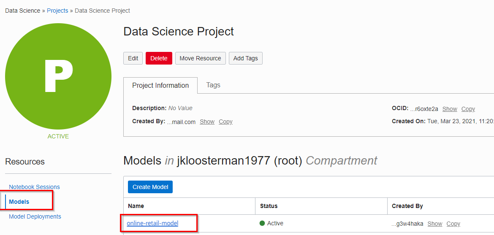

# Data Exploration, Data Preperation, and Building The Model

## Introduction

In this lab, you will build the Prophet model based on the historical data available to predict future SP500 values (at market close). You will then deploy this model to the OCI Model Catalog.

Estimated Time: 45 minutes

### Objectives

In this lab you will:
* Learn how to prepare data for Time Series Analysis.
* Learn commonly used data exploration techniques.
* Learn how build the fb prophet forecasting model and analyze results on OCI Data Science.

### Prerequisites

* An Oracle Free Tier, Always Free, Paid or LiveLabs Cloud Account (see prerequisites in workshop menu)
* OCI Data Science service with dependencies (see previous lab)

## **Task 1:** Prepare for Prophet

1. Run the cell under the header "Prepare for Prophet". 

    This cell will create a new pandas dataframe, that will rename the columns and take the log value of the SP500 closing value.

## **Task 2:** Running Prophet

1. Run the cell under the heading "Running Prophet". 

    This cell first defines the Prophet model you will use, and then fits that model to the SP500 historical data. Next, you create a new dataframe for future predictions. This new dataframe, called "future", will list all the dates for the next 365 days (since you are predicting the SP500 market value for the next year). And lastly, you will make predictions for the SP500 market value on this new future dataframe using the model trained on the historical data.


## **Task 3:** Plotting the Forecast

1. Run all the under the header "Plotting the Forecast". 

    There are detailed descriptions of what each cell does inside the notebook itself. At a high level, the code in these cells determines the usefulness and statistical significance of the trained model. You will then analyze how the projected forecast differs from what the actual data shows.


## **Task 4:** Deploy Model to Model Catalog

1. Create working model

    The following requires that you have successfully completed steps 1 to 4.

2. Store the model in the model catalog

    If you want applications/business processes to make good use of the model, then you need to deploy it. You will start by publishing the model to the model catalog. The following will **serialize** the model along with some other artifacts and store it in the catalog under the name "online-retail-model".

    ```python
    <copy>
    import ads
    from ads.common.model_artifact import ModelArtifact
    from ads.common.model_export_util import prepare_generic_model
    import os
    from os import path
    from joblib import dump
    import cloudpickle
    ads.set_auth(auth='resource_principal')
    path_to_model_artifacts = "prophet-forecasting"
    generic_model_artifact = prepare_generic_model(
        path_to_model_artifacts,
        force_overwrite=True,
        function_artifacts=False,
        data_science_env=True)
    with open(path.join(path_to_model_artifacts, "model.pkl"), "wb") as outfile: cloudpickle.dump(model, outfile)
    catalog_entry = generic_model_artifact.save(display_name='prophet-forecasting-model',
        description='Model to predict SP500 values')
    </copy>
    ```

3. Deploy the model

    Now you will deploy this model to its own compute instance. This will take the model from the catalog and create a runtime version of it that's ready to receive requests. This uses normal OCI compute shapes. Go ahead and select "Create Deployment".

    

    - Give the model deployment a name, e.g. "prophet forecasting model deployment"
    - Choose the right model (prophet-forecasting-model)
    - Choose a shape, one instance of VM.Standard2.1 is sufficient. Note that we could have chosen multiple instances, this is useful for models that are used very intensively.

    Finally, submit the deployment. This should take about 10 minutes. Finally, you should see that the compute instance is active.

    
    
Congratulations on completing this lab!

You may now **proceed to the next lab**.

## Acknowledgements
* **Authors** - Simon Weisser - Cloud Engineer, Tom McGinn - Database Innovations Architect, Database Product Management
* **Last Updated By/Date** - Simon Weisser, Dec 2021

