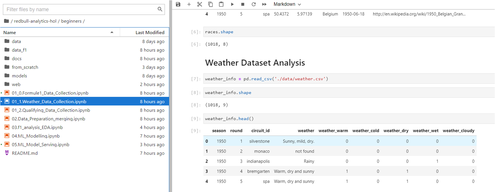

# Data Collection

## Introduction

This lab will walk you through the very basic step of machine learning, i.e, data collection. For this lab we're pulling data from ```ergast.com```. 

* The data gathering process takes some time, so we've gone ahead and pulled the data in for you. However, if you want to see how it's done, take a look in the ```from_scratch``` directory in your Jupyter notebook, where you'll find the original scripts that gathered the remote data.

Estimated Time: 1 hr


### Objectives

In this lab, you will gather data by:
* Executing notebook ```01_0.Formule1_Data_Collection.ipynb``` to download race data (capturing data on features like  races, rounds, results, etc.) and create your own CSV Files. 
* Executing notebook ```01_1.Weather_Data_Collection.ipynb``` to download weather data for races
* Finally, executing this last notebook ```01_2.Qualifying_Data_Collection.ipynb``` to download the qualifying data for races

### Prerequisites

* An Oracle Free Tier, Always Free, Paid or LiveLabs Cloud Account


## **Task 1**: Race Data Collection

Navigate to the ``` /beginner/from_scratch``` directory in your Jupyter Notebook session and execute ``` 01_0.Formule1_Data_Collection.ipynb```

   * Execute the notebook to download race data and create your CSV files. 

1. Download dataset from ERGAST Web
    
    

2. Extracting Races Results, Driving Standing, & Team Standing results from ERGAST Web

    

3. Visualizing the different features to better understand their distributions, by discretization the values into buckets and review the frequency in each bucket as histograms

    

4. The final important relationship to explore is that of the relationships between the attributes. We can review the relationships between attributes by looking at the distribution of the interactions of each pair of attributes.

    


## **Task 2:** Weather Data Collection 

1. Navigate to the ``` /beginner/from_scratch``` directory in your Jupyter Notebook session and execute ``` 01_1.Weather_Data_Collection.ipynb```

    * Execute the notebook to download weather data that captures weather conditions (warm, sunny, rainy, ect.) for different races. 

    


## **Task 3:** Qualifying Data Collection 

1. Navigate to the ``` /beginner/from_scratch``` directory in your Jupyter Notebook session and execute ``` 01_2.Formula 1 Qualifying Data Collection```

    * Execute the notebook to download weather data that captures weather conditions (warm, sunny, rainy, ect.) for different races. 

    *We suppose that Qualifying dataset is an important information to predict the result of a race.*

    


You may now **proceed to the next lab**.

## Acknowledgements
* **Author** - Olivier Francois Xavier Perard , Principal Data Scientist
* **Last Updated By/Date** - Samrat Khosla, Advanced Data Services, September 2021


## Need Help?
Please submit feedback or ask for help using our [LiveLabs Support Forum](https://community.oracle.com/tech/developers/categories/livelabsdiscussions). Please click the **Log In** button and login using your Oracle Account. Click the **Ask A Question** button to the left to start a *New Discussion* or *Ask a Question*.  Please include your workshop name and lab name.  You can also include screenshots and attach files.  Engage directly with the author of the workshop.

If you do not have an Oracle Account, click [here](https://profile.oracle.com/myprofile/account/create-account.jspx) to create one.
