# Implement ML Model

## Introduction

This lab will walk you through how to approach building the best machine learning model for our use case, which is predicting the possible next winner (top 5) for a given race. 

To begin with, we are going to be building our machine learning model based on the following hypothesis. Winner of the race:
* Depends on Qualifying Position.
* Depends on Constructor / Driver.
* Depends on Constructor Reliability.
* Depends on GP Race / Circuit. 
* Depends on Driver Confidence:
    * Do Not Finish 
    * Points Number

<b> Six Algorithms </b>

  We're going to compare six different classification algorithms to determine the best one to produce an accurate model for our predictions.

  1. _Logistic Regression_

  Logistic Regression (LR) is a technique borrowed from the field of statistics. It is the go-to method for binary classification problems (problems with two class values).

  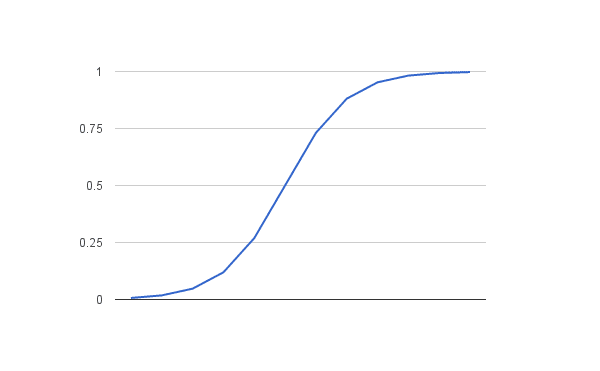

  Logistic Regression is named for the function used at the core of the method: the logistic function. The logistic function is a probablistic method used to determine whether or not the driver will be the winner. Logistic Regression predicts probabilities.

  2. _Decision Tree_

  A tree has many analogies in real life, and it turns out that it has influenced a wide area of machine learning, covering both classification and regression. In decision analysis, a decision tree can be used to visually and explicitly represent decisions and decision making.

  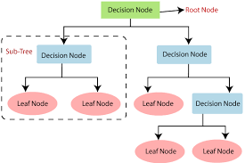

  This methodology is more commonly known as a "learning decision tree" from data, and the above tree is called a Classification tree because the goal is to classify a driver as the winner or not. 

  3. _Random Forest_ 

  Random forest is a supervised learning algorithm. The "forest" it builds is an ensemble of decision trees, usually trained with the “bagging” method, a combination of learning models which increases the accuracy of the result.

  A random forest eradicates the limitations of a decision tree algorithm. It reduces the overfitting of datasets and increases precision. It generates predictions without requiring many configurations.

  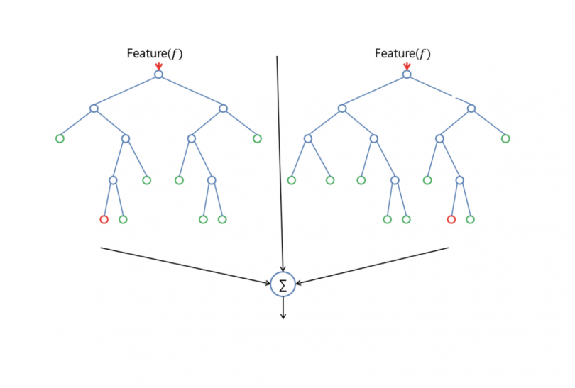

  Here's the difference between the Decision Tree and Random Forest methods:

  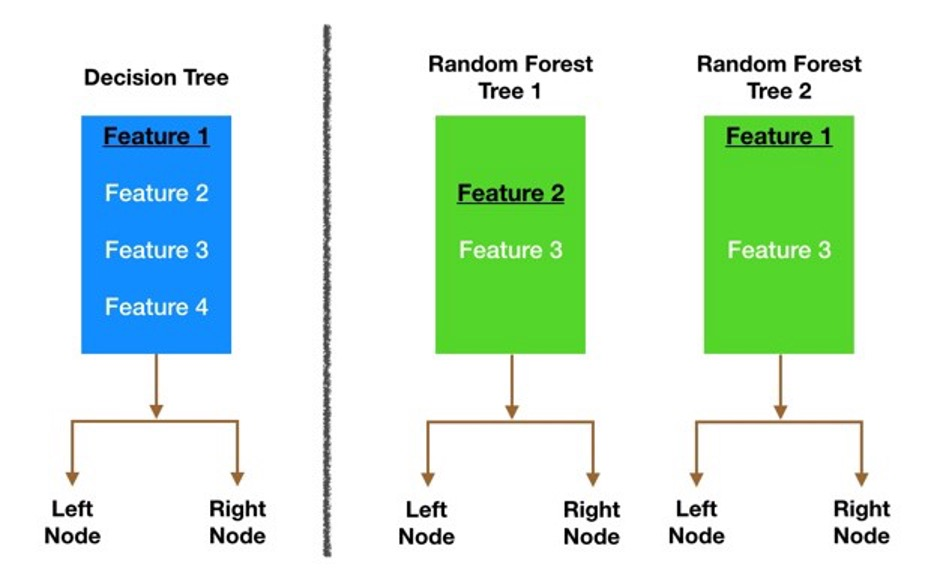


  4. _Support Vector Machine Algorithm (SVC)_

  Support Vector Machines (SVMs) are a set of supervised learning methods used for classification, regression and detection of outliers.

  The advantages of support vector machines are:

    * Effective in high dimensional spaces
    * Still effective in cases where number of dimensions is greater than the number of samples
    * Uses a subset of training points in the decision function (called support vectors), so it is also memory efficient
    * Versatile: different kernel functions can be specified for the decision function. Common kernels are provided, but it is also possible to specify custom kernels
  
  The objective of a SVC (Support Vector Classifier) is to fit to the data you provide, returning a "best fit" hyperplane that divides, or categorizes, your data.

  5. _Gaussian Naive Bayes Algorithm_

  Naive Bayes is a classification algorithm for binary (two-class) and multi-class classification problems. The technique is easiest to understand when described using binary or categorical input values. The representation used for naive Bayes is probabilities.

  A list of probabilities is stored to a file for a learned Naive Bayes model. This includes:

    * Class Probabilities: The probabilities of each class in the training dataset.
    * Conditional Probabilities: The conditional probabilities of each input value given each class value.
  
  Naive Bayes can be extended to real-value attributes, most commonly by assuming a Gaussian distribution. This extension of Naive Bayes is called Gaussian Naive Bayes. Other functions can be used to estimate the distribution of the data, but the Gaussian (or normal distribution) is the easiest to work with because you only need to estimate the mean and the standard deviation from your training data.

  6. _k Nearest Neighbor Algorithm (kNN)_

  The k-Nearest Neighbors (KNN) algorithm is a simple, supervised machine learning algorithm that can be used to solve both classification and regression problems.

  kNN works by finding the distances between a query and all of the examples in the data, selecting the specified number examples (k) closest to the query, then voting for the most frequent label (in the case of classification) or averages the labels (in the case of regression).

  The kNN algorithm assumes the similarity between the new case/data and available cases, and puts the new case into the category that is most similar to the available categories.

  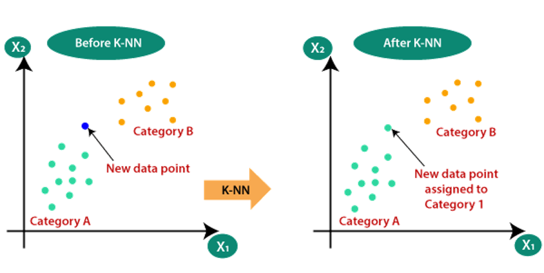


Estimated Time: 40 minutes

### Objectives

In this lab, you will:
* Execute the notebook ```04.ML_Modelling.ipynb``` to build and implement a mchine learning model for our use case
* Machine learning model exercise for Developers

### Prerequisites

* An Oracle Free Tier, Always Free, Paid or LiveLabs Cloud Account

## **Task 1**: Execute the notebook 

  Navigate to the ``` /redbull-analytics-hol/beginners/``` directory in your Jupyter Notebook session and execute ``` 04.ML_Modelling.ipynb``` 

  Here is a detailed description on how we approached modelling our predictions in this lab, so that you understand how we came to the conclusions. 

1. <b> Analyze the Data </b>
    
  _Feature Importance_

  Another great quality of the random forest algorithm is that it's easy to measure the relative importance of each feature to the prediction. The Scikit-learn Python Library provides a great tool for this which measures a feature's importance by looking at how much the tree nodes that use that feature reduce impurity across all trees in the forest. It computes this score automatically for each feature after training, and scales the results so the sum of all importance is equal to one.

  _Data Visualization When Building a Model_

  How do you visualize the influence of the data? How do you frame the problem?

  An important tool in the data scientist's toolkit is the power to visualize data using several excellent libraries such as Seaborn or MatPlotLib. Representing your data visually might allow you to uncover hidden correlations that you can leverage. Your visualizations might also help you to uncover bias or unbalanced data.

  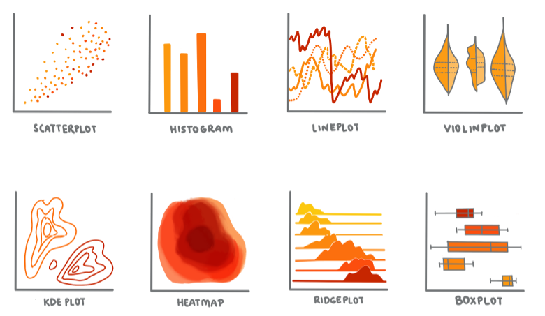


  _Splitting the Dataset_

  Prior to training, you need to split your dataset into two or more parts of unequal size that still represent the data well.

  a. **Training.** This part of the dataset is fit to your model to train it. This set constitutes the majority of the original dataset.
  
  b.  **Testing.** A test dataset is an independent group of data, often a subset of the original data, that you use to confirm the performance of the model you built.

  c.  **Validating.** A validation set is a smaller independent group of examples that you use to tune the model's hyperparameters, or architecture, to improve the model. Depending on your data's size and the question you are asking, you might not need to build this third set.


2. <b> Build the Model </b>

  Using your training data, your goal is to build a model, or a statistical representation of your data, using various algorithms to train it. Training a model exposes it to data and allows it to make assumptions about perceived patterns it discovers, validates, and accepts or rejects.

  _Decide on a Training Method_

  Depending on your question and the nature of your data, you will choose a method to train it. Stepping through Scikit-learn's documentation, you can explore many ways to train a model. Depending on the results you get, you might have to try several different methods to build the best model. You are likely to go through a process whereby data scientists evaluate the performance of a model by feeding it unseen data, checking for accuracy, bias, and other quality-degrading issues, and selecting the most appropriate training method for the task at hand.

  _Train a Model_

  Armed with your training data, you are ready to "fit" it to create a model. In many ML libraries you will find the code 'model.fit' - it is at this time that you send in your data as an array of values (usually 'X') and a feature variable (usually 'y').

  _Evaluate the Model_

  Once the training process is complete, you will be able to evaluate the model's quality by using test data to gauge its performance. This data is a subset of the original data that the model has not previously analyzed. You can print out a table of metrics about your model's quality.

  _Model Fitting_

  In the Machine Learning context, model fitting refers to the accuracy of the model's underlying function as it attempts to analyze data with which it is not familiar.

  _Underfitting and Overfitting_

  Underfitting and overfitting are common problems that degrade the quality of the model, as the model either doesn't fit well enough, or it fits too well. This causes the model to make predictions either too closely aligned or too loosely aligned with its training data. An overfit model predicts training data too well because it has learned the data's details and noise too well. An underfit model is not accurate as it can neither accurately analyze its training data nor data it has not yet 'seen'.

  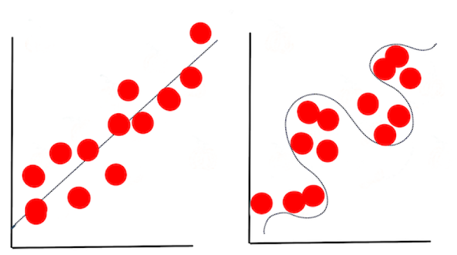


## **Task 2:** Machine learning model exercise for Developers

Modify final section of Notebook “04.ML_Modelling.ipynb” to implement a Model considering both “Drivers” and “F1 Team/Constructor” Information.

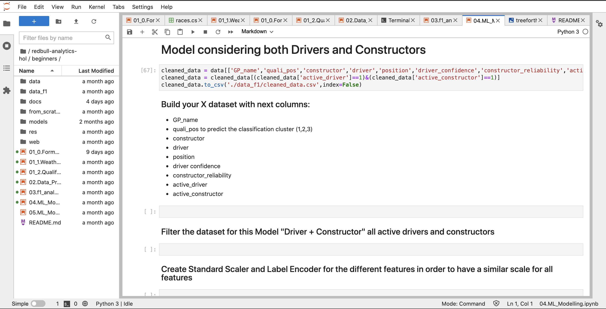

1. Build your x dataset

    ```
    <copy>
    x = data[['GP_name','quali_pos','constructor','driver','position','driver_confidence','constructor_reliability','active_driver','active_constructor']]

    </copy>
    ```

  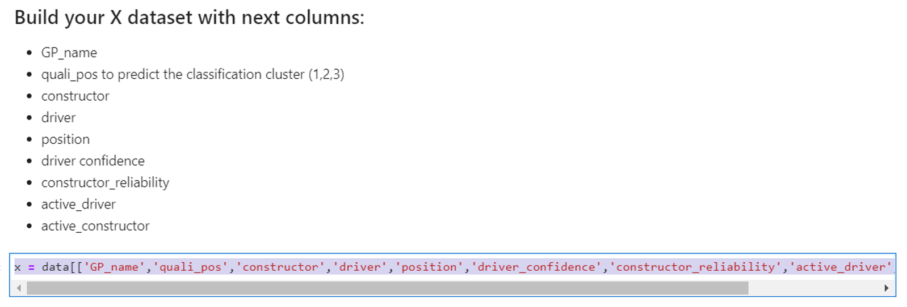

2. Filter the dataset for this Model "Driver + Constructor" all active drivers and constructors

    ```
    <copy>
    x = x[(x['active_constructor']==1) & (x['active_driver']==1)]
    </copy>
    ```

    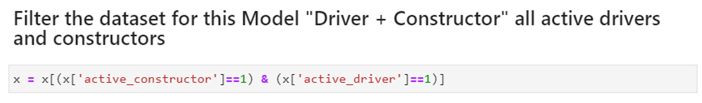

3. Create Standard Scaler and Label Encoder for the different features in order to have a similar scale for all features
  
    ```
    <copy>
    sc  = StandardScaler()
    le = LabelEncoder()
    x_c['GP_name'] = le.fit_transform(x_c['GP_name'])
    x_c['constructor'] = le.fit_transform(x_c['constructor'])
    X_c = x_c.drop(['position','active_constructor'],1)
    y_c = x_c['position'].apply(lambda x: position_index(x))
    </copy>
    ```

    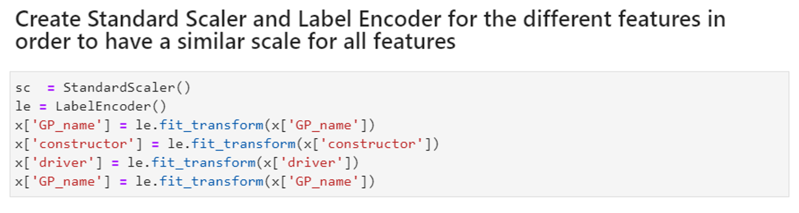

4. Prepare the x (Features dataset) and y for predicted value.

    ```
    <copy>
    X = x.drop(['position','active_driver','active_constructor'],1)
    y = x['position'].apply(lambda x: position_index(x))
    </copy>
    ```

    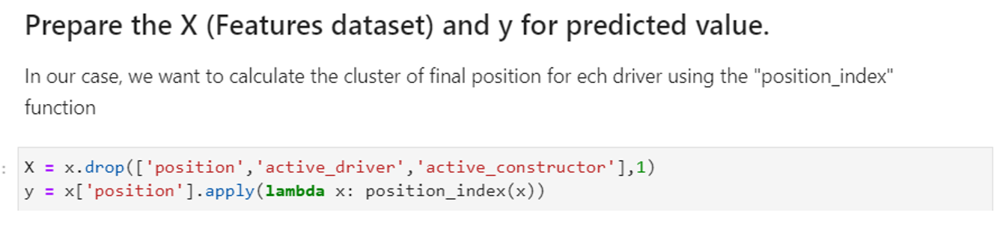

5. Applied the same list of ML Algorithms for cross validation of different models

    ```
    <copy>
    #cross validation for different models
    models = [LogisticRegression(),DecisionTreeClassifier(),RandomForestClassifier(),SVC(),GaussianNB(),KNeighborsClassifier()]
    names = ['LogisticRegression','DecisionTreeClassifier','RandomForestClassifier','SVC','GaussianNB','KNeighborsClassifier']
    model_dict = dict(zip(models,names))
    for model in models:
      cv = StratifiedKFold(n_splits=10,random_state=1,shuffle=True)
      result = cross_val_score(model,X,y,cv=cv,scoring='accuracy')
      mean_results.append(result.mean())
      results.append(result)
      name.append(model_dict[model])
      print(f'{model_dict[model]} : {result.mean()}')
    </copy>
    ```


6. Use the same boxplot plotter used in the previous Models

    ```
    <copy>
    plt.figure(figsize=(15,10))
    plt.boxplot(x=results,labels=name)
    plt.xlabel('Models')
    plt.ylabel('Accuracy')
    plt.title('Model (Driver + F1 Team) Performance Comparison')
    plt.show()
    </copy>
    ```
    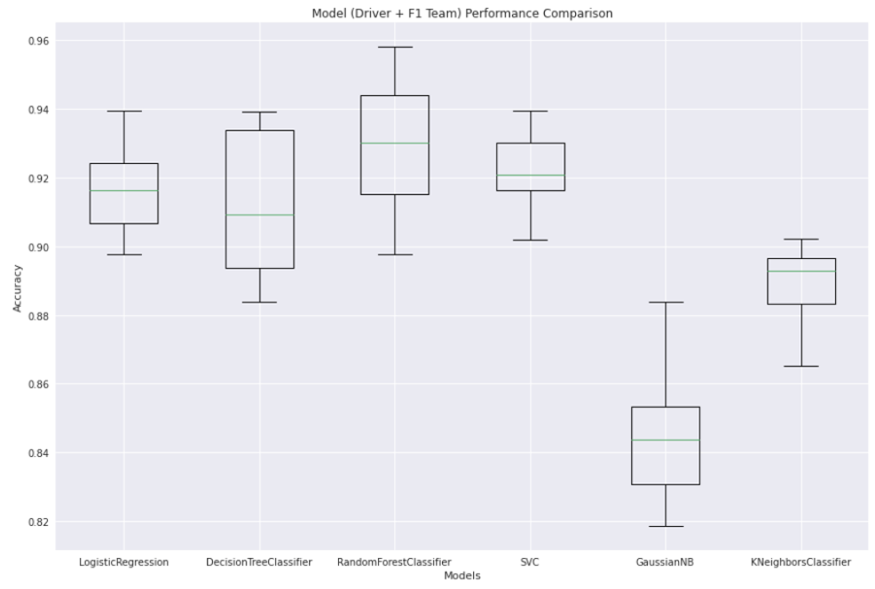

7. Comparing the 3 ML models

    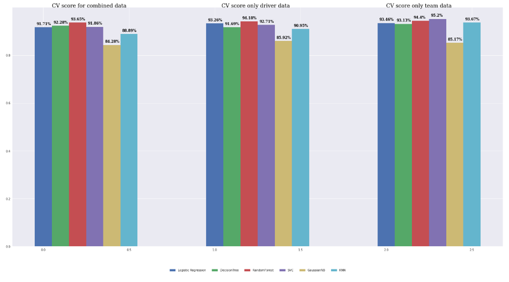

You may now **proceed to the next lab**.

## Acknowledgements
* **Author** - Olivier Francois Xavier Perard , Principal Data Scientist
* **Last Updated By/Date** - Samrat Khosla, Advanced Data Services, September 2021

## Need Help?
Please submit feedback or ask for help using our [LiveLabs Support Forum](https://community.oracle.com/tech/developers/categories/livelabsdiscussions). Please click the **Log In** button and login using your Oracle Account. Click the **Ask A Question** button to the left to start a *New Discussion* or *Ask a Question*.  Please include your workshop name and lab name.  You can also include screenshots and attach files.  Engage directly with the author of the workshop.

If you do not have an Oracle Account, click [here](https://profile.oracle.com/myprofile/account/create-account.jspx) to create one.
