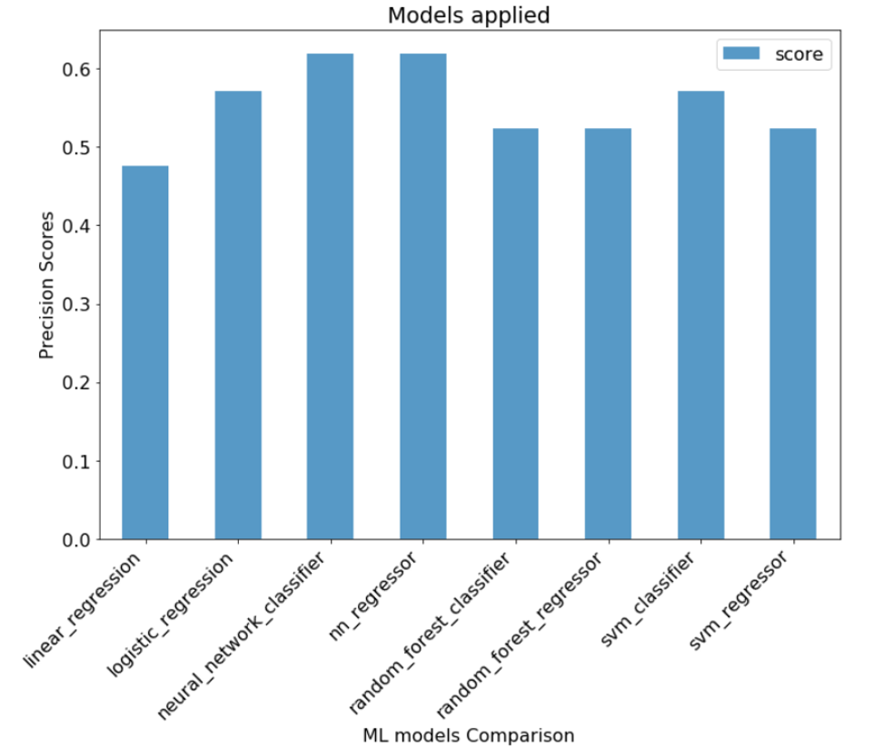
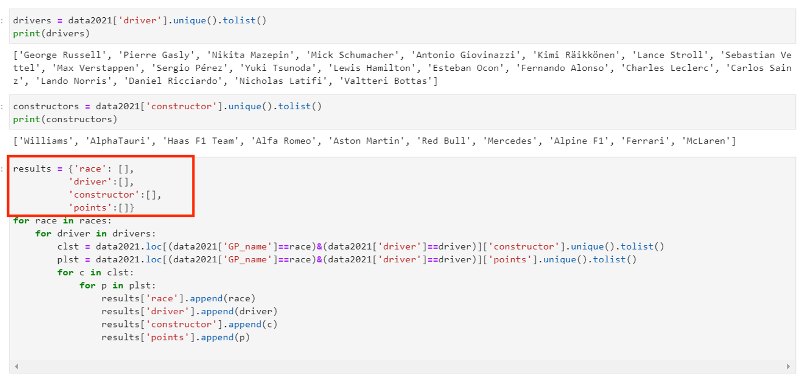
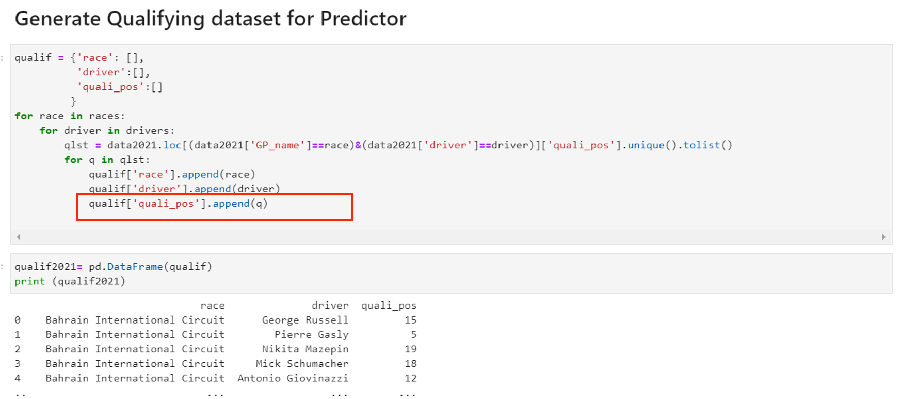
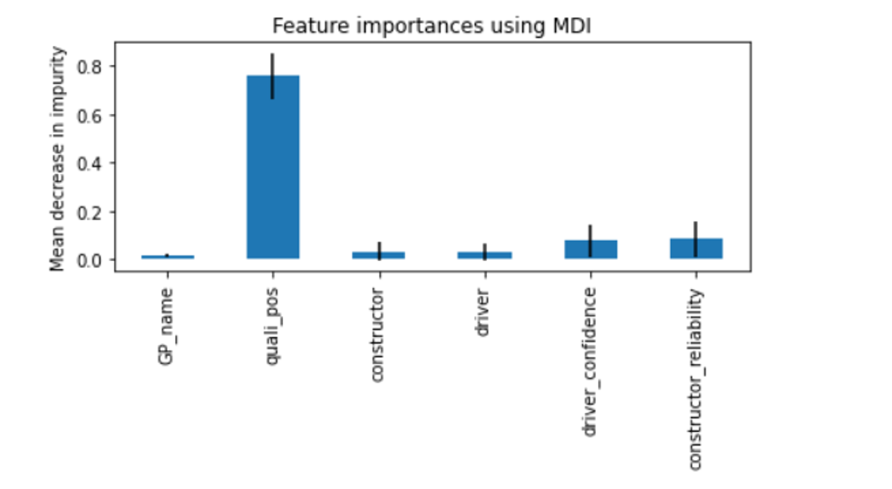
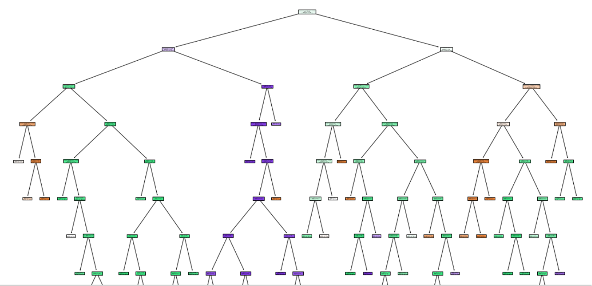
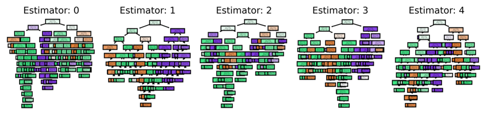

# Model Serving

## Introduction

This lab will walk you through the steps to deploy and serve the best trained model as:
  
  * API REST using the feature importance (variables) for the best model.



It seems the Neural Network Classification is the best model to return the highest scores, correctly predicting the winner for 62% of the races.

Estimated Time: 60 minutes

### Objectives

In this lab, you will:
* Execute ``` 05.ML_Model_Serving.ipynb ``` to deploy the best ML model, which is served and consumed using REST API

### Prerequisites

* An Oracle Free Tier, Always Free, Paid or LiveLabs Cloud Account


## **Task 1**: Deploy the Best Machine Learning Model

Navigate to the ``` /redbull-analytics-hol/beginners/``` directory in your Jupyter Notebook session and execute ``` 05.ML_Model_Serving.ipynb ```. 

1. Our ML model must use Drivers confidence / points and Team/Constructor reliability / Points

   


2. Using 2021 Dataset to Calculate the Confidence/ reliability and Points per Constructor/ Driver after each race
  
  

  


3. We can detect the Feature Importance for our Best ML Model.The Qualifying Position is the main feature for our trained model. 

  

4. RF Explanation for First Decision Tree 

  

5. RF Explanation for 5 first Decision Trees

  

You may now **proceed to the next lab**.

## Acknowledgements
* **Author** - Olivier Francois Xavier Perard , Principal Data Scientist
* **Last Updated By/Date** - Samrat Khosla, Advanced Data Services, September 2021

## Need Help?
Please submit feedback or ask for help using our [LiveLabs Support Forum](https://community.oracle.com/tech/developers/categories/livelabsdiscussions). Please click the **Log In** button and login using your Oracle Account. Click the **Ask A Question** button to the left to start a *New Discussion* or *Ask a Question*.  Please include your workshop name and lab name.  You can also include screenshots and attach files.  Engage directly with the author of the workshop.

If you do not have an Oracle Account, click [here](https://profile.oracle.com/myprofile/account/create-account.jspx) to create one.
