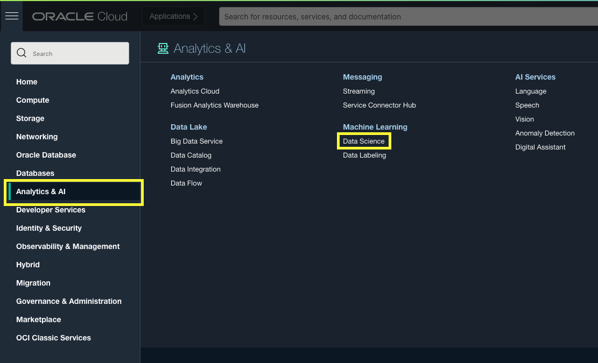
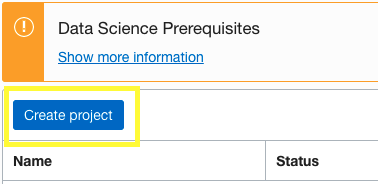
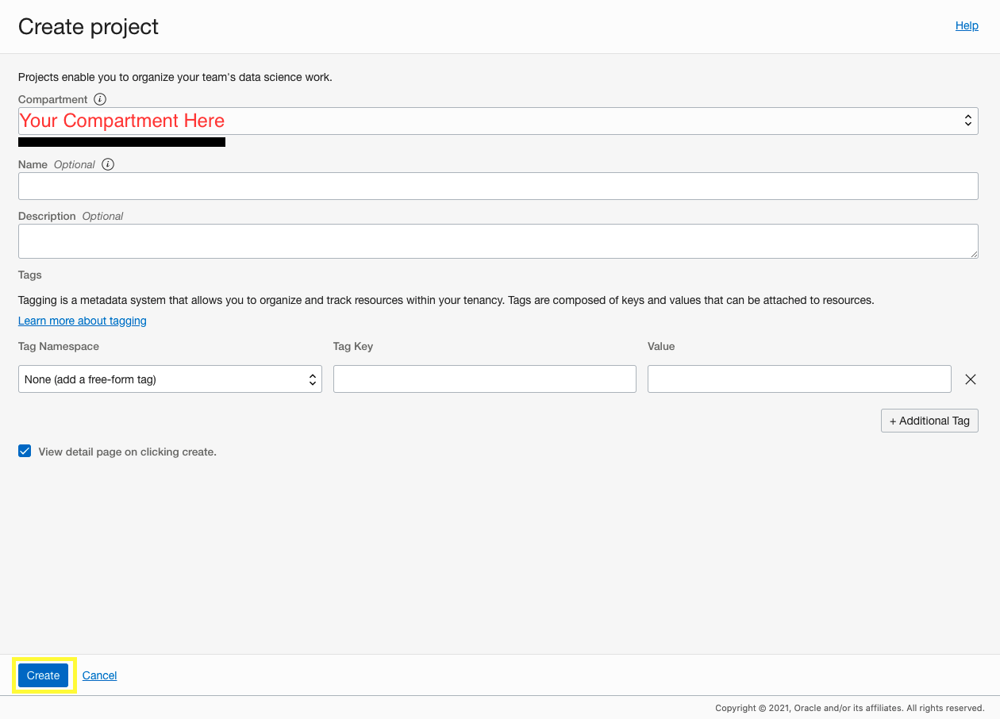
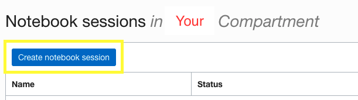
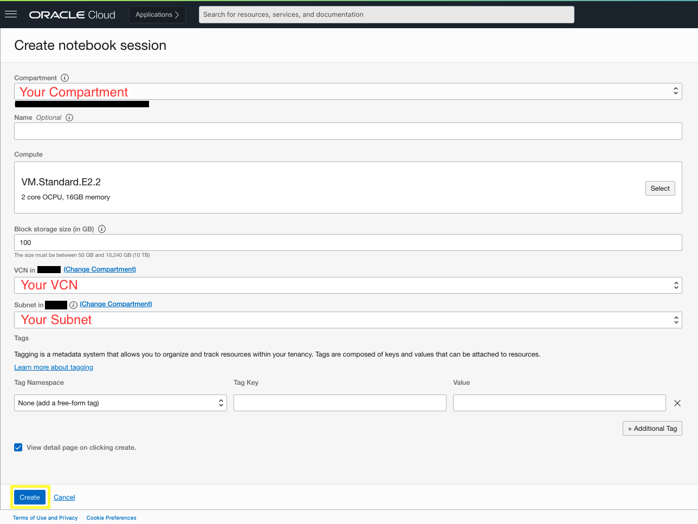
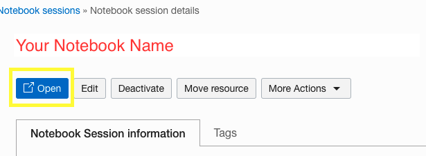

# Get Started with OCI Data Science

## Introduction

This lab will guide you on provisioning an OCI Data Science environment.

Estimated lab time: 15 minutes

### Objectives

In this lab you will:
* Become familiar with the set up of the OCI Data Science service.

### Prerequisites

* Access to your Oracle Cloud console.

## **Step 1:** Provision OCI Data Science

This guide shows you how to provision the OCI Data Science service on the Oracle Cloud Console.

1. In your Oracle CLoud Console, open the menu.

    

2. Select Analytics & AI -> Data Science.

    Data Science should be under the Machine Learning category.

    

3. Click Create Project

    

4. Choose the proper compartment to create your project in and then click Create.

    

    Name and Description are optional but may help you find your project more easily later.

## **Step 2:** Create a Data Science Notebook

Now we can create the Data Science Notebook.

1. Click Create Notebook Session

    

2. Fill out Necessary Information

    

    Once again, name is optional, but preferred.

    For Compute, VM.Standard.E2.2 will work.

    For our project, 100 GB in Block Storage Size is suitable, but even something as low as 50 GB should work.

3. Click the Open Button.

    

    We will be returning to this data science notebook later to use it, but for now we are opening it to make sure that it has been created properly.
    Feel free to close the page and open it again later.

    You may now **proceed to the next lab**.

## Acknowledgements
* **Author** - Austin Chin, Associate Cloud Solutions Engineer
* **Last Updated By/Date** - Austin Chin, Advanced Data Services, December 2021

## Need Help?
Please submit feedback or ask for help using our [LiveLabs Support Forum](https://community.oracle.com/tech/developers/categories/livelabsdiscussions). Please click the **Log In** button and login using your Oracle Account. Click the **Ask A Question** button to the left to start a *New Discussion* or *Ask a Question*.  Please include your workshop name and lab name.  You can also include screenshots and attach files.  Engage directly with the author of the workshop.

If you do not have an Oracle Account, click [here](https://profile.oracle.com/myprofile/account/create-account.jspx) to create one.
