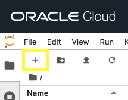
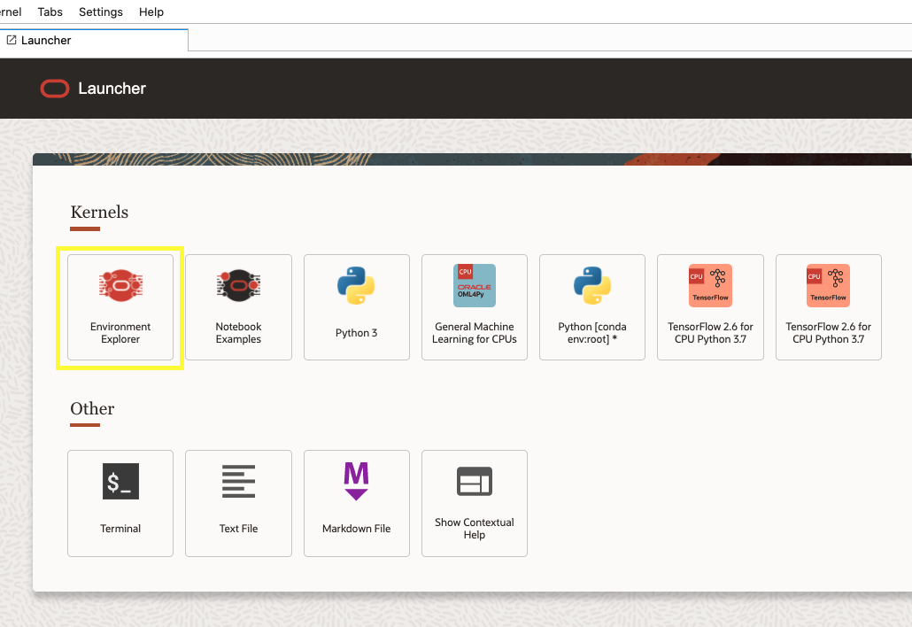
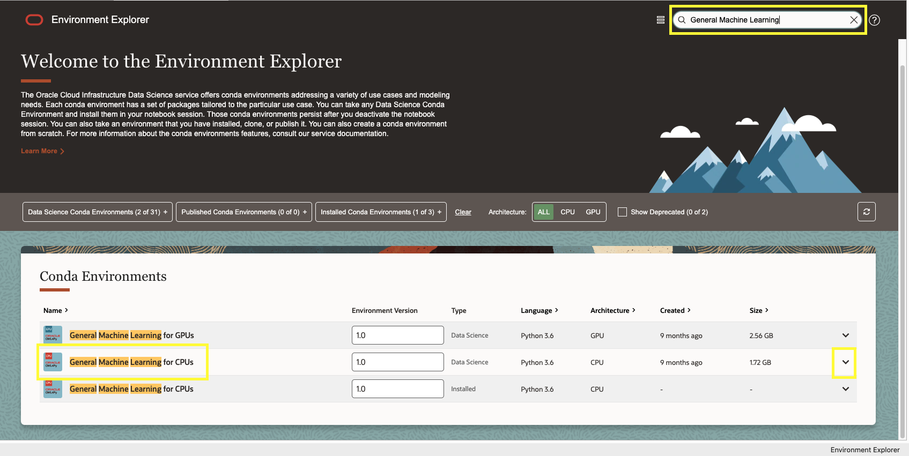
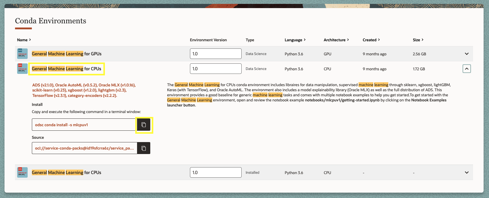
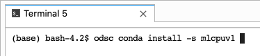
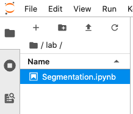
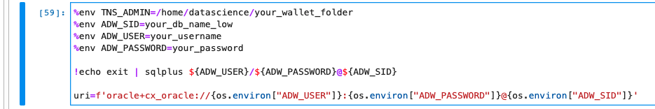
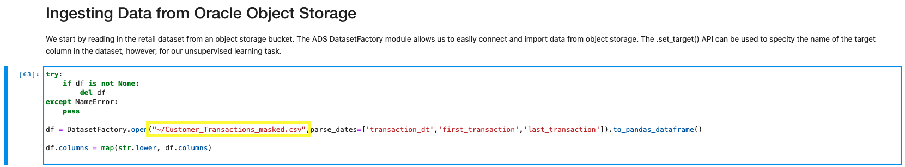
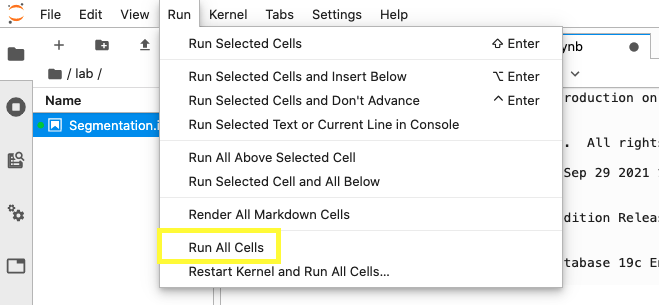

# Run the Notebook

## Introduction

This guide will tell you how to run the Retail Segmentation demo notebook on the infrastruction that we have just provisioned.

Estimated lab time: 35 minutes

### Objectives

In this lab you will:
* Learn to run a notebook on OCI Datascience.

### Prerequisites

* No additional prerequisites.

## **Step 1:** Placing Files into the Notebook

Our focus will now shift back to the datascience notebook.

1. Return to your datascience notebook that you have created and press Open.

    

2. Place the config file associated with your oracle account and tenancy into the ./.oci directory within the directory on Oracle Data Science.

    Note: You can easily upload files to OCI Data Science by dragging a file from your local folder onto the file directory box on the left.

    For tips on how to create a config file, go to (add link)

    The code below should help you move the config file to ./.oci

    ```
    <copy>
    mv config ./.oci
    </copy>
    ```

3. Place your wallet.zip into the directory and unzip it into a folder of your choice.

    While it doesn't matter if you unzip it into a folder, it is better organized that way.

    Make sure to remember what directory you place the unzipped contents in for later.

    The code below will help you unzip the folder and move it to a separate folder of your choice. Removing -d and the destination folder will unzip the folders in the current directory.

    ```
    <copy>
    unzip Wallet_Your_DB_Name.zip -d destination_folder
    </copy>
    ```

4. Download the Retail Segmentation notebook from this link and place it into the directory in Oracle Datascience.
    Also download the Customer Transactions data that the notebook will use. Both can be downloaded from the links below.

    https://objectstorage.us-ashburn-1.oraclecloud.com/p/rmWDKR_hSkiYDeSsVOuW8abwUZmQI8G-gZ5aWUGjPEe0gQQZ-g8o2SJYYI-iPjVW/n/orasenatdpltintegration03/b/Lumina/o/Segmentation.ipynb

    https://objectstorage.us-ashburn-1.oraclecloud.com/p/1dzOB88QeywWzprMcoMMLw6xwYIpMDTbPFTdiFH6ZZ1miqaNE5t0vUD-KTYfNptT/n/orasenatdpltintegration03/b/Lumina/o/Customer_Transactions_masked.csv


## **Step 2:** Installing the Kernel

Let us now shift our focus to installing a kernel to use for our datascience notebook.

1. Press the + button on the top left to open up the launch, and double click the environment explorer.

    

    

2. Search for "General Machine Learning" on the top right, and then select General Machine Learning for CPU's.

    

    The kernel may already be displayed by defauly even before you search.
    Also, other machine learning libraries such as Tensorflow for CPU should work as well so long as it is CPU for CPU instanes and GPU for GPU instances.

3. Click the down arrow on the right to expand the box for the kernel.

4. Click the copy button next to the line of code under install.

    

5. Open a terminal from the launch and run the line of code.

    

    If it asks you for version number just press enter, and if it asks you to say yes, press y and then press enter,


## **Step 3:** Running the Retail Segmentation Notebook

Now we can begin running the notebook itself.

1. Open the data science notebook by double clicking it in the directory on the left hand side.

    

2. Now, you must fill in the information in the third block of code.

    

    TNS ADMIN will equal the directory which you put the wallet folder in.
    ADW SID refers to a value within the tnsnames.ora file in the unzipped wallet folder.
    Set it to the value that ends with "low" which should look something like "databasename"_low
    ADW USER and ADW PASSWORD will be the username and password that you had created earlier using OML User Administration.


3. For the fourth block of code, underneath what you had just edited, make sure the string within the first set of quotes points to the location of the data file you had downloaded.

    

4. With this, you should be able to press run all, at the top, which will execute the code sequentially, and produce results.

    

    You may now **proceed to the next lab**.


## Acknowledgements
* **Author** - Austin Chin, Associate Cloud Solutions Engineer
* **Last Updated By/Date** - Austin Chin, Advanced Data Services, December 2021

## Need Help?
Please submit feedback or ask for help using our [LiveLabs Support Forum](https://community.oracle.com/tech/developers/categories/livelabsdiscussions). Please click the **Log In** button and login using your Oracle Account. Click the **Ask A Question** button to the left to start a *New Discussion* or *Ask a Question*.  Please include your workshop name and lab name.  You can also include screenshots and attach files.  Engage directly with the author of the workshop.

If you do not have an Oracle Account, click [here](https://profile.oracle.com/myprofile/account/create-account.jspx) to create one.
