# Setting Up ADW

## Introduction

This guide shows you how to provision the Autonomous Data Warehouse service on the Oracle Cloud Console.

Estimated lab time: 30 minutes

### Objectives

In this lab you will:
* Become familiar with the set up of ADW

### Prerequisites

*  No additional prerequisites.

## **Step 1:** Provision ADW

Start from your Oracle Cloud Console

1. From your Oracle Cloud Console, open the menu.

    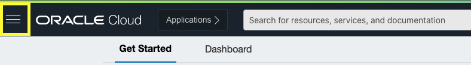

2. Select Oracle Database -> Autonomous Data Warehouse.

    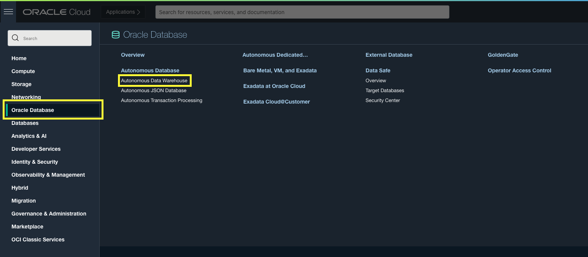

3. Click the Create Autonomous Database Button

    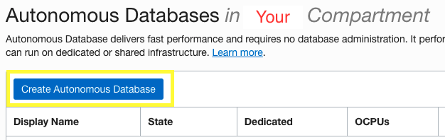

4. Enter the correct information in the window.

    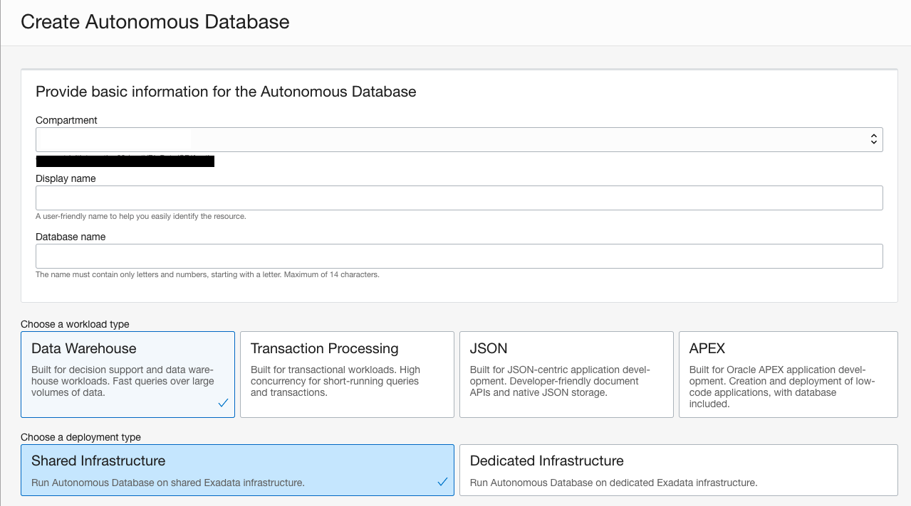

    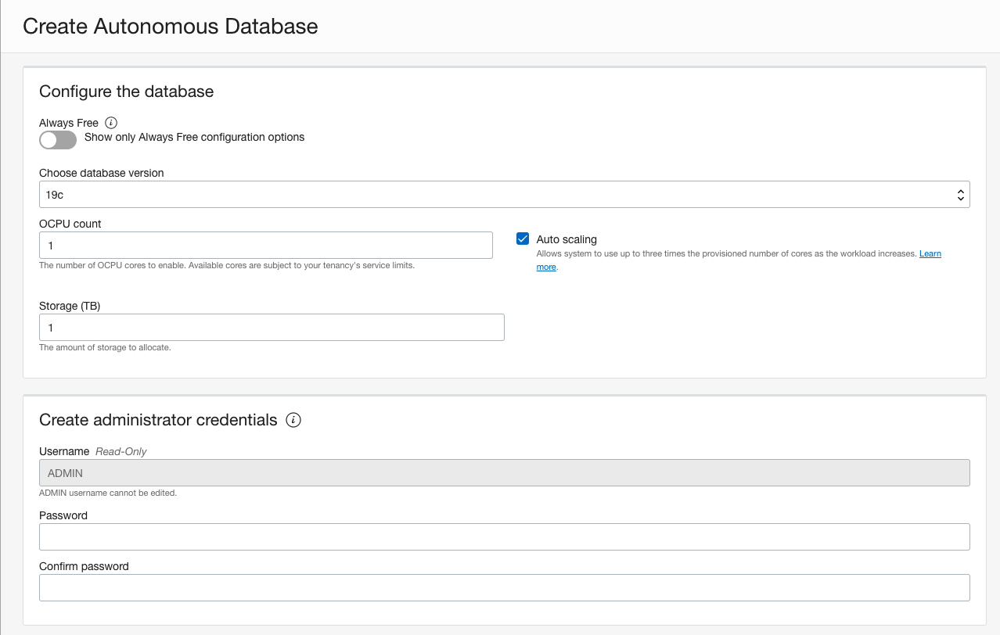

    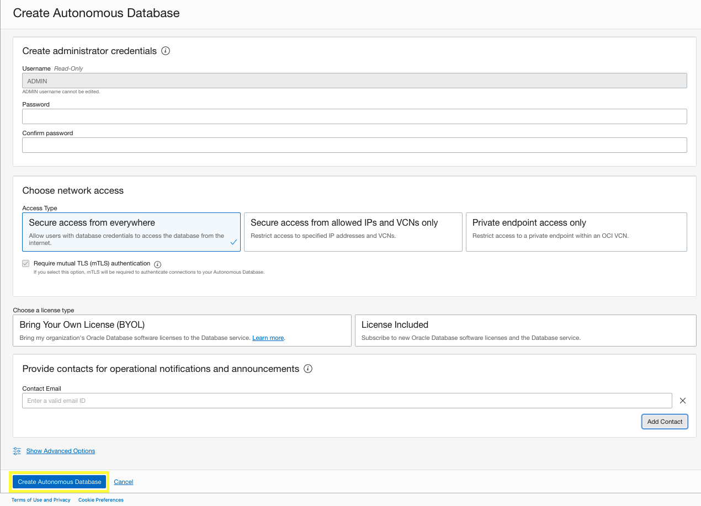

    A display name and database name are optional but hopefully for visibility.
    For workload type, deployment type, and database configurations, default options are appropriate.
    Enter a password that you will remember for administrator credentials. This will be used later
    The Default Option for netwwork access is approrptiate.
    Choose the license type that suits you best.

5. Click Create Autonomous Database

## **Step 2:** Setting up Credentials

Within a few minutes, the Database will be available.

1. Once the Database is available, click the DB Connection to bring up a new page.

    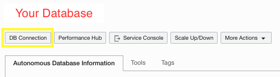

2. Click the Download Wallet button.

    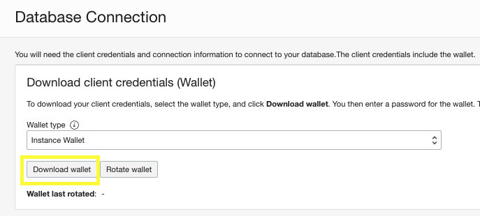

    Wallet Type should be Instance Wallet.
    This Wallet file will be used later.

3. Click the Tools option to move to the tools tab.

    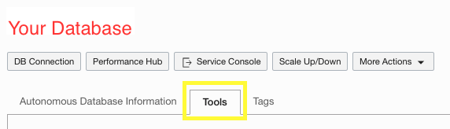

4. Click the Open Oracle ML User Administration Button.

    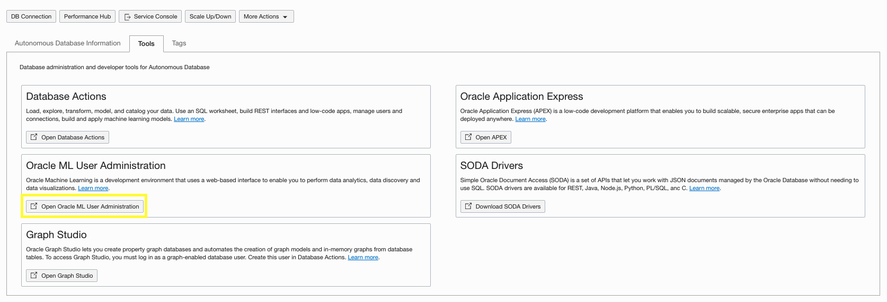

    We will be creating an account here to use later.

5. Enter your Admin user and password to log in.

    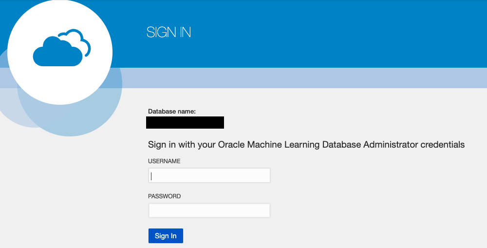

6. Click the "+ Create" button to create a new user. This will be used to access the ADW later.

    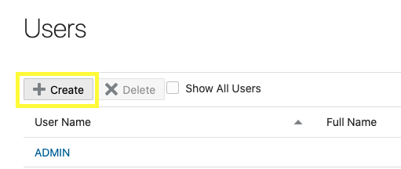

7. Enter information for a new account and create user.

    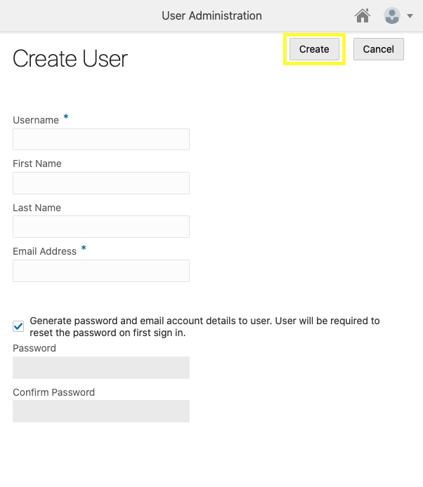

    You may now **proceed to the next lab**.

## Acknowledgements
* **Author** - Austin Chin, Associate Cloud Solutions Engineer
* **Last Updated By/Date** - Austin Chin, Advanced Data Services, December 2021

## Need Help?
Please submit feedback or ask for help using our [LiveLabs Support Forum](https://community.oracle.com/tech/developers/categories/livelabsdiscussions). Please click the **Log In** button and login using your Oracle Account. Click the **Ask A Question** button to the left to start a *New Discussion* or *Ask a Question*.  Please include your workshop name and lab name.  You can also include screenshots and attach files.  Engage directly with the author of the workshop.

If you do not have an Oracle Account, click [here](https://profile.oracle.com/myprofile/account/create-account.jspx) to create one.
