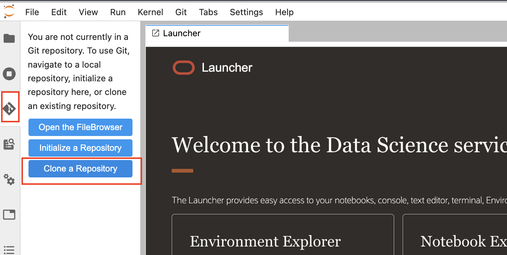
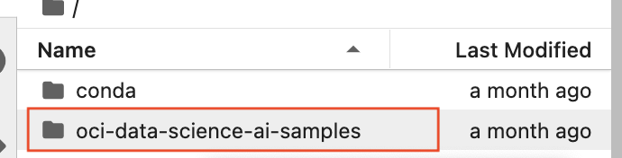

# Binary Classification Model

## Introduction

Organizations can face significant costs resulting from employee turnover. Some costs are tangible, such as training expenses and the time it takes from when an employee starts to when they become a productive team member. Generally, the most important costs are intangible. Consider what is lost when a productive employee quits, such as corporate knowledge, new product ideas, great project management, and customer relationships. With advances in machine learning and data science, it is possible to not only predict employee attrition but to understand the key variables that influence turnover.

In this lab, an employee attrition dataset is examined. The goal of the model is to predict if an employee is going to resign their position and to understand the important factors that are related to this attrition.

In addition to the modeling aspects, the lab will demonstrate some of the features of the [Oracle Accelerated Data Science (ADS) SDK](https://docs.cloud.oracle.com/iaas/tools/ads-sdk/latest/index.html). ADS offers a friendly user interface, with objects and methods that cover all the steps involved in the lifecycle of machine learning models, from data acquisition to model evaluation and interpretation. In the lab, you will do an Exploratory Data Analysis (EDA) using the ``DatasetFactory`` class. The ``DatasetFactory`` loads data from various sources, profiles the data, determines their data types and uses sampling to prepare visualizations. The ``show_in_notebook()`` method performs an EDA in a single command, generating summary information about the data, intelligent graphs summarizing features, correlation heat maps and warnings about the condition of the data.

The lab also demonstrates the feature engineering abilities in ``ADS``. For example, it can fix class imbalance by up or downsampling. There are many transforms that ADS can also apply. You can have ADS perform an analysis of the data and automatically perform the transformations that it thinks would improve the model. This is done with the ``auto_transform()`` method. The ``suggest_recommendations()`` method allows you to explore the suggested transforms using the notebook's UI and select the transformations that you want it to make.

The ``ADSEvaluator`` class is used to evaluate model performance. Since this is a binary classification problem,  the ``ADSEvaluator`` is used to create precision-recall, ROC, lift, and gain plots. Each model under study is plotted together. This allows for easy comparison. In addition, the normalized confusion matrices are provided.

*Estimated Time*: 90 minutes

### Objectives

In this lab, you will:
* Learn how to execute cells in JupyterLab and perform other basic operations in a notebook.
* Learn how to launch a **Notebook Example**.
* Open a data file using a ``DatasetFactory`` object.
* Perform an Exploratory Data Analysis
* Use automatic feature engineering tools to create model features.
* Perform model evaluation using the ``ADSEvaluator``.

### Prerequisites

This lab assumes that you have:
* A Data Science notebook session.

## Task 1: Working with JupyterLab

Now that JupyterLab is open, it can be seen that the screen is split into two sections. By default, the left side has the file browser open but it can change based on what navigation icons are selected on the far left side of the screen. The right side of the screen contains the workspace. It will have a notebook, terminal, console, launcher, Notebook Examples, etc.

There is a menu across the top of the screen. For this lab, the most interesting menu item is **Run**. It will allow you to execute code cells in the document. It is recommended that you manually execute the cells one at a time as you progress through the notebook. It is, generally important, that you execute them in order. To do this from the keyboard, press *shift + enter* in a cell and it will execute it and advance to the next cell. Alternatively, you can run all of the cells at once. To do this, click on Run then "Run Selected Cells".

## Task 2: Summary of Commands

The following is a summary of the steps that are covered in this lab along with the most important Python commands. You can use it as a reference guide for when you build your own models.

1. **Open dataset**: ``ds = DatasetFactory.open()``
1. **Visualize dataset**: ``ds.show_in_notebook()``
1. **Automatic feature engineering**: ``transformed_ds = ds.auto_transform()``
1. **Split data into train and test sets**: ``train, test = transformed_ds.train_test_split()``
1. **Build an ADS model from a scikit-learn classifier**: ``my_model = ADSModel.from_estimator(sk_model, name=sk_clf.__class__.__name__)``
1. **Evaluate the model**: ``evaluator = ADSEvaluator()``

## Task 3: Install a Conda Environment

A conda environment is a collection of libraries, programs, components and metadata. It defines a reproducible set of libraries that are used in the data science environment. There is an Environment Explore that allows you to learn about the different conda environments that are available. We are going to use the TensorFlow for CPUs conda.

1. Open a terminal window by clicking on **File**, **New** and then **Terminal**.
1. Run the command: `odsc conda install -s tensorflow27_p37_cpu_v1`
1. You will receive a prompt related to what version number you want. Press `Enter` to select the default.
1. Wait for the conda environment to be installed.

## Task 4: Binary Classification Model

1. To access the binary classification JupyterLab notebook, we are going to clone the Oracle Data Science and AI repository.  Navigate to the Oracle Data Science and AI repository https://github.com/oracle-samples/oci-data-science-ai-samples/

1.  Click on **Code** and copy the link under **HTTPS**

    

1.  Navigate to the git extension icon on the left and then click **Clone a Repository**.

    

1.  Paste the HTTPS link and click **Clone**.  

    

1.  After you have cloned the repository, you will see the **oci\_data\_science\_ai\_samples** folder. Click on the folder.

    

    * Click on the **labs** folder

    * Click on the **MLSummit21** folder

    * Click on the **notebooks** folder

    * Click on the file **1-model-training.ipynb** 

1.  After you have opened the notebook, select the TensorFlow 2.7 for CPU on Python 3.7 conda. 

1. Read through the document. When you encounter a chunk of code, click in the cell and press *shift + enter* to execute it. When the cell is running a ``[*]`` will appear in the top left corner of the cell. When it is finished, a number will appear in ``[ ]``, for example ``[1]``.

1. Execute the cells in order. If you run into problems and want to start over again, click the **restart** button then click **Restart**.

1. Step through the lab and look at the tools that are provided by Oracle Accelerated Data Science (ADS) SDK. This automates a number of time-consuming and repetitive processes by analyzing the data and creating appropriate outputs.

1.  When you have completed the entire notebook, you can optionally go through a notebook showing how to deploy that model you have saved using Data Science Model Deployment.  These are the steps to access the model deployment notebook.

    * Click on the **oci\_data\_science\_ai\_samples** folder in the directory

    * Click on the **labs** folder

    * Click on the **MLSummit21** folder

    * Click on the **notebooks** folder

    * Click on the file **2-model-deployment.ipynb** 

## Task 5: Next Steps

There are some other notebooks that you may find interesting. They can be accessed by clicking **File** and then clicking **New Launcher**. This will open Launcher. Click **Notebook Explorer** and select a notebook.  At the top of each notebook, the conda environment compatible with the notebook is listed.  You can download the conda compatible with the notebook using the instruction above.  Some notebooks of interest are:

* **visualizing\_data-exploring\_data.ipynb**: It provides a comprehensive overview of the data visualization tools in ADS. 
* **hyperparameter\_tuning.ipynb**: Learn about the ``ADSTuner`` and how it can help with hyperparameters tuning.

## Acknowledgements

* **Author**: [John Peach](https://www.linkedin.com/in/jpeach/), Principal Data Scientist
* **Last Updated By/Date**:
  * [Wendy Yip](https://www.linkedin.com/in/wendy-yip-a3990610/), Data Scientist, March 2023
